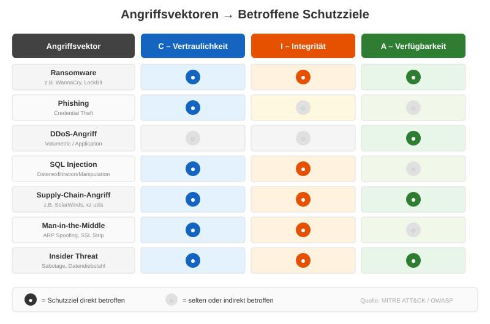
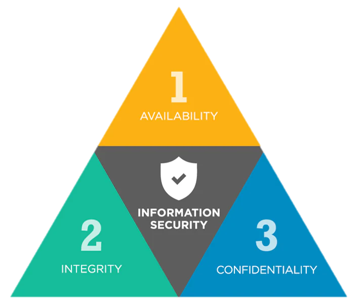
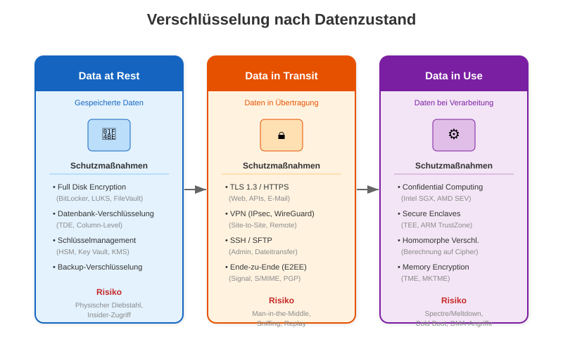
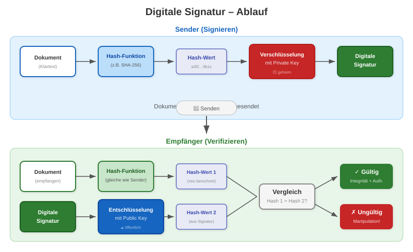
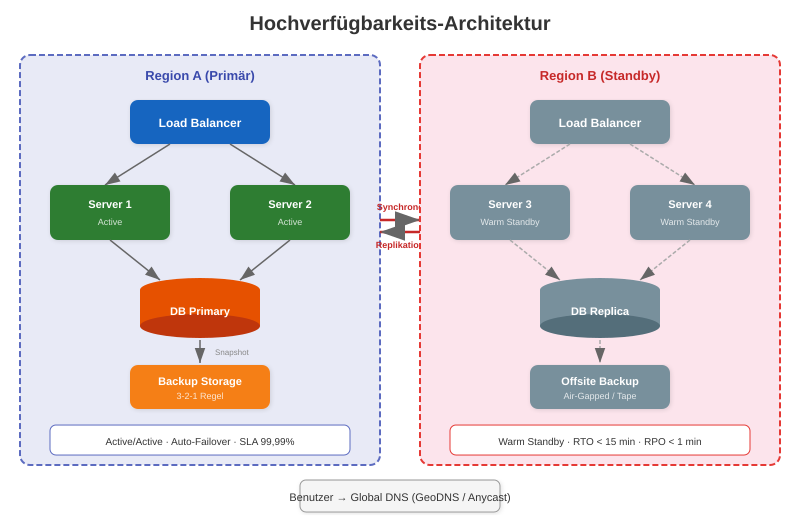
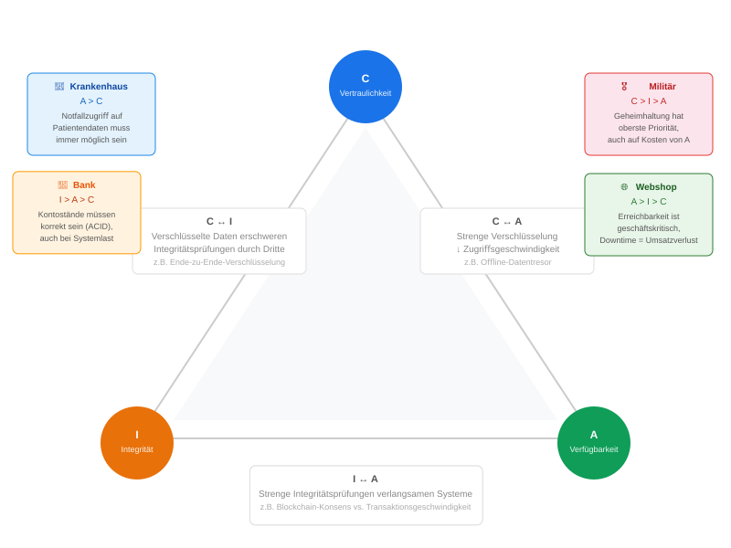
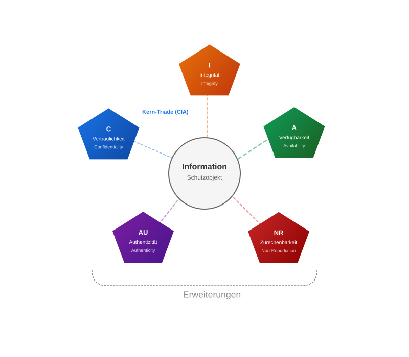
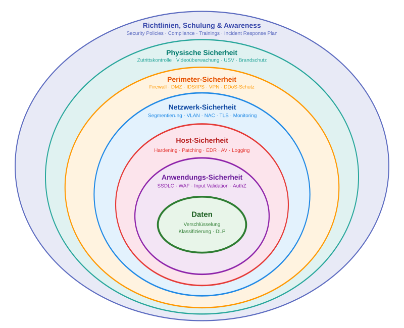

<!-- _class: title -->
# Die CIA-Triade

## Grundbegriffe

---
<!-- _class: biglist -->
# Agenda

- **Angreifer und Ziele** – Akteursgruppen, APTs, Angriffsvektoren
- **Was ist die CIA-Triade?** – Definition der Kernkonzepte
- **C: Vertraulichkeit (Confidentiality)** – Verschlüsselungsschichten, Datenklassifizierung
- **I: Integrität (Integrity)** – Digitale Signaturen, Supply-Chain-Sicherheit
- **A: Verfügbarkeit (Availability)** – SLAs, Redundanz, HA-Architekturen, DR
- **Balanceakt** – Trade-Offs zwischen den Schutzzielen
- **Erweiterte Schutzziele** – Authentizität, Zurechenbarkeit, Parkerian Hexad
- **Defense in Depth** – Mehrschichtige Sicherheitsarchitekturen
- **CIA in der Praxis** – ISO 27001, BSI IT-Grundschutz, NIST CSF
- **Zusammenfassung** – Alle Konzepte im Überblick

---
# Wer sind die Angreifer? (Akteursgruppen)

- **Cyberkriminelle**  
  - Organisierte Banden, Ransomware-Gruppen, Betrüger  
  - Hauptmotivation: Geld, oft hochprofessionell

- **Staaten / staatliche Akteure**  
  - Geheimdienste, Militär, staatlich unterstützte Gruppen (APTs)  
  - Motivation: Spionage, Sabotage, geopolitischer Einfluss

- **Hacktivisten**  
  - Lose Gruppierungen mit politischer/ideologischer Agenda  
  - Motivation: Aufmerksamkeit, Protest, „Bestrafung“ von Organisationen

---
# Wer sind die Angreifer? (Akteursgruppen)

- **Insider**  
  - Mitarbeitende, Ex-Mitarbeitende, Dienstleister  
  - Motivation: Rache, persönliche Konflikte, Geld, Überzeugungen

- **Script Kiddies / lernende Angreifer** 
  - Nutzen fertige Tools und Exploits ohne tiefes Verständnis  
  - Motivation: Spaß, Anerkennung, „mal sehen, ob es geht“

- **Wettbewerber** 
  - (Selten offen, eher über Dritte)  
  - Motivation: Wirtschaftsspionage, Markt- und Wettbewerbsvorteile

---
# Warum werden IT-Systeme angegriffen? (Ziele)

- **Finanzielle Ziele**  
  - Diebstahl von Geld (Online-Banking, Krypto), Erpressung (Ransomware)  
  - Verkauf von Daten (Kreditkarten, Zugangsdaten)

- **Informationsgewinn**  
  - Wirtschaftsspionage, Know-how-Diebstahl  
  - Abgriff von personenbezogenen Daten (Profiling, Identitätsdiebstahl)

- **Sabotage & Störung**  
  - Lahmlegen von Diensten (DDoS), Produktionsausfälle  
  - Zerstörung von Daten oder Systemen

---
# Warum werden IT-Systeme angegriffen? (Ziele)

- **Politische / ideologische Ziele**  
  - Protest („Hacktivism“), Einflussnahme, Desinformation  
  - Zensur umgehen oder durchsetzen

- **Macht & Kontrolle**  
  - Aufbau von Botnetzen, Hintertüren, langfristiger Zugriff („Persistence“)

- **Prestige & Neugier**  
  - „Proof of Concept“, Reputationsaufbau in der Szene  
  - Technische Herausforderung, Spieltrieb

---
# Aktuelle Bedrohungslandschaft (2024–2026)

- **Ransomware-as-a-Service (RaaS)**  
  - Professionalisierte Ökosysteme: LockBit, BlackCat/ALPHV, Cl0p  
  - Doppelte Erpressung: Verschlüsselung **+** Datenexfiltration (Double Extortion)  
  - Durchschnittliche Lösegeldforderung 2025: ca. **5,2 Mio. USD** (Chainalysis)

- **Supply-Chain-Angriffe**  
  - Kompromittierung von Software-Lieferketten als Multiplikator  
  - Beispiele: SolarWinds (2020), xz-utils Backdoor (2024), 3CX (2023)  
  - Zunehmend schwer erkennbar – Vertrauenskettenbrüche

- **KI-gestützte Angriffe**  
  - Automatisiertes Spear-Phishing, Deepfake-gestützte Identitätstäuschung  
  - KI-generierte Malware-Varianten zur Umgehung signaturbasierter Erkennung

---
# Bekannte APT-Gruppen (Advanced Persistent Threats)

| Gruppe | Zuordnung | Bekannte Operationen | Schwerpunkt |
|---|---|---|---|
| **APT28** (Fancy Bear) | Russland (GRU) | DNC-Hack 2016, Bundestag 2015 | Politische Spionage |
| **APT29** (Cozy Bear) | Russland (SVR) | SolarWinds 2020, COVID-Forschung | Nachrichtendienste |
| **Lazarus Group** | Nordkorea | WannaCry 2017, Bangladesh Bank SWIFT ($81M) | Finanzkriminalität |
| **APT41** (Double Dragon) | China | Supply-Chain-Angriffe, Gesundheitssektor | Hybride Spionage + Profit |
| **Sandworm** | Russland (GRU) | NotPetya 2017, Ukraine Stromausfälle 2015/2016 | Sabotage / Cyberwarfare |

*Quelle: MITRE ATT&CK, Mandiant Threat Intelligence*

---
# Angriffsvektoren und betroffene Schutzziele

---
# Die CIA-Triade – Übersicht

- **Confidentiality (Vertraulichkeit):** Schutz vor unbefugtem Zugriff.  
- **Integrity (Integrität):** Schutz vor unbefugter Änderung.  
- **Availability (Verfügbarkeit):** Gewährleistung des Zugriffs.

---
<!-- _class: chapter -->

# Confidentiality

## Vertraulichkeit

---
# C: Überblick

- **Ziel:**  
  - Schutz vor unbefugter Offenlegung – Nur autorisierte Personen dürfen auf Informationen zugreifen.

- **Maßnahmen:**  
  - Verschlüsselung  
  - Zugriffskontrollen  
  - Physische Maßnahmen

- **Verletzung:**  
  - Datenleck (Data Breach), Spionage.

---
# C: Verschlüsselung

- **Data in Transit (Übertragung):**  
  - Schützt Daten beim Senden über Netzwerke (z.B. Internet).  
  - Beispiele: TLS/SSL (HTTPS), VPNs.  
  - Verhindert "Sniffing" (Abhören).

- **Data at Rest (Speicherung):**  
  - Schützt Daten auf Festplatten, Servern, Backups.  
  - Beispiele: AES, BitLocker.  
  - Schützt bei physischem Diebstahl.

---
# C: Verschlüsselung nach Datenzustand (Detail)

---
# C: Datenklassifizierung

Nicht alle Daten brauchen den gleichen Schutz. Die Klassifizierung bestimmt die Schutzmaßnahmen.

| Stufe | BSI-Schutzbedarf | Beispiel | Maßnahmen |
|---|---|---|---|
| **Öffentlich** | Normal | Pressemitteilungen, Website | Integritätsschutz |
| **Intern** | Normal | Organigramme, Arbeitsanweisungen | Zugangskontrolle |
| **Vertraulich** | Hoch | Personalakten, Kundendaten | Verschlüsselung + ACLs |
| **Streng vertraulich** | Sehr hoch | Geschäftsgeheimnisse, kryptogr. Schlüssel | E2EE, HSM, Need-to-Know |

*Referenz: BSI IT-Grundschutz Kompendium, ISO/IEC 27001 Annex A (A.5.12–A.5.13)*

---
# C: Zugriffskontrolle

- **Authentifizierung: Wer bist du?**  
  - Nachweis der Identität.  
  - Beispiele: Passwort, Multi-Faktor-Authentifizierung (MFA), Biometrie.

- **Autorisierung: Was darfst du?**  
  - Zuweisung von Rechten nach der Identifizierung.  
  - Least Privilege Principle: Nur die minimal notwendigen Rechte vergeben.

---
# C: Information Hiding

- **Steganographie:**  
  - Verbergen von Daten in scheinbar unschuldigen Objekten (wie Bildern oder Audiodateien).

- **Data Masking / Anonymisierung:**  
  - Ersetzen sensibler Daten durch unkritische Platzhalter (z.B. in Testumgebungen).  
  - Keine Produktionsdaten auf Staging-Umgebungen!

---
# C: Bedrohungen

- **Sniffing / Eavesdropping**  
  - Abhören des Netzwerkverkehrs (z.B. in öffentlichen WLANs), um unverschlüsselte Daten mitzulesen.

- **Social Engineering**  
  - Psychologische Manipulation von Personen (z.B. Phishing), um vertrauliche Informationen zu erlangen.

- **Physischer Diebstahl**  
  - Entwendung von Geräten mit unverschlüsselten sensiblen Daten.

---
# C: Fallstudie – Equifax Data Breach (2017)

- **Was geschah?**
  - Angreifer nutzten eine ungepatchte Apache-Struts-Schwachstelle (CVE-2017-5638)
  - **147,9 Millionen** personenbezogene Datensätze gestohlen (SSN, Geburtsdaten, Adressen)
  - Datenabfluss über **76 Tage** unbemerkt

- **Warum Vertraulichkeits-Versagen?**
  - Keine Netzwerksegmentierung → Laterale Bewegung möglich
  - Abgelaufenes SSL-Zertifikat für Intrusion Detection seit **19 Monaten**
  - Sensible Daten in Klartext gespeichert (keine Data-at-Rest-Verschlüsselung)

- **Konsequenzen:**
  - **$700 Mio.** Vergleichszahlung (FTC)
  - CEO, CIO, CSO traten zurück
  - Regulatorische Verschärfungen in den USA

---
<!-- _class: chapter -->

# Integrity

## Integrität

---
# I: Überblick

- Integrität stellt sicher, dass Informationen **korrekt, vollständig, konsistent und unverändert** sind.
- Schutz vor unbefugtem oder unbeabsichtigtem **Ändern** von Daten und Systemen.

- **Kernanforderungen:**  
  - Korrektheit (Accuracy) - Sachliche Richtigkeit
  - Vollständigkeit (Completeness) - Alle notwendigen Daten sind vorhanden
  - Konsistenz (Consistency) - Daten wiedersprechen sich nicht
  - Unverändertheit (Unmodified) - Änderungen müssen autorisiert sein

---
# I: Mechanismen: Hashing & Signaturen

- **Hash-Funktionen (Prüfsummen)**  
  - Erzeugen eindeutigen Fingerabdruck (z.B. SHA-256). 
  - Ändert sich auch nur ein Bit in den Daten, ändert sich der Hash-Wert komplett. 
  - Anwendung: Passwortsicherung, Datei-Download-Prüfung.

- **Digitale Signaturen**  
  - Kombination aus Hashing + asymmetrischer Kryptografie.  
  - Beweist Integrität & Authentizität.  
  - Anwendung: sichere E-Mails, Software-Signierung.

---
# I: Digitale Signatur – Ablauf (Detail)

---
# I: Code Signing & Software-Integrität

- **Code Signing:** Digitale Signatur von Software-Artefakten durch den Entwickler  
  - Betriebssysteme prüfen Signaturen vor Ausführung (z.B. Windows Authenticode, macOS Gatekeeper)
  - Kompromittierte Signaturen = Vertrauenskettenbruch

- **Software Bill of Materials (SBOM)**  
  - Vollständiges Inventar aller Abhängigkeiten einer Software
  - Ermöglicht Nachvollziehbarkeit und schnelle Reaktion bei Schwachstellen
  - Seit 2021 (US Executive Order 14028) für staatliche Auftragnehmer verpflichtend

- **Merkle Trees (Hash-Bäume)**  
  - Hierarchische Hash-Struktur: Einzelne Blattknoten → kryptographisch verkettete Wurzel
  - Effiziente Integritätsprüfung großer Datenmengen (z.B. Git, Blockchain, Certificate Transparency)

---
# I: Mechanismen: Kontrolle & Transaktionen

- **Schreib-Zugriffskontrolle**
  Definiert präzise, WER Daten ändern, erstellen oder löschen darf (Autorisierung).  
- **Eingabevalidierung**
  Stellt sicher, dass nur korrekte und gültige Daten (z.B. Zahlen in einem Preisfeld) verarbeitet werden.
- **Transaktionsintegrität (ACID)**  
  Garantiert bei Datenbanken, dass Operationen (z.B. eine Überweisung) entweder GANZ oder GAR NICHT ausgeführt werden. Verhindert inkonsistente Daten.
- **Versionskontrolle & Logging**
  Protokolliert JEDE Änderung, um sie nachvollziehbar zu machen.

---
# I: Bedrohungen

- **Datenmanipulation**  
  Ein Angreifer ändert gezielt Daten, z.B. Kontostände in einer Bankdatenbank, Noten in einem Universitätssystem oder Einträge in Log-Dateien.
- **Malware**  
  Viren oder Ransomware, die Daten beschädigen, löschen oder unbemerkt verändern, bevor sie verschlüsselt werden.
- **Menschliches Versagen**
  Ein autorisierter Benutzer macht einen Fehler und gibt falsche Daten ein oder löscht versehentlich wichtige Datensätze.
  
---
# I: Fallstudie – SolarWinds SUNBURST (2020)

- **Was geschah?**
  - Angreifer (APT29/Cozy Bear) kompromittierten den Build-Prozess von SolarWinds Orion
  - Schadcode wurde in signierte, legitime Software-Updates eingeschleust
  - **~18.000 Organisationen** installierten das manipulierte Update, darunter US-Finanzministerium, Pentagon, Microsoft

- **Warum Integritäts-Versagen?**
  - Die Software war **korrekt signiert** – aber der Quellcode selbst war manipuliert
  - Kein Integrity-Check des Build-Prozesses (Reproducible Builds fehlten)
  - Angreifer modifizierten nur die **Build-Pipeline**, nicht das Repository direkt

- **Lessons Learned:**
  - Code Signing allein reicht nicht → Build-Pipeline muss ebenfalls abgesichert sein
  - SBOM und Provenance-Attestierung (SLSA Framework) als Gegenmaßnahme
  - Zero Trust für Software-Lieferketten: „Trust, but verify" → „Never trust, always verify"

---
<!-- _class: chapter -->
# Availability

## Verfügbarkeit

---
# A: Verfügbarkeit

- **Ziel:** Sicherstellung des Zugriffs bei Bedarf.  
- Autorisierte Benutzer müssen auf Systeme und Daten zugreifen können.
- **Maßnahmen:**  
  - Redundanz (z.B. RAID, Cluster)  
  - Backups & Disaster Recovery  
  - Schutz vor DDoS-Angriffen  
- **Verletzung:**  
  - Systemausfall  
  - Denial of Service (DoS)

---
# A: SLAs und Uptime-Metriken

Service Level Agreements definieren die **vertraglich zugesicherte Verfügbarkeit**.

| SLA-Level | Verfügbarkeit | Erlaubte Downtime / Jahr | Erlaubte Downtime / Monat |
|---|---|---|---|
| 99,0% | „Two Nines" | 3 Tage 15 Std | 7 Std 18 Min |
| 99,9% | „Three Nines" | 8 Std 46 Min | 43 Min 50 Sek |
| 99,99% | „Four Nines" | 52 Min 36 Sek | 4 Min 23 Sek |
| 99,999% | „Five Nines" | 5 Min 16 Sek | 26 Sek |

- **RPO** (Recovery Point Objective): Wie viel Datenverlust ist akzeptabel? (z.B. 1 Stunde)
- **RTO** (Recovery Time Objective): Wie schnell muss das System wiederhergestellt sein? (z.B. 15 Min)

*Jede zusätzliche „9" vervielfacht die Kosten exponentiell.*

---
# A: Redundanz-Strategien

- **Hardware-Redundanz**
  - **RAID** (Redundant Array of Independent Disks): Spiegelung/Striping auf Festplattenebene
  - **N+1 / 2N Redundanz:** Zusätzliche Stromversorgungen, Netzwerkanbindungen

- **Anwendungs-Redundanz**
  - **Active/Passive (Failover):** Standby-System übernimmt bei Primary-Ausfall
  - **Active/Active (Load Balancing):** Mehrere aktive Instanzen teilen die Last
  - **Geo-Redundanz:** Verteilung auf mehrere Rechenzentren/Regionen

- **Daten-Redundanz**  
  - Synchrone Replikation (kein Datenverlust, höhere Latenz)
  - Asynchrone Replikation (geringere Latenz, RPO > 0)

---
# A: Hochverfügbarkeits-Architektur

---
# A: Backup-Strategien

- **3-2-1-Regel** (Goldstandard):
  - **3** Kopien der Daten
  - Auf **2** verschiedenen Medientypen
  - Davon **1** an einem externen Standort (Offsite / Cloud)

- **Erweitert: 3-2-1-1-0-Regel**
  - **+1** Kopie offline oder air-gapped (Schutz vor Ransomware)
  - **+0** Fehler bei der Wiederherstellung (regelmäßige Restore-Tests!)

- **Backup-Typen:**
  - **Vollbackup:** Komplett, hoher Speicherbedarf
  - **Inkrementell:** Nur Änderungen seit letztem Backup (schnell, kleiner)
  - **Differentiell:** Änderungen seit letztem Vollbackup

---
# A: DDoS-Schutz

- **Volumetric Attacks** (Layer 3/4)
  - UDP/ICMP Floods, DNS Amplification, NTP Reflection
  - Mitigation: **Anycast-Netzwerke**, Traffic Scrubbing (Cloudflare, AWS Shield)

- **Protocol Attacks** (Layer 3/4)
  - SYN Floods, Ping of Death, Smurf
  - Mitigation: **SYN Cookies**, Rate Limiting, Stateful Firewalls

- **Application Layer Attacks** (Layer 7)
  - HTTP GET/POST Floods, Slowloris, Resource Exhaustion
  - Mitigation: **Web Application Firewall (WAF)**, Bot Detection, CAPTCHA

- **Größenordnung:** Rekord-DDoS 2024: **5,6 Tbps** (Cloudflare-Bericht)
  - Mirai-basierte Botnetze mit Hunderttausenden IoT-Geräten

---
# A: Disaster Recovery

| Strategie | Beschreibung | RTO | Kosten |
|---|---|---|---|
| **Cold Standby** | Hardware vorhanden, kein laufendes System | Stunden–Tage | Niedrig |
| **Warm Standby** | System läuft, Daten zeitverzögert repliziert | Minuten–Stunden | Mittel |
| **Hot Standby** | Echtzeit-Replikation, sofortiges Failover | Sekunden–Minuten | Hoch |
| **Multi-Site Active/Active** | Beide Sites aktiv, GeoDNS-gesteuert | Nahezu 0 | Sehr hoch |

- **DR-Plan Bausteine:**
  1. Business Impact Analyse (BIA): Welche Systeme sind kritisch?
  2. Wiederanlaufplan mit priorisierten Systemen
  3. Regelmäßige DR-Tests (mindestens jährlich)
  4. Kommunikationsplan (intern + extern)

---
# A: Fallstudie – CrowdStrike-Vorfall (19. Juli 2024)

- **Was geschah?**
  - Fehlerhaftes Konfigurationsupdate im CrowdStrike Falcon Sensor (Channel File 291)
  - Löste **Blue Screen of Death (BSOD)** auf Windows-Systemen aus
  - **~8,5 Millionen Windows-Systeme** weltweit betroffen

- **Auswirkungen (Verfügbarkeits-Katastrophe):**
  - Flughäfen: Tausende Flüge gestrichen (Delta, United, Lufthansa)
  - Krankenhäuser: OPs verschoben, Notfallsysteme auf Papier
  - Banken, Supermärkte, TV-Sender: Massive Ausfälle
  - Geschätzter wirtschaftlicher Schaden: **>$10 Mrd.** (Parametrix)

- **Lessons Learned:**
  - Staged Rollouts für Sicherheitsupdates (auch für EDR-Tools!)
  - Abhängigkeit von Single-Vendor-Lösungen als Verfügbarkeitsrisiko
  - Kein Cyberangriff – aber Auswirkungen vergleichbar mit globalem DDoS

---
# Ein Balanceakt

Die drei **Schutzziele** stehen oft in Konkurrenz.  

**Beispiel:** Maximale Vertraulichkeit (z.B. Offline-Speicherung im Safe) kann die Verfügbarkeit drastisch einschränken.

---
# CIA-Spannungsfelder im Detail

---
# CIA Trade-Offs: Praxis-Szenarien

**Szenario 1: Notaufnahme**
- Arzt muss *sofort* auf Patientendaten zugreifen
- → **A > C**: Notfallzugang ohne Passwort akzeptabel
- Nachträgliche Protokollierung als Kompensation
- „Break the Glass"-Verfahren

**Szenario 2: Militärische Kommunikation**
- Geheimhaltung ist existenziell
- → **C > A**: Lieber kein Zugriff als Kompromittierung
- Air-Gapped Netze, manuelle Kurierdienste

**Szenario 3: Finanzhandel (Börse)**
- Transaktionen müssen **exakt korrekt** sein
- → **I > A > C**: Lieber Handelstopp als falsche Kurse
- ACID-Transaktionen, Echtzeit-Reconciliation

**Szenario 4: E-Commerce (Black Friday)**
- Jede Minute Downtime = Millionenverlust
- → **A > I > C**: Performance-Optimierung priorisiert
- Eventual Consistency akzeptabel (CAP-Theorem)

---
<!-- _class: chapter -->

# Erweiterungen der Triade

## Weitere Schutzziele

---
# Erweiterung: Authentizität (Echtheit) 

- Stellt sicher, dass die Identität eines Benutzers oder Systems zweifelsfrei überprüft wird.
- Frage: „Bist du wirklich der, für den du dich ausgibst?“

- **Maßnahmen:**  
  - Passwörter & PINs  
  - Multi-Faktor-Authentifizierung (MFA)  
  - Biometrie  
  - Digitale Zertifikate

---
# Erweiterung: Zurechenbarkeit

- Zurechenbarkeit (Nicht-Abstreitbarkeit)  
- Verhindert, dass ein Absender das Senden einer Nachricht oder das Ausführen einer Transaktion nachträglich leugnen kann.
- Ziel: Schaffung von Beweiskraft.

- **Maßnahmen:**  
  - Digitale Signaturen  
  - Revisionssichere Protokollierung (Logging)  
  - Zeitstempel-Dienste

---
# Erweiterte Schutzziele – Überblick

---
<!-- _class: chapter -->

# Defense in Depth

## Mehrschichtige Verteidigung

---
# Defense in Depth – Prinzip

- **Grundidee:** Keine einzelne Sicherheitsmaßnahme ist perfekt. Mehrere unabhängige Schichten kompensieren Schwächen.
- Auch bekannt als „Zwiebelprinzip" oder „Castle Approach"
- Angreifer müssen **alle** Schichten überwinden, nicht nur eine.

**Die 7 Schichten:**
1. **Richtlinien & Awareness** – Organisatorische Regeln, Schulungen, Incident-Response-Pläne
2. **Physische Sicherheit** – Zutrittskontrolle, Videoüberwachung, USV, Brandschutz
3. **Perimeter** – Firewalls, DMZ, IDS/IPS, VPN-Gateways, DDoS-Schutz
4. **Netzwerk** – Segmentierung, VLANs, NAC, TLS, Network Monitoring
5. **Host** – OS Hardening, Patching, EDR/AV, Host-based Firewall
6. **Anwendung** – Secure Coding (SSDLC), WAF, Input Validation, AuthZ
7. **Daten** – Verschlüsselung, Klassifizierung, DLP, Tokenisierung

---
# Defense in Depth – Schichtenmodell

---
<!-- _class: chapter -->

# Alternative Modelle

## Über die CIA-Triade hinaus

---
# Das Parkerian Hexad (1998)

Donn B. Parker schlug **sechs** atomare Elemente der Informationssicherheit vor:

| Element | Beschreibung | In CIA enthalten? |
|---|---|---|
| **Confidentiality** | Schutz vor unbefugter Offenlegung | ✓ CIA – C |
| **Possession** (Control) | Physische Kontrolle über Datenträger/Systeme | ✗ Neu |
| **Integrity** | Schutz vor unautorisierter Änderung | ✓ CIA – I |
| **Authenticity** | Echtheit der Herkunft | ≈ CIA-Erweiterung |
| **Availability** | Zugriff bei Bedarf | ✓ CIA – A |
| **Utility** | Daten sind in nutzbarem Format | ✗ Neu |

- **Possession:** Jemand stiehlt ein verschlüsseltes Laptop → C nicht verletzt, aber Possession verloren
- **Utility:** Daten verschlüsselt, aber Schlüssel verloren → Daten verfügbar, aber nutzlos
- Debatte: Ist CIA + Erweiterungen ausreichend, oder brauchen wir Parkerian Hexad?

---
<!-- _class: chapter -->

# CIA in der Praxis

## Mapping auf Standards und Frameworks

---
# CIA → ISO 27001 / BSI IT-Grundschutz

**ISO/IEC 27001:2022 (Annex A)**  
- **Vertraulichkeit:**  
  A.8.24 Kryptographie  
  A.5.10 Acceptable Use of Information  
  A.8.3 Zugriffskontrolle  
- **Integrität:**  
  A.8.9 Configuration Management  
  A.8.25 Secure Development  
  A.8.4 Zugriff auf Quellcode  
- **Verfügbarkeit:**  
  A.8.14 Redundanz  
  A.5.29 Business Continuity  
  A.5.30 ICT Readiness for BC

**BSI IT-Grundschutz Kompendium**  
- **Vertraulichkeit:**  
  CON.1 Kryptokonzept  
  ORP.4 Identitäts- und Berechtigungsmanagement  
- **Integrität:**  
  OPS.1.1.3 Patch- und Änderungsmanagement  
  APP Anwendungssicherheit  
- **Verfügbarkeit:**  
  OPS.1.2.2 Archivierung  
  DER.4 Notfallmanagement  
  NET.1.1 Netzarchitektur  

*Schutzbedarf: Normal / Hoch / Sehr hoch*

---
# CIA → NIST Cybersecurity Framework (CSF 2.0)

| NIST CSF 2.0 Funktion | CIA-Bezug | Beispiel-Kategorien |
|---|---|---|
| **Govern (GV)** | C + I + A | Risikomanagement-Strategie, Supply Chain Risk |
| **Identify (ID)** | C + I + A | Asset Management, Risk Assessment |
| **Protect (PR)** | C + I + A | Access Control, Data Security, Platform Security |
| **Detect (DE)** | I + A | Continuous Monitoring, Anomaly Detection |
| **Respond (RS)** | I + A | Incident Management, Mitigation |
| **Recover (RC)** | A | Recovery Planning, Communication |

- NIST SP 800-53 Rev. 5 enthält **über 1.000 Controls** mit explizitem CIA-Mapping
- Sinnvolles Hilfsmittel zur systematischen Ableitung von Maßnahmen aus Schutzzielen

---
# Zusammenfassung

- **Die Kern-Triade (CIA)**  
  - Vertraulichkeit: Schutz vor unbefugtem LESEN.  
  - Integrität: Schutz vor unbefugtem ÄNDERN.  
  - Verfügbarkeit: Schutz vor unbefugtem NICHT-ZUGRIFF (Denial).

- **Die Erweiterungen**  
  - Authentizität: Beweis der ECHTHEIT einer Identität.  
  - Zurechenbarkeit: Beweis einer HANDLUNG (Nicht-Abstreitbarkeit).

- **Zentrale Erkenntnisse dieser Vorlesung:**
  - Die drei Schutzziele stehen in **Wechselwirkung** – Priorisierung hängt vom Kontext ab
  - **Defense in Depth:** Mehrere Schichten kompensieren individuelle Schwächen
  - Reale Vorfälle zeigen: **Equifax** (C), **SolarWinds** (I), **CrowdStrike** (A) – jedes Schutzziel kann katastrophal versagen
  - CIA bildet das Fundament für **ISO 27001**, **BSI IT-Grundschutz** und **NIST CSF**
