<!-- _class: title -->
# Kryptographie
## Verschlüsseln, Entschlüsseln und mehr

---

# Agenda

1. **Grundlagen:** Was ist Kryptographie? (Ziele, Begriffe, Kerckhoffs' Prinzip)
2. **Klassische Verfahren:** Cäsar, Vigenère, Enigma, One-Time Pad
3. **Kryptoanalyse:** Angriffsmodelle, Brute-Force, Seitenkanäle
4. **Moderne symmetrische Verfahren:** DES, AES, Betriebsmodi, ChaCha20
5. **Schlüsselaustausch:** Das Schlüsselproblem, Diffie-Hellman
6. **Asymmetrische Verfahren:** RSA, ECC, Hybride Verschlüsselung
7. **Integrität & Authentizität:** Hashes, MACs, Passwort-Hashing, Signaturen
8. **PKI & Vertrauensmodelle:** X.509-Zertifikate, S/MIME vs. PGP
9.  **Post-Quantum Kryptographie:** Die nächste Generation
10. **Praxis:** DRM, Steganographie

---
<!-- _class: chapter -->

# Grundlagen

## Was ist Kryptographie?

---

# Was ist Kryptographie?
<!-- _class: huge -->
- **Kryptographie** ("Geheimes Schreiben"): Die Wissenschaft der Verschlüsselung von Informationen.
- **Kryptoanalyse:** Die Wissenschaft der Entschlüsselung (des "Brechens") von Kryptosystemen.
- **Kryptologie:** Das Überthema, das beide Disziplinen umfasst.

---

# Die vier Schutzziele der Kryptographie

1.  **Vertraulichkeit (Confidentiality):** Nur autorisierte Personen können die Nachricht lesen. *(Wird durch Verschlüsselung erreicht).*
2.  **Integrität (Integrity):** Die Nachricht wurde nicht unbemerkt verändert. *(Wird durch Hashfunktionen / MACs erreicht).*
3.  **Authentizität (Authenticity):** Die Nachricht stammt nachweislich vom angegebenen Absender. *(Wird durch Signaturen / MACs erreicht).*
4.  **Verbindlichkeit (Non-Repudiation):** Der Absender kann nicht abstreiten, die Nachricht gesendet zu haben. *(Wird durch Digitale Signaturen erreicht).*

---

# Kerckhoffs' Prinzip (1883)

> Die Sicherheit eines kryptographischen Systems darf nicht von der Geheimhaltung des Algorithmus abhängen, sondern ausschließlich von der Geheimhaltung des Schlüssels.

**Warum ist das wichtig?**
- Algorithmen können analysiert und öffentlich geprüft werden (Peer Review)
- "Security by Obscurity" funktioniert nicht dauerhaft
- **Gegenbeispiel:** CSS (DVD-Kopierschutz) – geheimer Algorithmus, trotzdem gebrochen

---

# Grundprinzipien: Symmetrisch vs. Asymmetrisch

## Symmetrische Verschlüsselung
- **Ein** gemeinsamer Schlüssel $K$
- $C = E_K(P)$ und $P = D_K(C)$
- **Schnell** (Hardware-optimiert)
- Problem: Schlüsselaustausch

## Asymmetrische Verschlüsselung
- **Schlüsselpaar**: Public + Private Key
- $C = E_{K_{pub}}(P)$ und $P = D_{K_{priv}}(C)$
- **Langsam** (Faktor 1000+)
- Löst das Schlüsselproblem

→ In der Praxis: **Hybride Verschlüsselung** (das Beste aus beiden Welten)

---
<!-- _class: chapter -->

# Klassische Verfahren

## Von Cäsar bis zur Enigma

---
<!-- _class: biglist -->
# Die Cäsar-Chiffre (Monoalphabetische Substitution)

-  **Algorithmus:** Verschiebe jeden Buchstaben im Alphabet um $K$ Positionen.
-  **Beispiel:** $K=3$. 'A' $\rightarrow$ 'D', 'B' $\rightarrow$ 'E', ... 'Z' $\rightarrow$ 'C'.
    * `HALLO` $\rightarrow$ `KDOOR`
-  **Mathematisch:** $C \equiv (P+K) \pmod{26}$
-  **Schwäche:** Extrem anfällig für **Frequenzanalyse** (Häufigkeitsanalyse). 'E' ist im Deutschen der häufigste Buchstabe.

---

# Die Vigenère-Chiffre (Polyalphabetische Substitution)

-  **Algorithmus:** Nutzt ein Schlüsselwort (z. B. "AUTO"). Die Cäsar-Verschiebung ändert sich pro Buchstabe.

| Position | 1 | 2 | 3 | 4 | 5 | 6 | 7 |
| :--- | :---: | :---: | :---: | :---: | :---: | :---: | :---: |
| **Klartext** | A | N | G | R | I | F | F |
| **Schlüssel** | A(0) | U(20) | T(19) | O(14) | A(0) | U(20) | T(19) |
| **Rechnung** | 0+0 | 13+20 | 6+19 | 17+14 | 8+0 | 5+20 | 5+19 |
| **mod 26** | 0 | 7 | 25 | 5 | 8 | 25 | 24 |
| **Chiffre** | **A** | **H** | **Z** | **F** | **I** | **Z** | **Y** |

-  **Stärke:** Glättet die Frequenzverteilung – einfache Frequenzanalyse scheitert.

---
<!-- _class: biglist -->
# Kasiski-Test

-  **Ziel:** Polyalphabetische Substitution auf (mehrere) monoalphabetische Substitutionen reduzieren.
-  **Vorgehen:**
    * Finden von sich wiederholenden Mustern im verschlüsselten Text.
    * Durch die Abstände wird die Schlüssellänge bestimmt.
-  **Voraussetzung:** Benötigt eine ausreichende Menge an verschlüsseltem Text.

---

# Kasiski-Test – Beispiel

Text-Ausschnitt: `AXTRX TRYLC TYSZO EMLAF...`

| Muster | Abstand | Faktorisierung |
| :--- | :--- | :--- |
| **XTR** | 3 | $3$ |
| **XRPI** | 98 | $2 \times 7 \times 7$ |
| **YFW** | 70 | $2 \times 5 \times 7$ |
| **YBCSMYFW** | 14 | $2 \times 7$ |

**Gemeinsamer Faktor:** 7 → **Vermutete Schlüssellänge: 7**

---
<!-- _class: huge -->
# Die Enigma

-  Automatisierte polyalphabetische Substitutions-Chiffre mit sehr großer Periodenlänge.
-  Eingesetzt im Zweiten Weltkrieg (1939–1945) durch die Achsenmächte.
-  Den Alliierten gelang die Entzifferung, was bis 1974 geheim gehalten wurde.

---

# Das Knacken der Enigma

-  **Beteiligte:** Marian Rejewski (Polen), Alan Turing (UK, Bletchley Park).
-  **Konstruktionsfehler:** Der Reflektor verhinderte, dass ein Buchstabe mit sich selbst verschlüsselt wurde (z.B. 'A' $\neq$ 'A').
-  **Menschliche Fehler:**
    * Schlechte Grundstellungen (z.B. "AAA").
    * Stereotype Nachrichtenanfänge ("WETTERBERICHT").
-  **Angriffsmethode:** Known-Plaintext-Attack ("Cribs").
-  **Die "Turing-Bombe":** Elektromechanische Maschine zum parallelen Testen von Einstellungen. Widerlegte Millionen falscher Konfigurationen.

---

# One-Time Pad (OTP) – Perfekte Sicherheit

- **Prinzip:** Zufälliger Schlüssel, genauso lang wie die Nachricht, wird per XOR verknüpft.
- $C_i = P_i \oplus K_i$ und $P_i = C_i \oplus K_i$
- **Perfekte Sicherheit** (Shannon, 1949): Informationstheoretisch unknackbar!
- **Bedingungen:** Schlüssel ist (1) echt zufällig, (2) genauso lang wie die Nachricht, (3) wird **nie** wiederverwendet.
- **Praxis-Problem:** Schlüsselverteilung (genauso viele Schlüssel-Bits wie Nachrichten-Bits).
- **Historisch:** Heisser Draht Washington–Moskau, sowjetische Spionage (VENONA-Projekt – Schlüssel wurde wiederverwendet → gebrochen).

---
<!-- _class: chapter -->

# Kryptoanalyse

## How to Break Crypto

---

# Angriffsmodelle – Steigende Angreiferfähigkeiten

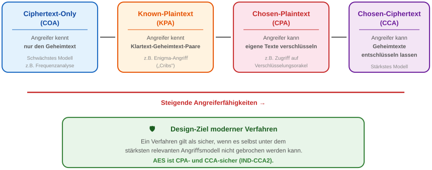

---

# Kryptoanalyse: Brute-Force

<!-- _class: huge -->

- **Definition:** Erschöpfendes Ausprobieren aller möglichen Schlüssel.
- **Komplexität:** $2^k$ Versuche bei $k$ Bits Schlüssellänge.

---

# Brute-Force – Zeitaufwand
<!-- _class: small -->

| Schlüssellänge | Anzahl Schlüssel | Zeit (10⁹ Keys/s) | Bewertung |
| :--- | ---: | :--- | :--- |
| 56 Bit (DES) | $7,2 \times 10^{16}$ | ~833 Tage | ❌ Unsicher |
| 64 Bit | $1,8 \times 10^{19}$ | ~585 Jahre | ❌ Ungenügend |
| 128 Bit (AES) | $3,4 \times 10^{38}$ | ~$10^{22}$ Jahre | ✅ Sicher |
| 256 Bit (AES) | $1,2 \times 10^{77}$ | ~$10^{60}$ Jahre | ✅ Langzeitsicher |

**Zum Vergleich:** Alter des Universums ≈ $1,4 \times 10^{10}$ Jahre

→ AES-128 ist mit heutiger Technologie **nicht** per Brute-Force brechbar.

---

# Mathematische Härte vs. Physische Realität

## Mathematischer Angriff
- Angriffe auf das zugrunde liegende Problem
- z.B. Zahlkörpersieb (GNFS) für RSA-Faktorisierung
- Konsequenz: Längere Schlüssel (2048+ Bit) werden nötig

## Seitenkanalangriffe
- Angriff auf die **Implementierung**, nicht den Algorithmus
- **Timing-Angriff:** Analyse der Rechenzeit
- **Strom (DPA):** Energieverbrauch verrät Bit-Werte
- **Elektromagnetisch:** EM-Abstrahlung
- **Gegenmaßnahme:** Constant-Time-Implementierungen

---
<!-- _class: chapter -->

# Moderne symmetrische Verfahren

## Von DES zu AES

---

# Symmetrische Verschlüsselung – Überblick

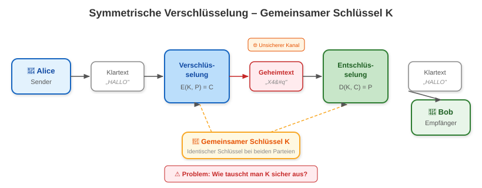

---

# Die Rolle des Zufalls in der Kryptographie
<!-- _class: biglist -->

- **Alles steht und fällt mit gutem Zufall**: IVs, Nonces, Schlüssel, Salts
- **PRNG** (Pseudo Random): Deterministisch, vorhersagbar → **unsicher für Krypto!**
- **CSPRNG** (Cryptographically Secure): Nicht vorhersagbar, z.B. `/dev/urandom`, `CryptGenRandom`
- **TRNG** (True Random): Hardware-basiert (thermisches Rauschen, radioaktiver Zerfall)
- **Historische Katastrophen:**
  - *Debian OpenSSL Bug (2008):* Zufallsgenerator auf 32.768 mögliche Schlüssel reduziert
  - *Sony PS3 ECDSA (2010):* Gleiche Nonce $k$ wiederverwendet → Private Key berechenbar

---

# Design-Konzepte: Konfusion und Diffusion

-  **Design-Ziele (Claude Shannon, 1949):**
    * **Konfusion:** Zusammenhang zwischen Schlüssel und Geheimtext so komplex wie möglich gestalten.
    * **Diffusion:** Einfluss eines Klartext-Bits auf möglichst viele Geheimtext-Bits ausweiten.
-  **Strukturelle Implementierung:**
    * **Substitution:** Ersetzen von Bits/Bytes (→ Konfusion).
    * **Permutation:** Vertauschen von Bit-Positionen (→ Diffusion).
-  **Iterative Chiffren:** Wiederholtes Anwenden dieser Operationen in Runden erhöht die Sicherheit.

---

# DES – Der erste Standard (1977)
<!-- _class: biglist -->

- **Data Encryption Standard:** Erster standardisierter symmetrischer Algorithmus (NIST/NBS).
- **Eckdaten:** 56-Bit Schlüssel, 64-Bit Blocklänge, Feistel-Netzwerk, 16 Runden.
- **Problem:** 56-Bit Schlüssel heute in Stunden knackbar! (Deep Crack, 1998: 56 Stunden)
- **3DES (Triple DES):** Dreifache Anwendung von DES ($C = E_{K3}(D_{K2}(E_{K1}(P)))$).
  - Effektive Schlüssellänge: 112 Bit (bei 3 verschiedenen Schlüsseln).
  - Langsam und seit 2023 durch NIST als veraltet erklärt.

---

# Die Suche nach AES (NIST, 1997)

**Kriterien für den DES-Nachfolger:**
-  Symmetrische Blockchiffre.
-  128 Bit Blocklänge.
-  Schlüssel: 128, 192 und 256 Bit.
-  Effizient in Hard- und Software (auch Smartcards).
-  Resistent gegen alle bekannten Kryptoanalysen (inkl. Power-/Timing-Attacken).
-  Frei von Patenten (unentgeltlich nutzbar).

**5 Finalisten, internationaler offener Wettbewerb.**

---

# Der Advanced Encryption Standard (AES)

-  **Gewinner:** Algorithmus **Rijndael** (Joan Daemen & Vincent Rijmen, Belgien).
-  **Struktur:** Substitution-Permutation Network (SPN).
-  **Runden:** 10 (AES-128), 12 (AES-192), 14 (AES-256).
-  **Sicherheit:** Kein praktisch durchführbarer Angriff bekannt.
-  **Effizienz:** Sehr hohe Performance, besonders mit AES-NI Hardware-Beschleunigung.
-  *Randnotiz:* US-Bedenken wegen europäischem Ursprung.

---

# AES – Die vier Rundenschritte

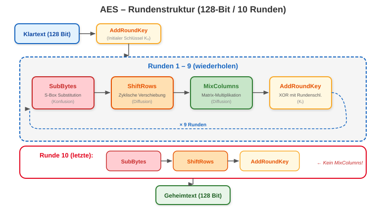

---

# AES – Warum ist es sicher?
<!-- _class: biglist -->

- **SubBytes:** Nicht-lineare S-Box zerstört algebraische Beziehungen → **Konfusion**
- **ShiftRows + MixColumns:** Verteilen jedes Eingabe-Bit auf viele Ausgabe-Bits → **Diffusion**
- **AddRoundKey:** Einmischung des Schlüsselmaterials per XOR
- Nach 10 Runden: Jedes Ausgabe-Bit hängt von **jedem** Eingabe-Bit und **jedem** Schlüssel-Bit ab
- Bester bekannter Angriff: **Biclique-Attack** – reduziert AES-128 auf $2^{126.1}$ (praktisch irrelevant)

---

# Blockchiffre-Betriebsarten: ECB und CBC

-  **Problem:** Blockchiffren verschlüsseln nur 128 Bit – wie verarbeitet man Megabytes?
-  **ECB (Electronic Codebook):**
    * Jeder Block wird unabhängig verschlüsselt.
    * **Schwachstelle:** Identische Klartextblöcke → identische Geheimtextblöcke (Mustererkennung!).
    * *Beispiel:* Der "ECB-Pinguin" (Konturen bleiben sichtbar).
-  **CBC (Cipher Block Chaining):**
    * Klartextblock wird mit dem vorherigen Geheimtextblock XOR-verknüpft.
    * Erfordert einen zufälligen Initialisierungsvektor (IV).
    * **Nicht parallelisierbar** bei Verschlüsselung.

---

# ECB vs. CBC im Vergleich

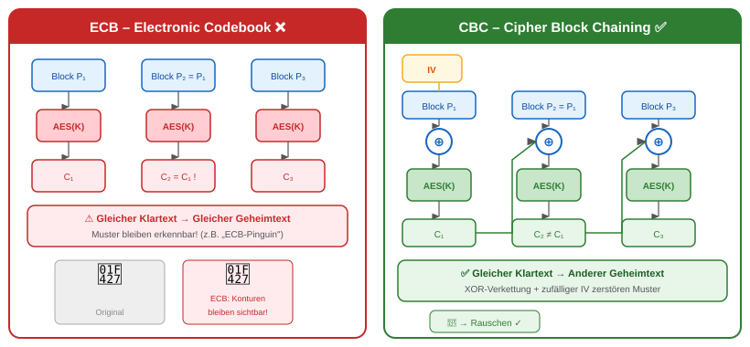

---

# CTR-Modus (Counter Mode)

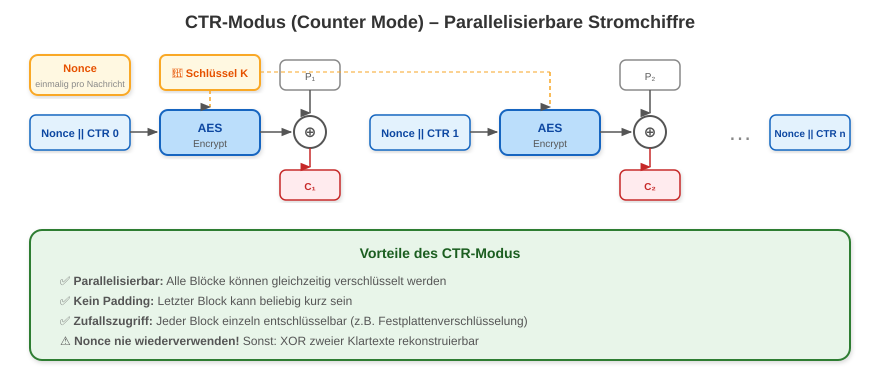

---

# GCM – Authentifizierte Verschlüsselung (AEAD)

## Was ist AEAD?
- **A**uthenticated **E**ncryption with **A**ssociated **D**ata
- Liefert **Vertraulichkeit und Integrität** in einem Schritt
- Erkennt Manipulation automatisch

## GCM (Galois/Counter Mode)
- CTR-Modus + Galois-Feld-Multiplikation
- Erzeugt einen **Authentication Tag**
- Sehr effizient (AES-NI Hardware-Beschleunigung)

## Warum AEAD?
- **Ohne AEAD:** Angreifer kann Geheimtext manipulieren, ohne dass es auffällt (z.B. Padding Oracle)
- **Mit AEAD:** Jede Manipulation wird erkannt und abgelehnt
- **„Encrypt-then-MAC"** als Prinzip

## Einsatz
- **Standard für TLS 1.3**, IPsec, SSH
- `AES-256-GCM` = aktueller Goldstandard

---

# ChaCha20-Poly1305 – Die Alternative
<!-- _class: biglist -->

- **ChaCha20:** Moderne Stromchiffre von Daniel J. Bernstein (2008).
- **Poly1305:** Zugehöriger MAC für AEAD.
- **Vorteile gegenüber AES-GCM:**
  - Keine Timing-Angriffe in Software (keine Lookup-Tables)
  - Performant **ohne** Hardware-Beschleunigung (ideal für Mobilgeräte, IoT)
  - Einfachere Implementierung → weniger Fehlerquellen
- **Einsatz:** WireGuard, TLS 1.3, QUIC (HTTP/3), Google Chrome
- **Faustregel:** AES-GCM wenn Hardware-Beschleunigung, ChaCha20 wenn nicht.

---
<!-- _class: chapter -->
# Sicherer Schlüsselaustausch

## ...über unsichere Kanäle

---
<!-- _class: biglist -->
# Das Schlüsselproblem

-  **Problem:** Alice und Bob wollen symmetrisch (z. B. AES) kommunizieren, haben aber keinen sicheren Kanal für den Schlüsselaustausch.
-  Bei $n$ Teilnehmern braucht man $\frac{n \cdot (n-1)}{2}$ Schlüssel – das skaliert nicht!
-  **Lösung (Diffie & Hellman, 1976):** Verfahren zur Berechnung eines gemeinsamen Geheimnisses über einen öffentlichen Kanal.

---

# Diffie-Hellman – Farbbeispiel

 
 

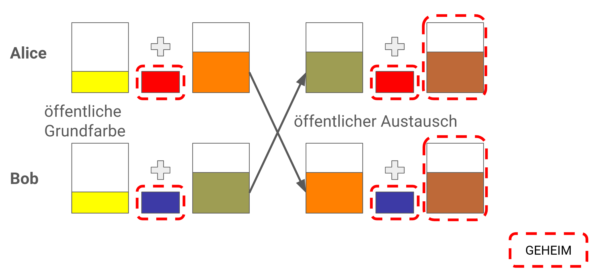

---

# Diffie-Hellman Schlüsselaustausch

-  **Mathematik:** Diskreter Logarithmus Problem (DLP).
-  **Ablauf:**
    1.  Öffentliche Parameter: Primzahl $p$, Generator $g$.
    2.  Alice wählt Geheimnis $a$, berechnet $A = g^a \pmod{p}$ $\rightarrow$ Bob.
    3.  Bob wählt Geheimnis $b$, berechnet $B = g^b \pmod{p}$ $\rightarrow$ Alice.
    4.  **Gemeinsamer Schlüssel $K$:**
        - Alice berechnet $K = B^a \pmod{p}$
        - Bob berechnet $K = A^b \pmod{p}$
-  Ein Angreifer kennt $g, p, A, B$, kann aber $g^{ab}$ nicht effizient berechnen.

---

# Diffie-Hellman – Zahlenbeispiel

**Öffentliche Parameter:**
- Primzahl $p = 23$, Generator $g = 5$

**Alice** ($a = 6$, geheim):
- $A = 5^{6} \bmod 23 = 8$ → sendet **8** an Bob

**Bob** ($b = 15$, geheim):
- $B = 5^{15} \bmod 23 = 19$ → sendet **19** an Alice

**Gemeinsamer Schlüssel:**
- Alice: $K = 19^{6} \bmod 23 = 2$
- Bob: $K = 8^{15} \bmod 23 = 2$
- Beide berechnen $K = \mathbf{2}$ ✅

**Angreifer sieht:** $g=5, p=23, A=8, B=19$

Muss diskreten Logarithmus lösen → bei großen Zahlen (2048+ Bit) praktisch unmöglich!

---

# Diffie-Hellman – Man-in-the-Middle
<!-- _class: biglist -->

- **Problem:** DH allein bietet **keine Authentifizierung!**
- Ein Angreifer (Mallory) kann sich zwischen Alice und Bob schalten:
  1. Mallory führt separaten DH mit Alice **und** Bob durch
  2. Alice glaubt mit Bob zu reden – redet aber mit Mallory
  3. Mallory kann alle Nachrichten mitlesen und verändern
- **Lösung:** DH kombiniert mit **digitalen Signaturen** oder **Zertifikaten**
- In TLS: Server beweist Identität per X.509-Zertifikat

---
<!-- _class: chapter -->

# Asymmetrische Verschlüsselung

## Public-Key-Kryptographie

---

# Asymmetrische Verschlüsselung – Überblick

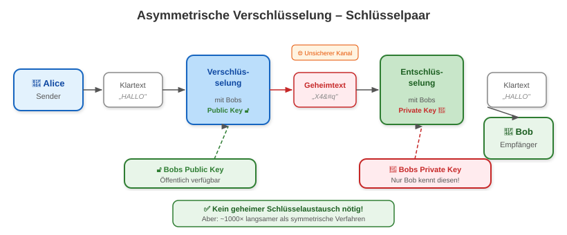

---

# Paradigma und Einwegfunktionen

-  **Definition:** Nutzt ein Paar verknüpfter Schlüssel: **Public Key** und **Private Key**.
-  **Konzept:** Trennung von Verschlüsselung (öffentlich) und Entschlüsselung (privat).
-  **Grundlage:** **Falltür-Einwegfunktionen** (Trapdoor One-Way Functions).
    * $y = f(x)$ ist leicht zu berechnen.
    * $x = f^{-1}(y)$ ist ohne Zusatzwissen praktisch unmöglich.
-  **Vorteile:** Lösung des Schlüsselaustauschproblems, hohe Skalierbarkeit.
-  **Nachteile:** Extrem langsam (Faktor 1000+ langsamer als AES).

---

# RSA – Grundlagen

-  **RSA (1977):** Meistverbreitetes asymmetrisches Verfahren (Rivest, Shamir, Adleman).
-  **Mathematik:** Faktorisierungsproblem großer Zahlen.
-  Es ist einfach, $p \cdot q = N$ zu rechnen, aber schwer aus $N$ wieder $p$ und $q$ zu finden.

---

# RSA – Beispiel: Schlüsselgenerierung

**Schritt 1: Wähle zwei Primzahlen**
-  $p = 11$, $q = 13$

**Schritt 2: Berechne Modulus $n$**
-  $n = p \cdot q = 11 \cdot 13 = 143$

**Schritt 3: Eulersche Phi-Funktion**
-  $\Phi(n) = (p-1) \cdot (q-1) = 10 \cdot 12 = 120$

**Schritt 4: Wähle öffentlichen Exponenten $e$**
- $e$ muss teilerfremd zu $\Phi(n)$ sein.
- Gewählt: $e = 17$ (da $ggT(17, 120) = 1$).

**Schritt 5: Berechne privaten Exponenten $d$**
- $(e \cdot d) \equiv 1 \pmod{\Phi(n)}$
- Ergebnis: $d = 113$

**Resultierende Schlüssel:**
- 🔓 Öffentlich: $(n, e) = (143, 17)$
- 🔒 Privat: $(n, d) = (143, 113)$

---

# RSA – Beispiel: Ver- und Entschlüsselung

## Verschlüsselung (Public Key)
- Nachricht (Zahl): $m = 88$
- Formel: $c = m^e \pmod{n}$
- Rechnung: $c = 88^{17} \pmod{143}$
- **Ergebnis:** $c = 121$

## Entschlüsselung (Private Key)
- Chiffrat: $c = 121$
- Formel: $m = c^d \pmod{n}$
- Rechnung: $m = 121^{113} \pmod{143}$
- **Ergebnis:** $m = 88$ ✅

→ Die ursprüngliche Nachricht wurde korrekt wiederhergestellt.

---

# Elliptic Curve Cryptography (ECC)

- **Grundidee:** Nutzung elliptischer Kurven über endlichen Körpern.
- **Vorteil:** Gleiche Sicherheit bei wesentlich kürzeren Schlüsseln.

**NIST Vergleich (128-Bit Sicherheit):**
- RSA: 3072 Bit Schlüssel
- ECC: 256 Bit Schlüssel

**Nutzen:** Weniger Rechenleistung, geringerer Energieverbrauch (IoT), schnellere Web-Handshakes.
**Verbreitete Kurven:** P-256, P-384, Curve25519 (X25519 für DH, Ed25519 für Signaturen).

---

# Schlüssellängen im Vergleich
<!-- _class: small -->

| Sicherheitsniveau | RSA (Bit) | ECC (Bit) | AES (Bit) | Bemerkung |
| :--- | ---: | ---: | ---: | :--- |
| 80 Bit | 1.024 | 160 | – | Veraltet, **nicht verwenden** |
| 112 Bit | 2.048 | 224 | – | Noch akzeptabel bis ~2030 |
| 128 Bit | 3.072 | 256 | 128 | **Aktueller Standard** |
| 192 Bit | 7.680 | 384 | 192 | Hohe Sicherheitsanforderungen |
| 256 Bit | 15.360 | 521 | 256 | Langzeitschutz |

**Faustformel:** ECC-Schlüssel sind ~12× kürzer als RSA bei gleicher Sicherheit.

---

# Hybride Verschlüsselung – Das Beste aus beiden Welten

Kombination der Vorteile von Symmetrie (Speed) und Asymmetrie (Key-Verteilung).

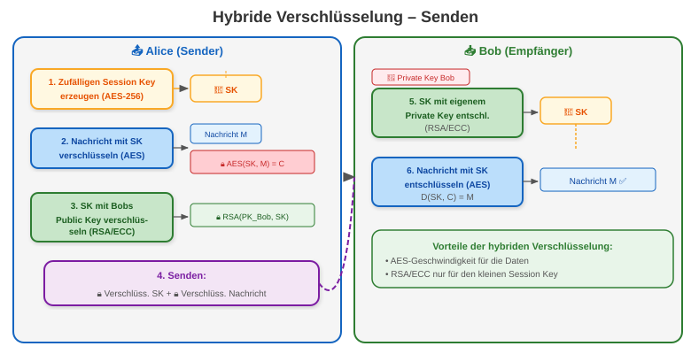

**Prinzip:** Asymmetrisch wird nur der **Session Key** ausgetauscht; die Daten selbst werden symmetrisch (AES) verschlüsselt. Dies ist die Grundlage für TLS, S/MIME, PGP u.v.m.

---
<!-- _class: chapter -->

# Integrität & Authentizität

## Hashes, MACs und Digitale Signaturen

---

# Hashfunktionen – Überblick

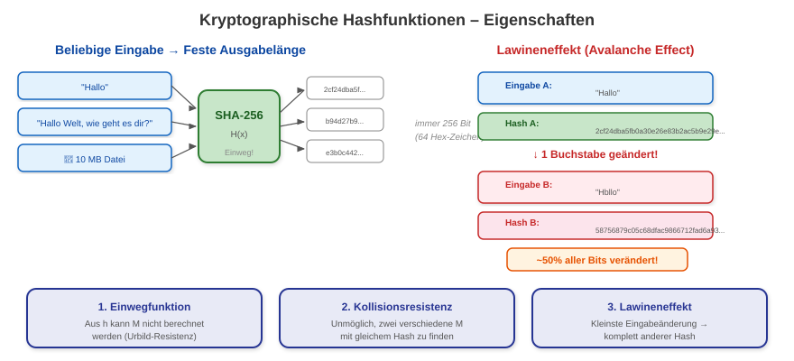

---

# Hashfunktionen

- **Zweck:** Integritätsprüfung ("digitaler Fingerabdruck").
- **Eigenschaften:**
    1.  **Einwegfunktion (Urbild-Resistenz):** Aus Hash $h$ kann Nachricht $M$ nicht berechnet werden.
    2.  **Kollisionsresistenz:** Es ist praktisch unmöglich, zwei verschiedene Nachrichten mit gleichem Hash zu finden.
    3.  **Lawineneffekt:** Kleinste Eingabeänderung → komplett anderer Hash.
- **Aktuell empfohlen:** SHA-256, SHA-3 (Keccak).
- ❌ **Gebrochen / veraltet:** MD5, SHA-1 (Kollisionen nachgewiesen).
- **Anwendung:** Passwort-Speicherung, Checksums, Blockchain, Digitale Signaturen.

---

# MACs – Message Authentication Codes

## Hash vs. MAC
- **Hash:** Prüft nur **Integrität** (wurde etwas verändert?)
- **MAC:** Prüft **Integrität + Authentizität** (wer hat es geschickt?)
- Unterschied: MAC benötigt einen **geheimen Schlüssel**

## HMAC-Konstruktion
$\text{HMAC}(K, M) = H\big((K \oplus \text{opad}) \| H((K \oplus \text{ipad}) \| M)\big)$

## Anwendungsfälle
| Einsatz | Beispiel |
| :--- | :--- |
| **API-Authentifizierung** | AWS Signature v4 |
| **TLS** | Record-Layer Integrität |
| **JWT** | HMAC-SHA256 Token |
| **Blockchain** | Merkle Trees |

---

# HMAC – Konstruktion

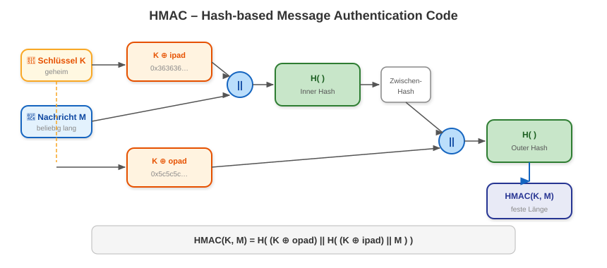

---

# Passwort-Hashing – Salted Hashes

## Warum nicht einfach hashen?
- Gleiche Passwörter → gleicher Hash
- **Rainbow Tables:** Vorberechnete Hash-Tabellen für Millionen Passwörter
- Angriff in Sekunden möglich!

## Lösung: Salt + langsamer Hash
- **Salt:** Zufälliger Wert, pro Nutzer einzigartig
- Gespeichert: `salt || hash(salt + passwort)`

## Empfohlene Algorithmen
| Algorithmus | Typ |
| :--- | :--- |
| **Argon2id** | Memory-hard (Gewinner PHC) |
| **bcrypt** | Adaptiver Kostenfaktor |
| **scrypt** | Memory-hard |

## Nicht verwenden!
- MD5, SHA-1, SHA-256 (zu schnell!)
- Ungesalzene Hashes

---

# Digitale Signaturen

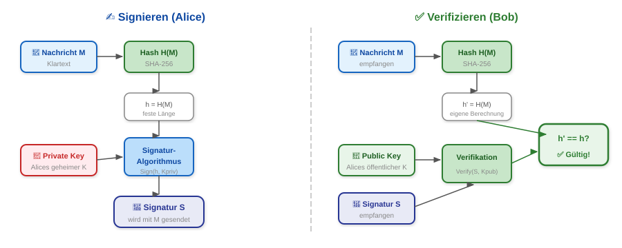

---

# Digitale Signaturen – Ablauf

**Signatur-Prozess (Alice):**
1.  Alice berechnet Hash der Nachricht: $h = H(M)$.
2.  Alice signiert $h$ mit ihrem **Private Key**: $S = \text{Sign}(h, K_{priv})$.

**Verifikations-Prozess (Bob):**
1.  Bob berechnet eigenen Hash der Nachricht: $h'= H(M)$.
2.  Bob verifiziert Signatur $S$ mit Alices **Public Key**: $h_{Alice} = \text{Verify}(S, K_{pub})$.
3.  Prüfung: $h' == h_{Alice}$?
    * **Ja:** Nachricht ist **authentisch** und **integer**.

**Verbreitete Algorithmen:** RSA-PSS, ECDSA (P-256), Ed25519.

---
<!-- _class: chapter -->

# PKI & Vertrauensmodelle

## Wem kann man vertrauen?

---

# X.509-Zertifikate und PKI

- **Problem:** Woher weiß Bob, dass ein Public Key wirklich Alice gehört?
- **Lösung:** Eine vertrauenswürdige Instanz (**Certificate Authority, CA**) bestätigt die Zuordnung.
- **Zertifikate:** X.509-Standard – digitale Ausweise für Public Keys.
- **Struktur:** Root-CA $\rightarrow$ Intermediate CA $\rightarrow$ End-Entity Zertifikat.

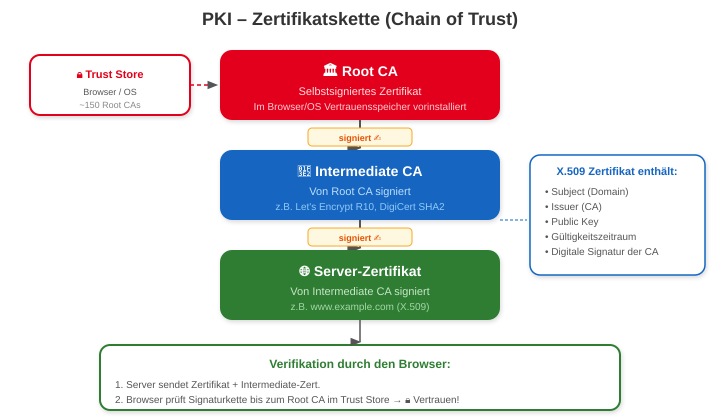

---

# E-Mail-Verschlüsselung: S/MIME vs. OpenPGP

## S/MIME
- **Vertrauensmodell:** Hierarchische PKI
- X.509-Zertifikate (von CA ausgestellt)
- Automatischer Key Exchange via Signatur
- **Typisch:** Unternehmen, Behörden

## OpenPGP
- **Vertrauensmodell:** Web of Trust (WoT)
- Dezentral, keine zentrale Autorität
- Manuelle Key-Verteilung (Keyserver)
- **Typisch:** Tech-Community, Journalisten

## Vergleich

| Merkmal | S/MIME | OpenPGP |
| :--- | :--- | :--- |
| **Vertrauen** | Hierarchisch | Dezentral |
| **Zertifikate** | X.509 (CA) | PGP-Keys |
| **Kosten** | Oft kostenpflichtig | Kostenlos |
| **Key Exchange** | Automatisch | Manuell |
| **Forward Secrecy** | Nein | Nein |

---

# Das PGP Web of Trust (WoT)

- **Validität:** Gehört der Key wirklich Person X?
- **Owner Trust:** Vertraue ich Person X bei der Prüfung anderer?
- **1-Full / 3-Marginal Regel:** Key ist gültig bei einer Signatur durch voll vertrauenswürdige Person oder drei marginal vertrauenswürdige.
- **Key Signing Parties:** Physisches Treffen zum ID-Abgleich.
- **Problem:** Skaliert schlecht – in der Praxis setzt sich **Trust on First Use (TOFU)** durch.

---
<!-- _class: chapter -->

# TLS / HTTPS

## Kryptographie im Web

---

# Was ist TLS?
<!-- _class: biglist -->

- **Transport Layer Security** – das wichtigste Protokoll für verschlüsselte Kommunikation im Internet
- Schützt: HTTP (HTTPS), SMTP, IMAP, XMPP, MQTT, ...
- Aktueller Standard: **TLS 1.3** (RFC 8446, August 2018)
- TLS 1.0 und 1.1 sind seit 2021 **offiziell veraltet** (RFC 8996)
- Kombination aus: Schlüsselaustausch + Authentifizierung + symmetrischer Verschlüsselung + Integrität

---

# TLS 1.3 – Der Handshake

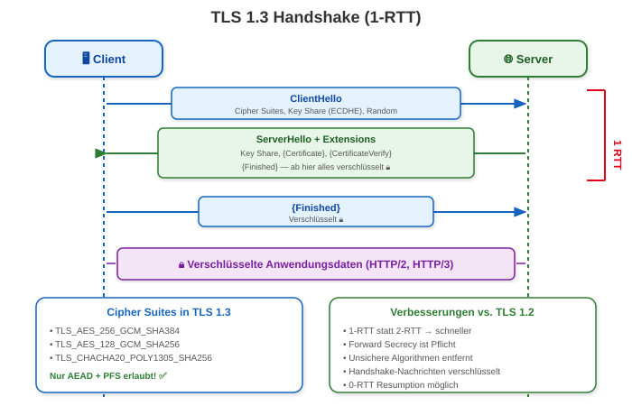

---

# TLS 1.3 vs. TLS 1.2
<!-- _class: small -->

| Eigenschaft | TLS 1.2 | TLS 1.3 |
| :--- | :--- | :--- |
| **Handshake** | 2-RTT | **1-RTT** (0-RTT möglich) |
| **Schlüsselaustausch** | RSA oder (EC)DHE | **Nur (EC)DHE** |
| **Forward Secrecy** | Optional | **Pflicht** |
| **Cipher Suites** | ~37 | **5** (nur AEAD) |
| **Handshake-Daten** | Klartext | **Verschlüsselt** |
| **Unsichere Algorithmen** | RC4, DES, MD5, SHA-1 | **Alle entfernt** |
| **Resumption** | Session Tickets | **PSK + 0-RTT** |

→ TLS 1.3 ist **schneller, sicherer und einfacher**.

---

# Forward Secrecy (PFS)
<!-- _class: biglist -->

- **Problem:** Wenn der Private Key des Servers kompromittiert wird – kann der Angreifer frühere Kommunikation entschlüsseln?
- **Ohne PFS (RSA Key Exchange):** Ja! → Alle aufgezeichneten Sessions sind lesbar.
- **Mit PFS (Ephemeral Diffie-Hellman):**
  - Für jede Session wird ein neuer, temporärer DH-Schlüssel erzeugt
  - Wird nach der Session gelöscht
  - Kompromittierter Langzeitschlüssel betrifft **nur zukünftige** Sessions
- TLS 1.3 erzwingt PFS → **Kein RSA Key Exchange mehr möglich**

---
<!-- _class: chapter -->

# Post-Quantum Kryptographie

## Die Bedrohung durch Quantencomputer

---

# Quantencomputer vs. heutige Kryptographie

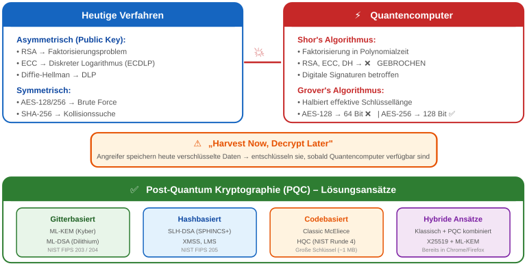

---

# Post-Quantum Kryptographie – NIST Standards

## Neue NIST Standards (2024)

| Standard | Basis | Typ |
| :--- | :--- | :--- |
| **FIPS 203** (ML-KEM) | CRYSTALS-Kyber | Schlüsselaustausch |
| **FIPS 204** (ML-DSA) | CRYSTALS-Dilithium | Signatur |
| **FIPS 205** (SLH-DSA) | SPHINCS+ | Signatur |

Alle basieren auf **Gitter-** oder **Hash-Problemen**, die auch Quantencomputer nicht effizient lösen können.

## Was bedeutet das für die Praxis?

- **Jetzt handeln:** Migration beginnen!
- **Hybride Ansätze:** Klassisch + PQC kombiniert
  - Chrome/Firefox nutzen bereits **X25519 + ML-KEM**
- **Mosca's Theorem:**
  - $x + y > z$ → jetzt migrieren!
  - $x$ = Schutz-Dauer der Daten
  - $y$ = Migrationszeit
  - $z$ = Zeit bis Quantencomputer verfügbar
- Besonders kritisch: Gesundheitsdaten, Staatsgeheimnisse, Infrastruktur

---
<!-- _class: chapter -->

# Praxisthemen

## DRM und Steganographie

---

# Digital Rights Management (DRM) – Das Dilemma

## Das Kernproblem
- **Rechteinhaber:** Will Nutzung kontrollieren
- **Nutzer:** Muss Inhalt entschlüsseln können
- **Dilemma:** Schlüssel muss zum Nutzer, darf aber nicht kopiert werden

## Warum DRM oft scheitert
- **Reverse Engineering** auf eigenem System
- **Memory Dumping** des Schlüssels aus RAM
- **Patching/Hooking** der Prüflogik

## DRM-Systeme im Laufe der Zeit

| Medium | Technik |
| :--- | :--- |
| **DVD** | CSS (gebrochen) |
| **Blu-ray** | AACS |
| **Streaming** | Widevine, PlayReady |
| **Hardware** | TPM |

## Moderne Lösung: TEE
- **Widevine L1:** Entschlüsselung nur im Trusted Execution Environment (ARM TrustZone)
- **Trusted Video Path:** Rohdaten nie im OS sichtbar

---

# Steganographie – Informationen verstecken
<!-- _class: biglist -->

- **Ziel:** Unauffälligkeit – Dritte sollen nicht bemerken, dass Kommunikation stattfindet.
- **Abgrenzung:** Kryptographie macht Text **unlesbar**; Steganographie macht Kommunikation **unsichtbar**.
- **Least Significant Bit (LSB) Substitution:**
  - Änderung der niederwertigsten Bits in Bilddateien (für Menschen nicht wahrnehmbar)
  - Beispiel (24-Bit RGB): 3 Bit pro Pixel → in einem 1920×1080-Bild: ~760 KB versteckbar
- **Carrier:** Bilder, Audio, Video, Whitespace in Text

---
<!-- _class: chapter -->

# Zusammenfassung

---

# Zusammenfassung – Key Takeaways
<!-- _class: small -->

**Grundprinzipien:**
- Kerckhoffs' Prinzip: Sicherheit liegt im Schlüssel, nicht im Algorithmus
- Symmetrisch = schnell, Asymmetrisch = flexibel → **Hybride Verschlüsselung**
- AES-256-GCM + (EC)DHE = aktueller Goldstandard

**Schlüsselaustausch & Asymmetrie:**
- Diffie-Hellman ermöglicht sicheren Austausch über unsichere Kanäle
- Aber: Erfordert Authentifizierung (Zertifikate)!
- RSA wird langfristig durch ECC und PQC abgelöst

**Integrität & Authentizität:**
- Hashfunktionen (SHA-256/SHA-3) für Integrität
- HMAC für Integrität + Authentizität
- Digitale Signaturen für Non-Repudiation

**Praxis:**
- TLS 1.3 = Standard für Webkommunikation
- Forward Secrecy ist Pflicht
- Passwort-Hashing: Argon2id, bcrypt (nie SHA-256!)
- Zufall ist fundamental: CSPRNG immer verwenden

**Ausblick:**
- Quantencomputer bedrohen RSA/ECC/DH
- NIST PQC-Standards sind verabschiedet (ML-KEM, ML-DSA)
- Migration zu hybriden Verfahren läuft
- **„Harvest Now, Decrypt Later"** → jetzt handeln!

---

# Diskussionsfragen
<!-- _class: biglist -->

1. **Warum ist "Security by Obscurity" langfristig zum Scheitern verurteilt?** Kennen Sie Beispiele?
2. **AES ist seit 2001 im Einsatz** – warum wurde es noch nicht gebrochen? Was macht es anders als DES?
3. **Harvest Now, Decrypt Later:** Welche Daten sind besonders gefährdet und warum ist das Zeitfenster für die Migration knapp?
4. **SHA-256 ist für Passwort-Hashing unsicher** – warum? Es ist doch ein sicherer Hash-Algorithmus?
5. **Forward Secrecy:** Warum erzwingt TLS 1.3, dass für jede Session neue DH-Schlüssel verwendet werden?