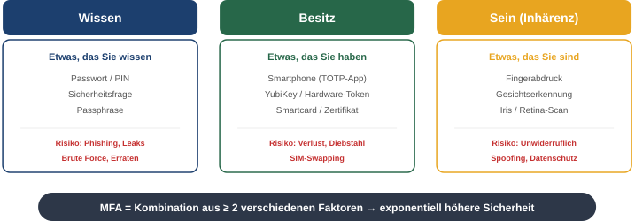
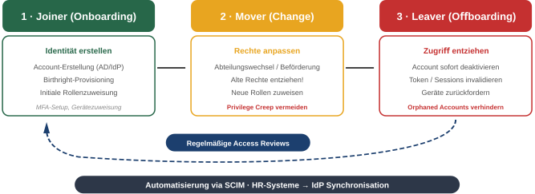
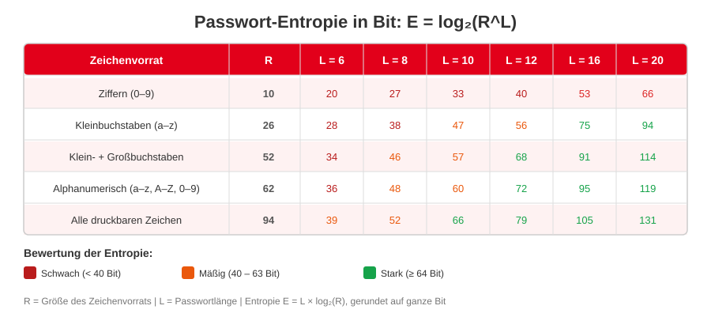
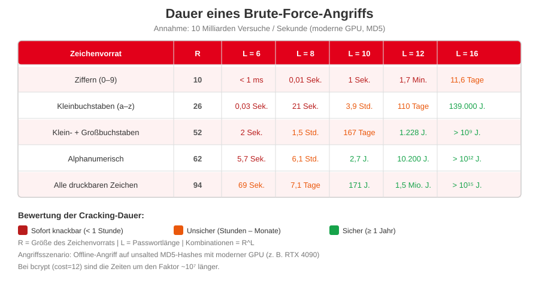
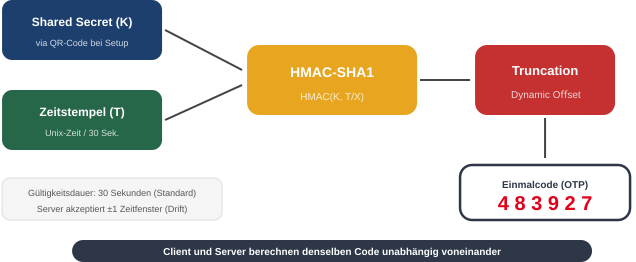
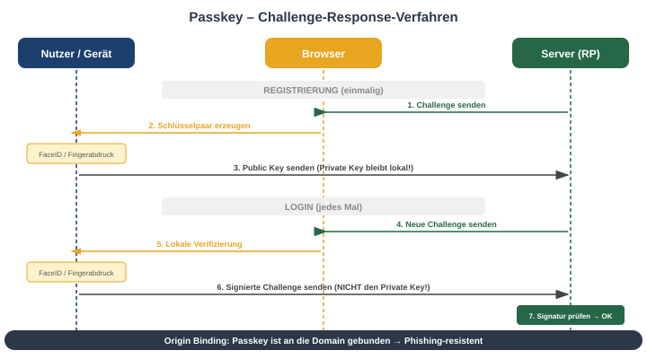
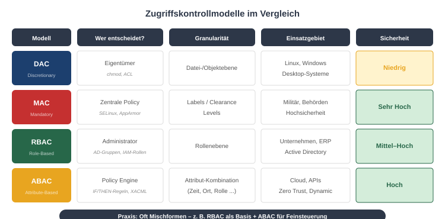
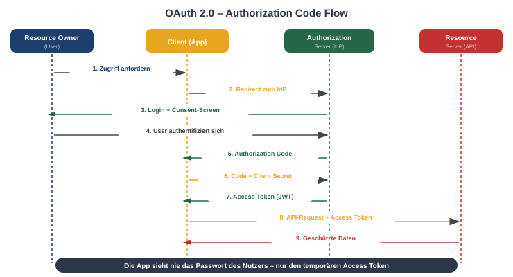

<!-- _class: title -->
# Identity and Access Management (IAM)

 
 
 
 
 
 

## Authentifizierung, Autorisierung & Federation

---
<!-- _class: biglist -->
# Agenda Identity & Access Management (IAM)

- **Grundlagen** – IAM-Definition, AuthN vs. AuthZ, Identity Lifecycle
- **Authentifizierung – Wissen** – Passwörter, Entropie, Hashing
- **Authentifizierung – Besitz, Biometrie & MFA** – Token, TOTP, TAN, Angriffe
- **Passkeys** – FIDO2, WebAuthn, Challenge-Response
- **Autorisierung** – DAC, MAC, RBAC, ABAC, PAM, Identity Governance
- **Verzeichnisdienste** – LDAP, Active Directory, Kerberos
- **SSO & Federation** – OAuth 2.0, OpenID Connect, SAML 2.0
- **Angriffe auf IAM** – Credential Stuffing, Pass-the-Hash, Token Theft

---

# Identity & Access Management (IAM)

IAM ist das Framework aus **Richtlinien, Prozessen und Technologien**, das sicherstellt, dass die **richtigen Entitäten** (Benutzer oder Systeme) den **richtigen Zugriff** auf die **richtigen Ressourcen** (Daten, Anwendungen) zur **richtigen Zeit** und aus den **richtigen Gründen** erhalten.

---

# Authentifizierung vs. Autorisierung – Überblick

| | **Authentifizierung (AuthN)** | **Autorisierung (AuthZ)** |
|---|---|---|
| **Frage** | *Wer sind Sie?* | *Was dürfen Sie tun?* |
| **Ziel** | Identität überprüfen | Rechte gewähren/verweigern |
| **Reihenfolge** | Zuerst | Danach |
| **Mechanismen** | Passwort, Biometrie, Token | Rollen, Policies, ACLs |
| **Analogie** | Personalausweis vorzeigen | Hausordnung lesen |
| **Protokolle** | OIDC, SAML, WebAuthn | OAuth 2.0, XACML |

> **Merksatz:** Authentifizierung prüft die Identität – Autorisierung prüft die Berechtigung.

---

# Die drei Faktoren der Authentifizierung

---

# Der Identity Lifecycle

 

> **Praxis:** Viele Sicherheitsvorfälle entstehen durch ehemalige Mitarbeiter mit noch aktivem Zugang.

---
<!-- _class: biglist -->
# IAM als Kern von Zero Trust

In modernen Infrastrukturen gibt es kein sicheres "internes Netz" mehr.

- **Leitsatz:** "Never trust, always verify."
- **Verschiebung des Perimeters:** Früher schützte die Firewall das Netz. Heute ist die **Identität** der neue Sicherheitsumfang.
- **Kontextuelle Prüfung:** Jeder Zugriff wird individuell geprüft (Wer? Welches Gerät? Welcher Ort? Welche Uhrzeit?), basierend auf Authentifizierung und Autorisierung.
- **Continuous Verification:** Nicht nur beim Login – auch während der Session.

---
<!-- _class: chapter -->

# Authentifizierung – Wissen

## Passwörter und ihre Grenzen

---
<!-- _class: huge -->
# Wissen – Passwörter

- Passwörter sind der "klassische" Authentifizierungsfaktor: **Wissen**
- Das Passwort ist ein Single Point of Failure, der auf **Geheimhaltung** basiert
- Sobald dieses Geheimnis – sei es durch Raten, Phishing oder Leaks – preisgegeben wird, ist die Authentifizierung gebrochen

---

# Passwortstärke

Das Maß für die Stärke eines Passworts ist die **Entropie**

Diese ergibt sich aus folgender Formel:

$E = log_2(R^L)$

Dabei ist $R$ der Vorrat an möglichen Zeichen, $L$ ist die Länge des Passworts

---

# Passwörter – Entropie

---

# Passwörter – Brute Force Angriffe

---
<!-- _class: normal -->
# Schwache Passwörter (Geringe Entropie)

### Typische Muster
- Gängige Wörter: `Passwort`, `Sonne`
- Sequenzen: `123456`, `qwertz`, `abcdef`
- Persönliche Daten: Geburtstage, Kosenamen
- Tastaturpfade: `qwerty`, `asdfgh`
- Leetspeak-Varianten: `P@ssw0rt`

### Warum so verbreitet?
- **Merkbarkeit** schlägt Sicherheit
- **Rotation** erzwingt einfache Muster
- **Kein Feedback** über Passwortstärke
- **Top 10** decken Millionen von Accounts ab

> `123456` war 2024 das weltweit häufigste Passwort (NordPass)

---
<!-- _class: normal -->
# Passwortregeln – Traditionell vs. Modern

### Traditionell
- Mindestlänge 8–12 Zeichen
- Großbuchstabe (A–Z)
- Kleinbuchstabe (a–z)
- Ziffer (0–9)
- Sonderzeichen (!§$%&?)

**Problem:** Führt zu Mustern wie `Sommer2024!` → leicht angreifbar

### Modern (NIST SP 800-63B)
- **Länge > Komplexität**
- Passphrase: `vier-schoene-baeume-im-garten`
- Prüfung gegen **Blocklists** (bekannte/kompromittierte Passwörter)
- Keine Komplexitätsregeln mehr
- Mindestens 15 Zeichen empfohlen

**Ergebnis:** Sicherer UND merkbarer

---
<!-- _class: normal -->
# Menschliche Schwächen bei Passwörtern

- **Passwort-Wiederverwendung (Password Reuse):** Dasselbe Passwort für Dutzende Dienste. Wird ein Dienst kompromittiert → **Credential Stuffing** bei allen anderen.
- **Unsichere Aufbewahrung:** Post-it am Monitor, unverschlüsselte `passwoerter.txt`, Browser-Speicher ohne Master-Passwort.
- **Social Engineering:** Anfälligkeit für Phishing-Angriffe – Passwort wird auf gefälschter Webseite eingegeben.
- **Minimale Änderungen:** Bei erzwungener Rotation: `P@ssw0rt_01` → `P@ssw0rt_02`.

---
<!-- _class: normal -->
# Passwort-Rotation – Pro & Contra

### Ursprüngliche Idee
- Gültigkeitsdauer eines gestohlenen Passworts begrenzen
- Regelmäßig wechseln (z.B. alle 90 Tage)

### Warum kontraproduktiv?
- Minimale Änderungen (`_01` → `_02`)
- Kognitive Last → schwächere Passwörter
- Passwörter werden aufgeschrieben

### Moderne Empfehlung (NIST, BSI)
- **Keine** erzwungene periodische Rotation
- Passwörter bleiben gültig, solange sie **stark** sind
- Änderungspflicht **nur bei Kompromittierung**:
  - Verdächtige Anmeldeversuche
  - Auftauchen in einem Datenleck
  - Laterale Bewegung im Netzwerk

---
<!-- _class: normal -->
# Passwort Manager

**Verschlüsselte Datenbank** (ein "Tresor" / "Vault") zur Speicherung von Zugangsdaten – geschützt durch ein Master-Passwort (+ idealerweise 2FA).

### Kernfunktionen
- **Passwort-Generator:** Erzeugt zufällige, hochentropische Passwörter
- **Auto-Fill:** Füllt Formulare nur bei **exakter URL** aus → Phishing-Schutz
- **Synchronisation:** Zugriff auf allen Geräten (Cloud) oder lokal

### Bekannte Lösungen

| Typ | Beispiele |
|---|---|
| **Cloud** | Bitwarden, 1Password |
| **Lokal** | KeePass, KeePassXC |
| **Browser** | Chrome, Firefox (eingebaut) |
| **Enterprise** | CyberArk, HashiCorp Vault |

---
<!-- _class: normal -->
# Passwort Manager – Vorteile & Nachteile

### Vorteile
- **Einzigartigkeit:** Für jeden Dienst ein langes, komplexes Passwort
- **Stärke:** Generatoren mit hoher Entropie (z.B. `k9§yE#vT!z$5rP@&mL`)
- **Lösung des Memorierproblems:** Nur Master-Passwort merken
- **Phishing-Schutz:** Auto-Fill nur bei exakter URL

### Nachteile
- **Single Point of Failure:** Kompromittierung des Masters = alles weg
- **Cloud-Manager** (Bitwarden, 1Password): Vertrauen in "Zero-Knowledge"-Prinzip
- **Lokale Manager** (KeePass): `.kdbx`-Datei in eigener Verantwortung
- **Verfügbarkeit:** Master vergessen = Daten verloren

---
<!-- _class: chapter -->

# Passwörter – Implementierung

## Speichern und Schutz von Passwörtern

---
<!-- _class: normal -->
# Passwörter – Implementierung (Naiver Ansatz)

**Erster Ansatz:** User/Passwort-Paare als Klartext in einer Datenbank speichern.

| user_id | username | password |
|:---:|:---|:---|
| 1 | max.mustermann | `Sommer2024!` |
| 2 | anna.schmidt | `qwertz123` |
| 3 | tom.weber | `Sommer2024!` |

**Probleme:**
- Jeder mit DB-Zugriff (Admin, Angreifer, Backup) kann **alle Passwörter lesen**
- Bei einem Breach sind sofort alle Konten kompromittiert
- Gleiche Passwörter (User 1 & 3) sind sofort erkennbar → Muster ableitbar

---

# Passwörter – Hashing

## Nächster Versuch – Nur **Hashes** von Passwörtern speichern

**Vorteile:**
  - Nur der User kennt das Passwort

**Nachteile:**
  - Passwort-Rücksetzen aufwändiger
  - Höhere Rechenlast
  - Anfällig gegen Rainbow Tables

---

# Rainbow Tables

Problem von Hashes: Gleiches Passwort führt zu gleichem Hash

**Angriff:**
  - Vorberechnung von Hashes für gängige Passwörter
  - Suche der Hashes in Tabelle mit Passwort-Hashes

---
<!-- _class: normal -->
# Passwort Salting

Schutz gegen Rainbow Tables: Ein pro User **zufällig generierter String** (Salt) wird an das Passwort angehängt. Der Salt wird zusammen mit dem Hash gespeichert.

| user_id | username | salt | hash |
|:---:|:---|:---|:---|
| 1 | max.mustermann | `a7f3` | `SHA256("Sommer2024!" + "a7f3")` = `9c1d...` |
| 3 | tom.weber | `k2x8` | `SHA256("Sommer2024!" + "k2x8")` = `f4a7...` |

**Effekt:** Gleiches Passwort → **unterschiedliche Hashes** (durch verschiedene Salts).

- Rainbow Tables werden nutzlos, da für jede Salt-Variante eine eigene Tabelle nötig wäre
- Salt muss **nicht** geheim sein – er verhindert nur Vorberechnung
- Mindestlänge: **16 Byte** (kryptographisch zufällig, z.B. via `os.urandom()`)

---
<!-- _class: normal -->
# Moderne Hashing-Algorithmen

Einfaches Hashing (MD5, SHA-1, SHA-256) ist **zu schnell** – Angreifer können Milliarden Hashes/Sekunde berechnen.

| Algorithmus | Prinzip | Stärke |
|---|---|---|
| **bcrypt** | Adaptive Cost-Function (Iteration Count). Basiert auf Blowfish. | Bewährt, weit verbreitet |
| **scrypt** | Speicher-intensiv → gegen GPU/ASIC-Angriffe | Gut gegen Hardware-Angriffe |
| **Argon2id** | Gewinner des Password Hashing Competition (PHC). Kombiniert speicher- und zeitintensiv. | **Aktueller Goldstandard** |

**Warum wichtig?**
- SHA-256: ~10 Mrd. Hashes/s (GPU) → Brute-Force in Minuten
- bcrypt (cost=12): ~1.000 Hashes/s → Brute-Force in Jahren
- Argon2id: Konfigurierbar für Zeit UND Speicher

---
<!-- _class: chapter -->

# Authentifizierung – Besitz & Biometrie

## Token, MFA und Angriffe

---
<!-- _class: normal -->
# Authentifizierung – Besitz

### Beispiele
- **Hardware-Token:** USB-Sicherheitsschlüssel (YubiKey)
- **Smartcards:** Chipkarten mit Lesegerät
- **Mobilgeräte:** Smartphone-Apps, SMS-Codes
- **Zertifikate:** Digitale Schlüssel auf speziellen Medien

### Vorteile
- Schutz vor Remote-Angriffen
- Phishing-Resistenz (FIDO2)
- Geringe kognitive Last
- Schwere Duplizierbarkeit

### Nachteile
- **Verlust:** Token weg = Zugang gesperrt
- **Kosten:** Hardware für Kauf, Verteilung, Ersatz
- **Abhängigkeit:** Leerer Akku, vergessener Stick
- **Logistik:** Verwaltung, Inventar, Rückforderung bei Austritt

---
<!-- _class: normal -->
# Authentifizierung – Sein (Inhärenz / Biometrie)

### Merkmale
- Fingerabdruck, Gesicht, Stimme, Retina
- Einzigartig und (theoretisch) unveränderlich

### Vorteile
- Maximale Bequemlichkeit – nichts vergessen
- Keine Merklast
- Einzigartigkeit bei jedem Menschen
- Schnelligkeit (Blick in Kamera)

### Nachteile
- **Unwiderruflichkeit:** Gestohlene Daten nicht "änderbar"
- **Fehlerraten:**
  - False Acceptance Rate (FAR)
  - False Rejection Rate (FRR)
- **Datenschutz:** Hochsensible Daten, Angst vor Überwachung
- **Spoofing:** Fotos, 3D-Masken, Deepfakes können einfache Systeme täuschen

---

# Multi-Faktor-Authentifizierung (MFA/2FA)

## Das Herzstück der **2FA** ist die Kombination von **zwei unabhängigen Komponenten** aus **unterschiedlichen Kategorien.**

## Die Sicherheit steigt exponentiell, da ein Angreifer zwei völlig verschiedene Barrieren gleichzeitig überwinden muss.

---

# 2FA – Time-based One-Time Password (TOTP)
<!-- _class: normal -->
Erstellen von nur kurzzeitig gültigen PINs (RFC 6238):

- **Shared Secret (K):** Kryptographischer Schlüssel, beim Setup via QR-Code ausgetauscht.
- **Zeitstempel (T):** Aktuelle Unix-Zeit.
- **Zeitintervall (X):** Gültigkeitsdauer eines Codes (Standard: 30 Sekunden).

**Formel:** $\text{TOTP}(K, T) = \text{Truncate}(\text{HMAC-SHA1}(K, \lfloor T/X \rfloor))$

---

# TOTP – Funktionsweise

---
<!-- _class: normal -->
# TAN-Verfahren im Vergleich

| Verfahren | Prinzip | Sicherheit | Status |
|:---|:---|:---:|:---|
| **iTAN** | Gedruckte Papierlisten | Niedrig | Ausgemustert (PSD2) |
| **mTAN** | SMS auf Handy | Mittel | Auslaufmodell |
| **chipTAN** | Separates Lesegerät + Bankkarte | Sehr Hoch | Nischenprodukt |
| **pushTAN** | App-Freigabe (biometrisch) | Hoch | ✅ Standard |

**Entwicklungstreiber:**
- **Phishing** machte statische TANs unsicher
- **SIM-Swapping** kompromittierte SMS-basierte Verfahren
- **PSD2-Richtlinie** der EU: Dynamische Verknüpfung (TAN an Betrag + Empfänger) und 2FA verpflichtend

---

# MFA – Mögliche Angriffe

- **SIM-Swapping:** Angreifer erschleichen sich beim Provider eine Ersatz-SIM des Opfers.
- **Phishing:** Nutzer geben die TAN auf gefälschten Seiten selbst ein.
- **Session Hijacking:** Wenn das Session-Cookie nach dem 2FA-Login gestohlen wird, nützt der zweite Faktor nichts mehr.
- **2FA Fatigue (Ermüdungsangriff):** Angreifer überfluten das Opfer mit Push-Benachrichtigungen, bis dieses aus Frust auf "Erlauben" drückt.

---
<!-- _class: normal -->
# Fallstudie: Uber-Hack 2022 (2FA Fatigue)

**Ablauf:**
1. Angreifer kauft gestohlene Zugangsdaten im Darknet
2. Versucht Login → Uber-MFA sendet Push-Notification
3. Angreifer **spammt** über eine Stunde lang Push-Requests
4. Kontaktiert Opfer über WhatsApp als "IT-Support"
5. Opfer drückt genervt auf **"Erlauben"**
6. Angreifer hat Zugang zu internen Systemen (Slack, HackerOne, AWS)

**Gegenmaßnahmen:**
- **Number Matching:** App zeigt eine Zahl – Nutzer muss sie auf dem Login-Screen bestätigen
- **Anomalie-Erkennung:** Alarm bei ungewöhnlich vielen Push-Requests
- **Phishing-resistente Faktoren:** Passkeys statt Push-Notifications

---
<!-- _class: chapter -->
# Passkeys

## Der Passwort-Nachfolger

---
<!-- _class: biglist -->
# Passkeys – Konzept

**Definition:** Ein kryptografischer Berechtigungsnachweis basierend auf FIDO-Standards.

**Ersatz für Passwörter:** Ersetzt "Wissen" durch eine Kombination aus Besitz (Gerät) und Inhärenz (Biometrie) oder lokalem Wissen (PIN).

**Grundprinzip:** Asymmetrische Kryptografie. Der Server kennt nur einen öffentlichen Schlüssel; das Geheimnis (privater Schlüssel) verlässt niemals das Endgerät.

---
<!-- _class: normal -->
# Passkeys – Schlüsselpaar

Ein Passkey besteht aus zwei Teilen:
1. **Öffentlicher Schlüssel:**
    - Wird auf der Website oder beim Dienst gespeichert.
    - Ist öffentlich und nicht geheim.
2. **Privater Schlüssel:**
    - Wird sicher auf Ihrem persönlichen Gerät gespeichert (z.B. Smartphone, Computer, Sicherheitsschlüssel).
    - Dieser Schlüssel verlässt niemals Ihr Gerät.

Es gibt kein Geheimnis (wie ein Passwort), das gestohlen oder erraten werden kann.

---
<!-- _class: biglist -->
# Die FIDO2-Architektur

### WebAuthn (W3C API): Standardisierte Schnittstelle im Browser/Betriebssystem zur Kommunikation mit Webdiensten.

### CTAP2 (Protocol): Protokoll für die Kommunikation zwischen dem Client (PC/Laptop) und externen Authentikatoren (Smartphone, YubiKey).

## Zusammenhang: FIDO2 = WebAuthn + CTAP2

---

# Passkeys – Challenge-Response-Verfahren

---
<!-- _class: biglist -->
# Phishing-Resistenz durch Origin Binding

**Domain-Koppelung:** Jeder Passkey ist fest an eine spezifische Domain (Relying Party ID) gebunden.

**Browser-Kontrolle:** Der Browser vergleicht die URL der Website mit der im Passkey gespeicherten Domain.

**Kein Diebstahl möglich:** Da der Nutzer kein Passwort eingibt, kann er nicht auf Fake-Seiten (Phishing) getäuscht werden.

---

# Passkey-Typen im Vergleich

| Eigenschaft | Synchronisierte Passkeys (Synced) | Gerätegebundene Passkeys (Device-bound) |
|---|---|---|
| Speicherung | Cloud-Schlüsselbund (Apple/Google) | Hardware-Sicherheitschip (TPM/YubiKey) |
| Vorteil | Einfache Wiederherstellung & Komfort | Maximale Sicherheit & Kontrolle |
| Risiko | Abhängigkeit vom Cloud-Konto | Zugriff verloren bei Hardware-Verlust |
| Zielgruppe | Consumer / Alltag | Enterprise / Hochrisiko-Konten |

---
<!-- _class: normal -->
# Nachteile von Passkeys

- **Kontowiederherstellung (Account Recovery):** Verlust aller Geräte = Aussperrung. Erfordert Backup-Mechanismen (Recovery-Codes, zweiter Passkey).
- **Interoperabilität & Vendor Lock-in:** Synchronisierte Passkeys sind oft an ein Ökosystem gebunden (Apple ↔ Google noch eingeschränkt). FIDO Alliance arbeitet an herstellerübergreifendem Standard.
- **Enterprise-Deployment:** Rollout in großen Organisationen komplex – Schulung, Migration, Ausnahme-Prozesse.
- **Noch nicht überall verfügbar:** Viele Dienste unterstützen Passkeys noch nicht (Stand 2025).
- **Vertrauen in das Gerät:** Sicherheit ist nur so stark wie der Geräteschutz (Biometrie, PIN).

---
<!-- _class: chapter -->

# Autorisierung

## Was dürfen Sie?

---
<!-- _class: normal -->
# Principle of Least Privilege (PoLP)

Das Fundament jeder sicheren Architektur.

- **Definition:** Ein Subjekt erhält nur die minimal notwendigen Rechte, die zur Ausführung einer Aufgabe zwingend erforderlich sind.
- **Zeitliche Begrenzung:** Rechte sollten idealerweise nur für die Dauer der Aufgabe bestehen.
- **Vorteile:**
    - Reduktion der **Attack Surface** (Angriffsfläche).
    - Begrenzung des Schadens bei Kompromittierung eines Kontos ("Blast Radius").
    - Schutz gegen Fehlkonfigurationen.

---

# Die Access Control Matrix (ACM) – Das Modell

Die ACM beschreibt die Beziehung zwischen **Subjekten** (Benutzer, Prozesse) und **Objekten** (Dateien, Drucker, APIs).

| Subjekt / Objekt | Datei A | Datei B | Drucker 1 |
|:---|:---:|:---:|:---:|
| **User 1** | RW | - | P |
| **User 2** | R | RW | - |

- **ACLs (Access Control Lists):** Spaltenweise Speicherung (beim Objekt).
- **Capability Lists:** Zeilenweise Speicherung (beim Subjekt).

---
<!-- _class: normal -->
# Discretionary Access Control (DAC)

## Ermessensabhängige Zugriffskontrolle

- **Konzept:** Der **Eigentümer** eines Objekts entscheidet selbst, wer darauf zugreifen darf.
- **Praxisbeispiel: Linux Filesystem**
    - Standard-Berechtigungen: `rwx` für User, Group und Others.
    - `chmod 700 secret.txt` – Nur der Besitzer darf lesen/schreiben/ausführen.
- **Vorteil:** Hohe Flexibilität, einfach für Endnutzer.
- **Nachteil:** Hohes Risiko durch Fehlkonfiguration; Trojaner erben alle Rechte des Nutzers.

---

# Mandatory Access Control (MAC)

## Zwingende Zugriffskontrolle

- **Konzept:** Zugriff wird durch ein zentrales System (Sicherheitspolicy) erzwungen. Nutzer können Rechte **nicht** eigenmächtig weitergeben.
- **Labeling:** Subjekte haben ein *Clearance Level*, Objekte haben ein *Classification Level*.
- **Beispiele:** SELinux, AppArmor.
- **Einsatz:** Hochsicherheitsbereiche (Militär, Behörden).
- **Vorteil:** Extrem sicher, verhindert Datenabfluss (Data Leakage) effektiv.
- **Nachteil:** Sehr hoher administrativer Aufwand, unflexibel.

---

# Role-Based Access Control (RBAC)

## Rollenbasierte Zugriffskontrolle

- **Konzept:** Rechte werden nicht direkt an Nutzer, sondern an **Rollen** gebunden. Nutzer werden Mitglied einer Rolle.
- **Abstraktion:** Subjekt $\rightarrow$ Rolle $\rightarrow$ Permission.
- **Beispiel:** Ein Nutzer hat die Rolle "HR-Manager" und erbt damit automatisch Zugriff auf Personalakten.
- **Vorteil:** Skalierbarkeit. Bei Personalwechsel muss nur die Rollenzugehörigkeit geändert werden.
- **Nachteil:** "Role Explosion" (zu viele spezifische Rollen machen das System unübersichtlich).

---

# Attribute-Based Access Control (ABAC)

## Attributbasierte Zugriffskontrolle

- **Konzept:** Zugriff basierend auf einer logischen Kombination von Attributen:
    - **Subject:** Alter, Abteilung, Sicherheitsfreigabe.
    - **Resource:** Dateityp, Erstellungsdatum, Projektbezug.
    - **Environment:** Uhrzeit, IP-Adresse, Standort.
- **Logik:** `IF (Subject.Dept == 'Dev' AND Env.Time < '18:00') THEN Allow Access`.
- **Vorteil:** Extrem feingranular (Next Generation Access Control).
- **Nachteil:** Hohe Komplexität in der Regeldefinition und Performance-Impact durch Policy-Evaluation.

---

# Zugriffskontrollmodelle im Vergleich

---

# Vergleich der Verfahren

| Verfahren | Flexibilität | Sicherheit | Admin-Aufwand | Hauptanwendungsgebiet |
|:---|:---:|:---:|:---:|:---|
| **DAC** | Hoch | Niedrig | Gering | Desktop-OS, Heimrechner |
| **MAC** | Sehr niedrig | Sehr hoch | Sehr hoch | Militär, gehärtete Server |
| **RBAC** | Mittel | Mittel | Mittel | Unternehmen, Active Directory |
| **ABAC** | Sehr hoch | Hoch | Hoch | Cloud-Infrastruktur, Dynamische APIs |

> **Merksatz:** In modernen Systemen findet man oft Mischformen (z.B. RBAC für die Grundstruktur und ABAC für die Feinsteuerung).

---

# Privileged Access Management (PAM)

Besondere Regeln für "Superuser" (Admins), um das **Principle of Least Privilege (PoLP)** konsequent umzusetzen:

- **Vaulting:** Passwörter für Admins sind in einem Tresor gespeichert und werden regelmäßig rotiert.
- **Just-in-Time (JIT) Access:** Admin-Rechte werden nur für ein kurzes Zeitfenster (z.B. 2 Stunden) vergeben und danach automatisch entzogen.
- **Session Recording:** Kritische Sitzungen auf Servern werden aufgezeichnet, um Änderungen nachvollziehbar zu machen (Compliance).

---
<!-- _class: normal -->
# Identity Governance – Access Reviews & SoD

**Identity Governance & Administration (IGA)** ergänzt IAM um Kontroll- und Compliance-Funktionen:

- **Access Reviews / Rezertifizierung:** Manager müssen regelmäßig bestätigen, dass ihre Mitarbeiter die richtigen Berechtigungen haben. Ziel: Abbau von Privilege Creep.
- **Segregation of Duties (SoD):** Eine Person darf nicht gleichzeitig eine Bestellung **anlegen** und **freigeben** (Vier-Augen-Prinzip).
- **Automatisierung:** IGA-Tools (z.B. SailPoint, Saviynt, One Identity) automatisieren Provisionierung und Rezertifizierung.

**Warum wichtig?**
- Compliance (SOX, ISO 27001, DSGVO)
- Verhinderung von Insider-Bedrohungen
- Audit-Fähigkeit

---
<!-- _class: chapter -->

# Verzeichnisdienste & Active Directory

## Die Infrastruktur hinter IAM

---

# Verzeichnisdienste (Directory Services)

Ein Verzeichnisdienst ist eine zentrale Software-Infrastruktur, die Informationen über Objekte in einem Netzwerk speichert und verfügbar macht.

- **Zentralisierung:** Alle Identitäten (Benutzer, Computer, Drucker, Gruppen) werden an einem Ort verwaltet.
- **Hierarchie:** Daten in Baumstruktur (DIT – Directory Information Tree) organisiert.
- **Leseoptimiert:** Für schnelles Suchen und Lesen optimiert (im Gegensatz zu relationalen DBs).
- **Standard-Protokoll:** **LDAP** (Lightweight Directory Access Protocol).

---

# LDAP: Der Standard hinter den Kulissen

LDAP ist das Kommunikationsprotokoll, mit dem Clients Informationen vom Verzeichnisdienst abfragen.

- **Struktur:** Objekte werden über einen **Distinguished Name (DN)** eindeutig identifiziert.
  - Beispiel: `CN=Max Mustermann,OU=Vertrieb,DC=firma,DC=de`
- **Attribute:** Jedes Objekt hat spezifische Eigenschaften (z.B. `mail`, `uid`, `memberOf`).
- **Authentifizierung:** Unterstützt "Simple Bind" (User/Passwort) oder "SASL" (z.B. via Kerberos).

---

# Microsoft Active Directory (AD)

Active Directory ist der am weitesten verbreitete Verzeichnisdienst im Enterprise-Umfeld.

**Die logische Struktur:**
1. **Forest (Gesamtstruktur):** Die oberste Sicherheitsgrenze.
2. **Tree (Domänenstruktur):** Eine Sammlung von Domänen mit gemeinsamem Namensraum.
3. **Domain:** Eine administrative Grenze für Benutzer und Richtlinien.
4. **Organizational Unit (OU):** Container innerhalb einer Domäne zur logischen Gruppierung und Delegation.

---

# AD als Basis für RBAC

Active Directory bildet das Fundament für **rollenbasierte Zugriffskontrolle (RBAC)**:

- **Gruppen:** Benutzer werden in Sicherheitsgruppen (Security Groups) zusammengefasst.
- **Verschachtelung:** "User → Globale Gruppe (Rolle) → Lokale Gruppe (Berechtigung) → Ressource" (AGDLP-Prinzip).
- **Group Policy Objects (GPO):** Ermöglichen die zentrale Durchsetzung von Sicherheitsrichtlinien (z.B. Passwortkomplexität oder Softwareverteilung) auf allen verknüpften Systemen.

---
<!-- _class: normal -->
# Kerberos – Das Authentifizierungsprotokoll hinter AD

Kerberos ist das Standard-Protokoll für Authentifizierung in Active Directory (seit Windows 2000).

**Kernkomponenten:**
- **Key Distribution Center (KDC):** Zentraler Vertrauensanker (im Domain Controller integriert)
- **Ticket Granting Ticket (TGT):** "Ausweis" des Nutzers nach erfolgreichem Login
- **Service Ticket:** Berechtigt zum Zugriff auf einen bestimmten Dienst

**Ablauf (vereinfacht):**
1. User authentifiziert sich beim KDC → erhält **TGT**
2. User präsentiert TGT beim KDC → erhält **Service Ticket** für den gewünschten Dienst
3. User zeigt Service Ticket beim Dienst vor → Zugriff gewährt

> **Wichtig:** Kerberos-Tickets sind zeitlich begrenzt und kryptographisch signiert. Das Passwort wird nach dem initialen Login nie wieder über das Netzwerk gesendet.

---
<!-- _class: chapter -->

# Single Sign-On (SSO) & Verbundidentität

## OAuth 2.0, OpenID Connect und SAML 2.0

---

# Warum brauchen wir SSO?

**Das Problem der Identitäts-Fragmentierung:**

- **Credential Fatigue:** Benutzer müssen sich Dutzende Passwörter merken.
- **Sicherheitsrisiko:** "Passwort-Recycling" über verschiedene Dienste.
- **Administrativer Aufwand:** Onboarding/Offboarding in jedem System einzeln.
- **Schatten-IT:** Erschwerte Durchsetzung von Sicherheitsrichtlinien (z.B. MFA).

**Die Lösung:**
Ein zentraler **Identity Provider (IdP)** übernimmt die Authentifizierung für alle angebundenen **Service Provider (SP)**.

---

# Grundkonzepte von SSO

SSO basiert auf dem Aufbau einer **Vertrauensstellung (Trust)** zwischen zwei Parteien:

1. **User / Resource Owner:** Möchte auf einen Dienst zugreifen.
2. **Identity Provider (IdP):** Der "Trusted Third Party"-Dienst (z.B. Entra ID, Okta, Keycloak).
3. **Service Provider (SP) / Relying Party (RP):** Die Anwendung, die den Zugriff gewährt.

**Kernvorteil:** Die Anwendung (SP) sieht niemals das Passwort des Nutzers. Sie erhält lediglich eine digital signierte Bestätigung (Token/Assertion).

---

# OAuth 2.0: Das Framework für Autorisierung

> **Wichtig:** OAuth 2.0 ist primär ein **Autorisierungs-Protokoll**, kein Authentifizierungs-Protokoll!

- Es erlaubt einer Anwendung (Client), im Namen eines Benutzers auf Ressourcen zuzugreifen.
- **Metapher:** Der "Valet Key" (Werkstattschlüssel). Er erlaubt den Zugriff auf das Auto (Fahren), aber nicht auf das Handschuhfach oder den Kofferraum.

---

# OAuth 2.0 Authorization Code Flow

---

# OpenID Connect (OIDC): Die Identitätsschicht

Da OAuth 2.0 nur für Autorisierung gedacht war, wurde **OpenID Connect** darauf aufgesetzt, um Authentifizierung zu ermöglichen ("Wer bist du?").

- **OIDC = OAuth 2.0 + ID Token**
- Nutzt das **JWT (JSON Web Token)** Format.
- Erweitert OAuth um standardisierte Scopes (z.B. `openid`, `profile`, `email`).

| Feature | OAuth 2.0 | OpenID Connect |
|:---|:---|:---|
| Fokus | Autorisierung (Zugriff) | Authentifizierung (Identität) |
| Ergebnis | Access Token | ID Token + Access Token |
| Datenformat | Beliebig (oft JSON) | Immer JWT |

---

# JSON Web Tokens (JWT) in SSO

Ein JWT besteht aus drei Teilen:
1. **Header:** Algorithmus (z.B. RS256).
2. **Payload:** Claims (z.B. `sub`, `iss`, `exp`, `name`).
3. **Signature:** Verifiziert durch den Public Key des IdP.

$$\text{JWT} = \text{base64}(Header) . \text{base64}(Payload) . \text{Signature}$$

---
<!-- _class: normal -->
# SAML 2.0 – Der Enterprise-Standard

**Security Assertion Markup Language** – XML-basiertes Protokoll für SSO im Enterprise-Umfeld.

**Kernkonzept:** Der IdP erstellt eine signierte **Assertion** (XML-Dokument) mit Authentifizierungs- und Attribut-Informationen.

### SP-initiated Flow
1. User greift auf SP zu
2. SP leitet zum IdP um
3. User authentifiziert sich
4. IdP sendet SAML Assertion an SP
5. SP gewährt Zugriff

### SAML vs. OIDC

| | SAML 2.0 | OIDC |
|---|---|---|
| Format | XML | JSON/JWT |
| Transport | Browser Redirect/POST | REST API |
| Einsatz | Enterprise SSO | Web/Mobile |
| Verbreitung | Legacy, aber verbreitet | Modern, wachsend |

---

# SSO-Anbieter im Überblick

### Cloud / SaaS (B2C & B2B)
- **Google Identity / Facebook Login:** Klassiker für Endkonsumenten.
- **Microsoft Entra ID (früher Azure AD):** Standard im Enterprise-Umfeld (Office 365).
- **Okta / Auth0:** Hochspezialisierte IDaaS (Identity as a Service) Anbieter.

### Open Source / Self-Hosted (Wichtig für IT-Security & Compliance)
- **Keycloak (Red Hat):** Industriestandard für On-Premise.
- **Shibboleth:** Sehr verbreitet im akademischen Bereich (Universitäten).
- **Authentik / Authelia:** Moderne, leichtgewichtige Alternativen.

---

# Integration: AD im modernen IAM

Wie passt das klassische AD in die Cloud-Welt (SSO / OIDC)?

- **Identity Store:** Das lokale AD dient oft als primäre "Source of Truth" für Identitäten.
- **Hybrid-Setup:** Synchronisation lokaler Identitäten in die Cloud (z.B. via *Microsoft Entra Connect* in das Entra ID / ehemals Azure AD).
- **Federation:** Dienste wie ADFS (Active Directory Federation Services) ermöglichen SSO für Web-Anwendungen, indem sie AD-Identitäten in SAML- oder OIDC-Tokens übersetzen.

---
<!-- _class: biglist -->
# Zusammenfassung SSO & Federation

- **SSO** reduziert Passwort-Risiken und verbessert die UX.
- **OAuth 2.0** ist das Fundament für delegierte Autorisierung.
- **OpenID Connect** nutzt dieses Fundament für Benutzer-Authentifizierung via JWT.
- **SAML 2.0** bleibt der Standard im Enterprise-SSO (XML-basiert).
- **Sicherheit** steht und fällt mit der Validierung der Tokens und der Absicherung des IdP.

---
<!-- _class: chapter -->

# Angriffe auf IAM-Systeme

## Vom Passwort-Diebstahl zum Golden Ticket

---
<!-- _class: normal -->
# Credential Stuffing & Password Spraying

### Credential Stuffing
- Angreifer nutzt **gestohlene Zugangsdaten** aus Datenlecks (z.B. Collection #1: 773 Mio. E-Mails)
- Automatisiertes Testen gegen viele Dienste
- Funktioniert wegen **Passwort-Wiederverwendung**
- **Gegenmaßnahme:** Einzigartige Passwörter, MFA, Breach-Detection

### Password Spraying
- **Ein** häufiges Passwort gegen **viele** Accounts testen
- Umgeht Lockout-Mechanismen (z.B. nur 1 Versuch pro Account)
- Beispiel: `Sommer2024!` gegen alle 50.000 AD-Accounts
- **Gegenmaßnahme:** Blocklists, Smart Lockout, Anomalie-Erkennung

---
<!-- _class: normal -->
# Pass-the-Hash & Golden Ticket (AD-Angriffe)

### Pass-the-Hash (PtH)
- Angreifer stiehlt den **NTLM-Hash** eines Passworts vom Arbeitsspeicher
- Authentifiziert sich **ohne** das Klartext-Passwort zu kennen
- Tools: Mimikatz, Impacket
- **Gegenmaßnahme:** Credential Guard, LAPS, kein NTLM

### Golden Ticket
- Angreifer kompromittiert das **KRBTGT-Konto** (Kerberos Master Key)
- Kann sich beliebige **Kerberos-Tickets** selbst ausstellen
- Voller Zugriff auf die gesamte Domain – **für Jahre**
- **Gegenmaßnahme:** KRBTGT-Passwort regelmäßig rotieren (2x), Monitoring

> **Merksatz:** Beide Angriffe benötigen zunächst lokalen Zugriff – daher ist Endpoint-Security die erste Verteidigungslinie.

---
<!-- _class: normal -->
# Token Theft & Session Hijacking (SSO-Angriffe)

- **Token Theft:** Angreifer stiehlt ein gültiges **Access Token** oder **Refresh Token** aus dem Browser-Speicher, Logs oder durch XSS.
  - Ermöglicht Impersonation ohne erneute Authentifizierung.
  - **Gegenmaßnahme:** Token Binding, kurze Laufzeiten, `httpOnly`/`secure` Cookies.

- **Session Hijacking:** Diebstahl des **Session-Cookies** nach erfolgreichem MFA-Login.
  - Der zweite Faktor nützt nichts, wenn die Session selbst gestohlen wird.
  - **Gegenmaßnahme:** Continuous Access Evaluation (CAE), IP-Binding, kurze Sessions.

- **Adversary-in-the-Middle (AitM) Phishing:** Angreifer leitet den gesamten Login-Verkehr über einen Proxy (z.B. Evilginx2) und fängt Tokens in Echtzeit ab – **auch trotz MFA**.
  - **Gegenmaßnahme:** Phishing-resistenter Faktor (Passkeys/FIDO2).

---
<!-- _class: chapter -->

# Zusammenfassung & Diskussion

---
<!-- _class: biglist -->
# Zusammenfassung

- **IAM** ist weit mehr als nur Passwörter – es umfasst den gesamten Identity Lifecycle.
- **Authentifizierung** entwickelt sich von Wissen (Passwörter) zu Besitz + Inhärenz (Passkeys).
- **Autorisierung** reicht von einfachem DAC bis zu dynamischem ABAC – oft in Kombination.
- **Verzeichnisdienste** (AD/LDAP) bilden das Rückgrat der Unternehmens-IAM.
- **SSO/Federation** (OAuth, OIDC, SAML) vereint Sicherheit und Benutzbarkeit.
- **IAM-Angriffe** werden immer raffinierter – Phishing-resistente Faktoren sind die Zukunft.

---
<!-- _class: normal -->
# Diskussionsfragen

1. **Passwörter abschaffen?** Ist eine passwortlose Zukunft (nur Passkeys) realistisch – oder gibt es Szenarien, in denen Passwörter unverzichtbar bleiben?

2. **Zero Trust vs. Usability:** Wie viel Sicherheitskontrolle bei jedem Zugriff ist zumutbar, bevor die Produktivität leidet?

3. **Biometrie & Datenschutz:** Sollte ein Unternehmen biometrische Daten zentral speichern – oder nur lokal auf dem Gerät? Was sind die Trade-offs?

4. **Golden Ticket – was nun?** Ihr Active Directory wurde kompromittiert und der Angreifer hat ein Golden Ticket. Was sind Ihre ersten drei Maßnahmen?

