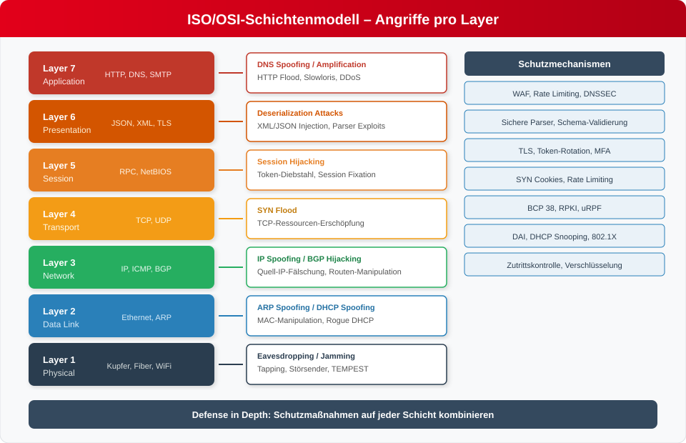
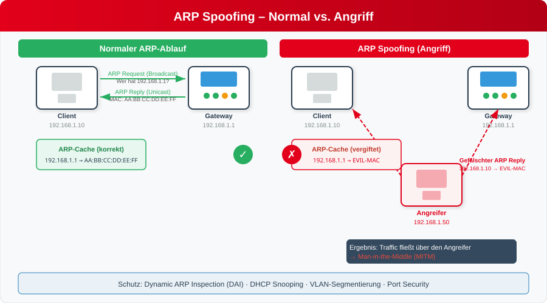
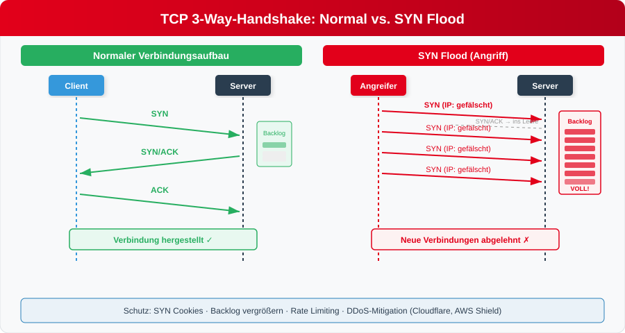
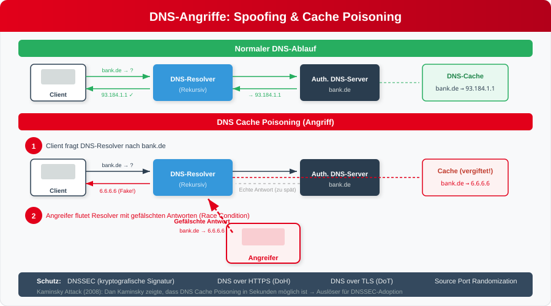
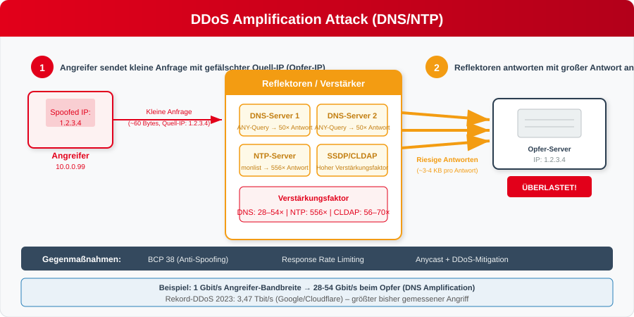
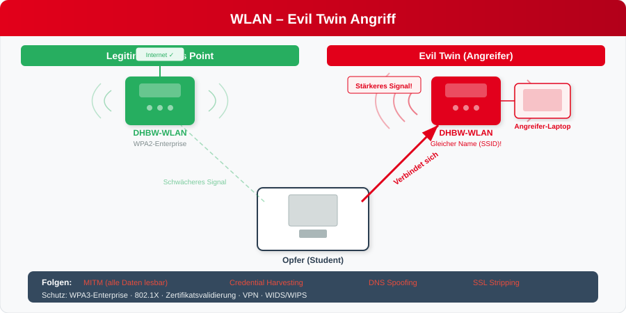
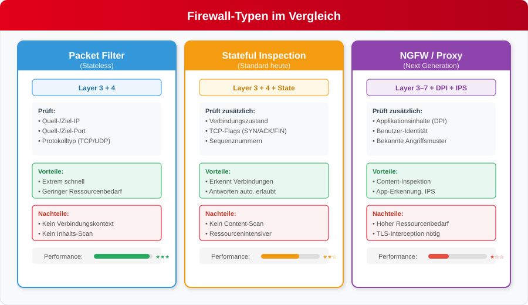
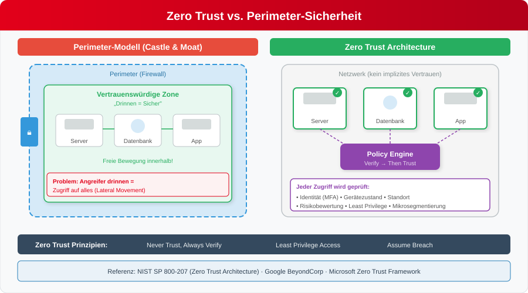
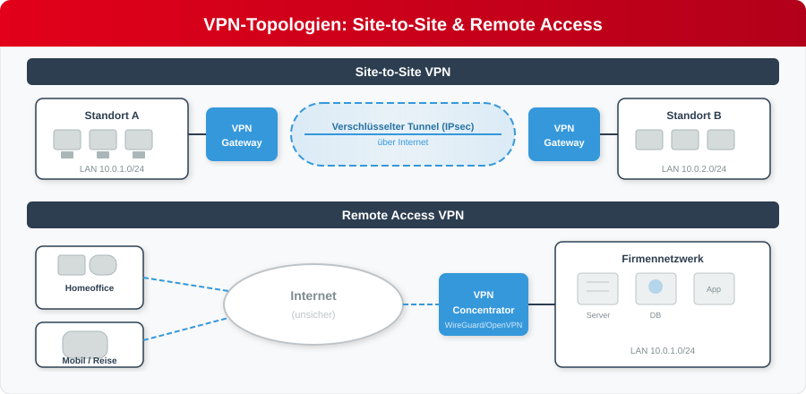
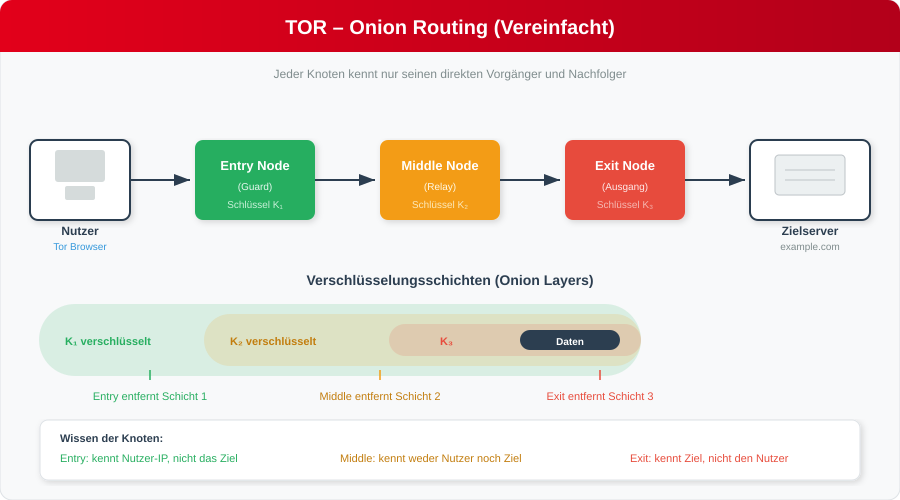

<!-- _class: title -->


#  Netzwerksicherheit

---
<!-- _class: chapter -->

# Fallstudie: Der Heartbleed-Bug (CVE-2014-0160)
## Analyse einer kritischen Sicherheitslücke in OpenSSL

<!-- Heartbleed ist einer der bekanntesten Sicherheitsvorfälle – wir nutzen ihn als Einstieg, um zu zeigen, warum Netzwerksicherheit so wichtig ist. Am Ende der Vorlesung werden wir auf diesen Fall zurückkommen, wenn wir TLS behandeln. -->

---
<!-- _class: biglist -->

# Was ist passiert?

- **Veröffentlichung:** April 2014.
- **Betroffene Komponente:** OpenSSL-Bibliothek (Versionen 1.0.1 bis 1.0.1f).
- **Kern des Problems:** Eine Schwachstelle in der Implementierung der TLS/DTLS-Heartbeat-Erweiterung (RFC 6520).
- **Auswirkung:** Angreifer konnten pro Anfrage bis zu 64 KB des Hauptspeichers des Servers auslesen – und das wiederholt, ohne Spuren zu hinterlassen.

<!-- Heartbleed betraf ca. 17% aller SSL-Webserver weltweit. Die Schwachstelle existierte über zwei Jahre, bevor sie entdeckt wurde. Das Pikante: Es war kein komplexer Exploit, sondern ein simpler Programmierfehler. -->

---
<!-- _class: biglist -->

# Warum ist es passiert? (Die technische Ursache)

- **Fehlende Bound-Check-Prüfung:** Der Heartbeat-Mechanismus funktioniert nach dem Echo-Prinzip:
  1. Client sendet "Payload" und die "Länge der Payload".
  2. Server kopiert die Payload in eine Antwort und sendet sie zurück.
- **Der Exploit:** Der Angreifer sendet eine Payload von z.B. 1 Byte, behauptet aber im Längenfeld, sie sei 65.535 Bytes (64 KB) groß.
- **Die Folge:** `memcpy()` kopiert über die tatsächliche Payload hinaus Daten aus dem angrenzenden Arbeitsspeicher des Servers in den Antwort-Puffer.

<!-- Das ist ein klassischer Buffer Over-Read. Der Server prüft nicht, ob die behauptete Länge mit der tatsächlichen Payload übereinstimmt, bevor er memcpy() aufruft. In Rust oder Java wäre das unmöglich – dort gibt es automatische Bounds-Checks. -->

---

# Code-Analyse (Vereinfachtes C-Beispiel)

```c
/* Der fatale Fehler in OpenSSL (dtls1_process_heartbeat) */

unsigned int payload;
unsigned char *p = &s->s3->rrec.data[0]; // Empfangene Daten
payload = (p[0] << 8) | p[1];            // Vertrauen in die Längenangabe!

/* ... später im Code ... */

unsigned char *buffer = OPENSSL_malloc(1 + 2 + payload + padding);
bp = buffer;

/* PROBLEM: memcpy liest 'payload' Bytes, auch wenn 'p' kleiner ist */
memcpy(bp, pl, payload); 

```

<!-- Zeigt den Studierenden den Originalcode – der entscheidende Fehler ist das blinde Vertrauen in die Längenangabe. Die Variable payload wird direkt aus den empfangenen Daten gelesen, ohne Prüfung gegen die tatsächliche Datenlänge. -->

---
<!-- _class: biglist -->

# Was befand sich im Speicher?

Durch das Auslesen des Speichers konnten Angreifer folgende sensible Daten extrahieren:

* **Private Schlüssel:** RSA/DSA Private Keys (ermöglicht Entschlüsselung des gesamten Traffics).
* **Session-IDs:** Übernahme aktiver Nutzersitzungen.
* **Benutzerdaten:** Passwörter im Klartext, E-Mail-Adressen, Kreditkartendaten.
* **System-Informationen:** Speicher-Layouts, die weitere Exploits erleichterten.

<!-- Der Angreifer konnte den Speicher wiederholt auslesen – 64 KB pro Request. Damit konnte er systematisch den gesamten Prozessspeicher durchsuchen. Besonders kritisch: Die privaten Schlüssel erlaubten es, auch aufgezeichneten alten Traffic zu entschlüsseln (kein Forward Secrecy bei RSA-Handshake). -->

---
<!-- _class: biglist -->

# Was können wir daraus lernen?

* **Vertraue niemals User-Input:** Jede Längenangabe, die von außen kommt, muss gegen die tatsächliche Größe des Puffers validiert werden.
* **Speichersichere Sprachen vs. C:** In Rust oder Java wäre dieser Fehler durch automatische Bounds-Checks zur Laufzeit verhindert worden.
* **Komplexität reduzieren:** Die Heartbeat-Erweiterung war für viele Nutzer unnötig, erhöhte aber die Angriffsfläche massiv.
* **Bedeutung von Audits:** Open Source ist nicht automatisch sicher; kritische Infrastruktur-Software benötigt professionelle Code-Audits.

<!-- Diese Lessons Learned werden in der Vorlesung immer wieder auftauchen: Input-Validierung, Angriffsfläche reduzieren, Defense in Depth. Heartbleed war einer der Auslöser für die Core Infrastructure Initiative und später die OpenSSF. -->

---
<!-- _class: biglist -->

# Agenda

- **Block 1: Grundlagen & Angriffe**
  - Das ISO/OSI-Schichtenmodell und Sicherheit
  - Angriffe auf die Schichten 1–7
- **Block 2: Schutzmechanismen**
  - TLS – Transport Layer Security
  - Sichere vs. unsichere Protokolle
  - WLAN-Sicherheit
  - Firewalls, IDS/IPS & Zero Trust
  - VPN & TOR-Netzwerk

<!-- Wir arbeiten uns im ersten Block systematisch durch das OSI-Modell und betrachten für jede Schicht die typischen Angriffe. Im zweiten Block schauen wir uns die Schutzmechanismen an. Die Gliederung entspricht einem Doppelblock von 2×90 Minuten. -->

---

# Das ISO/OSI-Modell & Security



<!-- Dieses Übersichtsbild zeigt das OSI-Modell mit den wichtigsten Angriffen pro Schicht. Jede Schicht hat ihre eigenen Schwachstellen – deshalb brauchen wir Defense in Depth: Schutzmaßnahmen auf jeder Ebene. Wir gehen nun Schicht für Schicht durch. -->

---
<!-- _class: chapter -->

# Layer 1

## Physical Layer

<!-- Wir beginnen ganz unten – bei der physischen Schicht. Diese wird in der IT-Sicherheit oft unterschätzt, ist aber das Fundament für alles darüber. -->

---

# Layer 1 – Physikalische Schicht

**Aufgabe**  
Übertragung roher Bits (0/1) über Medium

**Medien**  
- Kupfer (UTP/STP)  
- Glasfaser  
- Wireless (Wi-Fi, Bluetooth, 5G, ZigBee)  

**Wichtig**: Alles physisch berührbar → hoch angreifbar!

<!-- Layer 1 ist die einzige Schicht, die man anfassen kann. Das macht sie einerseits greifbar, andererseits besonders verwundbar. Physische Angriffe sind oft Low-Tech, aber hocheffektiv. -->

---
<!-- _class: biglist -->

# Warum ist Layer 1 ein Ziel?

- Keine Verschlüsselung auf L1  
- Physischer Zugang oft unterschätzt  
- Ausfall hier = Totalausfall des Netzes  
- „Soft underbelly" der IT-Sicherheit

<!-- Wenn Layer 1 ausfällt, hilft keine Software der Welt. Ein durchgeschnittenes Kabel oder ein Störsender bringt das gesamte darüberliegende System zum Stillstand. -->

---

# Angriffe auf Layer 1

## Physische Zerstörung / Tampering
- Kabel durchschneiden, Geräte entfernen  
- Rogue-Hardware einstecken  

## Passives Abhören (Eavesdropping)
- Kupfer: Passive TAPs  
- Glasfaser: Bending-Attack / Optical Splitter  
- Wireless: Richtantenne + SDR  

<!-- Passive TAPs sind kleine Geräte, die in ein Netzwerkkabel eingeklinkt werden und den Traffic spiegeln, ohne ihn zu stören. Bei Glasfaser gibt es die Bending-Attack: Durch leichtes Biegen der Faser tritt Licht aus, das abgefangen werden kann. -->

---

# Angriffe auf Layer 1

## Aktive Störung (Jamming / EMI)
- Wi-Fi/Bluetooth/5G-Störsender  
- Deauth-Flood über L1  

## Side-Channel
- TEMPEST / Van-Eck (EM-Abstrahlung)  

## Hardware-Implantate
- Modifizierte NICs, Rogue Access Points

<!-- TEMPEST ist ein NSA-Programm zum Abhören elektromagnetischer Abstrahlung von Monitoren und Tastaturen. Van-Eck demonstrierte 1985, dass man CRT-Monitore aus der Ferne rekonstruieren kann. Heute sind ähnliche Angriffe auch auf Flachbildschirme möglich. -->

---

# Gegenmaßnahmen Layer 1

<div class="columns">
<div>

**Physisch & Technisch**  
- Zutrittskontrolle, versiegelte Schränke  
- Kabel in Rohren, Port-Locking  
- STP / gepanzerte Kabel bevorzugen  
- Glasfaser statt Kupfer  
- OTDR-Monitoring  
- **End-to-End-Verschlüsselung** → Tapping nutzlos!

</div>
<div>

**Wireless & Organisatorisch**  
- WPA3-Enterprise + PMF  
- Frequency Hopping  
- Physical-Security-Audits  
- Redundanz (2-Wege + LTE-Backup)

</div>
</div>

<!-- Die wichtigste Maßnahme ist End-to-End-Verschlüsselung: Selbst wenn ein Angreifer den physischen Layer kompromittiert und Traffic mitliest, kann er mit den verschlüsselten Daten nichts anfangen. OTDR (Optical Time Domain Reflectometry) erkennt Veränderungen an Glasfaserkabeln. -->

---

# Zusammenfassung Layer 1

**Layer 1 = Fundament**  
Low-Tech-Angriffe mit hoher Wirkung!

**3 wichtigste Regeln**  
1. Physische Sicherheit zuerst  
2. Immer verschlüsseln (auch wenn L1 geknackt wird)  
3. Defense-in-Depth: L1 + L2–L7

**Merksatz**  
Ohne guten Layer-1-Schutz ist der Rest nur Kosmetik.

<!-- Überleitung zu Layer 2: Jetzt gehen wir eine Schicht höher – zum Data Link Layer. Hier werden die ersten intelligenten Protokolle wie ARP und DHCP eingesetzt, und damit kommen auch die ersten softwarebasierten Angriffe. -->

---
<!-- _class: chapter -->

# Layer 2

## Data Link Layer

<!-- Layer 2 ist das Herzstück des lokalen Netzwerks. ARP und DHCP sind fundamentale Protokolle, die praktisch in jedem Netzwerk aktiv sind – und beide haben keinerlei eingebaute Sicherheitsmechanismen. -->

---
<!-- _class: biglist -->

# ARP – Address Resolution Protocol

## Grundlagen

- ARP gehört zu **Layer 2/3** (Übergangsschicht) 
- Aufgabe: Zu einer **IPv4-Adresse** die **MAC-Adresse** ermitteln 
- Wird in jedem LAN ständig genutzt 
- Funktioniert **broadcast-basiert** 
- Keine Authentifizierung → anfällig für Manipulation 

<!-- ARP wurde 1982 in RFC 826 definiert – in einer Zeit, als Netzwerksicherheit kein Thema war. Das Protokoll hat keinerlei Authentifizierung: Jeder im Netzwerk kann ARP-Pakete senden, und jeder Host akzeptiert sie blind. -->

---
<!-- _class: biglist -->

# ARP – Funktionsweise

- Host benötigt MAC zu einer IP 
- Sendet **ARP Request** (Broadcast): 
  - „Wer hat IP X? Bitte sende mir deine MAC." 
- Zielhost antwortet mit **ARP Reply** (Unicast): 
  - „IP X gehört zu MAC Y." 
- Host speichert Zuordnung im **ARP-Cache** 

<!-- Der ARP-Cache ist eine temporäre Tabelle, in der ein Host die Zuordnung IP→MAC speichert. Einträge haben typischerweise eine TTL von 2-20 Minuten. Das Problem: Ein Host akzeptiert auch ARP-Replies, die er nie angefordert hat – sogenannte Gratuitous ARP. -->

---

# ARP Spoofing (ARP Poisoning)



<!-- Links sehen wir den normalen ARP-Ablauf: Client fragt per Broadcast, Gateway antwortet. Rechts der Angriff: Der Angreifer sendet gefälschte ARP-Replies an beide Seiten und vergiftet so die ARP-Caches – er wird zur Man-in-the-Middle-Position. -->

---
<!-- _class: biglist -->

# Funktionsweise: ARP Spoofing

- ARP ist **ungesichert** und akzeptiert jede Antwort 
- Angreifer sendet:
  - „IP des Gateways → meine MAC" 
  - „IP des Opfers → meine MAC" 
- Beide Kommunikationspartner senden Traffic an den Angreifer 
- Angreifer leitet weiter → bleibt unentdeckt 

<!-- Tools wie ettercap, arpspoof oder bettercap machen ARP-Spoofing extrem einfach – ein einziger Befehl genügt. In Kombination mit sslstrip kann der Angreifer sogar HTTPS-Verbindungen auf HTTP herabstufen, wenn der Client keine HSTS-Einträge hat. -->

---
<!-- _class: biglist -->

# Auswirkungen von ARP Spoofing

- MITM über das gesamte Subnetz 
- Abgreifen sensibler Daten (HTTP, FTP, Telnet, POP3 …) 
- Session Hijacking
- DNS-Manipulation 
- DoS möglich (Frames nicht weiterleiten) 

<!-- In der Praxis wird ARP Spoofing oft als erster Schritt eines mehrstufigen Angriffs genutzt. Einmal in der MITM-Position kann der Angreifer DNS-Antworten manipulieren, Malware in HTTP-Downloads injizieren oder Credentials abfangen. -->

---

# Gegenmaßnahmen: ARP Spoofing

- **Dynamic ARP Inspection (DAI)** 
  - Validiert ARP-Pakete anhand DHCP-Snooping-Datenbank 
- **DHCP Snooping** 
  - Grundlage für DAI 
- **Statische ARP-Einträge** (nur in Spezialfällen praktikabel) 
- **Port Security** 
- **IDS/IPS** zur Erkennung von ARP-Anomalien 
- **VLAN-Segmentierung** 

<!-- DAI ist die effektivste Maßnahme – sie prüft ARP-Pakete gegen eine Datenbank, die durch DHCP Snooping gefüllt wird. Wenn ein ARP-Reply eine IP-MAC-Zuordnung behauptet, die nicht in der DHCP-Snooping-Datenbank steht, wird das Paket verworfen. -->

---
<!-- _class: biglist -->

# DHCP Spoofing – Rogue DHCP Server

- Angreifer betreibt eigenen DHCP-Server 
- Opfer erhält falsche Netzwerkkonfiguration 
- Angreifer bestimmt: 
  - Default Gateway 
  - DNS-Server 
  - Domain-Suffix 
- Ermöglicht vollständigen **MITM** über das gesamte Subnetz 

<!-- DHCP Spoofing ist gefährlicher als ARP Spoofing, weil der Angreifer die komplette Netzwerkkonfiguration der Opfer kontrolliert. Er kann sich selbst als Gateway und DNS-Server einsetzen und so den gesamten Traffic umleiten. -->

---
<!-- _class: biglist -->

# Funktionsweise: DHCP Spoofing

- DHCP-Discover wird von allen Servern beantwortet 
- Angreifer antwortet schneller als legitimer Server 
- Opfer übernimmt falsche Konfiguration
- Angreifer kann: 
  - Traffic umleiten 
  - DNS-Anfragen manipulieren 
  - Routen verändern 
  - DoS verursachen 

<!-- Es ist ein Wettrennen: Wer zuerst antwortet, gewinnt. Der Angreifer kann seinen Rogue-DHCP-Server so konfigurieren, dass er extrem schnell antwortet. Sobald ein Client eine DHCP-Lease vom Angreifer akzeptiert hat, kontrolliert dieser die gesamte Kommunikation des Clients. -->

---
<!-- _class: biglist -->

# Gegenmaßnahmen: DHCP Spoofing

- **DHCP Snooping** 
  - Markiert Ports als „trusted" oder „untrusted" 
  - Nur vertrauenswürdige Ports dürfen DHCP-Server-Antworten senden 
- **Port Security** 
- **VLAN-Segmentierung** 
- **802.1X** zur Authentifizierung von Endgeräten 
- Monitoring ungewöhnlicher DHCP-Aktivität

<!-- DHCP Snooping ist ein grundlegender Schutzmechanismus auf managed Switches. Der Switch-Administrator markiert den Port, an dem der echte DHCP-Server hängt, als trusted. Alle anderen Ports sind untrusted – DHCP-Offer/ACK-Pakete von untrusted Ports werden verworfen. -->

---

# Vergleich: ARP vs. DHCP Spoofing

| Angriff | Häufigkeit | Gefährlichkeit | Grund |
|--------|------------|----------------|-------|
| **ARP Spoofing** | Sehr häufig | Mittel–hoch | ARP ist ungeschützt, überall aktiv |
| **DHCP Spoofing** | Weniger häufig | Sehr hoch | Komplette Netzwerkkontrolle möglich |

<!-- Beide Angriffe sind in der Praxis relevant. ARP Spoofing ist häufiger, weil es einfacher durchzuführen ist und keine Timing-Probleme hat. DHCP Spoofing ist gefährlicher, weil der Angreifer die gesamte Netzwerkkonfiguration kontrolliert. -->

---

# Fazit Layer 2

- **ARP Spoofing**: häufigster Layer-2-Angriff, leicht durchführbar 
- **DHCP Spoofing**: gefährlichster Angriff, ermöglicht vollständigen MITM 

- Effektive Schutzmaßnahmen: 
  - DHCP Snooping 
  - Dynamic ARP Inspection 
  - Port Security 
  - 802.1X 
  - Saubere VLAN-Konfiguration 

<!-- Nächster Schritt: Layer 3. Hier verlassen wir das lokale Netzwerk und betreten die Welt des Routings – mit IP-Spoofing und BGP Hijacking als Hauptangriffe. -->

---
<!-- _class: chapter -->

# Layer 3

## Netzwerkebene

<!-- Layer 3 ist die Ebene des Routings und der IP-Adressierung. Hier gibt es zwei dominante Angriffstypen: IP-Spoofing (der häufigste) und BGP Hijacking (der gefährlichste). -->

---

# Layer-3 Angriffe  
## Fokus: IP-Spoofing & BGP Hijacking

## Netzwerkebene (Routing, Adressierung)
- Zwei Angriffe dominieren:
  - **IP-Spoofing** → am häufigsten
  - **BGP Hijacking** → am gefährlichsten
- Beide Angriffe wirken auf fundamentale Mechanismen des Internets

<!-- IP-Spoofing ist ein Baustein für viele andere Angriffe (DDoS Amplification, Reflection). BGP Hijacking kann ganze Länder vom Internet abschneiden oder Traffic global umleiten. -->

---
<!-- _class: biglist -->

# IP-Spoofing  
## Der häufigste Layer-3-Angriff

- Manipulation der **Quell-IP-Adresse**
- Angreifer sendet Pakete mit gefälschter Absenderadresse
- Wird in vielen anderen Angriffen als Baustein genutzt:
  - DDoS Reflection/Amplification
  - Umgehung von IP-basierten ACLs
  - Verschleierung der Identität
- IPv4 bietet **keine Authentizität** der Absenderadresse

<!-- IPv4 wurde ohne Authentifizierung der Quelladresse entworfen. Router leiten Pakete standardmäßig weiter, ohne zu prüfen, ob die Quelladresse zum Absender passt. Das ist, als würde die Post jeden Brief ohne Prüfung des Absenders zustellen. -->

---

# Funktionsweise von IP-Spoofing

- Angreifer setzt die Quell-IP im IP-Header manuell
- Router überprüfen standardmäßig nicht, ob die Quelle plausibel ist
- Antworten gehen an die gefälschte Adresse, nicht zum Angreifer
- Besonders effektiv bei:
  - **stateless** Protokollen (UDP, ICMP)
  - **Reflection-Angriffen**

<!-- Bei TCP ist IP-Spoofing schwieriger, weil der Angreifer den SYN/ACK nicht empfängt und die Sequenznummer nicht kennt. Bei UDP gibt es keinen Handshake – ein gespooftes Paket genügt. Deshalb nutzen DDoS-Amplification-Angriffe fast immer UDP-basierte Dienste. -->

---
<!-- _class: biglist -->

# Typische Einsatzszenarien

- **DDoS Reflection/Amplification**
  - DNS, NTP, CLDAP, SSDP
  - Kleine Anfrage → große Antwort an Opfer
- **Firewall-Bypass**
  - ACLs, die nur IP-Ranges erlauben
- **Anonymisierung**
  - Erschwert Attribution und Forensik

<!-- Wir werden DDoS Amplification später bei Layer 7 noch genauer betrachten. Hier ist wichtig zu verstehen: IP-Spoofing ist der Enabler für Amplification – ohne gefälschte Quell-IP funktioniert der Angriff nicht. -->

---

# Tools für IP-Spoofing

- `hping3`  
  - Crafting beliebiger IP-Pakete
- `scapy`  
  - Python-Framework für Paketmanipulation
- `nping` (Nmap)  
  - Spoofing-fähige Netzwerktests
- `nemesis`  
  - Low-level Packet Injection

<!-- Diese Tools werden sowohl von Angreifern als auch von Penetration-Testern und Sicherheitsforschern eingesetzt. Scapy ist besonders mächtig, weil man damit beliebige Pakete in Python konstruieren und senden kann. -->

---

# Gegenmaßnahmen gegen IP-Spoofing

- **Ingress Filtering (BCP 38)**  
  - Blockiert Pakete mit ungültigen Quelladressen am Netzrand
- **Egress Filtering**  
  - Verhindert Spoofing aus dem eigenen Netz
- **uRPF (Unicast Reverse Path Forwarding)**  
  - Router prüfen, ob die Quelle über die eingehende Route erreichbar ist
- **IDS/IPS**  
  - Erkennung ungewöhnlicher Muster
- **Logging & Anomalieerkennung**

<!-- BCP 38 (RFC 2827) ist seit 2000 ein Standard, wird aber immer noch nicht von allen ISPs umgesetzt. Das ist das Kernproblem: IP-Spoofing wäre lösbar, wenn alle Netzbetreiber mitmachen würden. -->

---
<!-- _class: biglist -->

# BGP Hijacking  
## Der gefährlichste Layer-3-Angriff

- Manipulation des Border Gateway Protocol (BGP)
- Angreifer kündigt fremde IP-Präfixe an
- Ziel:
  - Umleitung von Traffic (MITM)
  - Blackholing (Unerreichbarkeit)
  - Wirtschaftliche oder politische Sabotage
- Auswirkungen können **global** sein

<!-- BGP ist das Routing-Protokoll des Internets – es entscheidet, welchen Weg Datenpakete zwischen Autonomen Systemen nehmen. Wenn jemand falsche Routen ankündigt, kann er Traffic global umleiten. -->

---
<!-- _class: biglist -->

# Warum ist BGP so verwundbar?

- BGP basiert auf **Vertrauen** zwischen Autonomous Systems (AS)
- Historisch **keine Authentifizierung** der Routen
- Fehler oder Angriffe verbreiten sich schnell über das Internet
- Große Abhängigkeit:
  - ISPs
  - Cloud-Provider
  - Kritische Infrastruktur

<!-- BGP wurde 1989 entworfen, als das Internet aus einer kleinen Gruppe von Universitäten und Forschungseinrichtungen bestand, die sich gegenseitig vertrauten. Dieses Vertrauensmodell skaliert nicht. -->

---

# Arten von BGP Hijacking

- **Prefix Hijack**  
  - Angreifer kündigt ein fremdes Präfix an
- **Subprefix Hijack**  
  - Angreifer kündigt *kleinere* Netze an → bevorzugte Route
- **Route Leak**  
  - Fehlkonfiguration führt zu falscher Weitergabe von Routen
- **MITM über BGP**  
  - Traffic wird über Angreifer umgeleitet, dann weitergeleitet

<!-- Subprefix Hijacks sind besonders tückisch: BGP bevorzugt die spezifischste Route. Wenn ein Angreifer ein /25 ankündigt und das Opfer nur ein /24 hat, gewinnt der Angreifer automatisch. -->

---

# Realwelt-Beispiele

- **2008 – Pakistan vs. YouTube**  
  - Fehlkonfiguration → globaler Ausfall von YouTube
- **2017 – Google Traffic über Russland/China**  
  - BGP-Hijack führte zu globaler Umleitung
- **2022 – Krypto-Börsen kompromittiert**  
  - Präfixe entführt, Traffic abgefangen

<!-- Der Pakistan-YouTube-Vorfall ist ein Klassiker: Pakistan wollte YouTube sperren und kündigte versehentlich das YouTube-Präfix global an. Innerhalb von Minuten war YouTube weltweit nicht erreichbar. -->

---

# Gegenmaßnahmen gegen BGP Hijacking

- **RPKI (Resource Public Key Infrastructure)**  
  - Kryptografische Validierung von Präfixen
- **Route Filtering**  
  - ISPs filtern ungültige Ankündigungen
- **Prefix-Listen & AS-Path-Filter**
- **Monitoring-Tools**  
  - BGPmon, RIPE RIS, Cloudflare Radar
- **Mutual Authentication**  
  - MD5/HMAC für BGP-Sessions

<!-- RPKI ist die wichtigste Gegenmaßnahme – sie erlaubt die kryptografische Signatur von Routenankündigungen. Allerdings nutzen erst ca. 40% der Routen RPKI. -->

---

# Vergleich der Layer-3-Angriffe

| Angriff | Häufigkeit | Schaden | Reichweite | Hauptproblem |
|--------|------------|---------|------------|--------------|
| **IP-Spoofing** | Sehr hoch | Mittel | Lokal/Netzwerk | Keine Authentizität in IPv4 |
| **BGP Hijacking** | Niedrig | Extrem hoch | Global | Vertrauensbasiertes Routing |

---

# Fazit Layer 3

- **IP-Spoofing** ist der am weitesten verbreitete Layer-3-Angriff  
- **BGP Hijacking** ist der gefährlichste Angriff mit globalem Impact  
- Effektive Verteidigung erfordert:
  - Netzwerkrand-Filterung
  - Routing-Authentifizierung
  - Monitoring & schnelle Reaktion
  - Kooperation zwischen Netzbetreibern

<!-- Überleitung: Layer 4. Jetzt geht es um TCP und den SYN-Flood-Angriff. -->

---
<!-- _class: chapter -->

# Layer 4

## Transport Layer

<!-- Layer 4 ist die Basis fast aller Internetdienste. TCP stellt zuverlässige Verbindungen her – aber der Verbindungsaufbau selbst ist angreifbar. -->

---

# Überblick: Layer 4 (Transport Layer)

- Protokolle: **TCP** und **UDP**
- Aufgaben:
  - Ende-zu-Ende-Kommunikation
  - Portverwaltung
  - Zuverlässigkeit (nur TCP)
  - Fluss- und Fehlerkontrolle
- Warum relevant?
  - Grundlage fast aller Internetdienste (HTTP, SSH, SMTP, …)

<!-- TCP und UDP sind die beiden Transportprotokolle des Internets. TCP bietet Zuverlässigkeit durch den 3-Way-Handshake, und genau dieser Mechanismus wird beim SYN-Flood-Angriff ausgenutzt. -->

---
<!-- _class: chapter -->

# SYN-Flooding  
## Der häufigste und wirkungsvollste Angriff auf Layer 4  

---
<!-- _class: biglist -->

# Warum ist SYN-Flooding so gefährlich?

- Nutzt grundlegenden Mechanismus des TCP-Verbindungsaufbaus aus
- Funktioniert gegen nahezu jeden TCP-basierten Dienst
- Benötigt keine Schwachstelle im Zielsystem
- Sehr leicht zu automatisieren
- Kann Server, Firewalls und Load Balancer überlasten
- Häufigster Bestandteil moderner DDoS-Angriffe

<!-- SYN-Flooding nutzt eine fundamentale Design-Entscheidung von TCP aus: Der Server muss Ressourcen reservieren, bevor die Verbindung vollständig aufgebaut ist. Das ist kein Bug, sondern ein Feature – und genau das wird ausgenutzt. -->

---

# Das Konzept hinter TCP-SYN  
## Wie funktioniert der TCP-3-Way-Handshake?

- TCP-Verbindungen werden über einen **3-Way-Handshake** aufgebaut:
  - **SYN** → Client möchte Verbindung aufbauen
  - **SYN/ACK** → Server bestätigt und reserviert Ressourcen
  - **ACK** → Client bestätigt, Verbindung steht

- Ziel:  
  - Zuverlässige, geordnete Verbindung  
  - Synchronisation der Sequenznummern  
  - Vorbereitung der Datenübertragung

<!-- Der entscheidende Punkt ist Schritt 2: Der Server reserviert Ressourcen bereits nach dem SYN – er wartet dann auf das abschließende ACK. Genau hier setzt der Angriff an. -->

---

# Visualisierung: Normal vs. SYN Flood



<!-- Links der normale Handshake: SYN → SYN/ACK → ACK, die Verbindung steht. Rechts der Angriff: Tausende SYN-Pakete mit gefälschten IPs fluten den Server. Die Backlog-Queue läuft voll und neue Verbindungen werden abgelehnt. -->

---
<!-- _class: biglist -->

# Was passiert bei einem SYN-Flood?

- Angreifer sendet **massiv viele SYN-Pakete**
- IP-Adressen sind häufig **gespooft**
- Server erzeugt für jedes SYN einen **halboffenen Eintrag** (SYN-RECEIVED)
- Der letzte Schritt (ACK) kommt nie an
- Die Warteschlange (Backlog) läuft voll
- Neue legitime Verbindungen werden abgelehnt

<!-- Hier sehen wir den Zusammenhang zu Layer 3: Ohne IP-Spoofing wäre SYN-Flooding weniger effektiv, weil der Angreifer per Rate Limiting blockiert werden könnte. Durch Spoofing ist der Angreifer unsichtbar. -->

---

# Auswirkungen eines SYN-Floods

- Dienste werden unerreichbar
- Server reagiert extrem langsam oder gar nicht
- Firewalls können überlastet werden
- Load Balancer verlieren Sessions
- Kritische Systeme (z.B. Online-Shops, APIs) fallen aus

<!-- Ein SYN-Flood ist besonders effizient: Der Angreifer braucht wenig Bandbreite (kleine SYN-Pakete), der Server muss aber für jedes Paket Ressourcen reservieren. Das Verhältnis Aufwand Angreifer vs. Opfer ist extrem asymmetrisch. -->

---

# Erkennung eines SYN-Floods

- Ungewöhnlich viele SYN-Pakete
- Viele halboffene Verbindungen (SYN-RECEIVED)
- Hohe CPU-Last auf Firewalls
- Monitoring-Tools:
  - NetFlow / sFlow
  - IDS/IPS (Snort, Suricata)
  - Systemlogs (dmesg, netstat)

<!-- Monitoring ist entscheidend: Ohne Sichtbarkeit kann man einen SYN-Flood nicht vom normalen Traffic-Anstieg unterscheiden. NetFlow und IDS-Alerts sind die ersten Indikatoren. -->

---

# Gegenmaßnahmen: SYN Flood

<div class="columns">
<div>

**Netzwerk- & Systemebene**
- **SYN Cookies** – Server speichert keine halboffenen Verbindungen
- **Backlog erhöhen** – Größere Warteschlange
- **Timeouts reduzieren** – Halboffene Verbindungen schneller verwerfen
- **Rate Limiting** – SYN-Pakete pro Quelle begrenzen

</div>
<div>

**Infrastruktur**
- **Load Balancer** – Verteilen Last, filtern SYN-Floods
- **DDoS-Mitigation-Provider** – Cloudflare, Akamai, AWS Shield
- **Anycast-Netzwerke** – Verteilen Traffic global
- **ISP-Level Filtering** – BCP 38 gegen IP-Spoofing

</div>
</div>

<!-- SYN Cookies sind die eleganteste Lösung: Der Server codiert die Verbindungsinformationen kryptografisch in die Sequenznummer des SYN/ACK. Er muss keinen State speichern, bis das ACK zurückkommt. -->

---

# Warum ist SYN-Flooding der "schlimmste" Layer-4-Angriff?

- Greift fundamentalen Mechanismus an
- Funktioniert gegen fast alle TCP-Dienste
- Sehr schwer eindeutig zu filtern
- Extrem häufig in realen DDoS-Kampagnen
- Kann selbst große Systeme lahmlegen
- Benötigt wenig Bandbreite → hoher Wirkungsgrad

<!-- Überleitung: Wir haben gesehen, wie TCP-Verbindungen angegriffen werden können, bevor sie stehen. Jetzt schauen wir uns an, was passiert, wenn die Verbindung steht, aber die Session übernommen wird. -->

---
<!-- _class: chapter -->

# Layer 5

## Session Layer

<!-- Layer 5 verwaltet Sitzungen – den logischen Dialog zwischen zwei Kommunikationspartnern. Der wichtigste Angriff hier ist Session Hijacking. -->

---

# Layer 5 – Session Layer

- Verantwortlich für **Aufbau, Verwaltung und Beendigung von Sitzungen**  
- Regelt **Dialogkontrolle** (wer sendet wann)  
- Stellt **Synchronisation** bereit (Checkpoints, Wiederaufnahme)  
- Typische Protokolle:  
  - RPC (Remote Procedure Call)  
  - NetBIOS  
  - PPTP  
  - TLS-Handshake-Mechanismen (teilweise)

<!-- Layer 5 ist im OSI-Modell etwas abstrakt, aber in der Praxis sehr relevant: Jede Webanwendung nutzt Sessions, um Benutzer über mehrere HTTP-Requests hinweg zu identifizieren. -->

---
<!-- _class: biglist -->

# Häufigster Angriff auf Schicht 5  
## Session Hijacking

- Angreifer übernimmt eine bestehende Sitzung zwischen Client und Server  
- Ziel: Zugriff auf Ressourcen, Identitätsübernahme, Manipulation  
- Besonders relevant bei **Web-Sessions**, VPN-Sessions, Remote-Diensten  
- Erfolgt meist durch Ausnutzen schwacher oder gestohlener Session-Tokens

<!-- Session Hijacking ist einer der ältesten Webangriffe. Firesheep (2010) zeigte, wie einfach es ist: Ein Firefox-Plugin fing in offenen WLANs Session-Cookies von Facebook und Twitter ab. Das war ein Weckruf für die HTTPS-Everywhere-Bewegung. -->

---
<!-- _class: biglist -->

# Warum Session Hijacking so verbreitet ist

- Viele Anwendungen nutzen **Session-IDs** statt dauerhafter Authentifizierung  
- Session-IDs sind oft:
  - schlecht geschützt  
  - vorhersehbar  
  - unverschlüsselt übertragen  
- Nutzer arbeiten häufig in **unsicheren Netzwerken** (WLAN, Hotspots)  
- Angriffe sind technisch relativ einfach durchzuführen

<!-- Das grundlegende Problem: HTTP ist zustandslos. Um einen Benutzer über mehrere Requests hinweg zu identifizieren, wird ein Session-Token vergeben. Wer dieses Token hat, ist aus Sicht des Servers der legitime Benutzer. -->

---

# Grundlagen: Wie funktionieren Sessions?

- Nach erfolgreicher Authentifizierung erzeugt der Server ein **Session-Token**  
- Dieses Token identifiziert den Nutzer während der gesamten Sitzung  
- Token wird typischerweise übertragen via:
  - Cookies  
  - URL-Parameter  
  - HTTP-Header  
- Wer das Token besitzt, **gilt als authentifiziert**

<!-- Session-Tokens in URLs sind besonders gefährlich – sie landen in Browser-History, Referrer-Headern und Server-Logs. Cookies mit den Flags Secure und HttpOnly sind deutlich besser geschützt. -->

---

# Wie funktioniert Session Hijacking?

1. **Session-Token abfangen**  
   - Sniffing in unverschlüsselten Netzwerken  
   - Man-in-the-Middle-Angriffe  
   - Cross-Site-Scripting (XSS)  
2. **Session-Token erraten**  
   - Schwache oder vorhersehbare Token  
3. **Session-Token stehlen**  
   - Malware, Browser-Exploits  
4. **Session übernehmen**  
   - Angreifer sendet das Token an den Server  

<!-- Es gibt auch Session Fixation: Der Angreifer zwingt das Opfer, ein vorher bekanntes Token zu verwenden. Beispiel: Der Angreifer setzt das Session-Cookie per XSS, wartet bis sich das Opfer einloggt, und nutzt dann dasselbe Token. -->

---

# Varianten des Session Hijacking

- **Active Hijacking**  
  Angreifer übernimmt aktiv die Verbindung und sendet eigene Pakete  
- **Passive Hijacking**  
  Angreifer liest nur mit, um Informationen zu sammeln  
- **Session Fixation**  
  Angreifer zwingt das Opfer, ein vorher bekanntes Token zu verwenden  
- **Cross-Site-Scripting-basiertes Hijacking**  
  Token wird über JavaScript ausgelesen

<!-- Active Hijacking ist am gefährlichsten – der Angreifer kann im Namen des Opfers Aktionen ausführen. Passive Hijacking wird oft für Reconnaissance genutzt. -->

---

# Gegenmaßnahmen: Session Hijacking

<div class="columns">
<div>

**Technisch**
- **TLS/HTTPS erzwingen** – verhindert Sniffing  
- **Secure & HttpOnly Cookies** – schützt vor XSS-Diebstahl  
- **Session-Timeouts** – begrenzt Angriffszeit  
- **Token-Rotation** – regelmäßig neue Tokens  

</div>
<div>

**Architekturell & Organisatorisch**
- **IP- und Gerätebindung** – Session nur für bestimmte Parameter gültig  
- **Multi-Factor Authentication (MFA)** – erschwert Identitätsübernahme  
- Keine Logins über **offene WLANs**  
- Nutzung von **VPN**  

</div>
</div>

<!-- Die wichtigste Maßnahme ist HTTPS überall – damit kann ein Angreifer im selben Netzwerk die Cookies nicht mitlesen. Token-Rotation bedeutet: Bei jedem Request wird ein neues Session-Token ausgegeben und das alte ungültig gemacht. -->

---
<!-- _class: chapter -->

# Layer 6 

## Präsentationsschicht

<!-- Layer 6 ist die Schicht der Datenformatierung. Der häufigste Angriff sind Format-Parsing-Angriffe, insbesondere Deserialization Attacks. -->

---

# Layer 6: Präsentationsschicht

- Datenformatierung  
- Kodierung/Decodierung  
- Verschlüsselung/Entschlüsselung  
- Serialisierung  
- Typische Formate: JSON, XML, TLS, MIME, ASN.1

**Warum ist Layer 6 interessant für Angreifer?**

- Er verarbeitet strukturierte Daten  
- Parser sind komplex → Fehleranfällig  
- Viele Anwendungen vertrauen auf korrektes Format

<!-- In der Praxis verschwimmen die Grenzen zwischen Layer 6 und 7. Viele Angriffe auf JSON/XML-Parser werden manchmal Layer 7 zugeordnet. Entscheidend ist: Parser sind komplex und damit fehleranfällig. -->

---

# Häufigster Angriff auf Layer 6

## **Format-Parsing-Angriffe**
(z.B. **Deserialization Attacks**, **Format Injection**, **Parser Exploits**)

Warum dieser Angriff so verbreitet ist:

- Anwendungen empfangen strukturierte Daten (JSON, XML, JWT, TLS-Handshake-Daten)
- Parser sind oft überkomplex
- Fehler führen zu Codeausführung, Speicherfehlern oder Logikfehlern

<!-- Log4Shell (CVE-2021-44228) ist ein perfektes Beispiel: Log4j parsierte User-Input als JNDI-Lookup und führte Remote Code Execution aus. Deserialization Attacks in Java gehören zu den kritischsten Schwachstellen der letzten Jahre. -->

---

# Beispiel: Deserialization Attack

**Was passiert?**

1. Anwendung empfängt ein strukturiertes Objekt (z.B. JSON, XML, Java-Objektstream)
2. Parser wandelt es in ein internes Objekt um
3. Angreifer manipuliert das Format so, dass beim Deserialisieren:
   - unerwarteter Code ausgeführt wird  
   - gefährliche Klassen instanziiert werden  
   - Ressourcen überlastet werden (DoS)

<!-- In Java ist das besonders kritisch: ObjectInputStream.readObject() kann beliebige Klassen instanziieren. Über sogenannte Gadget Chains kann der Angreifer beliebigen Code ausführen. Tools wie ysoserial automatisieren solche Payloads. -->

---

# Grundlagen: Warum Parser verwundbar sind

- **Komplexe Grammatik** → viele Sonderfälle  
- **Fehlerhafte Implementierung** → Buffer Overflows, Use-After-Free  
- **Zu viel Vertrauen** in eingehende Daten  
- **Automatische Objektinstanziierung** (z.B. Java, PHP, Python)  
- **Historisch gewachsene Protokolle** (TLS, ASN.1) mit vielen Altlasten

<!-- ASN.1 ist besonders berüchtigt – es wird in TLS-Zertifikaten, SNMP und vielen Protokollen verwendet. Die Spezifikation ist extrem komplex und Parser-Bugs in ASN.1-Implementierungen haben zu zahllosen Schwachstellen geführt. -->

---

# Wie funktionieren Format-Parsing-Angriffe?

## Allgemeiner Ablauf

1. Angreifer sendet manipulierte strukturierte Daten  
2. Parser interpretiert sie falsch  
3. Dadurch entstehen:
   - Speicherfehler, Logikfehler  
   - Unerwartete Objektinstanzen  
   - Umgehung von Sicherheitsmechanismen  
4. Angreifer erhält:
   - Codeausführung, Datenzugriff, DoS, Rechteausweitung

<!-- Der Ablauf ist immer gleich: Untrusted Data → Parser → Unerwartetes Verhalten. Die Lösung: Niemals untrusted Data direkt in einen Parser geben, sondern vorher validieren. -->

---

# Gegenmaßnahmen: Parsing & Deserialization

<div class="columns">
<div>

**Parser & Deserialisierung**
- Sichere, aktiv gepflegte Parser verwenden  
- Parser im „strict mode" betreiben  
- **Keine untrusted Deserialization**  
- Whitelists für erlaubte Klassen  
- Sandboxing  

</div>
<div>

**Validierung & Defense-in-Depth**
- Schema-Validierung (JSON Schema, XML Schema)  
- Typ- und Längenprüfungen  
- Encoding-Normalisierung (UTF-8)  
- WAF-Regeln gegen XXE, JSON-Injection  
- Fuzzing von Parsern  

</div>
</div>

---

# Zusammenfassung Layer 6

- **Häufigster Angriff:** Format-Parsing-Angriffe (v.a. Deserialization Attacks)
- **Warum?** Parser sind komplex, fehleranfällig und verarbeiten untrusted Daten.
- **Wie funktionieren sie?** Manipulierte strukturierte Daten führen zu Fehlinterpretationen.
- **Was hilft?** Sichere Parser, Validierung, Whitelisting, aktuelle Bibliotheken, Defense-in-Depth.

<!-- Jetzt gehen wir zu Layer 7 – der Anwendungsschicht. Hier laufen Protokolle wie DNS, HTTP und SMTP. -->

---
<!-- _class: chapter -->

# Layer 7

## Application Layer

<!-- Layer 7 ist die beliebteste Angriffsfläche, weil sie direkt mit dem Internet kommuniziert und die komplexesten Protokolle beherbergt. -->

---
<!-- _class: biglist -->

# Layer 7 – Application Layer

- **Die höchste Schicht** im OSI-Modell
- Direkte Schnittstelle zum Benutzer und zum Internet
- Protokolle: HTTP, DNS, SMTP, FTP, SSH, SNMP …
- **Größte Angriffsfläche** aller Schichten:
  - Komplexe Protokolle
  - Viele Implementierungen
  - Direkt aus dem Internet erreichbar

<!-- Layer 7 ist für Angreifer besonders attraktiv: Die Protokolle sind komplex, die Angriffsfläche ist riesig, und viele Dienste sind direkt aus dem Internet erreichbar. Wir konzentrieren uns auf DNS-Angriffe, HTTP-basierte Angriffe und DDoS als Gesamtkonzept. -->

---

# DNS-Angriffe – Überblick

Das **Domain Name System** ist die Telefonauskunft des Internets:

| Angriff | Beschreibung | Ziel |
|---------|--------------|------|
| **DNS Spoofing** | Gefälschte DNS-Antworten | Umleitung auf Fake-Seiten |
| **DNS Cache Poisoning** | Vergiftung des Resolver-Caches | Massenhafte Umleitung |
| **DNS Amplification** | Missbrauch offener DNS-Server | DDoS auf Opfer |
| **DNS Tunneling** | Daten in DNS-Queries verstecken | Exfiltration, C2-Kommunikation |

<!-- DNS ist eine kritische Infrastruktur – fast jede Internetkommunikation beginnt mit einer DNS-Auflösung. Wenn DNS kompromittiert ist, kann der Angreifer den gesamten Traffic umleiten. -->

---

# DNS Cache Poisoning



<!-- Oben der normale DNS-Ablauf, unten der Angriff: Der Angreifer flutet den Resolver mit gefälschten Antworten. Wenn seine Antwort vor der echten ankommt, wird der Cache vergiftet. Dan Kaminsky zeigte 2008, dass dies in Sekunden möglich ist. -->

---

# DNS-Gegenmaßnahmen

- **DNSSEC** – Kryptografische Signatur von DNS-Antworten
  - Resolver kann Echtheit prüfen
  - Verbreitung wächst, aber noch nicht flächendeckend

- **DNS over HTTPS (DoH)** / **DNS over TLS (DoT)**
  - Verschlüsselt DNS-Anfragen
  - Schützt vor Sniffing und Manipulation auf dem Transportweg

- **Source Port Randomization**
  - Erschwert Cache-Poisoning-Angriffe

<!-- DNSSEC ist die Ideallösung, hat aber eine langsame Adoption. DoH/DoT schützen den Transport, aber nicht vor einem kompromittierten Resolver. Die Kombination DNSSEC + DoH ist derzeit der beste Schutz. -->

---

# HTTP-basierte Angriffe aus Netzwerksicht

## Slowloris
- Viele Verbindungen öffnen, aber **sehr langsam** Daten senden
- Server hält Verbindungen offen, bis Ressourcen erschöpft

## HTTP Flood
- Massenhaft **valide HTTP-Requests** (GET/POST)
- Schwer von legitimem Traffic zu unterscheiden

## SSL/TLS Exhaustion
- Massenhaft **TLS-Handshakes** initiieren
- Server muss teure kryptografische Operationen durchführen

<!-- Slowloris ist elegant: Statt Bandbreite zu verschwenden, hält der Angreifer mit minimalen Daten maximale Verbindungen offen. Apache war besonders anfällig. Nginx und andere Event-basierte Server sind resistenter. -->

---

# DDoS als Gesamtkonzept

Moderne DDoS-Angriffe kombinieren mehrere Techniken:

| Typ | Schicht | Beispiele | Strategie |
|-----|---------|-----------|-----------|
| **Volumetric** | L3/L4 | DNS/NTP Amplification | Bandbreite überlasten |
| **Protocol** | L4 | SYN Flood, Ping of Death | Verbindungs-State erschöpfen |
| **Application** | L7 | HTTP Flood, Slowloris | Server-Ressourcen erschöpfen |

**Rekord-DDoS (2023):** 3,47 Tbit/s (Google / Cloudflare)

<!-- Moderne DDoS-Angriffe sind oft Multi-Vektor: Sie kombinieren Volumetric + Protocol + Application Layer Attacks gleichzeitig. Das macht die Abwehr besonders schwierig. -->

---

# DDoS Amplification im Detail



<!-- Der Angreifer sendet kleine Anfragen mit gefälschter Quell-IP an offene Reflektoren. Diese antworten mit viel größeren Antworten an das Opfer. Verstärkungsfaktor bei DNS: bis 54×, bei NTP sogar 556×. -->

---

# DDoS-Gegenmaßnahmen

<div class="columns">
<div>

**Prävention**
- BCP 38 / Ingress Filtering (Anti-Spoofing)
- DNS Response Rate Limiting (RRL)
- Offene Reflektoren absichern
- Anycast-Netzwerke einsetzen

</div>
<div>

**Mitigation**
- DDoS-Scrubbing-Center (Cloudflare, Akamai, AWS Shield)
- Traffic-Analyse & Anomalie-Erkennung
- Rate Limiting pro Source/Destination
- GeoIP-Blocking als Notmaßnahme

</div>
</div>

<!-- Cloud-basierte DDoS-Mitigation: Der gesamte Traffic wird über das Anycast-Netzwerk des Anbieters geleitet, dort gefiltert, und nur der legitime Traffic an den Origin-Server weitergeleitet. -->

---
<!-- _class: chapter -->

# TLS – Transport Layer Security

## Sichere Verbindungen im Netz

<!-- Jetzt kommen wir zu TLS. Erinnern wir uns an den Heartbleed-Bug vom Anfang – das war eine Schwachstelle in der TLS-Implementierung. Jetzt verstehen wir den Kontext. -->

---
<!-- _class: biglist -->

# TLS – Transport Layer Security

- Verständnis von **TLS** als Sicherheitsprotokoll  
- Einordnung von TLS im **ISO/OSI-Schichtenmodell**  
- Überblick über Funktionsweise, Handshake und Sicherheitsmechanismen  
- Bedeutung von TLS in modernen IT-Systemen
- **Rückbezug zu Heartbleed:** TLS war das betroffene Protokoll

<!-- TLS ist das zentrale Sicherheitsprotokoll des Internets. Es schützt Vertraulichkeit und Integrität von Daten auf dem Transportweg. -->

---

# Was ist TLS?

**TLS (Transport Layer Security)** ist ein kryptografisches Protokoll zur Absicherung von Datenübertragungen über unsichere Netzwerke.

## Hauptziele:
- **Vertraulichkeit** (Verschlüsselung)
- **Integrität** (Manipulationsschutz)
- **Authentizität** (Identitätsprüfung)

## Einsatzgebiete:
- HTTPS, E-Mail (SMTP, IMAP, POP3), VPN, Messaging, APIs

<!-- Die CIA-Triade aus der Vorlesung findet sich hier direkt wieder: Confidentiality durch Verschlüsselung, Integrity durch HMAC/AEAD, Authentication durch Zertifikate. -->

---

# TLS und das ISO/OSI-Schichtenmodell

TLS lässt sich nicht perfekt einer einzelnen OSI-Schicht zuordnen:

| <div style="width: 230px;">OSI-Schicht</div> | Bezug zu TLS | Erklärung |
|-------------|--------------|-----------|
| **7 – Anwendung** | nutzt TLS | Browser, Mailserver, APIs verwenden TLS |
| **6 – Darstellung** | Verschlüsselung | TLS übernimmt Kodierung, Verschlüsselung |
| **5 – Sitzung** | Sitzungsaufbau | TLS-Handshake, Session-Management |

➡️ **TLS wird meist als Schicht 5/6-Protokoll betrachtet.**

<!-- In der Praxis ist TLS ein Zwischenlayer – es sitzt zwischen der Transportschicht (TCP) und der Anwendungsschicht. Das TCP/IP-Modell kennt diese Trennung nicht. -->

---

# Warum TLS notwendig ist

### Bedrohungen im Netzwerk:
- Abhören (Sniffing)
- Man-in-the-Middle-Angriffe
- Datenmanipulation
- Identitätsfälschung

### TLS schützt davor durch:
- Verschlüsselung
- Zertifikatsbasierte Authentifizierung
- Integritätsprüfungen

<!-- Ohne TLS wäre jede Kommunikation im Internet wie eine Postkarte – jeder Zwischenknoten kann mitlesen und manipulieren. TLS macht aus der Postkarte einen versiegelten Brief. -->

---

# Der TLS-Handshake (vereinfacht)

1. **ClientHello** – unterstützte TLS-Versionen, Cipher Suites, Zufallswerte  
2. **ServerHello** – Auswahl der Cipher Suite, Serverzertifikat  
3. **Schlüsselaustausch** – z.B. Diffie-Hellman (DHE/ECDHE)  
4. **Session Keys erzeugen**  
5. **„Finished"-Nachrichten** – beide Seiten bestätigen sichere Parameter  

Danach beginnt die **verschlüsselte Kommunikation**.

<!-- TLS 1.3 optimiert den Handshake: Statt 2 Round-Trips (TLS 1.2) braucht TLS 1.3 nur 1 Round-Trip, bei Session Resumption sogar 0 (0-RTT). -->

---

# Kryptografische Verfahren in TLS

### **Asymmetrische Kryptografie**
- Zertifikate (X.509), RSA, ECDSA, Ed25519

### **Symmetrische Verschlüsselung**
- AES-GCM, ChaCha20-Poly1305

### **Schlüsselaustausch**
- ECDHE (Standard), DHE

### **Integrität**
- HMAC, AEAD-Verfahren

<!-- Die Kombination ist entscheidend: Asymmetrische Krypto für den Handshake (sicher, aber langsam), symmetrische Krypto für die Datenübertragung (schnell). ECDHE bietet Forward Secrecy. -->

---

# TLS-Versionen

| Version | Status | Besonderheiten |
|--------|--------|----------------|
| SSL 2.0/3.0 | ❌ unsicher | veraltet |
| TLS 1.0/1.1 | ❌ unsicher | deaktiviert |
| **TLS 1.2** | ✅ weit verbreitet | sicher, flexibel |
| **TLS 1.3** | ✅ modern | schneller, sicherer, weniger Angriffsfläche |

<!-- TLS 1.0/1.1 wurden 2020 abgeschaltet. TLS 1.2 ist immer noch Standard, aber TLS 1.3 wird zunehmend zum Default. -->

---
<!-- _class: biglist -->

# Vorteile von TLS 1.3

- Reduzierter Handshake (1-RTT statt 2-RTT)
- Nur moderne Cipher Suites
- Standardmäßig Forward Secrecy
- Entfernt unsichere Algorithmen (RSA-Handshake, SHA-1, CBC-Mode)

<!-- TLS 1.3 ist secure by default – es gibt keine Option mehr, einen unsicheren Algorithmus zu wählen. Damit wäre Heartbleed unter TLS 1.3 zwar immer noch ein Bug, aber die Auswirkungen wären geringer. -->

---

# TLS und PKI

TLS nutzt eine **Public Key Infrastructure (PKI)**:

- Zertifizierungsstellen (CAs)
- Zertifikate (X.509)
- Certificate Transparency
- Chain of Trust

**Dadurch kann der Client die Identität des Servers prüfen.**

<!-- Certificate Transparency ist ein öffentliches Log aller ausgestellten Zertifikate. Damit können Domain-Inhaber prüfen, ob jemand ein falsches Zertifikat für ihre Domain ausgestellt hat. -->

---

# Typische Angriffe auf TLS

- Downgrade-Angriffe  
- Unsichere Cipher Suites  
- Abgelaufene oder gefälschte Zertifikate  
- Schwache Implementierungen  
- Man-in-the-Middle bei fehlender Zertifikatsprüfung  

**Moderne TLS-Versionen verhindern viele dieser Angriffe.**

<!-- Wichtige TLS-Schwachstellen: BEAST (2011), CRIME (2012), Heartbleed (2014), POODLE (2014), FREAK (2015). Alle betreffen ältere TLS-Versionen. TLS 1.3 eliminiert die meisten dieser Angriffsvektoren by Design. -->

---

# Zusammenfassung TLS

- TLS ist das zentrale Sicherheitsprotokoll im Internet  
- Es schützt Vertraulichkeit, Integrität und Authentizität  
- Der TLS-Handshake ermöglicht sicheren Schlüsselaustausch  
- **TLS 1.3** ist der aktuelle Standard  
- **Rückbezug Heartbleed:** Der Bug betraf die Implementierung, nicht das Protokoll

<!-- Heartbleed war kein Fehler im TLS-Protokoll, sondern in der Implementierung (OpenSSL). Selbst ein sicheres Protokoll kann durch eine fehlerhafte Implementierung kompromittiert werden. -->

---
<!-- _class: chapter -->

# Sichere vs. Unsichere Protokolle

## Protokollvergleich im Überblick

<!-- Nachdem wir TLS verstanden haben, schauen wir uns an, welche alltäglichen Protokolle sicher und welche unsicher sind. -->

---

# Sichere vs. Unsichere Protokolle

| Unsicher | Sicher | Unterschied |
|----------|--------|-------------|
| HTTP | **HTTPS** | + TLS-Verschlüsselung |
| FTP | **SFTP / FTPS** | + SSH-Tunnel / TLS |
| Telnet | **SSH** | + Verschlüsselung + Auth |
| SMTP (Port 25) | **SMTP + STARTTLS** | + Opportun. Verschlüsselung |
| POP3 / IMAP | **POP3S / IMAPS** | + TLS |
| DNS (UDP/53) | **DoH / DoT** | + HTTPS / TLS |
| SNMP v1/v2 | **SNMP v3** | + Auth + Verschlüsselung |
| LDAP | **LDAPS** | + TLS |

<!-- Die Faustregel: Jedes Klartextprotokoll hat ein verschlüsseltes Pendant. In der Praxis sieht man aber immer noch FTP, Telnet und unverschlüsseltes SMTP – Low-Hanging-Fruits für Angreifer. -->

---

# Warum ist das wichtig?

- **Unverschlüsselte Protokolle** senden Credentials im Klartext
- In Kombination mit ARP Spoofing (Layer 2) → sofortige Kompromittierung
- **Best Practice:** Nur verschlüsselte Protokollvarianten verwenden
- **Network Monitoring:** Unverschlüsselte Protokolle identifizieren und eliminieren

<!-- Hier sehen wir den Zusammenhang der Layer: ARP-Spoofing auf L2 + unverschlüsseltes Protokoll auf L7 = vollständiger Credential-Diebstahl. Defense in Depth bedeutet: Schutz auf jeder Ebene. -->

---
<!-- _class: chapter -->

# WLAN-Sicherheit

## Wireless LAN – Angriffe und Schutz

<!-- WLAN ist allgegenwärtig. Die kabellose Übertragung bringt eigene Sicherheitsrisiken mit sich. -->

---
<!-- _class: biglist -->

# WLAN-Grundlagen

- **Standard:** IEEE 802.11 (a/b/g/n/ac/ax/be → WiFi 4–7)
- **Frequenzen:** 2,4 GHz / 5 GHz / 6 GHz
- **Reichweite:** 30–100 m (Indoor), bis zu 300 m (Outdoor)
- **Problem:** Funkwellen enden nicht an der Gebäudegrenze
  - Jeder in Reichweite kann den Traffic empfangen
  - Authentifizierung und Verschlüsselung sind essentiell

<!-- Im Gegensatz zu kabelgebundenen Netzwerken muss ein Angreifer nicht physisch ins Gebäude gelangen – er kann vom Parkplatz aus angreifen. -->

---

# WLAN-Verschlüsselung: Evolution

| Standard | Jahr | Status | Sicherheit |
|----------|------|--------|------------|
| **WEP** | 1997 | ❌ Gebrochen | RC4, 40/104 Bit – in Minuten knackbar |
| **WPA** | 2003 | ❌ Veraltet | TKIP – Schwachstellen bekannt |
| **WPA2** | 2004 | ⚠️ Standard | AES-CCMP – sicher, aber KRACK-Angriff |
| **WPA3** | 2018 | ✅ Modern | SAE, 192-Bit, PMF – aktuell empfohlen |

<!-- WEP wurde 2001 gebrochen und ist komplett unsicher – trotzdem findet man es in IoT-Geräten. WPA2 ist seit KRACK (2017) nur mit PMF als sicher einzustufen. WPA3 verwendet SAE statt des anfälligen 4-Way-Handshake. -->

---

# WPA2 vs. WPA3

<div class="columns">
<div>

**WPA2**
- Pre-Shared Key (PSK) oder Enterprise (802.1X)
- 4-Way-Handshake → anfällig für Offline-Wörterbuch-Angriffe
- KRACK-Angriff (2017): Nonce-Wiederverwendung
- Kein Schutz der Management Frames (optional PMF)

</div>
<div>

**WPA3**
- **SAE** (Simultaneous Authentication of Equals)
- Forward Secrecy bei jedem Handshake
- Schutz gegen Offline-Wörterbuch-Angriffe
- **PMF obligatorisch**
- 192-Bit-Modus für Enterprise

</div>
</div>

<!-- Der große Vorteil von WPA3-SAE: Selbst wenn ein Angreifer den Handshake aufzeichnet, kann er keine Offline-Brute-Force durchführen. Bei WPA2-PSK konnte man den 4-Way-Handshake mitschneiden und offline knacken. -->

---

# WLAN-Angriffe



<!-- Der Evil Twin: Der Angreifer erstellt einen AP mit derselben SSID, aber stärkerem Signal. Das Opfer verbindet sich automatisch mit dem stärkeren Signal – der Angreifer ist in der MITM-Position. -->

---

# Weitere WLAN-Angriffe

| Angriff | Beschreibung | Gegenmaßnahme |
|---------|--------------|---------------|
| **Evil Twin** | Fake-AP mit gleicher SSID | 802.1X + Zertifikate |
| **Deauthentication** | Management Frames fälschen | PMF (WPA3) |
| **KRACK** | Nonce-Wiederverwendung in WPA2 | WPA3 oder gepatchtes WPA2 |
| **WPS Brute Force** | 8-stellige PIN in 11.000 Versuchen | WPS deaktivieren |
| **Handshake Capture** | 4-Way-Handshake aufzeichnen + Offline-Crack | WPA3-SAE |

<!-- Deauth-Angriffe sind besonders ärgerlich: Gefälschte Deauthentication-Frames trennen den Client vom AP. Das kann als DoS genutzt werden oder um den Client zum Evil Twin zu zwingen. WPA3 löst das durch PMF. -->

---

# WLAN-Schutzmaßnahmen

<div class="columns">
<div>

**Technisch**
- **WPA3-Enterprise** mit 802.1X / RADIUS
- Zertifikatsbasierte Authentifizierung
- **PMF** (Protected Management Frames)
- WIDS/WIPS (Wireless IDS/IPS)
- Separate SSIDs für Gäste / IoT

</div>
<div>

**Organisatorisch**
- WLAN-Audit durchführen
- Signalstärke begrenzen
- Unbekannte APs regelmäßig scannen
- Client-Isolation aktivieren
- VPN für sensible Kommunikation

</div>
</div>

<!-- In Unternehmensumgebungen ist WPA3-Enterprise mit 802.1X und RADIUS der Standard. An der DHBW nutzen wir eduroam mit genau diesem Prinzip. -->

---
<!-- _class: chapter -->

# Firewalls in Netzwerken
## Konzepte, Technik und Herausforderungen

<!-- Jetzt wechseln wir von den Angriffen zu den Schutzmechanismen. Firewalls sind das älteste und bekannteste Sicherheitsinstrument in Netzwerken. -->

---

# Das Prinzip einer Firewall

Eine Firewall fungiert als **Kontrollinstanz** zwischen verschiedenen Netzwerken (meist Intern vs. Extern).

- **Überwachung:** Analysiert den ein- und ausgehenden Datenverkehr.
- **Regelwerk (ACL):** Trifft Entscheidungen basierend auf definierten Sicherheitsregeln (Allow / Deny).
- **Isolation:** Schützt vertrauenswürdige Segmente vor unvertrauenswürdigen Quellen.
- **Logik:** „Alles, was nicht explizit erlaubt ist, ist verboten" (Default Deny).

<!-- Eine Firewall ist wie ein Türsteher: Sie prüft anhand einer Liste, wer rein darf. Default Deny ist deutlich sicherer als Default Allow. -->

---

# Wo werden Firewalls eingesetzt?

- **Perimeter Firewall:** Grenze zwischen Internet und Firmennetzwerk.
- **Interne Segmentierung:** Trennung von Abteilungen oder VLANs.
- **Host-based Firewall:** Direkt auf dem Endgerät (z.B. Windows Defender Firewall).
- **Cloud Firewall:** Virtuelle Instanzen zum Schutz von Cloud-Ressourcen (Security Groups).

<!-- Moderne Netzwerke haben nicht nur eine Firewall am Perimeter, sondern mehrere Ebenen – das entspricht dem Defense-in-Depth-Prinzip. -->

---

# Firewall-Typen im Vergleich



<!-- Drei Generationen: Packet Filter (schnell, aber dumm), Stateful Inspection (erkennt Verbindungen, Standard), NGFW/Proxy (analysiert Inhalte, ressourcenintensiv). -->

---

# Einordnung im ISO/OSI-Schichtenmodell

Firewalls operieren auf unterschiedlichen Ebenen, je nach Typ:

- **Schicht 3 (Network):** Filterung basierend auf IP-Adressen und ICMP.
- **Schicht 4 (Transport):** Analyse von Ports (TCP/UDP) und Verbindungszuständen.
- **Schicht 7 (Application):** Inspektion von Protokollinhalten (HTTP, DNS, FTP).

<!-- Je höher die Schicht, desto mehr Kontext hat die Firewall – aber desto mehr Rechenleistung braucht sie. -->

---

# Arten von Firewalls (1/3)
## 1. Packet Filter (Stateless)

Arbeitet primär auf **Schicht 3 und 4**. Jedes Paket wird einzeln betrachtet, ohne Bezug auf vorherige Pakete.

- **Kriterien:** Quell-/Ziel-IP, Quell-/Ziel-Port, Protokolltyp.
- **Vorteil:** Extrem schnell, geringer Overhead.
- **Nachteil:** Erkennt keine komplexen Angriffsmuster oder den Kontext einer Verbindung.
- **Beispiel:** `DROP TCP from 192.168.1.50 to any port 22`

---

# Arten von Firewalls (2/3)
## 2. Stateful Inspection Firewall

Der heutige Standard. Sie führt eine **Zustandstabelle (State Table)**.

- **Funktion:** Merkt sich, ob ein Paket Teil einer bereits bestehenden, legitimen Verbindung ist.
- **Vorteil:** Antwortpakete werden automatisch durchgelassen, wenn die Anfrage von innen kam.
- **Technisches Detail:** Prüft TCP-Flags (SYN, ACK, FIN) und Sequenznummern.

---

# Arten von Firewalls (3/3)
## 3. Application Level Gateway (Proxy Firewall)

Arbeitet auf **Schicht 7**. Die Verbindung wird physisch getrennt.

- **Funktion:** Der Client verbindet sich mit dem Proxy, der Proxy baut eine neue Verbindung zum Ziel auf.
- **Vorteil:** Kann Inhalte scannen (z.B. Viren in HTTP-Downloads oder SQL-Injection).
- **Nachteil:** Hoher Ressourcenverbrauch, verlangsamt die Verbindung.

---

# Next-Generation Firewalls (NGFW)

Kombiniert klassische Techniken mit modernen Analyse-Features:

- **Deep Packet Inspection (DPI):** Schaut tief in die Nutzdaten.
- **Intrusion Prevention System (IPS):** Erkennt und blockiert bekannte Angriffe.
- **User Identity:** Regeln basieren auf Benutzernamen (AD-Integration).
- **Applikations-Erkennung:** Kann „Facebook" blockieren, aber „Facebook Messenger" erlauben.

<!-- NGFWs von Palo Alto, Fortinet oder Check Point sind heute Standard in Unternehmensnetzwerken. -->

---

# Probleme und Herausforderungen

- **Verschlüsselung (TLS):** Firewall kann verschlüsselten Inhalt nicht prüfen (Lösung: TLS-Interception → Datenschutzprobleme).
- **Performance-Bottleneck:** DPI führt zu Latenz.
- **Fehlkonfiguration:** Komplexe Regelwerke → offene Ports ("Shadowing Rules").
- **Internal Threats:** Firewall schützt kaum gegen Angriffe von innen.

<!-- Das TLS-Interception-Dilemma: Um verschlüsselten Traffic zu prüfen, muss die Firewall die TLS-Verbindung aufbrechen. In der EU ist das wegen DSGVO besonders kritisch. -->

---

# Zusammenfassung Firewalls

- Firewalls sind das Fundament der Netzwerksicherheit.
- Sie entwickeln sich von einfachen Paketfiltern hin zu intelligenten Schicht-7-Wächtern.
- **Wichtig:** Eine Firewall ist kein "Allheilmittel", sondern Teil einer *Defense-in-Depth* Strategie.

<!-- Überleitung: Firewalls prüfen Regeln. Was wenn der Angriff die Regeln nicht verletzt? Dafür gibt es IDS/IPS. -->

---
<!-- _class: chapter -->

# IDS / IPS

## Intrusion Detection & Prevention

<!-- IDS/IPS ergänzen Firewalls: Während eine Firewall Regeln durchsetzt, erkennt ein IDS/IPS anomale Muster und bekannte Angriffssignaturen. -->

---

# IDS vs. IPS – Was ist der Unterschied?

<div class="columns">
<div>

**IDS – Intrusion Detection System**
- **Passiv:** Erkennt und **alarmiert**
- Sitzt als TAP/SPAN am Netzwerk
- Kein Eingriff in den Traffic
- Risiko: Alarmmüdigkeit (False Positives)

</div>
<div>

**IPS – Intrusion Prevention System**
- **Aktiv:** Erkennt und **blockiert**
- Sitzt **inline** im Datenpfad
- Kann Pakete verwerfen
- Risiko: False Positives blockieren legitimen Traffic

</div>
</div>

<!-- Moderne NGFWs sind meist IPS-fähig. Standalone-IDS/IPS wie Snort oder Suricata werden zusätzlich für Network Security Monitoring eingesetzt. -->

---

# Erkennungsmethoden

| Methode | Beschreibung | Vorteile | Nachteile |
|---------|-------------|----------|-----------|
| **Signaturbasiert** | Bekannte Angriffsmuster | Sehr genau | Keine Zero-Day-Erkennung |
| **Anomaliebasiert** | Abweichung vom Normal | Erkennt Unbekanntes | Hohe False-Positive-Rate |
| **Verhaltensbasiert** | ML/AI analysiert Muster | Adaptiv | Komplex, rechenintensiv |

**Bekannte Tools:** Snort, Suricata, Zeek (ehem. Bro), OSSEC

<!-- Snort ist der Klassiker seit 1998. Suricata ist der moderne Nachfolger mit Multi-Threading. Zeek erstellt detaillierte Protokolle – ideal für Forensik und Threat Hunting. -->

---

# IDS/IPS in der Praxis

- **Positionierung:** Hinter der Firewall, vor kritischen Segmenten
- **Integration:** NGFW ≈ Firewall + IPS + DPI + App-Control
- **SIEM-Anbindung:** Alerts an zentrales Security Information & Event Management
- **Tuning:** Regelsätze müssen an die Umgebung angepasst werden

**Merke:** IDS/IPS ist nicht „Set and Forget" – es erfordert kontinuierliches Monitoring und Tuning.

<!-- Ein IDS/IPS ohne jemanden, der die Alerts auswertet, ist nutzlos. In der Praxis werden Alerts an ein SIEM weitergeleitet. -->

---
<!-- _class: chapter -->

# Zero Trust Architecture

## „Never Trust, Always Verify"

<!-- Zero Trust ist der wichtigste Paradigmenwechsel in der Netzwerksicherheit der letzten Jahre. -->

---

# Zero Trust vs. Perimeter



<!-- Links: Perimeter-Modell – Firewall am Rand, dahinter alles vertrauenswürdig. Problem: Lateral Movement. Rechts: Zero Trust – jede Ressource individuell geschützt, jeder Zugriff wird geprüft. -->

---
<!-- _class: biglist -->

# Die drei Prinzipien von Zero Trust

1. **Never Trust, Always Verify**
   - Jeder Zugriff wird authentifiziert und autorisiert – unabhängig vom Standort
   
2. **Least Privilege Access**
   - Minimale Berechtigung, nur für die aktuelle Aufgabe, zeitlich begrenzt

3. **Assume Breach**
   - Gehe davon aus, dass das Netzwerk bereits kompromittiert ist
   - Segmentierung, Monitoring, Anomalie-Erkennung

<!-- Google hat mit BeyondCorp gezeigt, dass das funktioniert: Alle Mitarbeiter greifen auf interne Dienste über das Internet zu, geschützt durch Zero Trust – ohne VPN. -->

---

# Zero Trust – Bausteine

| Baustein | Beschreibung |
|----------|-------------|
| **Identity & Access Management** | MFA, SSO, Conditional Access |
| **Mikrosegmentierung** | Netzwerk in kleinste Zonen aufteilen |
| **Device Trust** | Gerätezustand prüfen (Patch-Level, EDR, Compliance) |
| **Continuous Monitoring** | Jede Session wird überwacht, nicht nur der Login |
| **Policy Engine** | Zentrale Entscheidung: Zugriff erlauben/verweigern |

**Referenz:** NIST SP 800-207 (Zero Trust Architecture)

<!-- Mikrosegmentierung ist der technische Kern: Jede Ressource in eigenes Segment, Kommunikation nur über Policy Engine. Das verhindert Lateral Movement. -->

---

# Warum Zero Trust heute relevant ist

- **Remote Work / Homeoffice** – Perimeter ist aufgelöst
- **Cloud-Migration** – Daten nicht mehr im eigenen RZ
- **BYOD** – Unbekannte Geräte im Netzwerk
- **Zunahme von Insider-Threats & Lateral Movement**
- **VPN skaliert nicht** für tausende Remote-Nutzer

**Zero Trust ≠ Kein VPN** – es ist ein Architekturprinzip, kein einzelnes Produkt.

<!-- Die Umsetzung erfolgt schrittweise: Zuerst Identity (MFA everywhere), dann Device Trust, dann Mikrosegmentierung, dann Continuous Monitoring. -->

---
<!-- _class: chapter -->

# Virtuelle Private Netzwerke (VPN)
## Sichere Kommunikation in unsicheren Netzen

---
<!-- _class: biglist -->

# Was ist ein VPN?

- **Virtuelles Privates Netzwerk**
- Stellt eine **verschlüsselte Verbindung** über ein unsicheres Netzwerk (z.B. Internet) her
- Ziel: **Vertraulichkeit**, **Integrität**, **Authentizität** der übertragenen Daten
- Nutzung: Remote-Zugriff, Standortverschleierung, sichere Kommunikation

<!-- VPN ist wie ein sicherer Tunnel durch ein unsicheres Gebiet. -->

---

# VPN-Topologien



<!-- Oben Site-to-Site VPN: Zwei Standorte über Internet verbunden. Unten Remote Access VPN: Einzelne Nutzer verbinden sich ins Firmennetz. -->

---
<!-- _class: biglist -->

# Ziele eines VPN

- **Schutz vor Mitlesen** (Confidentiality)
- **Schutz vor Manipulation** (Integrity)
- **Sichere Identifikation** der Kommunikationspartner (Authentication)
- **Virtuelle Topologie**: Nutzer wirkt wie im entfernten Netzwerk
- **Umgehung von Geoblocking / Zensur** (je nach Einsatz)

---

# VPN im OSI-Modell

| OSI-Schicht | Relevanz für VPN |
|-------------|------------------|
| **Schicht 3 – Netzwerk** | IPsec-Tunnel, Routing, IP-Pakete werden geschützt |
| **Schicht 4 – Transport** | TLS-basierte VPNs (OpenVPN, WireGuard) nutzen UDP/TCP |
| **Schicht 5–7** | TLS-Handshake, Zertifikate, Schlüsselmanagement |

**Merke:** VPNs sind *keine reine Schicht-3-Technologie*, sondern nutzen mehrere Ebenen.

---

# Wie funktioniert ein VPN?

1. **Authentifizierung** – Zertifikate, Pre-Shared Keys, Benutzer/Passwort
2. **Schlüsselaustausch** – Diffie-Hellman, ECDH
3. **Tunnelaufbau** – Virtuelle Netzwerkschnittstelle (TUN/TAP)
4. **Verschlüsselung** – AES-GCM, ChaCha20-Poly1305
5. **Routing** – Gesamter Traffic oder nur bestimmte Netze (Split-Tunneling)

<!-- Split-Tunneling: Soll der gesamte Traffic durch den Tunnel (Full Tunnel) oder nur zum Firmennetz (Split Tunnel)? Full Tunnel ist sicherer, Split Tunnel spart Bandbreite. -->

---
<!-- _class: biglist -->

# Technische Grundlagen

- **Tunneling** – Einbettung eines Pakets in ein anderes (Encapsulation)
- **Kryptografie** – Symmetrisch (AES, ChaCha20) + Asymmetrisch (RSA, ECC)
- **Integrity Checks** – HMAC, AEAD-Modi
- **Key Management** – IKEv2, TLS-Handshake

---

# Arten von VPNs

<div class="columns">
<div>

**1. Site-to-Site VPN**
- Verbindet ganze Netzwerke
- Typisch für Unternehmen
- Meist IPsec-basiert

**2. Remote-Access VPN**
- Einzelne Clients → Firmennetz
- OpenVPN, WireGuard, IKEv2

</div>
<div>

**3. Commercial / Consumer VPN**
- Fokus: Privatsphäre, Standortwechsel
- Öffentliche Anbieter

**4. SSL-VPN**
- Läuft über HTTPS (TCP/443)
- Funktioniert fast überall

</div>
</div>

---

# Vergleich gängiger VPN-Protokolle

| Protokoll | Eigenschaften | Vorteile | Nachteile |
|-----------|--------------|----------|-----------|
| **IPsec** | Layer-3, etabliert | Sehr sicher, Standard | Komplex, NAT-Probleme |
| **OpenVPN** | TLS-basiert | Flexibel, stabil | Relativ langsam |
| **WireGuard** | Modern, minimal | Sehr schnell, einfach | Weniger Features |
| **IKEv2** | Mobilgeräte-freundlich | Stabil bei Wechsel | Komplexe Konfiguration |

<!-- WireGuard: ca. 4.000 Zeilen Code (vs. 400.000 bei OpenVPN), seit 2020 im Linux-Kernel. Für die meisten Fälle heute die beste Wahl. -->

---
<!-- _class: biglist -->

# Nachteile von VPNs

- **Single Point of Failure** (VPN-Gateway)
- **Performance-Einbußen** durch Verschlüsselung
- **Komplexe Konfiguration** (v.a. IPsec)
- **Vertrauensproblem bei Consumer-VPNs**
  - Anbieter sieht *allen* Traffic
- **Blockierbarkeit**
  - Firewalls können VPN-Protokolle erkennen

<!-- Consumer-VPNs versprechen Anonymität, aber der Anbieter sieht den gesamten Traffic. Man verschiebt das Vertrauensproblem. Für echte Anonymität braucht man TOR. -->

---
<!-- _class: biglist -->

# Wie kann man Nachteile umgehen?

- **Redundanz**: Mehrere Gateways, Load Balancing
- **Moderne Protokolle** wie WireGuard für bessere Performance
- **Obfuscation / Stealth-VPN** – Tarnung als HTTPS-Traffic
- **Split-Tunneling** zur Lastreduktion
- **Zero-Trust-Ansätze** statt klassischer VPN-Architektur

<!-- Zero Trust als Alternative: Statt alle Remote-Nutzer über ein VPN zu tunneln, prüft man jeden Zugriff einzeln. Google BeyondCorp zeigt, dass Unternehmen kein VPN brauchen, wenn Zero Trust konsequent umgesetzt wird. -->

---
<!-- _class: chapter -->

# Exkurs: Das TOR-Netzwerk

## Anonymität, Architektur und Angriffsvektoren

---

# Was ist TOR?

**The Onion Router** ist ein Open-Source-System zur Anonymisierung von Verbindungsdaten.

- **Zweck:** Schutz der Privatsphäre und Umgehung von Zensur.
- **Prinzip:** Daten werden über eine Kette von drei Knoten geleitet.
- **Verschlüsselung:** Mehrlagig (wie eine Zwiebel), wobei jede Schicht nur den nächsten Hop kennt.

<!-- TOR wurde vom US Naval Research Laboratory entwickelt und wird von der gemeinnützigen TOR Project Organization betrieben. -->

---

# TOR – Onion Routing



<!-- Oben der Datenpfad: Client → Entry → Middle → Exit → Zielserver. Unten die Verschlüsselungsschichten: Dreifach verschlüsselt – jeder Knoten entfernt eine Schicht. -->

---

# Die Architektur: Der Circuit

Eine TOR-Verbindung besteht immer aus drei spezifischen Server-Typen:

- **Entry Node (Guard):** Der einzige Knoten, der die IP-Adresse des Nutzers kennt.
- **Middle Node:** Dient als Brücke; kennt weder Start noch Ziel.
- **Exit Node:** Entschlüsselt die letzte Schicht und leitet die Anfrage ins öffentliche Internet weiter.

<!-- Die Trennung stellt sicher, dass kein einzelner Knoten genug Wissen hat, um den Nutzer zu deanonymisieren. Nur wenn Entry UND Exit kompromittiert sind, ist eine Traffic-Correlation möglich. -->

---

# Technischer Ablauf (The Onion Principle)

1. **Verbindungsaufbau:** Der Client lädt eine Liste von Nodes vom Verzeichnis-Server.
2. **Key Exchange:** Mit jedem Knoten wird ein individueller symmetrischer Schlüssel via Diffie-Hellman ausgehandelt.
3. **Verschlüsselung:**
   - Paket wird mit dem Schlüssel des Exit Nodes verschlüsselt.
   - Dann mit dem des Middle Nodes.
   - Dann mit dem des Entry Nodes.

> $P_{final} = E_{K1}(E_{K2}(E_{K3}(Daten)))$

---

# Konkrete Anwendungsbeispiele

- **Journalismus & Whistleblowing:** Sicherer Austausch von Informationen (z.B. SecureDrop).
- **Zensurumgehung:** Zugriff auf blockierte Dienste in autoritären Regimen.
- **Privatsphäre:** Schutz vor Tracking und Fingerprinting durch Werbenetzwerke oder ISPs.
- **Hidden Services (.onion):** Bereitstellung von Inhalten, ohne den Standort des Servers preiszugeben.

<!-- SecureDrop wird von New York Times, The Guardian und Washington Post eingesetzt. -->

---

# Wie kann TOR angegriffen werden?

Obwohl die Verschlüsselung stark ist, gibt es infrastrukturelle Schwachstellen.

## 1. Traffic Correlation (End-to-End Analyse)
Wenn ein Angreifer sowohl den **Entry Node** als auch den **Exit Node** kontrolliert, kann er durch Timing-Analysen den Nutzer identifizieren.

## 2. Exit Node Sniffing
Der Betreiber eines Exit Nodes sieht den unverschlüsselten Traffic, sofern keine zusätzliche TLS-Verschlüsselung (HTTPS) genutzt wird.

---

# Fortgeschrittene Angriffe auf TOR

- **Sybil Attack:** Angreifer flutet das Netzwerk mit eigenen Knoten.
- **Fingerprinting:** Analyse der Browser-Eigenschaften trotz TOR.
- **Bad Apples:** BitTorrent über TOR leitet die reale IP am Proxy vorbei.

<!-- Der Tor Browser nutzt ein gehärtetes Firefox-Profil: Einheitliche Fenstergröße, deaktiviertes JavaScript (Strict Mode), kein WebRTC. Trotzdem bleibt Browser-Fingerprinting eine Bedrohung. -->

---

# Zusammenfassung TOR

- TOR schützt nicht vor "Überwachung an sich", sondern vor der **Analyse von Metadaten** (Wer spricht mit wem?).
- **Wichtig:** Anonymität ist nur gewahrt, wenn auch die Anwendungsebene (Browser) sicher konfiguriert ist.
- TOR ist ein Werkzeug für digitale Selbstverteidigung, kein magischer Schutzschild.

<!-- TOR anonymisiert den Netzwerkverkehr, aber nicht das Verhalten. Wer sich über TOR bei Facebook einloggt, weiß Facebook natürlich, wer er ist. -->

---
<!-- _class: chapter -->

# Fazit & Zusammenfassung

## Defense in Depth

<!-- Zum Abschluss fassen wir die wichtigsten Erkenntnisse zusammen und bringen sie in einen Gesamtkontext. -->

---

# Was haben wir gelernt?

<div class="columns">
<div>

**Angriffe pro Schicht**
- L1: Eavesdropping, Jamming
- L2: ARP/DHCP Spoofing
- L3: IP Spoofing, BGP Hijacking
- L4: SYN Flood
- L5: Session Hijacking
- L6: Deserialization Attacks
- L7: DNS Attacks, DDoS, HTTP Flood

</div>
<div>

**Schutzmechanismen**
- TLS – Verschlüsselung & Integrität
- WLAN – WPA3, 802.1X
- Firewalls – Packet Filter → NGFW
- IDS/IPS – Erkennung & Reaktion
- Zero Trust – Never Trust, Always Verify
- VPN – Sichere Tunnel
- TOR – Anonymisierung

</div>
</div>

<!-- Diese Folie gibt einen Gesamtüberblick: Links Angriffe, rechts Schutzmechanismen. Defense in Depth bedeutet, auf jeder Ebene Schutzmaßnahmen zu implementieren. -->

---

# Die 5 wichtigsten Takeaways

1. **Jede OSI-Schicht hat eigene Schwachstellen** – Sicherheit muss auf jeder Ebene adressiert werden
2. **Verschlüsselung ist der wichtigste Schutz** – TLS 1.3 überall einsetzen
3. **Zero Trust ersetzt das Perimeter-Modell** – „Never Trust, Always Verify"
4. **Netzwerksicherheit ist kein Produkt** – es ist ein Prozess aus Technik, Monitoring und Organisation
5. **Der Mensch bleibt das schwächste Glied** – Schulung und Awareness sind essentiell

<!-- Diese fünf Punkte sollten die Studierenden mitnehmen. Die nächste Vorlesung zu Schwachstellenmanagement und ISMS baut auf diesen Grundlagen auf. -->
