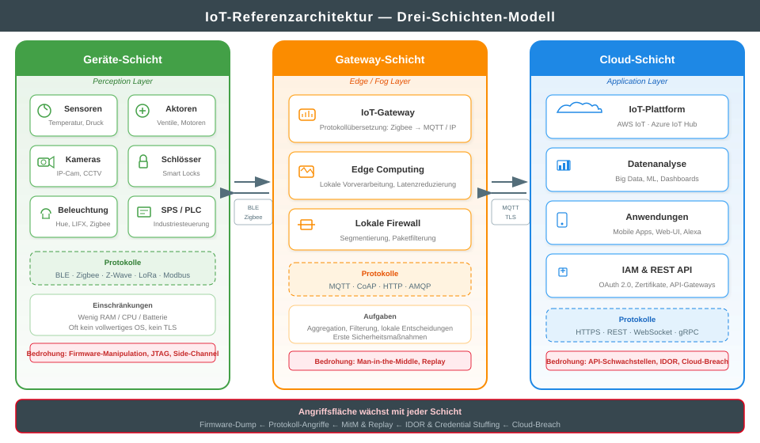
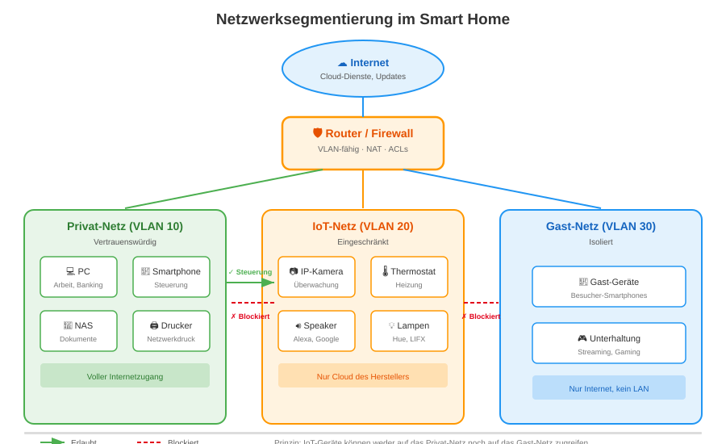
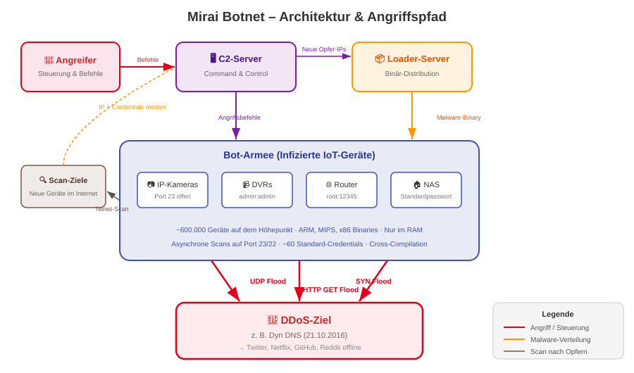
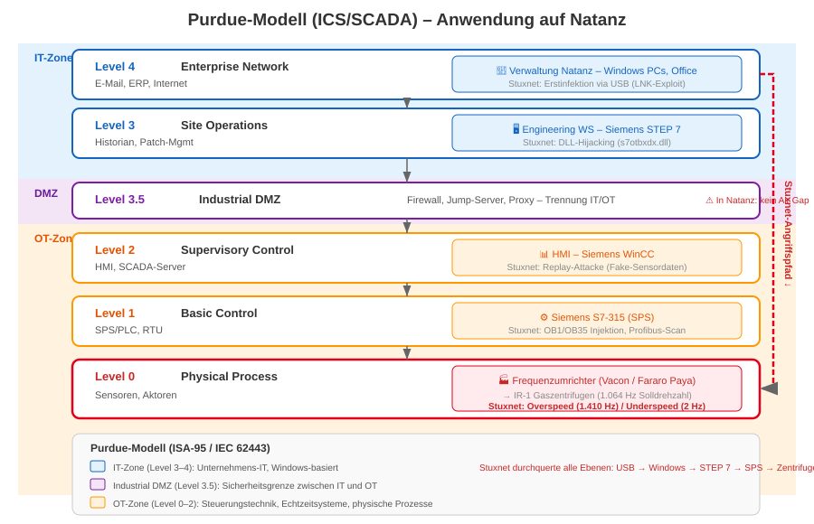
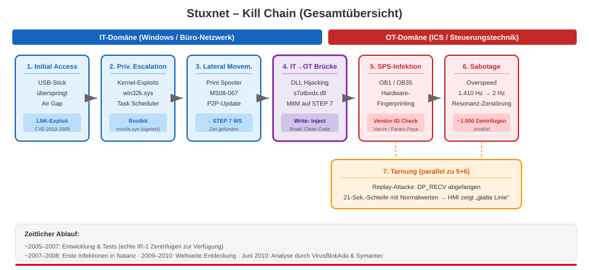

<!-- _class: title -->

# IoT-Sicherheit

## Sicherheit im Internet der Dinge

---

# Agenda

1. **Grundlagen** – Was ist IoT? Architektur & Protokolle
2. **Bedrohungslandschaft** – OWASP IoT Top 10 & Angriffsvektoren
3. **Fallstudie: Smart Home** – Schwachstellen, Schutzmaßnahmen
4. **Fallstudie: Mirai-Botnet** – DDoS durch Haushaltsgeräte
5. **OT-Sicherheit** – Industrielle Steuerungssysteme absichern
6. **Fallstudie: Stuxnet** – Cyber-Waffe gegen Industrieanlagen
7. **Standards & Regulierung** – ETSI, IEC 62443, EU Cyber Resilience Act
8. **Fazit & Ausblick**

---

<!-- _class: chapter -->

# Grundlagen

## Was ist das Internet der Dinge?

---

<!--
Das Internet der Dinge (Internet of Things, IoT) bezeichnet die Vernetzung physischer Gegenstände – von Alltagsgeräten bis zu Industrieanlagen – mit dem Internet. Die Zahl der vernetzten Geräte hat sich in den letzten Jahren exponentiell entwickelt: Schätzungen gehen von über 30 Milliarden IoT-Geräten weltweit aus (Stand 2025). 

Wichtig ist die Abgrenzung der drei Domänen: IT (Information Technology) umfasst klassische Computer, Server und Netzwerke. OT (Operational Technology) bezeichnet die Steuerungstechnik in Fabriken und kritischer Infrastruktur (SCADA, SPS). IoT ist die Brücke zwischen beiden Welten – vernetzte Geräte, die Daten sammeln und Aktionen ausführen, oft mit eingeschränkten Ressourcen (wenig RAM, CPU, Batterie). Die Konvergenz von IT und OT ist einer der größten Sicherheits-Treiber unserer Zeit.
-->

# Was ist das Internet der Dinge?

<!-- _class: biglist -->

- **Definition:** Vernetzung physischer Gegenstände mit dem Internet
- **Umfang:** > 30 Milliarden Geräte weltweit (Tendenz steigend)
- **Drei Domänen:**
  - **IT** – Information Technology (PCs, Server, Cloud)
  - **OT** – Operational Technology (SCADA, SPS, Industriesteuerung)
  - **IoT** – Brücke zwischen IT und OT
- **Einsatzfelder:** Smart Home, Industrie 4.0, Medizin, Verkehr, Energie, Landwirtschaft
- **Kernproblem:** Geräte mit minimalen Ressourcen, aber maximaler Vernetzung

---

<!--
Die IoT-Referenzarchitektur beschreibt drei Schichten, durch die Daten fließen:

Die Geräte-Schicht (Perception Layer) umfasst Sensoren, Aktoren und eingebettete Systeme. Diese Geräte haben oft nur wenige Kilobyte RAM, laufen auf Mikrocontrollern (ARM Cortex-M, ESP32) und kommunizieren über energiesparende Protokolle wie BLE, Zigbee oder LoRa. Viele haben kein vollwertiges Betriebssystem und können kein TLS für verschlüsselte Kommunikation unterstützen.

Die Gateway-Schicht (Edge/Fog Layer) übernimmt die Protokollübersetzung (z. B. Zigbee → MQTT/IP), lokale Datenvorverarbeitung (Edge Computing) und erste Sicherheitsmaßnahmen wie Paketfilterung. Hier findet die Transformation von proprietären Feldprotokollen in internetfähige Protokolle statt.

Die Cloud-Schicht (Application Layer) beherbergt die IoT-Plattform (AWS IoT, Azure IoT Hub), Datenanalyse, Dashboards und die REST-APIs, über die Mobile Apps und Web-UIs mit den Geräten interagieren. Hier laufen auch IAM-Dienste (Identity & Access Management) und die Zertifikatsverwaltung.

Wichtig: Die Angriffsfläche wächst mit jeder Schicht – von Firmware-Manipulation auf Geräteebene über Man-in-the-Middle auf der Gateway-Ebene bis zu API-Schwachstellen in der Cloud.
-->

# IoT-Referenzarchitektur

---

<!--
Die Protokollvielfalt im IoT ist sowohl Stärke als auch Schwachstelle. Auf der Funkebene (Physical/Link Layer) dominieren energiesparende Protokolle: Bluetooth Low Energy (BLE) für kurze Distanzen, Zigbee und Z-Wave für Mesh-Netzwerke im Smart Home, und LoRaWAN für Kilometer-weite Reichweiten bei minimaler Bandbreite (z. B. Landwirtschaft, Smart City).

Auf der Applikationsebene ist MQTT (Message Queuing Telemetry Transport) der De-facto-Standard. Es arbeitet nach dem Publish/Subscribe-Modell: Ein Gerät veröffentlicht Daten auf einem „Topic" (z. B. home/temperatur/wohnzimmer), und alle abonnierenden Clients erhalten die Nachricht automatisch. MQTT ist extrem leichtgewichtig, was es ideal für instabile Verbindungen macht – aber auch anfällig, wenn es ohne TLS betrieben wird (Standardport 1883 unverschlüsselt vs. 8883 mit TLS).

CoAP (Constrained Application Protocol) ist das REST-Äquivalent für eingeschränkte Geräte: Es nutzt UDP statt TCP und ist damit noch ressourcenschonender als MQTT.
-->

# IoT-Protokolle im Überblick

| Protokoll | Schicht | Reichweite | Einsatz | Sicherheit |
|-----------|---------|-----------|---------|-----------|
| **BLE** | Funk | ~50 m | Wearables, Beacons | AES-128 (optional) |
| **Zigbee** | Funk/Mesh | ~100 m | Smart Home (Hue, IKEA) | AES-128, aber Schlüsselaustausch kritisch |
| **Z-Wave** | Funk/Mesh | ~100 m | Hausautomation | S2-Framework (AES-128) |
| **LoRaWAN** | Funk | ~15 km | Smart City, Agrar | AES-128 (App + Netzwerk) |
| **MQTT** | Applikation | IP-basiert | Telemetrie, Sensordaten | TLS optional (Port 8883) |
| **CoAP** | Applikation | IP-basiert | REST für Mikrocontroller | DTLS (UDP-basiertes TLS) |

---

<!-- _class: chapter -->

# Bedrohungslandschaft

## OWASP IoT Top 10 & Angriffsvektoren

---

<!--
Die OWASP Foundation hat analog zu den Web Application Top 10 eine eigene Top-10-Liste für IoT-Schwachstellen veröffentlicht. Diese fasst die häufigsten und kritischsten Sicherheitsprobleme im IoT zusammen und dient als Orientierung für Hersteller, Entwickler und Sicherheitsforscher.

Besonders gravierend sind die ersten drei Punkte: Schwache oder voreingestellte Passwörter (wie admin:admin bei IP-Kameras), unsichere Netzwerkdienste (offene Telnet-Ports, unverschlüsselte APIs) und unsichere Ecosystem-Interfaces (Schwachstellen in der Cloud-Plattform, der Mobile App oder der Web-Oberfläche des Geräts). Diese drei Kategorien waren auch die Hauptvektoren für das Mirai-Botnet, das wir später im Detail besprechen.

Punkt 4 (fehlende sichere Update-Mechanismen) ist besonders problematisch: Viele günstige IoT-Geräte haben schlicht keine Möglichkeit, Firmware-Updates zu empfangen. Selbst wenn Updates verfügbar wären, fehlt oft die kryptografische Signaturprüfung, sodass ein Angreifer manipulierte Firmware aufspielen könnte.
-->

# OWASP IoT Top 10 – Übersicht

1. **Weak, Guessable, or Hardcoded Passwords** – Standardpasswörter, keine Änderung erzwungen
2. **Insecure Network Services** – Offene Ports (Telnet, UPnP), unnötige Dienste
3. **Insecure Ecosystem Interfaces** – Schwache APIs, Web-UIs, Cloud-Backends
4. **Lack of Secure Update Mechanism** – Keine OTA-Updates, keine Signaturprüfung
5. **Use of Insecure or Outdated Components** – Veraltete Libraries, ungepatchte CVEs
6. **Insufficient Privacy Protection** – Unnötige Datensammlung, Klartext-Übertragung
7. **Insecure Data Transfer and Storage** – Fehlende Verschlüsselung lokal & in transit
8. **Lack of Device Management** – Kein Inventar, kein Lifecycle-Management
9. **Insecure Default Settings** – Alles aktiviert, nichts gehärtet
10. **Lack of Physical Hardening** – JTAG/UART zugänglich, Firmware extrahierbar

---

<!--
I1 – Weak, Guessable, or Hardcoded Passwords: Dies ist die häufigste und zugleich trivialste Schwachstelle im IoT. Viele Geräte werden mit universellen Standardpasswörtern ausgeliefert (admin:admin, root:root, admin:1234). Manche Hersteller kodieren Zugangsdaten direkt in die Firmware – im Klartext oder als Hash, der einfach extrahiert werden kann –, sodass sie vom Nutzer gar nicht geändert werden können. Dies war der Hauptvektor für das Mirai-Botnet: Es reichte eine Liste von etwa 60 Standard-Credentials, um hunderttausende Geräte zu übernehmen.

Gegenmaßnahmen: Einzigartige Passwörter pro Gerät ab Werk (wie der EU Cyber Resilience Act fordert), erzwungener Passwortwechsel beim ersten Login, Unterstützung für zertifikatsbasierte Authentifizierung, Verbot von Telnet zugunsten von SSH mit Key-based Auth.
-->

# I1 – Schwache & hartcodierte Passwörter

### Problem
- Universelle Standardpasswörter (`admin:admin`)
- Fest in Firmware kodiert → nicht änderbar
- Kein erzwungener Passwortwechsel
- **Mirai nutzte nur ~60 Credentials** für 600.000 Geräte

### Beispiele
- IP-Kameras: `admin:admin`
- Router: `root:root`
- DVRs: `888888` / `666666`

### Gegenmaßnahmen
- Einzigartiges Passwort pro Gerät ab Werk
- Erzwungener Passwortwechsel beim Erstlogin
- Zertifikatsbasierte Authentifizierung
- Kein Telnet → SSH mit Key-Auth
- **CRA verbietet universelle Standardpasswörter ab 2027**

---

<!--
I2 – Insecure Network Services: Viele IoT-Geräte exponieren unnötige Netzwerkdienste, die Angreifern eine große Angriffsfläche bieten. Telnet (Port 23) überträgt alles im Klartext, einschließlich Passwörter. UPnP (Universal Plug and Play) erlaubt Geräten, eigenständig Port-Weiterleitungen im Router zu erstellen – und reißt damit Löcher in die Firewall, ohne dass der Nutzer es bemerkt. Oft laufen veraltete Webserver (z. B. GoAhead, lighttpd mit bekannten CVEs) auf den Geräten, die nie gepatcht werden. Ein offener Debug-Port oder ein vergessener FTP-Dienst reicht für einen Angreifer aus, um das Gerät vollständig zu übernehmen.

Über Suchmaschinen wie Shodan oder Censys lassen sich Millionen von Geräten mit offenen Telnet-Ports, ungesicherten Web-Interfaces oder sogar offenen Datenbank-Ports im Internet finden. Diese Geräte sind oft innerhalb von Sekunden angreifbar.
-->

# I2 – Unsichere Netzwerkdienste

### Problem
- **Telnet** (Port 23) – Klartext-Übertragung
- **UPnP** – automatische Port-Weiterleitungen
- Veraltete Webserver (GoAhead, lighttpd)
- Offene Debug-Ports (Fernwartung)
- FTP ohne Authentifizierung

### Beispiele
- Shodan-Suche: >1 Mio. Geräte mit offenem Telnet
- UPnP: Gerät öffnet Port 80 zum Internet

### Gegenmaßnahmen
- Minimale Dienste (Least Privilege)
- Alle unnötigen Ports schließen
- Telnet → SSH ersetzen
- UPnP im Router deaktivieren
- Regelmäßige Port-Scans eigener Geräte
- Webserver aktuell halten

---

<!--
I3 – Insecure Ecosystem Interfaces: Das Ökosystem eines IoT-Geräts umfasst viel mehr als das Gerät selbst: Cloud-Backend, REST-API, Mobile App, Web-Dashboard und die Kommunikation zwischen all diesen Komponenten. Eine Schwachstelle in einem dieser Elemente kompromittiert das gesamte System.

Ein besonders häufiges Problem sind IDOR-Schwachstellen (Insecure Direct Object References): Ein Angreifer kann die Geräte-ID in der API-URL manipulieren und erhält Zugriff auf fremde Geräte anderer Nutzer. Beispiel: GET /api/devices/12345/stream → Änderung zu /api/devices/12346/stream zeigt den Kamera-Feed eines Fremden. Solche Schwachstellen wurden bei Verkada (2021, 150.000 Kameras betroffen), Ring (mehrfach), und zahlreichen IP-Kamera-Herstellern gefunden. Auch fehlende Rate-Limits bei Login-Versuchen ermöglichen einfache Brute-Force- und Credential-Stuffing-Angriffe.
-->

# I3 – Unsichere Ökosystem-Schnittstellen

### Problem
- Fehlende API-Authentifizierung
- **IDOR** – Zugriff auf fremde Geräte durch ID-Manipulation
- SQL-Injection in Web-Dashboards
- Kein Rate-Limiting bei Login-Versuchen
- Unverschlüsselte Cloud-Kommunikation

### Reale Vorfälle
- **Verkada (2021):** 150.000 Kameras kompromittiert
- **Ring:** Mehrfach Credential-Stuffing-Angriffe

### Gegenmaßnahmen
- OAuth 2.0 mit Scoping
- Input-Validierung & Parameterized Queries
- Rate-Limiting & Account-Lockout
- Penetrationstests des gesamten Ökosystems
- TLS für jede Verbindung
- Bug-Bounty-Programme

---

<!--
I4 – Lack of Secure Update Mechanism: Firmware-Updates sind der wichtigste Weg, um Sicherheitslücken nach der Auslieferung zu beheben. Viele günstige IoT-Geräte haben jedoch überhaupt keinen Update-Mechanismus. Andere laden Updates über unverschlüsseltes HTTP herunter, ohne die Integrität oder Authentizität der Firmware zu prüfen. Das ermöglicht Man-in-the-Middle-Angriffe, bei denen ein Angreifer im lokalen Netz eine manipulierte Firmware einschleust.

Besonders kritisch sind Rollback-Angriffe: Ein Angreifer kann das Gerät dazu bringen, eine ältere Firmware-Version zu installieren, die eine bekannte Schwachstelle enthält. Sichere Update-Mechanismen müssen daher drei Eigenschaften haben: Verschlüsselung (TLS), Signaturprüfung (der Bootloader prüft die kryptografische Signatur des Images) und Anti-Rollback (Versionsnummer wird im Secure Storage gespeichert, ältere Versionen werden abgelehnt).
-->

# I4 – Fehlende sichere Update-Mechanismen

### Problem
- Kein OTA-Update-Mechanismus vorhanden
- Updates über unverschlüsseltes HTTP
- Keine Signaturprüfung der Firmware
- Kein Anti-Rollback-Schutz
- Nutzer muss manuell updaten (tut es nicht)

### Risiko
- MitM → manipulierte Firmware einspielen
- Rollback auf verwundbare Version erzwingen

### Sicherer Update-Prozess
1. **Verschlüsselung:** Download via TLS
2. **Signatur:** Bootloader prüft kryptografische Signatur (Public Key im Secure Storage)
3. **Anti-Rollback:** Versionsnummer im Secure Element, ältere Versionen abgelehnt
4. **Automatisch:** Updates ohne Nutzerinteraktion
5. **A/B-Partitionen:** Fallback bei fehlgeschlagenem Update

---

<!--
I5 – Use of Insecure or Outdated Components: IoT-Geräte basieren oft auf Linux-Distributionen mit veralteten Kerneln und Libraries. Ein Gerät, das 2020 mit OpenSSL 1.0.1 ausgeliefert wurde, ist anfällig für Heartbleed und dutzende weitere CVEs. Hersteller von günstigen IoT-Geräten nutzen häufig fertige SDKs ihrer Chipset-Hersteller (z. B. Realtek, HiSilicon) und aktualisieren diese nach der Erstentwicklung nie wieder. Ohne eine Software Bill of Materials (SBOM) ist es weder für den Hersteller noch für den Betreiber möglich, die enthaltenen Komponenten und deren bekannte Schwachstellen zu identifizieren.

I6 – Insufficient Privacy Protection: Viele IoT-Geräte sammeln mehr Daten als für ihre Funktion notwendig. Smart Speaker zeichnen Sprachbefehle auf und senden sie an Cloud-Server. Staubsauger-Roboter erstellen detaillierte Grundrisse der Wohnung. Fitness-Tracker übermitteln Gesundheitsdaten. Diese Daten werden häufig unverschlüsselt übertragen oder auf unsicheren Cloud-Servern gespeichert. Bei einem Datenleck werden intime Details des Lebens offengelegt. Nach DSGVO sind Hersteller zur Datenminimierung verpflichtet.

I7 – Insecure Data Transfer and Storage: Sowohl die Übertragung (in transit) als auch die Speicherung (at rest) von Daten sind oft unzureichend geschützt. Lokale Speicherung auf dem Gerät erfolgt häufig im Klartext auf einem Flash-Speicher, der durch physischen Zugriff ausgelesen werden kann. Im Netzwerk werden Credentials und Telemetriedaten oft über unverschlüsselte Protokolle (HTTP, MQTT ohne TLS, CoAP ohne DTLS) gesendet.
-->

# I5–I7 – Komponenten, Datenschutz & Datenübertragung

### I5 – Veraltete Komponenten
- Linux-Kernel von 2015
- OpenSSL 1.0.1 (Heartbleed!)
- Chipset-SDKs nie aktualisiert (Realtek, HiSilicon)
- Keine SBOM vorhanden
- **Gegenmaßnahme:** Software Composition Analysis, SBOM-Pflicht (CRA)

### I6 – Mangelnder Datenschutz
- Staubsauger: Grundrisse der Wohnung
- Speaker: Sprachaufzeichnungen
- Tracker: Gesundheitsdaten
- Daten oft unverschlüsselt in der Cloud
- **Gegenmaßnahme:** Datenminimierung, lokale Verarbeitung, DSGVO-Konformität

### I7 – Unsichere Datenübertragung
- HTTP statt HTTPS
- MQTT ohne TLS (Port 1883)
- Credentials im Klartext
- Flash-Speicher unverschlüsselt
- **Gegenmaßnahme:** TLS everywhere, at-rest-Verschlüsselung, Secure Storage

---

<!--
I8 – Lack of Device Management: In vielen Organisationen und Haushalten gibt es kein Inventar der IoT-Geräte. Niemand weiß, welche Geräte am Netzwerk hängen, welche Firmware-Version sie haben und ob bekannte Schwachstellen existieren. Ohne Asset-Management ist kein Patch-Management möglich. Geräte, deren Hersteller den Support eingestellt hat (End of Life), bleiben oft jahrelang am Netz – ungepatcht und vergessen.

I9 – Insecure Default Settings: Geräte werden oft mit allen Funktionen aktiviert ausgeliefert – offene Ports, aktives UPnP, Debug-Modus, Standard-Credentials. Das Prinzip "Secure by Default" verlangt das Gegenteil: Nur die minimal notwendigen Funktionen sollten aktiviert sein. Der Nutzer muss bewusst Funktionen freischalten, nicht bewusst Funktionen absichern.

I10 – Lack of Physical Hardening: IoT-Geräte sind oft physisch zugänglich – im Garten, an der Hauswand, in öffentlichen Gebäuden. Debug-Schnittstellen wie JTAG und UART sind häufig auf der Platine zugänglich und nicht deaktiviert. Über diese Schnittstellen lässt sich die Firmware extrahieren (Dump), analysieren (Reverse Engineering) und manipulieren. Im Firmware-Image finden sich dann häufig hartcodierte Credentials, API-Schlüssel oder private Zertifikate. Auch Seitenkanalangriffe (Stromverbrauchsanalyse, elektromagnetische Abstrahlung) sind bei physischem Zugang möglich.
-->

# I8–I10 – Management, Defaults & physische Sicherheit

### I8 – Fehlendes Gerätemanagement
- Kein Inventar der IoT-Geräte
- Firmware-Versionen unbekannt
- Kein Lifecycle-Management
- Verwaiste Geräte im Netz
- **Gegenmaßnahme:** Asset Discovery, automatisiertes Inventar, Netzwerk-Scans

### I9 – Unsichere Standardeinstellungen
- Alles aktiviert ab Werk
- Debug-Modus aktiv
- UPnP, Telnet offen
- Kein Zwang zum Passwortwechsel
- **Gegenmaßnahme:** Secure by Default – minimale Services, erzwungene Konfiguration

### I10 – Fehlende physische Härtung
- JTAG/UART auf Platine offen
- Firmware-Dump möglich
- Keine Secure-Boot-Kette
- Seitenkanalangriffe möglich
- **Gegenmaßnahme:** Debug-Ports deaktivieren, Secure Boot, Tamper Detection

---

<!--
IoT-Angriffsvektoren lassen sich in vier Kategorien einteilen:

Physische Angriffe: Da IoT-Geräte oft frei zugänglich sind (z. B. Sensoren im Außenbereich), können Angreifer direkt auf die Hardware zugreifen. Über Debug-Schnittstellen wie JTAG oder UART lässt sich die Firmware extrahieren und analysieren (Reverse Engineering). Im Firmware-Image finden sich häufig hartcodierte Credentials, API-Schlüssel oder private Zertifikate. Auch Side-Channel-Angriffe (Stromverbrauchsanalyse, elektromagnetische Abstrahlung) sind bei physischem Zugang möglich.

Netzwerk-Angriffe: Im lokalen Netzwerk sind Man-in-the-Middle-Angriffe (bei unverschlüsselter Kommunikation), Replay-Attacken (Wiederabspielen aufgezeichneter Befehle) und Deauthentication-Angriffe (Zwangsabmeldung von WLAN-Geräten) die häufigsten Vektoren.

Cloud/API-Angriffe: Die meisten IoT-Geräte kommunizieren mit einem Cloud-Backend. Schwachstellen in der REST-API (Broken Authentication, IDOR – Insecure Direct Object Reference) ermöglichen den Zugriff auf fremde Geräte. Bei einem Cloud-Hack sind potenziell alle Geräte aller Kunden betroffen.

Supply-Chain-Angriffe: Manipulierte Firmware oder Hardware-Komponenten werden bereits im Herstellungsprozess eingeschleust. Dies ist besonders schwer zu erkennen und betrifft die gesamte Lieferkette.
-->

# Angriffsvektoren im IoT

### Physisch
- Firmware-Dump (JTAG, UART)
- Hartcodierte Credentials
- Side-Channel (Stromanalyse)
- Hardware-Manipulation

### Netzwerk
- Man-in-the-Middle (MitM)
- Replay-Attacken
- Deauthentication (WLAN)
- Port-Scanning & Brute-Force

### Cloud / API
- Broken Authentication
- IDOR (fremde Geräte steuern)
- API-Schlüssel in Firmware
- Cloud-Breach → alle Geräte betroffen

### Supply Chain
- Manipulierte Firmware ab Werk
- Kompromittierte Chipsets
- Backdoors in Libraries
- Schwer erkennbar

---

<!-- _class: chapter -->

# Sicherheit im Smart Home

## Wenn der Kühlschrank einen Server angreift

---

<!-- _class: biglist -->

# Was ist ein Smart Home?

<!--
Ein Smart Home ist ein Ökosystem aus heterogenen Geräten, die über verschiedene Protokollstacks kommunizieren. Während WLAN (IEEE 802.11) für bandbreitenintensive Geräte wie Kameras genutzt wird, setzen energieeffiziente Sensoren oft auf Mesh-Netzwerke wie Zigbee (basiert auf IEEE 802.15.4) oder Z-Wave. Diese Protokolle arbeiten häufig im 2,4-GHz- oder 868-MHz-Band und benötigen ein Gateway (Hub), um die Brücke zum IP-basierten Heimnetzwerk und zur Cloud zu schlagen. Die Kommunikation erfolgt dabei oft über das MQTT-Protokoll (Message Queuing Telemetry Transport), einem leichtgewichtigen Publish/Subscribe-Messaging-Protokoll, das ideal für instabile Netzwerkverbindungen ist.
-->

- Vernetzte Geräte im privaten Haushalt  
- Beispiele:
  - Smart Speaker  
  - IP‑Kameras  
  - Smarte Thermostate  
  - Türschlösser  
  - Lichtsysteme  
- Kommunikation über WLAN, Zigbee, Z‑Wave, Bluetooth, IP

---
<!-- _class: biglist -->

# Warum ist Smart‑Home‑Sicherheit kritisch?
<!--
Die Kritikalität ergibt sich aus der IT/OT-Konvergenz im privaten Bereich. Smart-Home-Geräte sind oft "Always-on" und direkt mit Cloud-Backends verbunden, was sie zu idealen Zielen für persistente Bedrohungen macht. Da viele Hersteller aus dem Consumer-Bereich kommen, fehlt oft ein Security Lifecycle Management; Geräte werden auf den Markt geworfen, ohne dass langfristige Sicherheitsupdates eingeplant sind. Ein kompromittiertes Gerät (z. B. ein smarter Kühlschrank) dient Angreifern als Pivot-Punkt, um Firewalls von innen zu umgehen und auf sensible Systeme wie NAS-Speicher oder Arbeitslaptops im selben Subnetz zuzugreifen.
-->
- Geräte oft dauerhaft online  
- Viele Hersteller mit sehr unterschiedlichem Sicherheitsniveau  
- Geräte werden selten aktualisiert  
- Direkter Einfluss auf Privatsphäre & physische Sicherheit  
- Angreifer nutzen Smart‑Home‑Geräte als Einstiegspunkt ins Heimnetz

---
<!-- _class: biglist -->
# Typische Schwachstellen im Smart Home
<!--
Ein technisches Hauptproblem ist das Protokoll UPnP (Universal Plug and Play). Es erlaubt Geräten, eigenständig Port-Weiterleitungen im Router zu erstellen, was oft ungewollte Löcher in die Firewall reißt. Hinzu kommt die fehlende Transportverschlüsselung im lokalen Netzwerk; viele günstige IoT-Geräte übertragen Statusmeldungen oder Passwörter im Klartext via HTTP statt HTTPS. Auch die Authentifizierung bei Begleit-Apps ist oft schwach implementiert, was Brute-Force-Angriffe auf Cloud-Konten ermöglicht, über die dann das gesamte Zuhause gesteuert werden kann.
-->
- Standardpasswörter  
- Unsichere Cloud‑Anbindungen  
- Unverschlüsselte lokale Kommunikation  
- Fehlende Updates  
- Unsichere WLAN‑Konfiguration  
- Offene Ports / UPnP  
- Schwache Authentifizierung bei Apps

---
<!-- _class: biglist -->
# Bedrohungen im Smart Home
<!--
Neben dem Missbrauch für DDoS-Attacken (wie bei Mirai) steht die Privatsphäre im Fokus. Durch Man-in-the-Middle-Angriffe (MitM) können Angreifer unverschlüsselten Datenverkehr abfangen oder manipulieren. Eine besonders kritische Bedrohung ist der Identitätsdiebstahl über Cloud-Konten: Da viele Nutzer dieselben Passwörter für den Staubsauger-Roboter wie für ihr E-Mail-Konto verwenden, führt ein Leak beim Hersteller oft zur Kompromittierung der gesamten digitalen Identität. Zudem ermöglichen Schwachstellen in der lokalen API oft das unbefugte Entriegeln von smarten Türschlössern ohne physische Spuren.
-->
- **Botnet‑Infektionen** (z. B. Mirai)  
- **DDoS‑Missbrauch**  
- **Ausspähen von Kameras**  
- **Manipulation von Türschlössern**  
- **Man‑in‑the‑Middle‑Angriffe**  
- **Identitätsdiebstahl über Cloud‑Konten**

---
<!-- _class: biglist -->
# Netzwerksicherheitsprinzipien für Smart Homes
<!--
Die Abwehr basiert auf drei Säulen:

Zero Trust: Kein Gerät innerhalb des Netzwerks erhält implizites Vertrauen. Jede Kommunikationsanfrage muss authentifiziert werden.

Least Privilege: Ein smarter Thermostat benötigt Zugriff auf den Zeitserver und die Cloud des Herstellers, aber niemals Zugriff auf die SMB-Freigaben des Familien-PCs.

Defense in Depth: Sicherheit darf nicht nur an der Peripherie (Router) stattfinden, sondern muss auf Geräteebene (Verschlüsselung) und Netzwerkebene (Segmentierung) greifen.
-->
- **Zero Trust**: Kein Gerät automatisch vertrauenswürdig  
- **Segmentierung**: IoT‑Geräte in eigenes WLAN/VLAN  
- **Least Privilege**: Minimale Berechtigungen  
- **Verschlüsselung**: WLAN & Protokolle  
- **Monitoring**: Netzwerkverkehr beobachten  
- **Secure‑by‑Design**: Geräteauswahl nach Sicherheitskriterien

---

# Netzwerksegmentierung im Smart Home
<!--
Technisch wird dies meist über VLANs (Virtual Local Area Networks) oder ein separates Gast-WLAN realisiert. In einem VLAN-Szenario wird der Netzwerkverkehr auf Layer 2 logisch getrennt. Eine Firewall (auf Layer 3/4) regelt dann mittels Access Control Lists (ACLs), welche Pakete zwischen dem "IoT-VLAN" und dem "Privat-VLAN" fließen dürfen. So kann man beispielsweise erlauben, dass das Smartphone (Privat-Netz) den Fernseher (IoT-Netz) steuert, aber der Fernseher keine Verbindung zum Smartphone initiieren kann.
-->

---
<!-- _class: biglist -->

# Sichere Kommunikation
<!--
Auf der physikalischen Ebene ist WPA3 der aktuelle Standard, der durch das SAE-Verfahren (Simultaneous Authentication of Equals) deutlich resistenter gegen Offline-Wörterbuchangriffe ist als WPA2. Für die Applikationsebene ist TLS (Transport Layer Security) zwingend erforderlich, insbesondere bei der Nutzung von MQTT über TLS (Port 8883). Für den Fernzugriff sollte auf Port-Weiterleitungen verzichtet werden; stattdessen ist ein VPN (Virtual Private Network) auf Basis von WireGuard oder OpenVPN zu bevorzugen, um einen verschlüsselten Tunnel direkt ins Heimnetz zu legen.
-->
- WPA3 oder mindestens WPA2  
- Deaktivieren von WPS  
- TLS/HTTPS für Cloud‑Zugriffe  
- VPN für Fernzugriff  
- Sichere Protokolle:
  - MQTT über TLS  
  - HTTPS statt HTTP

---
<!-- _class: biglist -->
# Authentifizierung & Identitätsmanagement
<!--
Sichere Systeme nutzen geräte-spezifische Zertifikate (X.509), die während der Fertigung in einem Secure Element oder TPM (Trusted Platform Module) im Gerät gespeichert werden. Dies verhindert das Klonen von Identitäten. Für den Nutzer ist die Multi-Faktor-Authentifizierung (MFA) via TOTP (Time-based One-Time Password) oder FIDO2 der wichtigste Schutz gegen Account-Takeover, falls die Zugangsdaten durch Phishing oder Leaks bekannt werden.
-->
- Starke Passwörter  
- Multi‑Factor Authentication für Cloud‑Konten  
- Geräte‑Zertifikate (wenn unterstützt)  
- Regelmäßige Passwortrotation  
- Keine Passwort‑Wiederverwendung

---
<!-- _class: biglist -->
# Firmware‑ und Patch‑Management
<!--
Sicheres Patch-Management erfordert signierte Firmware. Das Gerät prüft dabei mittels eines im Bootloader hinterlegten öffentlichen Schlüssels die kryptografische Signatur des Updates. Nur wenn die Signatur gültig ist, wird das Update installiert. Dies verhindert, dass Angreifer manipulierte Firmware-Images aufspielen können. Zudem sollte der Update-Prozess über eine verschlüsselte HTTPS-Verbindung erfolgen, um Rollback-Angriffe (das Erzwingen einer alten, verwundbaren Version) zu verhindern.
-->
- Automatische Updates aktivieren  
- Geräte regelmäßig prüfen  
- Nur Hersteller mit gutem Update‑Support wählen  
- Alte oder unsichere Geräte ersetzen  
- Signierte Firmware bevorzugen

---
<!-- _class: biglist -->
# Monitoring & Anomalieerkennung
<!--
Ein IDS (Intrusion Detection System) analysiert den Netzwerkverkehr auf bekannte Angriffsmuster. Im Smart Home ist besonders die Anomalieerkennung effektiv: Wenn ein Gerät, das normalerweise nur kleine Pakete (Status-Updates) sendet, plötzlich beginnt, Port-Scans im lokalen Netz durchzuführen oder massenhaft UDP-Pakete an externe IPs schickt, deutet dies auf eine Botnet-Infektion hin. Moderne Router nutzen hierfür Deep Packet Inspection (DPI), um den Inhalt der Pakete auf Protokollkonformität zu prüfen.
-->
- Router‑Logs prüfen  
- Ungewöhnliche Datenraten erkennen  
- Geräte, die plötzlich „nach Hause telefonieren"  
- IDS/IPS in modernen Routern nutzen  
- Benachrichtigungen bei neuen Geräten im Netzwerk

---

<!-- _class: chapter -->

# Mirai‑Botnet  

## DDoS durch Haushaltsgeräte

---
<!-- _class: biglist -->
# Fallbeispiel: Mirai‑Botnet  

<!--
Mirai (japanisch für „Zukunft") erlangte 2016 Berühmtheit, als es Teile des Internets durch massive Angriffe auf den DNS-Dienstleister Dyn lahmlegte. Es markiert einen Wendepunkt, da es demonstrierte, wie eine riesige Armee von technologisch schwachen Geräten (IP-Kameras, DVRs, Heimrouter) in der Masse eine gewaltige Schlagkraft entwickelt. Da diese Geräte oft direkt am Internet hängen und selten durch Firewalls geschützt sind, bilden sie eine ideale, globale Infrastruktur für Angreifer.
-->

## Warum ist Mirai relevant für Smart Homes?

- Infizierte vor allem **Heimrouter, IP‑Kameras, DVRs**  
- Nutzt **Standardpasswörter** und **offene Telnet/SSH‑Ports**  
- Wurde für massive DDoS‑Angriffe eingesetzt  
- Zeigt, wie leicht schlecht gesicherte Geräte kompromittiert werden

---
<!-- _class: biglist -->
# Mirai – Technischer Überblick

<!--
Technisch gesehen ist Mirai in C geschrieben und darauf optimiert, auf verschiedenen CPU-Architekturen (ARM, MIPS, x86) zu laufen, die in IoT-Geräten üblich sind. Der Infektionsvektor ist denkbar einfach: Die Malware scannt das Internet nach offenen Telnet-Ports (Port 23) oder SSH-Ports (Port 22). Sobald eine Verbindung steht, führt sie eine Wörterbuch-Attacke mit einer fest kodierten Liste von nur etwa 60 Standard-Anmeldedaten durch (z. B. admin:admin, root:12345). Diese Effizienz beim Scannen ermöglichte es Mirai, innerhalb von Stunden hunderttausende Geräte zu infizieren.
-->

- Programmiert in C  
- Ziel: IoT‑Geräte mit schwacher Authentifizierung  
- Vorgehensweise:
  - Scannen des Internets nach offenen Ports (v. a. 23/Telnet)  
  - Versuch von Standard‑Login‑Kombinationen  
  - Nach erfolgreichem Login: Nachladen der Malware  
  - Gerät wird Teil des Botnets

---

# Mirai – Architektur

<!--
Die Architektur von Mirai ist hochgradig modular und verteilt:

Bots: Die infizierten Geräte selbst. Sie führen die eigentlichen Scans und Angriffe aus.

Command-and-Control (C2): Ein zentraler Server, von dem die Bots Befehle (Ziel-IP, Angriffsart) entgegennehmen.

Loader: Wenn ein Bot ein neues Opfer findet, meldet er die IP und die Zugangsdaten an den Loader-Server. Dieser lädt dann die für die jeweilige Prozessorarchitektur passende Binärdatei auf das neue Opfer nach.

Scan-Module: Diese nutzen asynchrone Sockets, um extrem schnell tausende IP-Adressen gleichzeitig zu prüfen, ohne auf eine Antwort warten zu müssen (stateless scanning).
-->

---

# Mirai – Angriffstechniken

<!--
Mirai beherrscht verschiedene DDoS-Methoden auf unterschiedlichen Ebenen des OSI-Modells:

TCP SYN Flood (Layer 4): Hierbei werden massenhaft SYN-Pakete gesendet, um den Three-Way-Handshake des Zielservers zu initiieren, aber nie abzuschließen. Dies verbraucht alle verfügbaren Verbindungsressourcen (Backlog).

UDP Flood (Layer 4): Es werden massenhaft UDP-Pakete an zufällige Ports des Opfers gesendet. Der Server muss für jedes Paket prüfen, ob eine Anwendung lauscht, und mit einem "ICMP Destination Unreachable" antworten, was die Bandbreite und CPU sättigt.

HTTP GET Flood (Layer 7): Diese Attacke simuliert echte Nutzeranfragen an eine Webseite. Da die Verarbeitung einer Datenbankabfrage auf dem Server deutlich mehr Ressourcen verbraucht als das Senden des Requests auf Angreiferseite, bricht der Webdienst unter der Last zusammen.
-->

- **Brute‑Force über Telnet**  
- **DDoS‑Methoden**:
  - TCP SYN Flood  
  - UDP Flood  
  - HTTP GET Flood  
- **Persistenz**:
  - Mirai lebt nur im RAM  
  - Neustart entfernt die Malware  
  - Aber Geräte werden schnell erneut infiziert, wenn Schwachstelle bleibt

---
<!-- _class: biglist -->
# Mirai – Warum war es so erfolgreich?

<!--
Der Erfolg beruhte auf der ökonomischen Asymmetrie: Ein Angreifer kann mit minimalem Aufwand Millionen Geräte scannen, während der Schutz jedes einzelnen Geräts in der Verantwortung von Millionen technisch unbedarfter Nutzer liegt. Viele dieser Geräte besitzen zudem keine Update-Funktion für die Firmware. Ein weiterer Faktor ist die Persistenz: Obwohl Mirai nur im flüchtigen Arbeitsspeicher (RAM) lebt und ein Neustart die Malware löscht, ist die Re-Infektionsrate so hoch, dass das Gerät oft in weniger als zwei Minuten nach dem Reboot erneut übernommen wird, solange das Standardpasswort aktiv ist.
-->

- Millionen IoT‑Geräte mit Standardpasswörtern  
- Hersteller ohne Update‑Mechanismen  
- Nutzer ohne Sicherheitsbewusstsein  
- Geräte dauerhaft online  
- Geringe Rechenleistung → schwer zu schützen

---
<!-- _class: biglist -->
# Schutz vor Mirai & ähnlichen Botnets

<!--
Die wichtigste Maßnahme ist das Härten der Konfiguration: Standardpasswörter müssen zwingend durch komplexe, individuelle Passwörter ersetzt werden. Technisch gesehen sollten Dienste wie Telnet komplett deaktiviert und durch verschlüsseltes SSH mit Key-basierter Authentifizierung ersetzt werden. Auf Netzwerkebene hilft das Deaktivieren von UPnP am Router, damit Geräte sich nicht selbstständig nach außen öffnen können. Zudem sollten IoT-Geräte in einem isolierten VLAN ohne Zugriff auf das restliche Heimnetzwerk betrieben werden (Segmentierung).
-->

- Standardpasswörter ändern  
- Telnet/SSH deaktivieren  
- Firmware aktualisieren  
- IoT‑Geräte in isoliertes Netz  
- UPnP deaktivieren  
- Router‑Firewall aktivieren  
- Geräte nur von vertrauenswürdigen Herstellern kaufen

---

<!-- _class: chapter -->

# OT-Sicherheit

## Sicherheit industrieller Steuerungssysteme

---

<!--
Operational Technology (OT) bezeichnet Hardware und Software, die physische Prozesse überwacht und steuert. Im Gegensatz zur IT, wo die Schutzziele Vertraulichkeit, Integrität und Verfügbarkeit (CIA) priorisiert werden, gilt in der OT eine umgekehrte Priorität: Verfügbarkeit steht an erster Stelle, gefolgt von Integrität. Ein Produktionsstopp in einem Stahlwerk oder der Ausfall einer Wasseraufbereitungsanlage hat unmittelbare physische Konsequenzen – im schlimmsten Fall Gefahr für Menschenleben.

Die wichtigsten Systeme in der OT sind:

SCADA (Supervisory Control and Data Acquisition): Zentrales Steuerungs- und Überwachungssystem, das Daten von verteilten Feldgeräten sammelt und über ein HMI (Human Machine Interface) visualisiert. SCADA-Systeme steuern Stromnetze, Wasserwerke, Pipelines und Verkehrsleitsysteme.

SPS/PLC (Speicherprogrammierbare Steuerung / Programmable Logic Controller): Echtzeitfähige Computer, die direkt mit Sensoren und Aktoren verbunden sind und den physischen Prozess steuern. Sie laufen in deterministischen Zyklen (z. B. 10 ms) und reagieren auf Eingangssignale mit vorprogrammierter Logik.

DCS (Distributed Control System): Ähnlich wie SCADA, aber für eng gekoppelte, lokale Prozesse (z. B. chemische Anlagen). Die Steuerung ist auf viele verteilte Controller aufgeteilt.

RTU (Remote Terminal Unit): Fernwirkgeräte, die an abgelegenen Standorten Daten erfassen und an die Zentrale übermitteln (z. B. Messstationen an Pipelines).
-->

# Was ist OT? – Operational Technology

### IT vs. OT – Prioritäten

| | **IT** | **OT** |
|---|---|---|
| **Priorität 1** | Vertraulichkeit | **Verfügbarkeit** |
| **Priorität 2** | Integrität | Integrität |
| **Priorität 3** | Verfügbarkeit | Vertraulichkeit |
| **Lebensdauer** | 3–5 Jahre | **15–30 Jahre** |
| **Patching** | Regelmäßig | Selten (Wartungsfenster) |
| **Ausfallfolgen** | Datenverlust | **Physische Schäden** |

### Schlüsselsysteme
- **SCADA** – Supervisory Control & Data Acquisition
- **SPS/PLC** – Speicherprogrammierbare Steuerungen
- **DCS** – Distributed Control Systems
- **RTU** – Remote Terminal Units
- **HMI** – Human Machine Interface

### Einsatzgebiete
- Energieversorgung, Wasserwerke
- Chemie, Pharma, Fertigung
- Verkehrsleitsysteme, Pipelines

---

<!--
Die Besonderheiten von OT-Systemen machen die Absicherung fundamental anders als in der klassischen IT:

Lebenszyklen von 15–30 Jahren: Industrieanlagen laufen Jahrzehnte. Die eingesetzten Steuerungen wurden oft zu einer Zeit entwickelt, als Cybersicherheit kein Thema war. Windows XP und veraltete Protokolle sind in Fabriken noch weit verbreitet.

Proprietäre Protokolle ohne Sicherheitsfeatures: Modbus (1979) und Profibus übertragen Befehle im Klartext ohne jede Authentifizierung. Ein Angreifer im Netzwerk kann direkt Steuerbefehle an eine SPS senden, ohne ein Passwort zu benötigen. Es gibt keine Verschlüsselung, keine Integritätsprüfung, keine Zugriffskontrolle auf Protokollebene.

Patching ist problematisch: In einer Produktionsanlage kann ein Update nicht einfach eingespielt werden, da dies einen Produktionsstopp erfordert. Viele OT-Systeme werden nur in geplanten Wartungsfenstern (z. B. einmal im Jahr) aktualisiert – wenn überhaupt. Hinzu kommt, dass Hersteller von SPS und SCADA-Software oft keine zeitnahen Patches bereitstellen.

Echtzeitanforderungen: SPS-Zyklen im Millisekundenbereich dulden keine Latenz durch Sicherheitsmaßnahmen wie Verschlüsselung oder Intrusion Detection.
-->

# Warum ist OT-Sicherheit so schwierig?

<!-- _class: biglist -->

- **Lebenszyklen von 15–30 Jahren** – Windows XP noch produktiv
- **Proprietäre Protokolle ohne Sicherheit:**
  - **Modbus** (1979): Klartext, keine Authentifizierung
  - **Profibus, OPC Classic:** kein TLS, keine Zugriffskontrolle
- **Patching ist riskant** – Produktionsstopp nötig, Hersteller-Freigabe fehlt
- **Echtzeitanforderungen** – SPS-Zyklen im ms-Bereich dulden keine Latenz
- **Konvergenz IT/OT** – Immer mehr OT-Systeme mit Internet verbunden
- **Fehlende Sichtbarkeit** – Kein Monitoring, kein Asset-Inventar
- **Legacy-Geräte** – Können oft nicht gehärtet werden

---

<!--
Das Purdue Enterprise Reference Architecture (PERA) Modell – auch bekannt als ISA-95 – ist das Standardmodell für die Strukturierung industrieller Netzwerke. Es teilt die Architektur in hierarchische Ebenen auf:

Level 0 (Process): Die physischen Prozesse selbst – Motoren, Ventile, Pumpen, Sensoren.
Level 1 (Basic Control): SPS/PLC und RTU, die direkt mit Level 0 verbunden sind.
Level 2 (Supervisory): HMI, SCADA-Server, die Daten von Level 1 visualisieren und übergeordnete Steuerung ermöglichen.
Level 3 (Operations): Engineering Workstations, Historian-Server, die Produktionsdaten aufzeichnen.
Level 3.5 (Industrial DMZ): Die kritischste Grenze – hier wird IT von OT getrennt. Firewalls, Jump-Server und Data Diodes kontrollieren den Datenfluss.
Level 4-5 (Enterprise): Das klassische IT-Netz mit E-Mail, ERP, Internet.

Das Prinzip ist klar: Jede Ebene darf nur mit der direkt angrenzenden Ebene kommunizieren. Ein Rechner aus Level 4 darf niemals direkt auf eine SPS in Level 1 zugreifen. In der Praxis wird diese Trennung jedoch häufig aufgeweicht, insbesondere wenn Remote-Zugriff für Wartung oder Cloud-Anbindung für Predictive Maintenance implementiert wird.
-->

# Das Purdue-Modell (ISA-95 / IEC 62443)

---

<!--
Die Absicherung von OT-Systemen basiert auf den Prinzipien der IEC 62443 Normenreihe, dem zentralen Standard für industrielle Cybersicherheit:

Netzwerksegmentierung (Zones & Conduits): Das Netzwerk wird in Sicherheitszonen aufgeteilt, die jeweils ein eigenes Security Level haben. Die Kommunikation zwischen Zonen erfolgt ausschließlich über definierte Conduits (kontrollierte Verbindungswege) mit Firewalls oder Data Diodes. Eine Data Diode ist ein Hardware-Gerät, das Daten physisch nur in eine Richtung durchlässt – ideal für die Übertragung von Logdaten aus der OT in die IT, ohne dass ein Rückkanal für Angriffe existiert.

Defense in Depth: Mehrere Sicherheitsschichten – nicht nur am Perimeter, sondern auf jeder Ebene des Purdue-Modells: Netzwerk (Segmentierung), Host (Whitelisting, Härtung), Applikation (sichere Konfiguration der SCADA-Software) und Daten (Verschlüsselung).

Anomalieerkennung: Da traditionelle signaturbasierte IDS in OT-Netzen schlecht funktionieren (proprietäre Protokolle), setzt man auf verhaltensbasierte Erkennung: Das System lernt den "normalen" Netzwerkverkehr und alarmiert bei Abweichungen.

Kein "Patch Tuesday" möglich: Stattdessen nutzt man Compensating Controls – virtuelle Patching über IPS-Signaturen, Netzwerksegmentierung und Application Whitelisting (nur freigegebene Anwendungen dürfen ausgeführt werden).
-->

# OT absichern – Kernprinzipien

### Netzwerk
- **Zones & Conduits** (IEC 62443)
  - Netz in Sicherheitszonen aufteilen
  - Kommunikation nur über Conduits (Firewalls)
- **Data Diodes** – Hardware-basiert unidirektional
- **Industrial DMZ** – strikte IT/OT-Trennung
- **Kein Internetzugang** für Level 0–2

### Monitoring
- Verhaltensbasierte **Anomalieerkennung**
- OT-spezifische IDS (z. B. Nozomi, Claroty)
- Netzwerk-Traffic-Analyse (DPI für Modbus, OPC)

### Host-Härtung
- **Application Whitelisting** – nur freigegebene Software
- USB-Port-Kontrolle (kein unkontrollierter Zugang)
- **Virtual Patching** via IPS-Signaturen
- Härtungsprofile nach CIS Benchmarks

### Zugriffskontrolle
- **Kein Remote-Zugriff** ohne VPN + MFA
- Role-Based Access Control (RBAC)
- Privileged Access Management (PAM)
- Audit-Logging aller Zugriffe

### Prozesse
- Regelmäßige OT-Risikoanalysen
- Incident-Response-Pläne für OT
- Gemeinsames **SOC für IT und OT**

---

<!--
Die IEC 62443 definiert vier Security Levels (SL), die den Schutzbedarf einer Anlage beschreiben. Die Levels orientieren sich am Angreifermodell: SL 1 schützt gegen unbeabsichtigte Fehler – ein Mitarbeiter verbindet versehentlich ein privates Gerät. SL 2 schützt gegen absichtliche Angriffe mit geringen Ressourcen – ein unzufriedener Mitarbeiter oder ein einfacher Hacker. SL 3 schützt gegen Angriffe mit erheblichen Ressourcen und spezifischem OT-Wissen – organisierte Kriminalität. SL 4 schützt gegen state-sponsored Angriffe mit nahezu unbegrenzten Ressourcen – dies war bei Stuxnet der Fall.

Jedes Security Level definiert konkrete technische Anforderungen an sieben Bereiche (Foundational Requirements): Identifikation und Authentifizierung, Zugriffskontrolle, Datenintegrität, Datenvertraulichkeit, eingeschränkter Datenfluss, zeitnahe Reaktion auf Ereignisse und Ressourcenverfügbarkeit. Betreiber müssen für jede Zone ihres Netzwerks ein Ziel-SL festlegen und die Maßnahmen entsprechend umsetzen.
-->

# IEC 62443 – Security Levels

| Security Level | Angreifermodell | Beispiel | Maßnahmen |
|---|---|---|---|
| **SL 1** | Unbeabsichtigte Fehler | Mitarbeiter schließt privates Gerät an | Basissegmentierung, Passwortschutz |
| **SL 2** | Absichtlich, geringe Ressourcen | Unzufriedener Mitarbeiter, Script-Kiddie | Rollenbasierte Zugriffskontrolle, Logging, Netzwerküberwachung |
| **SL 3** | Erhebliche Ressourcen, OT-Know-how | Organisierte Kriminalität, Industriespionage | MFA, verschlüsselte Kommunikation, Anomalieerkennung, Penetrationstests |
| **SL 4** | Staatliche Akteure, unbegrenzte Ressourcen | **Stuxnet-Szenario** | Data Diodes, Secure Boot, physische Härtung, Air Gap, 24/7-SOC |

### 7 Foundational Requirements (FR)
Identifikation & Authentifizierung · Zugriffskontrolle · Datenintegrität · Datenvertraulichkeit · eingeschränkter Datenfluss · zeitnahe Reaktion · Ressourcenverfügbarkeit

---

<!--
Um die Bedrohungslage für OT-Systeme zu verdeutlichen, betrachten wir einige reale Angriffe, die über Stuxnet hinausgehen:

Angriff auf das ukrainische Stromnetz (2015/2016): Die Hackergruppe Sandworm (APT28, Russland zugeschrieben) kompromittierte SCADA-Systeme dreier ukrainischer Energieversorger. Über Spear-Phishing gelangten sie ins IT-Netz, bewegten sich lateral zur OT und öffneten Leistungsschalter per Fernzugriff. 230.000 Haushalte waren mehrere Stunden ohne Strom. Es war der erste dokumentierte Cyberangriff, der einen Stromausfall verursachte.

Oldsmar Wasserwerk (2021, Florida): Ein Angreifer erlangte Fernzugriff auf das SCADA-System einer Wasseraufbereitungsanlage über eine veraltete TeamViewer-Installation ohne MFA. Er versuchte, den Natriumhydroxid-Gehalt (Lauge) im Trinkwasser um den Faktor 100 zu erhöhen. Ein aufmerksamer Mitarbeiter bemerkte die Änderung am HMI in Echtzeit und konnte sie sofort rückgängig machen.

TRITON/TRISIS (2017): Dieser Angriff richtete sich gegen das Safety Instrumented System (SIS) einer petrochemischen Anlage in Saudi-Arabien. Das SIS ist das letzte Sicherheitsnetz, das eine Anlage bei gefährlichen Zuständen automatisch abschaltet. Die Malware versuchte, diese Sicherheitsfunktion zu manipulieren – ein potenziell tödliches Szenario, denn ein deaktiviertes SIS kombiniert mit manipulierten Prozessparametern kann zu Explosionen führen.
-->

# Reale OT-Angriffe – Jenseits von Stuxnet

### Ukraine Stromnetz (2015/2016)
- **Sandworm** (staatlich, Russland)
- Spear-Phishing → IT → Lateral Movement → OT
- Leistungsschalter per SCADA geöffnet
- **230.000 Haushalte ohne Strom**
- Erster Cyberangriff mit Stromausfall

### Oldsmar Wasserwerk (2021)
- Fernzugriff über **veraltetes TeamViewer**
- Keine MFA, geteiltes Passwort
- NaOH-Gehalt um **Faktor 100 erhöht**
- Mitarbeiter bemerkte Änderung am HMI
- Zeigt: Remote-Zugriff ohne MFA = kritisch

### TRITON/TRISIS (2017)
- Angriff auf **Safety Instrumented System** (SIS)
- SIS = letzte Sicherheitslinie vor Explosion
- Malware versuchte SIS zu deaktivieren
- Petrochemische Anlage, Saudi-Arabien
- **Potenziell tödliches Szenario**

### Lessons Learned
- OT-Angriffe nehmen zu (staatlich + kriminell)
- Remote-Zugriff ist der häufigste Einstiegspunkt
- Safety-Systeme werden gezielt angegriffen
- IT/OT-Trennung ist überlebenswichtig

---

<!-- _class: chapter -->

# Stuxnet – Anatomie einer Cyber-Waffe

## Fallstudie zur Sicherheit Cyber-Physischer Systeme

<!--
Nach dem allgemeinen Überblick über OT-Sicherheit betrachten wir nun den berühmtesten OT-Angriff der Geschichte im Detail. Stuxnet (2010) war der erste bekannte Cyberangriff, der gezielt physische Infrastruktur zerstörte. Er demonstriert alle Konzepte, die wir zuvor besprochen haben – Purdue-Modell, fehlende Segmentierung, unsichere Protokolle – in einem einzigen, realen Szenario.
-->

---

<!-- 
Stuxnet markiert den Übergang von der rein digitalen Spionage zur physischen Sabotage, oft als „Kinetische Cyber-Operation" bezeichnet. Das Besondere war die Überwindung des Air Gaps – also die physische Isolierung des Zielnetzwerks vom öffentlichen Internet. Die Komplexität des Codes (15.000 Zeilen) resultierte daraus, dass Stuxnet nicht nur eine Malware war, sondern ein ganzes Toolkit. Der Einsatz von vier Zero-Day-Exploits gleichzeitig war bis dato beispiellos; normalerweise wird eine solche kostbare Schwachstelle einzeln genutzt, um ihre Entdeckung so lange wie möglich hinauszuzögern. Die Urheberschaft wird im Rahmen der „Operation Olympic Games" staatlichen Akteuren zugeschrieben, da die Entwicklung Millionen von Dollar und Zugriff auf die exakte Hardware der Zielanlage erforderte.
-->
# Warum Stuxnet alles veränderte

- **Historischer Kontext:**
  - Früher: Vandalismus, Datendiebstahl, Botnetze (virtuelle Ziele).
  - Stuxnet: Cyber-Physischer Angriff (kinetische Ziele).
- **Das Ziel:**
  - Sabotage der Urananreicherung in Natanz (Iran).
  - Vermuteter Akteur: "Operation Olympic Games" (USA/Israel).
- **Technische Komplexität:**
  - 15.000 Zeilen Code.
  - Einsatz von 4 Zero-Day-Exploits gleichzeitig.
  - Überwindung von "Air Gaps" (isolierte Netzwerke).

---
<!--

In der Industrieautomatisierung (OT - Operational Technology) nutzen wir das Purdue-Modell (auch ISA-95), das die IT/OT-Architektur in hierarchische Ebenen unterteilt. Im Diagramm sehen wir, wie diese Ebenen in Natanz realisiert waren:

Level 4 (Enterprise): Das Büro-Netzwerk mit Windows-PCs – hier begann die Stuxnet-Infektion über USB-Sticks.

Level 3 (Operations): Engineering Workstations mit Siemens STEP 7 – hier fand das DLL-Hijacking statt.

Level 3.5 (Industrial DMZ): Eigentlich die Sicherheitsgrenze zwischen IT und OT – in Natanz war diese Trennung unzureichend.

Level 2 (Supervisory Control): HMI mit Siemens WinCC – hier wurde die Replay-Attacke eingesetzt.

Level 1 (Basic Control): Die Siemens S7-315 SPS – hier wurden die Organisationsbausteine infiziert.

Level 0 (Physical Process): Die Frequenzumrichter und Zentrifugen selbst – das physische Sabotage-Ziel.
-->

# Architektur des Ziels: Natanz im Purdue-Modell

---

# Infektion: Der LNK-Exploit (CVE-2010-2568)

<!--
Da die Anlage nicht am Internet hing, war der USB-Stick das Trojanische Pferd. Stuxnet nutzte eine Schwachstelle im Windows-Dateisystem-Handler für Verknüpfungsdateien (.LNK). Wenn Windows ein Icon für eine solche Datei anzeigen will, parst die shell32.dll die Datei. Durch eine manipulierte Struktur innerhalb der .LNK-Datei wurde Windows dazu verleitet, eine bösartige .CPL-Datei (Control Panel) via LoadLibrary in den Speicher zu laden. Dies geschah automatisch beim Öffnen des Ordners im Explorer – ohne dass der Nutzer die Datei anklicken musste.
-->

- **Problem:** Zielanlage hat keine Internetverbindung ("Air Gap").
- **Vektor:** Infizierte USB-Wechseldatenträger.
- **Die Schwachstelle:**
  - Windows Shell parst `.LNK` (Verknüpfungs)-Dateien.
  - Fehler beim Laden des Icons aus einer manipulierten `.CPL`-Datei.
  - **Resultat:** Code-Ausführung (`LoadLibrary`) sobald der Ordner angezeigt wird.
- **Kein Klick durch Benutzer notwendig!**

---

# Verbreitung im lokalen Netzwerk

<!--
Einmal im Büro-Netzwerk der Anlage, musste Stuxnet die Rechner finden, auf denen die Siemens STEP 7 Software installiert war. Hierzu nutzte es unter anderem den Print Spooler Exploit (MS10-061). Durch eine RPC-Anfrage (Remote Procedure Call) konnte ein Angreifer eine Datei in das System32-Verzeichnis eines entfernten Rechners schreiben, die dann mit SYSTEM-Privilegien ausgeführt wurde. Zusätzlich wurde ein Peer-to-Peer (P2P)-Update-Mechanismus implementiert: Infizierte Maschinen tauschten über das Netzwerk Versionen aus, um sicherzustellen, dass überall die aktuellste Version der Malware aktiv war.
-->

- **Ziel:** Finden der Engineering Workstations (mit STEP 7).
- **Methode 1: Print Spooler Exploit (MS10-061)**
  - Zero-Day-Lücke im Druckdienst.
  - Senden einer Datei via RPC in `System32`.
  - Ausführung mit `SYSTEM`-Rechten.
- **Methode 2: MS08-067 (Conficker)**
  - Fallback auf bekannte Lücke (falls System ungepatcht).
- **P2P-Update:**
  - Infizierte Rechner vergleichen Versionen via RPC.
  - Neuester Code verteilt sich organisch im LAN.

---

# Persistence & Stealth: Kernel Rootkits

<!--
Um auf modernen Windows-Systemen dauerhaft zu überleben, installierte Stuxnet Treiber im Kernel-Modus. Da Windows nur signierte Treiber akzeptiert, nutzten die Angreifer gestohlene digitale Zertifikate der Hardware-Hersteller Realtek und JMicron. Das Rootkit fungierte als Filesystem Filter Driver (mrxcls.sys). Es klinkte sich in die Systemaufrufe (Hooks auf IRP_MJ_DIRECTORY_CONTROL) ein. Wenn ein Antivirenprogramm oder ein Nutzer die Dateiliste des USB-Sticks oder der Festplatte anforderte, fing das Rootkit diese Anfrage ab und entfernte die Stuxnet-Dateien aus der Liste, bevor die Antwort den Nutzer erreichte.
-->

- **Privilege Escalation:**
  - Exploits in `win32k.sys` & Task Scheduler für Kernel-Rechte.
- **Treiber-Signierung (Der Vertrauensbruch):**
  - Windows verlangt signierte Treiber.
  - **Lösung:** Gestohlene private Schlüssel von **Realtek** und **JMicron**.
- **Funktion des Rootkits (`mrxcls.sys`):**
  - Filesystem Filter Driver.
  - Hooked Systemaufrufe (`IRP_MJ_DIRECTORY_CONTROL`).
  - Filtert eigene Dateien (`.LNK`, `.DLL`) aus der Dateiliste heraus.

---

# Die Brücke zur Hardware: DLL Hijacking

<!--
Der Übergang von der IT (Windows) zur OT (SPS) erfolgte über die Datei s7otbxdx.dll. Dies ist die Standardbibliothek, die STEP 7 nutzt, um Code auf die Siemens-Steuerungen zu schreiben. Stuxnet benannte das Original um und setzte eine eigene, bösartige Version an deren Stelle. Dies ist ein klassischer Man-in-the-Middle-Angriff innerhalb der Software-Architektur:

Wenn der Ingenieur ein SPS-Programm auf die Steuerung laden wollte, fügte Stuxnet heimlich seinen eigenen Schadcode hinzu.

Wenn der Ingenieur den Code von der SPS zur Kontrolle wieder auslesen wollte, entfernte die Stuxnet-DLL den Schadcode in Echtzeit aus dem Datenstrom, sodass im Editor nur der "saubere" Originalcode erschien.
-->

- **Zielsoftware:** Siemens STEP 7 (Engineering Tool).
- **Wrapper-Technik:**
  - Original `s7otbxdx.dll` (Kommunikation zur SPS) wird umbenannt.
  - Stuxnet-DLL ersetzt das Original.
- **Man-in-the-Middle (Engineering Station):**
  - **Write-Befehle:** Injiziert Schadcode in legitime SPS-Programme.
  - **Read-Befehle:** Entfernt Schadcode aus der Rückgabe.
- **Resultat:** Ingenieur sieht sauberen Code ("Green Screen"), während Malware läuft.

---

# Stuxnet – Kill Chain (Gesamtübersicht)

<!--
Dieses Diagramm zeigt den gesamten Angriffspfad von Stuxnet als Kill Chain. Die Phasen sind farbkodiert: Blau markiert die IT-Domäne (Windows-basiert, Büro-Netzwerk), Lila den kritischen Übergang von IT zu OT, und Rot die OT-Domäne (Steuerungstechnik).

Phase 1 (Initial Access): USB-Stick überwindet den Air Gap mittels LNK-Exploit (CVE-2010-2568).
Phase 2 (Privilege Escalation): Kernel-Exploits und Rootkit-Installation mit gestohlenen Zertifikaten.
Phase 3 (Lateral Movement): Print Spooler und MS08-067 finden die STEP-7-Workstation.
Phase 4 (IT→OT-Brücke): DLL-Hijacking der s7otbxdx.dll – der Man-in-the-Middle am Übergang.
Phase 5 (SPS-Infektion): Organisationsbausteine OB1/OB35 werden manipuliert, Hardware-Fingerprinting prüft die Vendor-IDs.
Phase 6 (Sabotage): Der Zerstörungs-Algorithmus mit Overspeed/Underspeed-Zyklen.
Phase 7 (Tarnung): Replay-Attacke auf DP_RECV verhindert die Entdeckung.

Die besondere Leistung von Stuxnet war die nahtlose Verkettung aller Phasen über zwei völlig unterschiedliche Technologiedomänen hinweg.
-->

---

# In der Steuerung (S7-315)

<!--
Innerhalb der SPS infizierte Stuxnet die Organisationsbausteine (OB). Der OB1 ist der Hauptzyklus, der ständig durchlaufen wird. Der OB35 ist ein Weckalarm-Baustein, der in festen Intervallen (hier 100ms) die normale Logik unterbricht, um zeitkritische Aufgaben zu erledigen. Stuxnet nutzte diese Bausteine, um seine Schadroutinen mit höchster Priorität auszuführen. Bevor der Angriff startete, prüfte die Malware über den Profibus-Feldbus, ob die angeschlossene Hardware (Frequenzumrichter) exakt den Vendor-IDs der iranischen Anlage entsprach und ob die aktuelle Betriebsfrequenz zwischen 807 Hz und 1210 Hz lag. Nur bei einem Treffer wurde der Zerstörungs-Algorithmus aktiviert.
-->

- **Injektionsziel:** Organisationsbausteine (OB).
  - **OB1:** Hauptzyklus (Standard-Logik).
  - **OB35:** Zeitkritischer Interrupt (alle 100ms) – Priorität!
- **Hardware-Fingerprinting (Safety Checks):**
  - Scannt Profibus nach spezifischen Vendor-IDs (Vacon, Fararo Paya).
  - Prüft Betriebsfrequenz (807 Hz – 1210 Hz).
- **Logik:** Angriff erfolgt NUR, wenn exakt diese Konfiguration gefunden wird.
- **Verhindert Kollateralschäden** in falschen Fabriken.

---

# Der Zerstörungs-Algorithmus

<!--
Vertiefte technische Erklärung: Der Angriff nutzte physikalische Gesetzmäßigkeiten aus, insbesondere die Resonanzfrequenz. Jedes rotierende Objekt hat eine Eigenfrequenz, bei der sich Schwingungen extrem verstärken:
$$f_n = \frac{1}{2\pi}\sqrt{\frac{k}{m}}$$

Stuxnet manipulierte die Frequenzumrichter in einem präzisen Zyklus: Overspeed: Die Frequenz wurde kurzzeitig auf 1.410 Hz erhöht. Dies führte dazu, dass sich die Aluminium-Rotoren der Zentrifugen durch die Fliehkraft leicht ausdehnten und am Gehäuse schleiften ("Scraping"). Recovery: Danach folgten 27 Tage Normalbetrieb, um Misstrauen zu vermeiden. Underspeed: Zum Schluss wurden die Zentrifugen fast bis zum Stillstand (2 Hz) abgebremst. Dabei mussten sie zwangsläufig ihre kritischen Resonanzbereiche durchlaufen. Die dabei entstehenden Vibrationen führten zur mechanischen Zerstörung der Lager und der Rotoren.
-->

- **Ziel:** Mechanische Resonanzkatastrophe der Zentrifugen.
- **Ablauf (Dauer ca. 1 Monat):**
  - **Monitoring:** Aufzeichnen von Normalwerten.
  - **Overspeed:** Hochfahren auf 1.410 Hz (15 Min).
    - *Effekt:* Dehnung des Aluminium-Rotors ("Scraping").
  - **Recovery:** 27 Tage Normalbetrieb (Tarnung).
  - **Underspeed:** Abbremsen auf 2 Hz (50 Min).
    - Langsames Durchfahren kritischer Resonanzfrequenzen.
    - Resultat: Starke Vibrationen / Zersplittern.

---

# Blindmachen der Überwachung

<!--
Um zu verhindern, dass die Sensoren der Anlage Alarm schlugen, führte Stuxnet eine Replay-Attacke auf der Ebene der SPS aus. Die Malware fing die Kommunikation der Funktion DP_RECV ab, welche die Daten vom Profibus (die Ist-Werte der Zentrifugen) empfängt. Während des Angriffs wurden die echten, alarmierenden Sensordaten (Vibrationen, Drehzahländerungen) verworfen. Stattdessen speiste Stuxnet eine zuvor aufgezeichnete 21-sekündige Schleife von absolut unauffälligen Betriebsdaten ein. Das HMI zeigte somit eine perfekte, konstante Drehzahl von 1.064 Hz an, während die Hardware bereits auseinanderfiel.
-->

- **Problem:** HMI würde Vibrationen/Drehzahlfehler anzeigen -> Notabschaltung.
- **Lösung: Replay Attacke auf der SPS.**
- **Technik:**
  - Abfangen der Funktion `DP_RECV` (Profibus-Eingang).
  - Während des Angriffs: Einspielen aufgezeichneter "Safe Data" (21 Sek. Loop).
- **Effekt:**
  - Kontrollraum sieht "glatte Linie" (1.064 Hz).
  - Sicherheitsroutinen der SPS werden mit falschen Daten gefüttert und greifen nicht ein.

---

# Impact & Lessons Learned

- **Schaden:**
  - Ca. 1.000 Zentrifugen zerstört.
  - Massive Verunsicherung und Verzögerung des iranischen Programms.
- **Lehren für IT-Sicherheit:**
  - **Air Gaps sind nicht dicht:** Physischer Zugriff (USB) ist ein Vektor.
  - **IT/OT Konvergenz:** Angriffe starten im Büro (Windows) und enden in der Fabrik (SPS).
  - **Secure by Design:** SPS führte unsignierten Code aus (heute: Secure Boot).
  - **Defense in Depth:** Perimeter-Schutz reicht nicht; interne Überwachung nötig.

---

<!-- _class: chapter -->

# Standards & Regulierung

## Rahmenbedingungen für IoT-Sicherheit

---

<!--
Um die Sicherheit von IoT-Geräten systematisch zu verbessern, existieren verschiedene Standards und Normen, die je nach Einsatzgebiet relevant sind:

ETSI EN 303 645 ist der europäische Basisstandard für Consumer-IoT-Sicherheit. Er definiert 13 Mindestanforderungen, darunter: keine universellen Standardpasswörter, ein Verfahren zur Meldung von Schwachstellen (Coordinated Vulnerability Disclosure), sichere Update-Mechanismen und verschlüsselte Kommunikation. Dieser Standard ist besonders wichtig, da er die Grundlage für den EU Cyber Resilience Act bildet.

IEC 62443 ist die zentrale Normenreihe für industrielle Cybersicherheit (OT/ICS). Sie deckt das gesamte Ökosystem ab: von der Organisation (Betreiber, Integratoren) über das System bis zur einzelnen Komponente. Sie definiert vier Security Levels (SL 1-4), wobei SL 4 den Schutz gegen staatliche Akteure beschreibt – relevant für kritische Infrastrukturen wie Natanz.

NIST IR 8259 (USA) beschreibt die Core Cybersecurity Feature Baseline für IoT-Geräte: Geräteidentifikation, sichere Konfiguration, Datenschutz und Software-Updates.
-->

# IoT-Sicherheitsstandards

| Standard | Bereich | Kerninhalt |
|----------|---------|-----------|
| **ETSI EN 303 645** | Consumer IoT | 13 Mindestanforderungen (keine Standardpasswörter, sichere Updates, Verschlüsselung, CVD) |
| **IEC 62443** | Industrielle Systeme (OT) | 4 Security Levels, Zonierung, Anforderungen an Betreiber, Integratoren & Hersteller |
| **NIST IR 8259** | IoT allgemein (USA) | Device Identification, Secure Config, Data Protection, Software Updates |
| **OWASP IoT Top 10** | Alle IoT-Geräte | Schwachstellen-Ranking (siehe Phase B) |
| **ISO/IEC 27400** | IoT allgemein | Leitfaden für IoT-Sicherheit & Datenschutz |

---

<!--
Der EU Cyber Resilience Act (CRA) ist eine der bedeutendsten Regulierungen für die IoT-Sicherheit in Europa. Er wurde 2024 verabschiedet und tritt stufenweise bis 2027 in Kraft. Der CRA verlangt erstmals, dass digitale Produkte – und damit auch IoT-Geräte – über ihren gesamten Lebenszyklus hinweg Cybersicherheitsanforderungen erfüllen müssen, um das CE-Kennzeichen zu erhalten.

Für Hersteller bedeutet das konkret: Keine Standardpasswörter mehr erlaubt (jedes Gerät muss ein einzigartiges Passwort haben), verpflichtende Security-Updates für mindestens 5 Jahre nach Verkaufsende, eine Software Bill of Materials (SBOM), die alle Komponenten und deren Versionen auflistet, und eine Meldepflicht für aktiv ausgenutzte Schwachstellen innerhalb von 24 Stunden an die ENISA. Produkte, die diese Anforderungen nicht erfüllen, dürfen in der EU nicht mehr verkauft werden.

Der CRA unterscheidet drei Kategorien: Standard (Selbstbewertung), Important Class I (z. B. Passwortmanager, Router) und Important Class II bzw. Critical (z. B. Firewalls, Smartcards, ICS-Komponenten), die eine externe Prüfstelle benötigen.
-->

# EU Cyber Resilience Act (CRA)

- **Status:** Verabschiedet 2024, stufenweise Anwendung bis **2027**
- **Ziel:** Verpflichtende Cybersicherheit für alle digitalen Produkte in der EU
- **Pflichten für Hersteller:**
  - Keine universellen Standardpasswörter
  - Security-Updates für mindestens **5 Jahre** nach Verkaufsende
  - **Software Bill of Materials** (SBOM) – vollständige Komponentenliste
  - Meldung aktiv ausgenutzter Schwachstellen an ENISA (**24h-Frist**)
  - Security by Design & Default
- **CE-Kennzeichen:** Nur bei Einhaltung der CRA-Anforderungen
- **Kategorien:**
  - Standard: Selbstbewertung
  - Important / Critical: Externe Prüfstelle erforderlich (Router, Firewalls, ICS)

---

# Fazit & Ausblick

<!--
Die Fallstudien dieser Vorlesung illustrieren das gesamte Spektrum der IoT-Sicherheit: Unsichere Smart-Home-Geräte werden zur DDoS-Waffe (Mirai), und hochkomplexe Cyberwaffen können physische Infrastruktur zerstören (Stuxnet). Auch aktuelle Angriffe auf kritische Infrastrukturen (Ukraine, Oldsmar, TRITON) zeigen, dass OT-Sicherheit keine theoretische Übung ist. Die Lehren sind klar:

1. Secure by Design: Sicherheit muss von Anfang an in Produkte eingebaut werden – nicht nachträglich.
2. Defense in Depth: Keine einzelne Maßnahme ist ausreichend. Segmentierung, Verschlüsselung, Monitoring und Patch-Management müssen zusammenwirken.
3. Regulierung wirkt: Der EU Cyber Resilience Act wird Hersteller zwingen, Mindeststandards einzuhalten.
4. IT/OT-Konvergenz erfordert ganzheitliches Denken: Das Purdue-Modell und IEC 62443 geben den Rahmen vor.
5. Der Mensch bleibt der Faktor: Ob Standardpasswörter oder USB-Sticks – Social Engineering und fehlendes Bewusstsein sind immer Teil der Angriffskette.
-->

- **Mirai** zeigte: Millionen unsicherer Geräte = globale DDoS-Waffe
- **Stuxnet** zeigte: Cyber-Angriffe können physische Infrastruktur zerstören
- **Handlungsempfehlungen:**
  1. **Secure by Design** – Sicherheit von Anfang an, nicht nachträglich
  2. **Defense in Depth** – Segmentierung + Verschlüsselung + Monitoring + Patching
  3. **Standards einhalten** – ETSI EN 303 645, IEC 62443, OWASP IoT Top 10
  4. **Regulierung beachten** – EU Cyber Resilience Act ab 2027
  5. **IT/OT ganzheitlich denken** – Purdue-Modell, Zonierung, gemeinsames SOC
  6. **Awareness schaffen** – Standardpasswörter, USB-Sticks, Social Engineering
- **Sicherheit ist kein Zustand, sondern ein kontinuierlicher Prozess.**
