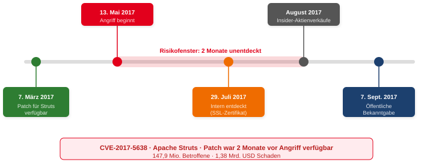
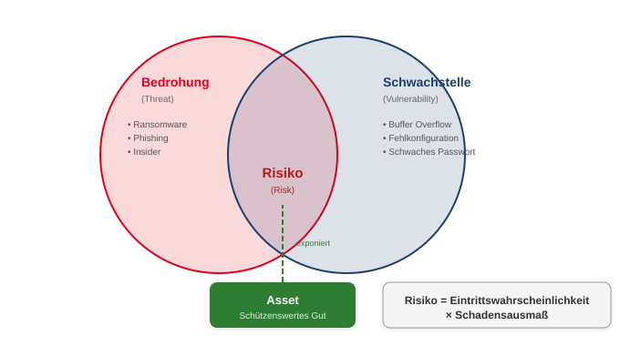
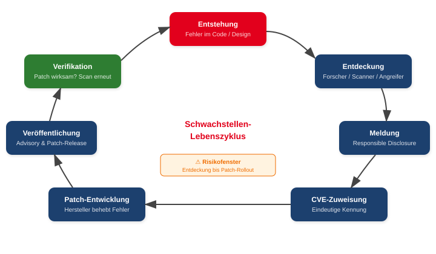
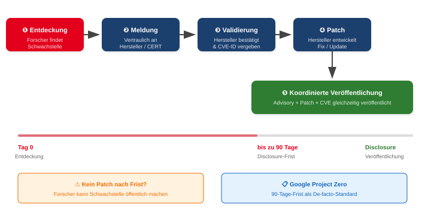
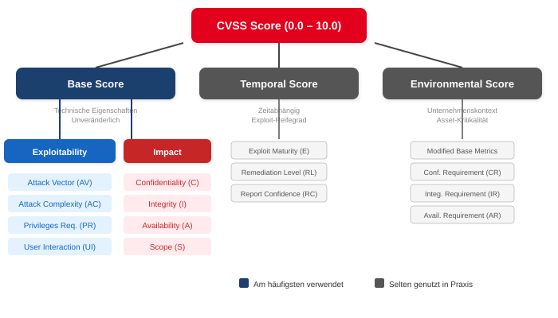

<style scoped>
p { text-align: center; }
</style>


---

<!-- _class: title -->
# Schwachstellen- & Patchmanagement

<br>
<br>
<br>
<br>
<br>
<br>

## Der Lebenszyklus einer Schwachstelle

---

<!-- _class: biglist -->
# Agenda

- Fallbeispiel: Der Equifax-Breach
- Was sind Schwachstellen?
- Schwachstellen finden und melden
- Coordinated Disclosure & Bug Bounties
- Rechtliche Rahmenbedingungen
- CVE, CVSS & Schwachstellenbewertung
- SBOM & Ausblick

<!-- _notes:
Die Vorlesung gliedert sich in sieben Blöcke. Wir starten mit einem Praxisfall, um die Relevanz des Themas greifbar zu machen, und arbeiten uns dann von den Grundlagen über die Bewertung bis hin zu aktuellen Entwicklungen vor. Am Ende soll klar sein, warum Schwachstellenmanagement kein rein technisches, sondern ein organisatorisches Thema ist.
-->

---

<!-- _class: chapter -->

# Equifax Data Breach (2017)

## Wenn ein Patch nicht eingespielt wird

<!-- _notes:
Der Equifax-Vorfall gilt als einer der bedeutendsten Datenschutzvorfälle der letzten Jahre. Equifax ist eines der drei großen US-Kreditbüros, die personenbezogene Finanzdaten sammeln. Der Fall zeigt exemplarisch, wie technische Schwachstellen, organisatorische Fehler und fehlende Sicherheitskultur zusammenwirken. Er ist der perfekte Einstieg für unsere Vorlesung.
-->

---

<!-- _class: biglist -->
# Überblick

- **Angriff:** Mai – Juli 2017
- **Bekanntgabe:** September 2017
- **Betroffene:**
  - 147,9 Mio. US-Amerikaner
  - 15,2 Mio. Briten
  - 19.000 Kanadier

<!-- _notes:
Der Angriff dauerte über zwei Monate und blieb unentdeckt. Fast die Hälfte der US-Bevölkerung war betroffen. Besonders kritisch: Die gestohlenen Daten – Sozialversicherungsnummern, Geburtsdaten – sind dauerhaft nutzbar und können nicht wie Passwörter einfach geändert werden. Das macht diesen Breach so verheerend.
-->

---

# Was ist passiert?

- Ausnutzung einer Schwachstelle in **Apache Struts** (CVE-2017-5638)
- Remote Code Execution (RCE) über manipulierte HTTP-Header
- Lateral Movement im internen Netzwerk
- Exfiltration sensibler Daten über Monate
- Angreifer vermutlich staatlich unterstützt (chin. Militär)

<!-- _notes:
Die Angreifer nutzten CVE-2017-5638 – eine Remote-Code-Execution-Schwachstelle in Apache Struts, einem Java-Framework für Webanwendungen. Die Schwachstelle erlaubte das Ausführen beliebigen Codes über einen manipulierten Content-Type-Header. Nach dem Eindringen bewegten sich die Angreifer lateral im Netzwerk und exfiltrierten Daten wie Sozialversicherungsnummern, Geburtsdaten und Führerscheinnummern. Die US-Justiz klagte später vier Mitglieder der chinesischen Volksbefreiungsarmee an.
-->

---

# Warum konnte es passieren?
## Technische Ursachen

- Patch für Apache Struts war **seit 2 Monaten verfügbar** – wurde nicht eingespielt
- **Abgelaufenes TLS-Zertifikat** → SSL-Inspection ausgefallen
- Fehlende **Netzwerksegmentierung** → freie Bewegung im Netz
- Datenbanken mit Klartext-Zugangsdaten

<!-- _notes:
Die zentrale technische Ursache war ein fehlendes Patch-Management. Der Patch existierte seit dem 7. März 2017, der Angriff begann am 13. Mai. Zusätzlich war ein internes TLS-Zertifikat seit 19 Monaten abgelaufen, wodurch die SSL-Inspection nicht funktionierte – das Monitoring konnte den Datenabfluss nicht erkennen. Fehlende Netzwerksegmentierung ermöglichte den Angreifern freie Bewegung im gesamten Netz.
-->

---

# Warum konnte es passieren?
## Organisatorische Ursachen

- Fehlende **Sicherheitskultur** – Patches hatten keine Priorität
- Unklare **Verantwortlichkeiten** für kritische Updates
- Mangelhafte **interne Kommunikation** über Schwachstellen-Alerts
- Schwache **Incident-Response-Prozesse** – Angriff blieb 78 Tage unentdeckt

<!-- _notes:
Neben Technik spielte die Organisation eine zentrale Rolle. Sicherheitskultur bedeutet, dass Sicherheit als strategische Priorität verstanden wird – bei Equifax war das nicht der Fall. Warnungen des US-CERT über die Struts-Schwachstelle erreichten nicht die zuständigen Teams. Incident-Response-Prozesse waren unzureichend definiert. Der Fall zeigt, dass Cybersecurity nicht nur ein technisches, sondern ein organisatorisches Problem ist.
-->

---

# Equifax – Zeitlicher Ablauf



<!-- _notes:
Diese Timeline zeigt die kritischen Ereignisse. Der Patch war seit März verfügbar, der Angriff startete im Mai. Erst Ende Juli wurde der Breach intern entdeckt – durch einen Zufall, weil ein abgelaufenes SSL-Zertifikat erneuert und die Inspection damit reaktiviert wurde. Bevor der Breach öffentlich wurde, verkauften Führungskräfte Aktien im Wert von fast 2 Millionen Dollar – was zu zusätzlichen Ermittlungen der SEC führte.
-->

---

# Auswirkungen

- **Identitätsdiebstahl** im großen Stil – Daten dauerhaft verwertbar
- Gesamtkosten: **1,38 Mrd. USD** (Strafen, Entschädigungen, Sicherheit)
- **Rücktritte** des CEO, CIO und CISO
- Verschärfte **regulatorische Auflagen** durch FTC
- Beschleuniger für Datenschutzgesetze (z. B. CCPA in Kalifornien)

<!-- _notes:
Die Auswirkungen waren enorm. Die gestohlenen Daten sind dauerhaft verwertbar, was ein lebenslanges Risiko für Kreditbetrug bedeutet. Equifax musste 1,38 Milliarden US-Dollar aufwenden. Der CEO, CIO und CISO traten zurück. Der Vorfall beschleunigte die Verabschiedung des California Consumer Privacy Act und führte zu verschärften Audits der FTC. Dies ist ein Lehrstück dafür, was passiert, wenn grundlegende Sicherheitsprozesse versagen.
-->

---

# Lessons Learned

- **Patch-Management ist sicherheitskritisch** – kein optionaler Prozess
- **Zertifikatsmanagement** nicht vernachlässigen – abgelaufene Zertifikate blenden Monitoring
- **Netzwerksegmentierung** begrenzt Schäden nach initialem Einbruch
- **Sicherheitskultur** muss organisatorisch verankert sein
- **Incident Response** braucht klare Prozesse und regelmäßige Übungen

<!-- _notes:
Der Equifax-Breach war kein hochkomplexer Angriff – die Schwachstelle war bekannt, der Patch verfügbar. Es war ein Versagen auf allen Ebenen: Technik, Prozesse, Kultur. Für uns als Sicherheitsexperten ist die wichtigste Erkenntnis: Grundlagen konsequent umzusetzen schützt besser als jedes Hightech-Tool. Im Folgenden schauen wir uns an, was Schwachstellen eigentlich sind und wie man mit ihnen umgeht.
-->

---

<!-- _class: chapter -->

# Was sind Schwachstellen?

## Definition, Arten und Lebenszyklus

<!-- _notes:
Nachdem wir gesehen haben, was passieren kann, wenn Schwachstellen nicht behandelt werden, definieren wir jetzt die Grundbegriffe. Was genau ist eine Schwachstelle? Welche Arten gibt es? Und wie sieht ihr Lebenszyklus aus?
-->

---

# Grundbegriffe

- **Schwachstelle (Vulnerability):** Fehler oder Eigenschaft eines Systems, die missbraucht werden kann
- **Exploit:** Konkretes Werkzeug oder Verfahren zur Ausnutzung einer Schwachstelle
- **Threat** (Bedrohung): Potenzieller Angreifer oder Angriffsvektor
- **Risk** (Risiko): Eintrittswahrscheinlichkeit × Schadensausmaß



<!-- _notes:
Drei Begriffe müssen wir sauber trennen. Eine Schwachstelle allein ist noch kein Risiko. Erst wenn eine Bedrohung auf eine Schwachstelle trifft und ein schützenswertes Asset exponiert ist, entsteht ein Risiko. Ein Exploit ist das konkrete Werkzeug, mit dem die Schwachstelle ausgenutzt wird. Das Diagramm zeigt diese Beziehung: Im Überlappungsbereich von Bedrohung und Schwachstelle liegt das Risiko – und es wird durch das exponierte Asset bestimmt.
-->

---

# Arten von Schwachstellen

| Kategorie | Beispiele |
|-----------|-----------|
| **Softwarefehler** | Buffer Overflow, SQL Injection, Logikfehler |
| **Fehlkonfigurationen** | Offene Ports, Standardpasswörter, Debug-Modi |
| **Designfehler** | Unsichere Protokolle, fehlende Verschlüsselung |
| **Organisatorisch** | Fehlende Prozesse, unklare Zuständigkeiten |
| **Menschlich** | Social Engineering, Phishing-Anfälligkeit |

<!-- _notes:
Schwachstellen sind vielfältig. Softwarefehler wie Buffer Overflows oder SQL Injections sind die bekanntesten. Aber auch Fehlkonfigurationen – ein offener Port, ein vergessenes Standardpasswort – sind Schwachstellen. Designfehler entstehen, wenn grundlegende Architekturentscheidungen unsicher sind, etwa die Nutzung von HTTP statt HTTPS. Organisatorische Schwachstellen wie fehlende Patch-Prozesse haben wir gerade bei Equifax gesehen. Menschliche Schwachstellen werden oft über Social Engineering ausgenutzt.
-->

---

# Zero-Day vs. bekannte Schwachstellen

| | **Zero-Day** | **Bekannte Schwachstelle** |
|---|---|---|
| **Status** | Hersteller weiß nichts davon | In CVE-Datenbank dokumentiert |
| **Patch** | Nicht verfügbar | Meist verfügbar |
| **Gefahr** | Extrem hoch – kein Schutz möglich | Hoch, wenn nicht gepatcht |
| **Preis** | Bis zu mehrere Mio. USD | Exploits oft frei verfügbar |
| **Beispiel** | Stuxnet (4 Zero-Days) | Equifax (CVE-2017-5638) |

<!-- _notes:
Der Unterschied zwischen Zero-Day und bekannter Schwachstelle ist entscheidend. Zero-Days sind unbekannt – es gibt keinen Patch und kaum Schutz. Auf dem Schwarzmarkt werden sie für hohe Summen gehandelt. Bekannte Schwachstellen sind dokumentiert und meist bereits gepatcht. Trotzdem werden sie am häufigsten ausgenutzt, weil viele Organisationen zu langsam patchen. Equifax ist das Paradebeispiel: Die Schwachstelle war bekannt, der Patch verfügbar – und wurde trotzdem nicht eingespielt.
-->

---

# Der Schwachstellen-Lebenszyklus



<!-- _notes:
Dieses Diagramm zeigt den typischen Lebenszyklus einer Schwachstelle. Sie entsteht als Fehler im Code oder Design. Irgendwann wird sie entdeckt – von Forschern, Scannern oder Angreifern. Im Idealfall folgt eine verantwortungsvolle Meldung an den Hersteller, eine CVE-Zuweisung, die Patch-Entwicklung und schließlich die koordinierte Veröffentlichung. Danach muss verifiziert werden, ob der Patch wirkt. Das orange markierte Risikofenster – die Zeit zwischen Entdeckung und Patch-Rollout – ist die gefährlichste Phase. Je kürzer dieses Fenster, desto besser.
-->

---

<!-- _class: chapter -->

# Schwachstellen finden

## Wer sucht – und wie?

<!-- _notes:
Jetzt, da wir wissen, was Schwachstellen sind, schauen wir uns an, wer sie findet und mit welchen Methoden. Die Akteure reichen von Sicherheitsforschern über Pentester bis hin zu Cyberkriminellen.
-->

---

# Wer sucht nach Schwachstellen?

<div class="columns">
<div>

## Sicherheitsforschende
- Analysieren Software, Protokolle, Hardware
- Ziel: Sicherheit verbessern, Reputation
- Veröffentlichung über CVE-Einträge

## Penetrationstester & Red Teams
- Arbeiten im Auftrag eines Unternehmens
- Simulieren reale Angriffe
- Finden technische und organisatorische Lücken

</div>
<div>

## Cyberkriminelle
- Finanzieller Gewinn, Erpressung, Spionage
- Entwickeln Exploits, verkaufen Zero-Days
- Professionell organisierte Gruppen

## Hersteller & Community
- Interne Security-Teams (PSIRT)
- Automatisierte Tests, Code-Reviews
- Open-Source: „Given enough eyeballs, all bugs are shallow"

</div>
</div>

<!-- _notes:
Vier Hauptgruppen suchen nach Schwachstellen. Sicherheitsforschende tun dies aus wissenschaftlichem Interesse oder für Reputation. Penetrationstester und Red Teams werden von Unternehmen beauftragt, um Schwachstellen kontrolliert zu finden. Cyberkriminelle suchen Schwachstellen zur Ausnutzung – sie verkaufen Zero-Days oder nutzen sie für Ransomware. Hersteller betreiben eigene PSIRTs – Product Security Incident Response Teams. In der Open-Source-Welt gilt Linus' Law: Je mehr Augen auf den Code schauen, desto schneller werden Fehler gefunden.
-->

---

<!-- _class: normal -->
# Motivation der Schwachstellensuche

| Motivation | Akteur | Beispiel |
|-----------|--------|---------|
| Sicherheit verbessern | Forscher, Hersteller | CVE-Veröffentlichung |
| Wissenschaft | Universitäten, Labs | Forschungspublikation |
| Bug-Bounty-Prämien | Freelancer, Forscher | HackerOne-Submission |
| Reputation | Forscher | DEF-CON-Talk, CVE-Credit |
| Finanzieller Gewinn | Kriminelle | Ransomware, Zero-Day-Verkauf |
| Staatliche Interessen | APT-Gruppen | Spionage, Sabotage |

<!-- _notes:
Die Motivation variiert stark. Forscher wollen Sicherheit verbessern oder publizieren. Bug-Bounty-Jäger verdienen Geld in einem legalen Rahmen. Kriminelle verkaufen Zero-Days oder setzen Ransomware ein. Staatliche Akteure wie APT-Gruppen suchen Schwachstellen für Spionage oder Sabotage – Stuxnet nutzte vier Zero-Days gleichzeitig. Diese Vielfalt erklärt, warum Schwachstellen sowohl verantwortungsvoll gemeldet als auch missbraucht werden.
-->

---

# Wie werden Schwachstellen gefunden?

<div class="columns">
<div>

## Automatisierte Methoden
- **Schwachstellenscanner:** Nessus, OpenVAS/Greenbone, Qualys
- **Netzwerkscanner:** Nmap + NSE-Skripte
- Vergleich mit CVE/NVD-Datenbanken
- Schnell, aber nur bekannte Schwachstellen

</div>
<div>

## Manuelle Methoden
- **Code-Review:** Statische Analyse des Quellcodes
- **Reverse Engineering:** Analyse von Binärdateien
- **Fuzzing:** Zufällige/manipulierte Eingaben (AFL, libFuzzer)
- **Logikfehleranalyse:** Nur manuell findbar

</div>
</div>

<!-- _notes:
Automatisierte Scanner wie Nessus oder OpenVAS vergleichen Softwareversionen und Konfigurationen mit CVE-Datenbanken. Sie sind schnell, finden aber nur bekannte Schwachstellen und keine Logikfehler. Manuelle Methoden gehen tiefer: Statische Codeanalyse untersucht Quellcode, Reverse Engineering analysiert Binärdateien. Fuzzing testet Programme mit zufälligen Eingaben, um Abstürze zu provozieren – moderne Fuzzer wie AFL nutzen Coverage-Feedback. Logikfehler – etwa eine fehlerhafte Berechtigungsprüfung – lassen sich meist nur manuell finden.
-->

---

# Penetrationstests & Monitoring

<div class="columns">
<div>

## Penetrationstests
- Kombination aus Tools und Kreativität
- Fokus auf reale Angriffsszenarien
- Tools: Metasploit, Burp Suite, Amass
- Ergebnis: Priorisierter Bericht mit Handlungsempfehlungen

</div>
<div>

## Betrieb & Monitoring
- Regelmäßige Sicherheitsüberprüfungen
- Log-Analyse und Konfigurationsprüfungen
- SIEM-Systeme (Splunk, Elastic Security)
- Compliance: DSGVO, NIS2, ISO 27001

</div>
</div>

<!-- _notes:
Penetrationstests sind die Königsdisziplin: Sie kombinieren automatisierte Tools mit menschlicher Kreativität. Ein Pentester bewertet nicht nur einzelne Schwachstellen, sondern auch Angriffsketten – mehrere kleine Schwachstellen können zusammen kritisch sein. Im laufenden Betrieb entstehen ständig neue Schwachstellen durch Fehlkonfigurationen oder Updates. SIEM-Systeme sammeln und korrelieren Logdaten, um Anomalien zu erkennen. Compliance-Anforderungen wie NIS2 verlangen regelmäßige Überprüfungen und dokumentierte Prozesse.
-->

---

<!-- _class: chapter -->

# Schwachstellen melden

## Der verantwortungsvolle Weg

<!-- _notes:
Wir wissen jetzt, wer Schwachstellen sucht und wie. Die nächste entscheidende Frage ist: Was macht man, wenn man eine findet? Es gibt klare Regeln und etablierte Prozesse – und auch Fallstricke.
-->

---

# Was tun, wenn ich eine Schwachstelle finde?

## 1. Dokumentieren
- Reproduktionsschritte festhalten
- Umgebung und Versionen notieren
- Auswirkungen beschreiben (CIA-Triade)

## 2. Nicht ausnutzen!
- Keine Daten exfiltrieren
- Keine Systeme verändern
- Minimaler Proof of Concept genügt

## 3. Verantwortungsvoll melden
- Hersteller, CERT/BSI oder Bug-Bounty-Programm kontaktieren

<!-- _notes:
Drei goldene Regeln beim Fund einer Schwachstelle: Erstens gründlich dokumentieren – Reproduktionsschritte, betroffene Versionen, mögliche Auswirkungen. Zweitens: Niemals über das Minimum hinausgehen. Ein Proof of Concept darf zeigen, dass die Schwachstelle existiert, aber keinen Schaden anrichten. Drittens: Verantwortungsvoll melden – an den Hersteller direkt, an ein CERT oder über ein Bug-Bounty-Programm. Ohne Erlaubnis testen kann strafbar sein – dazu später mehr.
-->

---

# Coordinated Disclosure



<!-- _notes:
Das Diagramm zeigt den Ablauf einer koordinierten Offenlegung. Der Forscher meldet die Schwachstelle vertraulich an den Hersteller. Dieser bestätigt und validiert sie, eine CVE-ID wird zugewiesen. Dann entwickelt der Hersteller einen Patch. Nach einer vereinbarten Frist – typischerweise 90 Tage, wie bei Google Project Zero – werden Advisory, Patch und CVE gleichzeitig veröffentlicht. Wenn der Hersteller nach der Frist keinen Patch liefert, kann der Forscher die Schwachstelle öffentlich machen. Dieses Verfahren ist heute De-facto-Standard.
-->

---

# Disclosure-Modelle im Vergleich

| | **Coordinated Disclosure** | **Full Disclosure** |
|---|---|---|
| **Ablauf** | Vertrauliche Meldung → Frist → Patch → Veröffentlichung | Sofortige öffentliche Veröffentlichung |
| **Vorteil** | Hersteller kann patchen, Nutzer geschützt | Maximaler Druck auf Hersteller |
| **Risiko** | Hersteller ignoriert Meldung | Nutzer ungeschützt, Exploits sofort nutzbar |
| **Standard** | Google Project Zero (90 Tage), CERT/CC | Heute eher unüblich |
| **Beispiel** | Die meisten CVE-Veröffentlichungen | Bugtraq-Mailing-Liste (historisch) |

<!-- _notes:
Es gibt zwei grundlegende Modelle. Coordinated Disclosure – früher Responsible Disclosure genannt – gibt dem Hersteller Zeit zum Patchen. Full Disclosure veröffentlicht sofort und setzt den Hersteller unter maximalen Druck, birgt aber das Risiko, dass Angreifer die Schwachstelle vor einem Patch ausnutzen. Heute dominiert Coordinated Disclosure mit klaren Fristen. Google Project Zero hat die 90-Tage-Frist als Standard etabliert. NIS2 fordert in Artikel 12 explizit koordinierte Offenlegungsprozesse in allen EU-Mitgliedstaaten.
-->

---

<!-- _class: normal -->
# Meldewege für Schwachstellen

## Direkt beim Hersteller
- Security-Kontaktadresse (`security@...`), Vulnerability Disclosure Policy (VDP)

## Nationale Stellen
- **BSI CERT-Bund** (Deutschland), **CERT/CC** (USA)
- Vermitteln zwischen Forschern und Herstellern

## Bug-Bounty-Plattformen
- **HackerOne** – Größte Plattform (Meta, Uber, US-Regierung)
- **Bugcrowd** – Crowd-Security-Testing
- **Intigriti** / **YesWeHack** – EU-Fokus, DSGVO-konform

<!-- _notes:
Es gibt drei Hauptwege zur Meldung. Erstens direkt beim Hersteller – die meisten haben inzwischen eine Security-Kontaktadresse oder eine Vulnerability Disclosure Policy. Zweitens über nationale CERTs wie CERT-Bund beim BSI – diese vermitteln, wenn der Hersteller nicht reagiert. Drittens über Bug-Bounty-Plattformen wie HackerOne oder YesWeHack, die einen legalen Rahmen, transparente Regeln und oft finanzielle Prämien bieten. Für EU-Unternehmen sind Intigriti und YesWeHack interessant, weil sie DSGVO-konform arbeiten.
-->

---

# Bug-Bounty-Programme & Wettbewerbe

<div class="columns">
<div>

## Bug Bounties
- Hersteller zahlen Belohnungen für Schwachstellen
- Höhe abhängig von Kritikalität und Produkt
- Legaler Rahmen, transparente Regeln
- Hall of Fame & Reputation
- Beispiel: Google zahlt bis 250.000 USD für Chrome-Exploits

</div>
<div>

## Exploit-Wettbewerbe
- **Pwn2Own** (ZDI/Trend Micro): Live-Exploits gegen Browser, VMs, Automotive
- Preisgelder >1 Mio. USD pro Event
- **DEF CON CTF**, **ECSC**, **Hack-a-Sat**
- Fokus: Exploitation, Reverse Engineering, Kryptographie
- Strenger legaler Rahmen

</div>
</div>

<!-- _notes:
Bug-Bounty-Programme sind ein etablierter Weg, um Schwachstellen verantwortungsvoll zu monetarisieren. Die Prämien variieren stark – von einigen hundert Dollar für XSS bis zu sechsstelligen Beträgen für kritische Remote-Code-Execution. Pwn2Own ist der bekannteste Exploit-Wettbewerb: Teams demonstrieren live Exploits gegen aktuelle Software. Die Schwachstellen werden an die Hersteller gemeldet, die dann patchen. Wettbewerbe wie DEF CON CTF oder die European Cyber Security Challenge fördern den Nachwuchs. All diese Formate haben eines gemeinsam: Sie bieten einen legalen Rahmen für Sicherheitsforschung.
-->

---

# Ablauf einer Schwachstellenmeldung

1. **Einreichung** der Schwachstelle (Beschreibung, PoC, betroffene Version)
2. **Bestätigung** (Acknowledgement) durch Hersteller / Plattform
3. **Validierung** durch das Security-Team
4. **Priorisierung** – CVSS-Score wird vergeben
5. **Patch-Entwicklung** durch den Hersteller
6. **Koordinierte Veröffentlichung** (Advisory, CVE, Patch gleichzeitig)
7. **Belohnung** (Bug Bounty, Credits, Hall of Fame)

<!-- _notes:
Der typische Ablauf einer Schwachstellenmeldung folgt diesen sieben Schritten. Nach der Einreichung bestätigt der Hersteller oder die Plattform den Eingang. Das Security-Team validiert die Schwachstelle – ist sie reproduzierbar? Dann wird ein CVSS-Score vergeben und priorisiert. Der Hersteller entwickelt einen Patch und veröffentlicht diesen koordiniert mit einem Advisory und der CVE-Zuweisung. Am Ende steht oft eine Belohnung – sei es Prämie, Credit oder Aufnahme in die Hall of Fame.
-->

---

<!-- _class: chapter -->

# Rechtliche Rahmenbedingungen

## Der Hackerparagraph und seine Folgen

<!-- _notes:
Nachdem wir gesehen haben, wie Schwachstellen gefunden und gemeldet werden, müssen wir über die rechtlichen Rahmenbedingungen sprechen. In Deutschland gibt es den umstrittenen Hackerparagraphen, der Sicherheitsforschung unter bestimmten Umständen unter Strafe stellen kann. Dieses Wissen ist essentiell für jeden, der in der IT-Sicherheit arbeitet.
-->

---

<!-- _class: biglist -->
# Der „Hackerparagraph" (§ 202c StGB)

- § 202c StGB stellt das **Vorbereiten des Ausspähens und Abfangens von Daten** unter Strafe
- Betroffen sind u. a. Werkzeuge, die *zur Begehung* solcher Taten bestimmt sind
- Strafbarkeit bereits **vor** einer eigentlichen Tat (Vorbereitungshandlung)
- Für Security-Research führt das zu erheblicher **Rechtsunsicherheit**

<!-- _notes:
Der Paragraf 202c StGB wurde 2007 eingeführt, um Cyberkriminalität einzudämmen. Er stellt das Herstellen, Beschaffen oder Verbreiten von Passwörtern und Hacker-Tools unter Strafe – bereits als Vorbereitungshandlung, also bevor ein eigentlicher Angriff stattfindet. Das Problem: Die Abgrenzung zwischen legitimen Security-Tools und verbotenen Werkzeugen ist unscharf. Ein Tool wie Nmap oder Metasploit kann sowohl für legale Pentests als auch für Angriffe verwendet werden. Das Bundesverfassungsgericht hat zwar klargestellt, dass die Absicht entscheidend ist, aber Unsicherheit bleibt.
-->

---

# Auswirkungen auf die Praxis

| Bereich | Problem |
|---------|---------|
| **Toolnutzung** | Rechtsunsicherheit bei Nmap, Metasploit, Hashcat, Burp Suite |
| **Forschung & Lehre** | Risiko, als Vorbereitungshandlung interpretiert zu werden |
| **Responsible Disclosure** | Forscher befürchten, selbst ins Visier zu geraten |
| **Unternehmen** | Verlangen formale Freigaben und Verträge für Pentests |
| **Community** | Hemmnis für offene Sicherheitsforschung in Deutschland |

<!-- _notes:
In der Praxis führt der Hackerparagraph zu konkreten Problemen. Sicherheitsforscher riskieren Strafverfolgung, wenn sie Schwachstellen melden – es gibt dokumentierte Fälle, in denen Forscher angezeigt wurden, obwohl sie verantwortungsvoll handelten. Unternehmen verlangen heute aufwändige Verträge und Freigaben für Penetrationstests. Die Community diskutiert seit Jahren über eine Präzisierung des Gesetzes. Im internationalen Vergleich steht Deutschland damit schlecht da – andere Länder haben klarere Regelungen für Security-Research.
-->

---

# Strategien für Forschung & Praxis

- Klare **Zweckbindung** dokumentieren (Forschung, Lehre, Auftrag)
- Nutzung von **Testumgebungen**, CTFs und isolierten Laboren
- Schriftliche **Einwilligungen** und Verträge bei realen Systemen
- Austausch in der Community über Best Practices
- **NIS2 Art. 12:** EU fordert koordinierte Offenlegungsprozesse in allen Mitgliedstaaten
- Politische Diskussion über eine **Präzisierung** des Gesetzes hält an

<!-- _notes:
Als Sicherheitsforscher oder Pentester sollte man sich absichern. Erstens: Zweck dokumentieren – warum nutze ich dieses Tool? Zweitens: Testumgebungen nutzen – CTFs und Labs sind legal. Drittens: Bei realen Systemen immer schriftliche Einwilligungen einholen. NIS2 bringt einen wichtigen Fortschritt: Artikel 12 fordert von allen EU-Mitgliedstaaten die Einrichtung koordinierter Offenlegungsprozesse. Das könnte langfristig auch die deutsche Rechtslage klären. Die politische Diskussion über eine Reform des Hackerparagraphen läuft.
-->

---

<!-- _class: chapter -->

# CVE & Schwachstellenbewertung

## Standardisierte Identifikation und Scoring

<!-- _notes:
Jetzt kommen wir zur systematischen Seite: Wie werden Schwachstellen eindeutig identifiziert und bewertet? Dafür gibt es zwei zentrale Standards: CVE für die Identifikation und CVSS für die Bewertung. Beide sind essenziell für das Schwachstellenmanagement.
-->

---

<!-- _class: normal -->
# CVE – Common Vulnerabilities and Exposures

- **Öffentliches Verzeichnis** für bekannte Schwachstellen
- Jede Schwachstelle erhält eine **eindeutige ID:** `CVE-YYYY-NNNNN`
- Beispiele:
  - `CVE-2017-5638` – Apache Struts (Equifax)
  - `CVE-2021-44228` – Log4Shell
  - `CVE-2024-3094` – XZ Utils Backdoor
- **CVE-Einträge enthalten:** Kurzbeschreibung, betroffene Produkte, Referenzen
- Herausgeber: **MITRE Corporation** + internationale Partner

<!-- _notes:
CVE – Common Vulnerabilities and Exposures – ist das globale Verzeichnis für Schwachstellen. Jede Schwachstelle bekommt eine eindeutige Kennung im Format CVE-Jahr-Nummer. Die Idee ist einfach, aber entscheidend: Wenn verschiedene Tools und Teams über dieselbe Schwachstelle sprechen, brauchen sie eine einheitliche Bezeichnung. CVE löst genau dieses Problem. Die Einträge enthalten eine Kurzbeschreibung, betroffene Produkte und Referenzen zu Advisories und Patches. Verwaltet wird das System von der MITRE Corporation.
-->

---

# Wie entsteht ein CVE-Eintrag?

1. **Entdeckung** – durch Forscher, Hersteller oder Bug-Bounty-Programme
2. **Meldung an eine CNA** – CVE Numbering Authority (z. B. Microsoft, Red Hat, Apache)
3. **Zuweisung einer CVE-ID** – eindeutige Kennung, oft vor Veröffentlichung
4. **Validierung & Veröffentlichung** – Beschreibung, Referenzen, Schweregrad
5. **Nutzung durch Security-Tools** – Scanner, Advisories, Patchmanagement

> Weltweit über **300 CNAs** in mehr als 40 Ländern (Stand 2026)

<!-- _notes:
Ein CVE-Eintrag entsteht in fünf Schritten. Nach der Entdeckung wird die Schwachstelle an eine CNA gemeldet – eine CVE Numbering Authority. Große Hersteller wie Microsoft, Google oder Red Hat sind selbst CNAs und vergeben CVE-IDs für ihre Produkte. Die ID wird oft schon vergeben, bevor die Schwachstelle öffentlich ist – das ermöglicht koordinierte Disclosure. Nach der Validierung wird der Eintrag veröffentlicht und von Security-Tools wie Scannern, SIEM-Systemen und Patchmanagement-Lösungen genutzt.
-->

---

# NVD & KEV – Ergänzende Datenbanken

<div class="columns">
<div>

## NVD – National Vulnerability Database
- Betrieben vom **NIST** (USA)
- Ergänzt CVE-Einträge um:
  - **CVSS-Scores**
  - CPE (Common Platform Enumeration)
  - Referenzen zu Patches
- Wichtigste Quelle für Scanner-Datenbanken

</div>
<div>

## KEV – Known Exploited Vulnerabilities
- Katalog der **CISA** (USA)
- Enthält nur Schwachstellen, die **aktiv ausgenutzt** werden
- Verpflichtend für US-Bundesbehörden
- Best Practice: KEV als Prioritätsliste nutzen
- Aktuell >1.200 Einträge

</div>
</div>

<!-- _notes:
Neben CVE gibt es zwei wichtige ergänzende Datenbanken. Die NVD – National Vulnerability Database – wird vom NIST betrieben und ergänzt CVE-Einträge um CVSS-Scores und CPE-Referenzen. Sie ist die wichtigste Quelle für Schwachstellenscanner. Der KEV-Katalog der CISA ist neuer und fokussierter: Er enthält nur Schwachstellen, die nachweislich aktiv ausgenutzt werden. US-Bundesbehörden sind verpflichtet, KEV-Schwachstellen innerhalb definierter Fristen zu patchen. Auch für nicht-US-Organisationen ist KEV eine exzellente Prioritätsliste.
-->

---

<!-- _class: chapter -->

# CVSS

## Standardisierte Bewertung von Schwachstellen

<!-- _notes:
CVE identifiziert Schwachstellen – aber wie kritisch sind sie? Dafür gibt es CVSS, das Common Vulnerability Scoring System. Es liefert einen numerischen Score, der die Schwere einer Schwachstelle beschreibt. Wir schauen uns an, wie CVSS funktioniert, was es gut macht und wo seine Grenzen liegen.
-->

---

# Was ist CVSS?

> **Common Vulnerability Scoring System** – ein offener Standard zur Bewertung der Schwere von Sicherheitslücken.

- Entwickelt vom **NIST**, gepflegt durch **FIRST**
- Aktuelle Versionen: **CVSS v3.1** (2019), **CVSS v4.0** (2023)
- Score von **0.0 – 10.0**

| Score | Schweregrad |
|-------|-------------|
| 0.0 | None |
| 0.1 – 3.9 | Low |
| 4.0 – 6.9 | Medium |
| 7.0 – 8.9 | High |
| 9.0 – 10.0 | Critical |

<!-- _notes:
CVSS liefert einen Score zwischen 0 und 10, der die technische Schwere einer Schwachstelle beschreibt. Der Standard wird vom FIRST – Forum of Incident Response and Security Teams – gepflegt. Die aktuelle Version 3.1 ist seit 2019 am weitesten verbreitet, CVSS 4.0 wurde 2023 veröffentlicht und integriert erstmals Threat-Intelligence-Metriken. Wichtig: CVSS misst Schwere, nicht Risiko. Ein CVSS-Score von 9.8 bedeutet nicht, dass Sie gehackt werden – und ein Score von 2.0 bedeutet nicht, dass Sie sicher sind.
-->

---

# CVSS-Metrikgruppen im Überblick



<!-- _notes:
CVSS besteht aus drei Metrikgruppen. Der Base Score beschreibt die unveränderlichen technischen Eigenschaften – er ist am wichtigsten und wird am häufigsten zitiert. Er setzt sich aus Exploitability-Metriken und Impact-Metriken zusammen. Der Temporal Score berücksichtigt zeitabhängige Faktoren wie die Verfügbarkeit von Exploits oder Patches. Der Environmental Score passt die Bewertung an den Unternehmenskontext an. In der Praxis werden Temporal und Environmental leider selten genutzt – ein bekanntes Problem von CVSS.
-->

---

# Base Score – Exploitability Metrics

Beschreibt, **wie leicht** eine Schwachstelle ausgenutzt werden kann.

| Metrik | Kürzel | Werte | Erklärung |
|--------|--------|-------|-----------|
| Attack Vector | AV | N / A / L / P | Netzwerk → Lokal → Physisch |
| Attack Complexity | AC | L / H | Wie komplex ist der Angriff? |
| Privileges Required | PR | N / L / H | Keine → Nutzer → Admin-Rechte |
| User Interaction | UI | N / R | Muss ein Nutzer mitwirken? |

> **Grundregel:** Je weniger Voraussetzungen, desto höher der Score.

<!-- _notes:
Die Exploitability-Metriken beschreiben die Angriffsoberfläche. Attack Vector gibt an, von wo aus der Angriff möglich ist – Netzwerk ist am schlimmsten, physischer Zugang am wenigsten kritisch. Attack Complexity beschreibt die Komplexität – Low bedeutet, der Angriff funktioniert ohne besondere Bedingungen. Privileges Required gibt an, ob ein Account nötig ist. User Interaction beschreibt, ob ein Nutzer aktiv mitwirken muss, etwa einen Link klicken. Die Grundregel ist einfach: Je weniger Voraussetzungen ein Angriff braucht, desto höher der Score.
-->

---

# Base Score – Impact Metrics

Beschreibt, **welchen Schaden** eine erfolgreiche Ausnutzung anrichtet (CIA-Triade).

| Metrik | Kürzel | Werte | Erklärung |
|--------|--------|-------|-----------|
| Confidentiality | C | N / L / H | Verlust von Vertraulichkeit |
| Integrity | I | N / L / H | Verlust von Integrität |
| Availability | A | N / L / H | Verlust von Verfügbarkeit |
| Scope | S | U / C | Bleibt Schaden im System oder springt er über? |

> **Scope Changed** (C) erhöht den Score deutlich – z. B. VM-Escape, Container-Breakout

<!-- _notes:
Die Impact-Metriken bilden die CIA-Triade ab: Vertraulichkeit, Integrität und Verfügbarkeit. Jede kann None, Low oder High betroffen sein. Der Scope ist besonders wichtig: Unchanged bedeutet, der Schaden bleibt im angegriffenen System. Changed bedeutet, der Angriff wirkt sich auf andere Systeme aus – etwa ein VM-Escape, bei dem ein Angreifer aus einer virtuellen Maschine auf den Host ausbricht. Scope Changed erhöht den Score deutlich und ist bei den gefährlichsten Schwachstellen wie Log4Shell der Fall.
-->

---

# Praxisbeispiel: Log4Shell (CVE-2021-44228)
## CVSS v3.1 Score: **10.0 (Critical)**

```
CVSS:3.1/AV:N/AC:L/PR:N/UI:N/S:C/C:H/I:H/A:H
```

| Parameter | Wert | Warum? |
|-----------|------|--------|
| Attack Vector | Network (N) | Über HTTP-Request auslösbar |
| Attack Complexity | Low (L) | Trivial auszunutzen – ein String genügt |
| Privileges Required | None (N) | Kein Login nötig |
| User Interaction | None (N) | Vollautomatisch |
| Scope | Changed (C) | JNDI-Lookup → RCE auf anderem System |
| C / I / A | High / High / High | Vollständige Kompromittierung |

<!-- _notes:
Log4Shell ist das Lehrbuchbeispiel für eine 10.0-Schwachstelle. Der CVSS-String zeigt warum: Über das Netzwerk angreifbar, trivial auszunutzen, kein Login nötig, keine Nutzerinteraktion erforderlich, und der Scope ist Changed – der JNDI-Lookup führt zu Remote Code Execution auf einem anderen System. Alle drei Impact-Metriken stehen auf High. Lesen Sie den CVSS-String: AV:N/AC:L/PR:N/UI:N = maximale Ausnutzbarkeit. S:C/C:H/I:H/A:H = maximaler Impact mit Scope Change. Zusammen ergibt das den höchstmöglichen Score.
-->

---

# Temporal & Environmental Score
<!-- _class: normal -->
## Temporal Score – zeitabhängige Faktoren

| Metrik | Bedeutung |
|--------|-----------|
| Exploit Code Maturity (E) | Gibt es funktionierenden Exploit-Code? |
| Remediation Level (RL) | Existiert ein offizieller Patch / Workaround? |
| Report Confidence (RC) | Wie verlässlich ist der Bericht? |

> Temporal Score **≤ Base Score** – er kann den Wert nur senken.

## Environmental Score – Unternehmenskontext
- Wie kritisch ist das **betroffene Asset** im eigenen Kontext?
- Gibt es bereits **Mitigationsmaßnahmen** (WAF, Segmentierung)?
- Anpassung über Confidentiality / Integrity / Availability Requirements

<!-- _notes:
Der Temporal Score berücksichtigt, ob es bereits Exploit-Code gibt, ob ein Patch verfügbar ist und wie verlässlich der Bericht ist. Der Environmental Score passt die Bewertung an den Unternehmenskontext an – ein Webserver mit Kundendaten hat höhere Anforderungen an Vertraulichkeit als ein interner Testserver. Beide Scores können den Base Score nur senken, nie erhöhen. In der Praxis werden sie leider selten genutzt – die meisten Organisationen arbeiten nur mit dem Base Score, was zu Fehlpriorisierungen führen kann.
-->

---

# Kritik an CVSS

<div class="columns">
<div>

## Technische Schwächen
- **Keine Kontextualisierung** – AV:N/AC:L klingt schlimm, aber ist das System überhaupt erreichbar?
- **Score-Inflation** – >50% aller CVEs sind High/Critical
- **Pseudopräzision** – 7.5 vs. 7.8 praktisch identisch
- **Kettenangriffe** – Mehrere „Low"-Schwachstellen kombiniert = Critical

</div>
<div>

## Praktische Schwächen
- **Temporal/Environmental** werden kaum genutzt
- **Subjektivität** – verschiedene Bewerter, verschiedene Scores
- **Keine Exploitwahrscheinlichkeit** – CVSS misst Schwere, nicht Risiko
- **Missbrauch als KPI** – „Alle Criticals patchen" → Fehlanreize

</div>
</div>

> *„A CVSS score of 9.8 does not mean you will be hacked. A score of 2.0 does not mean you won't."*

<!-- _notes:
CVSS hat bekannte Schwächen. Die fehlende Kontextualisierung ist das Hauptproblem: Ein Score sagt nichts darüber aus, ob die Schwachstelle in Ihrem Netzwerk überhaupt erreichbar ist. Score-Inflation macht Priorisierung schwieriger – wenn alles Critical ist, ist nichts Critical. Kettenangriffe werden nicht berücksichtigt: Mehrere Low-Schwachstellen können zusammen verheerend sein. Der wichtigste Punkt: CVSS misst technische Schwere, nicht Ausnutzungswahrscheinlichkeit. Deshalb brauchen wir ergänzende Systeme.
-->

---

# Ergänzungen zu CVSS: EPSS & SSVC

| System | Ansatz | Stärke |
|--------|--------|--------|
| **EPSS** | Wahrscheinlichkeit der Ausnutzung in 30 Tagen (0–100%) | Datengetrieben, ML-basiert |
| **SSVC** | Entscheidungsbaum: Exploit-Status → Exposure → Impact → Aktion | Kontextabhängig, handlungsorientiert |
| **CVSS v4.0** | Neue Supplemental-Metriken, Threat Intelligence | Standardisiert, evolutionär |

> **Best Practice:** CVSS Base Score + EPSS kombinieren
> → Hoher Schweregrad **und** hohe Ausnutzungswahrscheinlichkeit = höchste Priorität

<!-- _notes:
Drei Systeme ergänzen CVSS sinnvoll. EPSS – das Exploit Prediction Scoring System – nutzt Machine Learning, um die Wahrscheinlichkeit einer Ausnutzung in den nächsten 30 Tagen vorherzusagen. SSVC – Stakeholder-Specific Vulnerability Categorization – nutzt Entscheidungsbäume und liefert konkrete Handlungsempfehlungen statt nur Zahlen. CVSS 4.0 integriert erstmals Threat Intelligence. Die Best Practice heute: CVSS und EPSS kombinieren. Eine Schwachstelle mit CVSS 9.8 aber EPSS 0.1% ist weniger dringend als eine mit CVSS 7.0 und EPSS 90%.
-->

---

<!-- _class: chapter -->

# SBOM

## Software Bill of Materials

<!-- _notes:
Zum Abschluss des theoretischen Teils ein Thema, das in den letzten Jahren enorm an Bedeutung gewonnen hat: SBOM, die Software Bill of Materials. Die Idee ist einfach, die Auswirkungen sind weitreichend – besonders durch neue Regulierungen wie den Cyber Resilience Act.
-->

---

# Was ist eine SBOM?

- **Software Bill of Materials** = Stückliste aller Komponenten einer Software
- Listet alle Abhängigkeiten, Versionen und Lizenzen auf
- Analog zur Zutatenliste bei Lebensmitteln

## Warum ist das relevant für Schwachstellenmanagement?

- **Log4Shell-Frage:** „Nutzen wir Log4j?" – ohne SBOM oft nicht beantwortbar
- Automatischer Abgleich von SBOM gegen CVE/NVD-Datenbanken
- Schnelle Identifikation betroffener Systeme bei neuen Schwachstellen
- Formate: **SPDX** (ISO-Standard), **CycloneDX** (OWASP)

<!-- _notes:
Eine SBOM ist eine vollständige Liste aller Softwarekomponenten – inklusive Bibliotheken, Frameworks und deren Versionen. Das klingt trivial, ist aber in der Praxis eine der größten Herausforderungen. Als Log4Shell bekannt wurde, konnten viele Organisationen nicht beantworten, ob sie Log4j nutzen – weil sie keine SBOM hatten. Mit einer SBOM kann man automatisiert abgleichen, ob bekannte Schwachstellen in den eigenen Komponenten stecken. Der Cyber Resilience Act der EU wird SBOMs für viele Produkte verpflichtend machen.
-->

---

# SBOM & Regulierung

- **Cyber Resilience Act (CRA)** der EU: SBOM wird für viele Produkte verpflichtend
- **NIS2:** Lieferkettensicherheit explizit gefordert
- **US Executive Order 14028:** SBOM-Anforderung für Bundesbeschaffung
- **BSI TR-03183:** Technische Richtlinie für Cyber-Resilienz-Anforderungen

## Auswirkung auf die Praxis
- Hersteller müssen SBOMs bereitstellen
- Betreiber können Schwachstellen in Zukaufsoftware schneller identifizieren
- Automatisierte Schwachstellenerkennung in der Lieferkette

<!-- _notes:
SBOM ist nicht mehr optional. Der Cyber Resilience Act der EU wird Hersteller verpflichten, SBOMs für ihre Produkte bereitzustellen. NIS2 fordert explizit Lieferkettensicherheit. In den USA hat eine Executive Order von 2021 SBOMs für Bundesbeschaffung bereits vorgeschrieben. Das BSI hat mit TR-03183 eine technische Richtlinie veröffentlicht. Für Unternehmen bedeutet das: Sie müssen sowohl eigene SBOMs erstellen als auch die SBOMs ihrer Zulieferer auswerten können. Das Schwachstellenmanagement der Zukunft ist ohne SBOM nicht denkbar.
-->

---

<!-- _class: chapter -->

# Zusammenfassung

## Die wichtigsten Erkenntnisse

<!-- _notes:
Fassen wir die zentralen Punkte der heutigen Vorlesung zusammen.
-->

---

# Zusammenfassung

| Thema | Kernaussage |
|-------|-------------|
| **Equifax** | Grundlegende Versäumnisse verursachen katastrophale Schäden |
| **Schwachstellenarten** | Software, Konfiguration, Design, Organisation, Mensch |
| **Lebenszyklus** | Entstehung → Entdeckung → Meldung → CVE → Patch → Verifikation |
| **Disclosure** | Koordiniert melden, 90-Tage-Frist, nie ohne Erlaubnis testen |
| **§ 202c StGB** | Rechtsunsicherheit für Forscher, Zweckbindung dokumentieren |
| **CVE & CVSS** | Standardisierte Identifikation und Bewertung |
| **CVSS-Grenzen** | Schwere ≠ Risiko, EPSS + SSVC als Ergänzung |
| **SBOM** | Wird durch CRA/NIS2 verpflichtend, essentiell für Supply-Chain-Security |

<!-- _notes:
Die wichtigsten Takeaways: Equifax zeigt, was passiert, wenn Basics versagen. Der Schwachstellen-Lebenszyklus gibt uns einen strukturierten Rahmen. Coordinated Disclosure ist der Standard für verantwortungsvolle Meldung. Der Hackerparagraph erzeugt Unsicherheit, die sich aber mit klarer Dokumentation und Verträgen handhaben lässt. CVE und CVSS sind unverzichtbare Standards, haben aber Grenzen – deshalb ergänzen wir sie mit EPSS und SSVC. Und SBOMs werden durch europäische Regulierung verpflichtend und transformieren das Schwachstellenmanagement in der Lieferkette.
-->

---

# Diskussionsfragen

1. **Equifax hatte 2 Monate Zeit zum Patchen.** Warum scheitern Organisationen trotzdem regelmäßig am Patch-Management?

2. **Der Hackerparagraph kriminalisiert potenziell Security-Research.** Wie sollte eine moderne Gesetzgebung aussehen?

3. **CVSS-Score-Inflation:** Wenn >50% aller CVEs als High/Critical eingestuft werden – wie priorisiert man sinnvoll?

4. **SBOMs werden verpflichtend.** Was bedeutet das für kleine Softwareunternehmen und Open-Source-Projekte?

5. **Sollte es eine Meldepflicht für Schwachstellen geben**, vergleichbar mit der DSGVO-Meldepflicht für Datenpannen?

<!-- _notes:
Diese Fragen eignen sich für eine abschließende Diskussion oder als Denkanstoß für die nächste Sitzung. Jede Frage verbindet einen Vorlesungsinhalt mit einer praktischen oder gesellschaftlichen Dimension. Frage 1 zielt auf organisatorische Hürden beim Patching. Frage 2 adressiert die Spannungsfelder im Recht. Frage 3 erfordert kritisches Denken über Metriken. Frage 4 berührt die wirtschaftliche Realität von Regulierung. Frage 5 öffnet eine Debatte über Verantwortung und Transparenz.
-->

---
