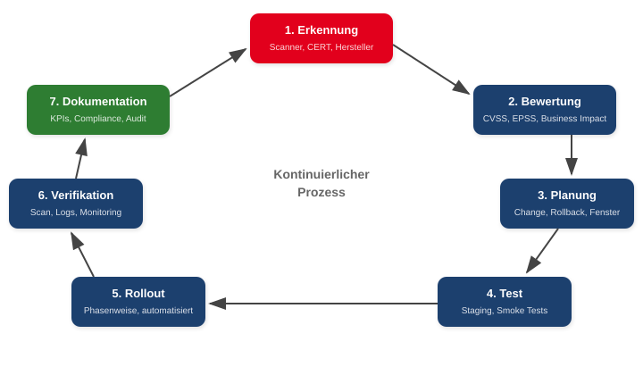
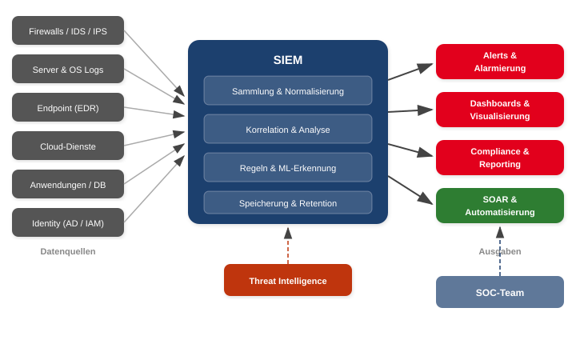
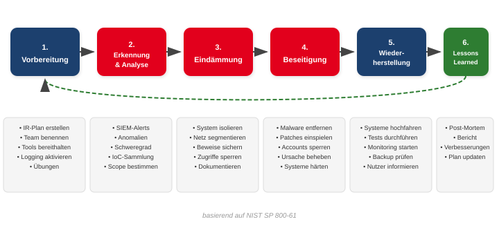
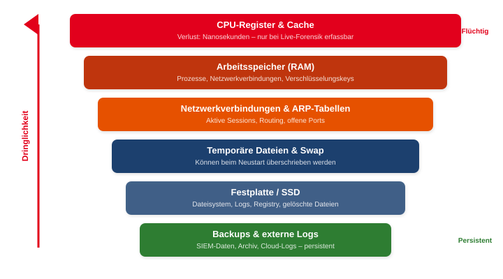

<!-- _class: title -->

# Schwachstellen-management

 
 
 
 
 

## Verteidigung, Erkennung & Reaktion

<!-- _notes:
Willkommen zur zweiten Vorlesung zum Schwachstellenmanagement. Letzte Woche haben wir den Lebenszyklus einer Schwachstelle betrachtet – von der Entstehung über die Bewertung mit CVE und CVSS bis zur SBOM. Heute geht es um die operative Seite: Wie patchen wir Schwachstellen? Wie erkennen wir Angriffe? Und wie reagieren wir, wenn es trotzdem passiert? Die drei Säulen dieser Vorlesung sind Patch-Management, SIEM und Incident Response.
-->

---

<!-- _class: biglist -->

# Agenda

1. Patch-Management – Schwachstellen schließen
2. SIEM – Angriffe erkennen
3. Digitale Forensik & Incident Response – richtig reagieren
4. Zusammenfassung & Diskussion

<!-- _notes:
Die Vorlesung folgt der logischen Reihenfolge: Zuerst die proaktive Verteidigung durch Patching, dann die Erkennung durch SIEM, und schließlich die Reaktion bei einem Vorfall. Diese drei Bereiche greifen in der Praxis eng ineinander – ein SIEM erkennt, dass eine ungepatchte Schwachstelle ausgenutzt wird, und löst den Incident-Response-Prozess aus.
-->

---

<!-- _class: chapter -->

# Patch-Management

## Schwachstellen systematisch schließen

<!-- _notes:
Wir starten mit dem Patch-Management. Im Equifax-Fall letzte Woche haben wir gesehen, was passiert, wenn ein verfügbarer Patch nicht eingespielt wird. Patch-Management ist kein rein technischer Vorgang – es ist ein Risikomanagement-Prozess mit klaren Rollen, Abläufen und Entscheidungen.
-->

---

# Was ist Patch-Management?

- **Strukturierter Prozess** zum Erkennen, Bewerten, Testen und Einspielen von Software-Updates
- Bestandteil von **ISMS**, **BSI-Grundschutz**, **ISO 27001**
- Patches können sein:
  - **Sicherheitsupdates** – schließen bekannte Schwachstellen
  - **Bugfixes** – korrigieren funktionale Fehler
  - **Feature-Updates** – erweitern Funktionalität
- Ziel: **Verfügbarkeit, Integrität, Vertraulichkeit** schützen – ohne Stabilität zu gefährden

<!-- _notes:
Patch-Management ist mehr als „Updates installieren". Es ist ein systematischer Prozess mit klaren Schritten: Erkennen, dass ein Patch existiert, Bewerten ob er relevant ist, Testen ob er funktioniert, und Ausrollen auf die Produktivsysteme. Das klingt einfach, ist aber in der Praxis eine der größten Herausforderungen – wie der Equifax-Fall gezeigt hat. Wichtig ist die Balance: Schnelles Patchen reduziert Risiken, aber ungetestete Patches können die Verfügbarkeit gefährden.
-->

---

# Rollen & Verantwortlichkeiten

| Rolle | Aufgabe |
|-------|---------|
| **IT-Security** | Bewertet Risiken, priorisiert, gibt Empfehlungen |
| **IT Operations** | Führt Patches aus, testet, dokumentiert |
| **Change Manager** | Steuert Freigaben, Change-Prozesse |
| **Management** | Entscheidet bei kritischen Risiken |
| **Fachbereiche** | Testen Business-Funktionalität |
| **SOC / SIEM** | Überwacht, ob Schwachstellen aktiv ausgenutzt werden |

<!-- _notes:
Patch-Management ist Teamarbeit. IT-Security bewertet die Schwachstelle, IT Operations setzt den Patch um, der Change Manager gibt den Change frei. Was viele vergessen: Die Fachbereiche müssen testen, ob ihre Business-Anwendungen nach dem Patch noch funktionieren. Und das Management muss einbezogen werden, wenn ein Risiko besteht – etwa wenn ein kritischer Patch die Produktion stoppen könnte. Klare Verantwortlichkeiten verhindern, dass Patches „zwischen den Stühlen" liegen bleiben.
-->

---

# Der Patch-Management-Prozess

<!-- _notes:
Dieses Diagramm zeigt den Patch-Prozess als kontinuierlichen Kreislauf mit sieben Phasen. Los geht es mit der Erkennung – durch Scanner, Herstellermeldungen oder CERT-Warnungen. Dann die Bewertung mit CVSS, EPSS und Business Impact. In der Planungsphase werden Change-Requests erstellt und Wartungsfenster definiert. Die Testphase im Staging verhindert Überraschungen in der Produktion. Nach dem Rollout wird verifiziert, dass die Schwachstelle tatsächlich geschlossen ist. Und die Dokumentation sorgt für Compliance und Nachvollziehbarkeit. Dann beginnt der Kreislauf von vorne.
-->

---

# Priorisierung – die kritische Entscheidung
<!-- _class: normal -->

- **Nicht jeder Patch hat die gleiche Dringlichkeit.** Die Priorisierung entscheidet über Erfolg oder Misserfolg.

| Faktor | Frage |
|--------|-------|
| **Schwere** (CVSS) | Wie kritisch ist die Schwachstelle? |
| **Ausnutzung** (EPSS, KEV) | Wird sie aktiv ausgenutzt? |
| **Exposition** | Ist das System aus dem Internet erreichbar? |
| **Business Impact** | Welche Prozesse hängen am System? |
| **Compliance** | Gibt es regulatorische Fristen? |

> CVSS 10 + Internet-facing + aktiver Exploit = **Sofort patchen**

<!-- _notes:
Die Priorisierung ist die wichtigste Entscheidung im Patch-Management. Nicht jeder Patch mit CVSS 9.0 muss sofort eingespielt werden – ein internes Testsystem ohne Internetanbindung ist weniger kritisch als ein Webserver. Umgekehrt kann ein CVSS 7.0 mit aktivem Exploit auf einem exponierten System dringender sein als ein CVSS 10 auf einem isolierten System. Nutzen Sie die Kombination: CVSS für die Schwere, EPSS für die Ausnutzungswahrscheinlichkeit, KEV als „Alarmliste" aktiv ausgenutzter Schwachstellen, und den Business Impact für den Unternehmenskontext.
-->

---

# Change-Management – Patchen ist ein Change

- Patchen ist ein **Change**, kein Routinevorgang
- **Change-Arten:**

| Typ | Risiko | Beispiel |
|-----|--------|---------|
| **Standard Change** | Gering, vorab genehmigt | Monatliches Windows Update |
| **Normal Change** | Mittel, Freigabe nötig | Datenbank-Patch mit Downtime |
| **Emergency Change** | Hoch, sofortige Umsetzung | Zero-Day mit aktivem Exploit |

- **Immer dokumentieren:** Risiko, Auswirkungen, Tests, Verantwortliche, Rollback-Plan

<!-- _notes:
Ein häufiger Fehler: Patches werden wie Routine behandelt, ohne formalen Change-Prozess. Standard Changes – etwa monatliche Windows-Updates – können vorab genehmigt werden. Aber ein Datenbank-Patch, der Downtime erfordert, ist ein Normal Change und braucht eine Freigabe. Emergency Changes sind für Zero-Days reserviert, bei denen keine Zeit für den normalen Prozess bleibt. Wichtig: Auch Emergency Changes müssen dokumentiert werden – spätestens nachträglich.
-->

---

# Testen & Staging
<!-- _class: normal -->

**Kein Patch geht ohne Test in die Produktion.**

- **Testumgebung** möglichst produktionsnah aufbauen
- **Funktionstests:**
  - Dienste starten? Software stabil? Login funktioniert?
  - API-Funktionalität, Datenbankzugriffe, Performance
- **Kompatibilitätstests:**
  - Legacy-Software, Treiber, Drittanbieter-Integrationen
- **Security-Tests:**
  - Schwachstellenscan **nach** Patch – ist die Lücke zu?
  - Wurde keine neue Schwachstelle eingeführt?
- **Log-Analyse** vor/nach Patch vergleichen

<!-- _notes:
Das Testen ist die Phase, die am häufigsten übersprungen wird – mit teils katastrophalen Folgen. Ein Patch kann Treiber inkompatibel machen, Legacy-Software zum Absturz bringen oder neue Sicherheitslücken einführen. Deshalb braucht man eine Testumgebung, die der Produktion möglichst ähnlich ist. Die Reihenfolge: Erst Funktionstest, dann Kompatibilitätstest, dann Security-Test. Und nach dem Patch einen erneuten Schwachstellenscan – damit ist verifiziert, dass die Lücke tatsächlich geschlossen ist.
-->

---

# Rollout-Strategien

## Phasenweiser Rollout
1. **Pilotgruppe** (IT, wenig kritisch)
2. **Erweiterte Gruppe** (einzelne Abteilungen)
3. **Gesamtrollout** (alle Systeme)

> Fehler werden früh erkannt, bevor sie alle treffen.

## Automatisierung
- **WSUS / SCCM / Intune** – Windows-Umgebungen
- **Ansible / Puppet / Chef** – Linux & heterogene Systeme
- **Cloud-native:** AWS SSM, Azure Update Management
- **Container:** Neues Image bauen statt patchen

<!-- _notes:
Der phasenweise Rollout ist der Standard: Erst eine kleine Pilotgruppe, dann schrittweise ausweiten. Wenn der Patch in der Pilotgruppe Probleme verursacht, sind nur wenige Systeme betroffen. Automatisierung ist der Schlüssel zur Skalierung – in einer Umgebung mit tausenden Servern kann man nicht manuell patchen. In Container-Umgebungen gilt „Replace statt Patch": Man baut ein neues Image mit dem Patch und rollt es aus. Das ist ein Paradigmenwechsel im Patch-Management.
-->

---

# Monitoring & Nachbereitung

- **Funktionstests** nach dem Patch – läuft alles?
- **Live-Monitoring** während des Rollouts: CPU, RAM, Logs, Netzwerk
- **Validierung:** Schwachstelle geschlossen? Scan erneut ausführen
- **SIEM prüfen:** Angriffsmuster verschwunden?
- **Rollback** bei kritischen Fehlern – Backup muss funktionieren!
- **Dokumentation:** Was wurde wann auf welchem System gepatcht?

<!-- _notes:
Nach dem Rollout ist der Job nicht getan. Monitoring während und nach dem Patch ist entscheidend. Funktioniert alles? Zeigt der erneute Schwachstellenscan, dass die Lücke geschlossen ist? Falls nicht – Rollback. Und im SIEM prüfen, ob verdächtige Aktivitäten verschwinden. Die Dokumentation ist keine Bürokratie, sondern Grundlage für Compliance und Audit. Jeder Patch sollte im Ticket-System nachvollziehbar sein.
-->

---

# Typische Fehler im Patch-Management

| Fehler | Folge |
|--------|-------|
| Patch ohne Test direkt produktiv | Systemausfälle, neue Probleme |
| Fehlende Backups | Kein Rollback möglich |
| Abhängigkeiten übersehen | Cluster, Datenbanken, Failover brechen |
| Downtime falsch eingeschätzt | Geschäftsprozesse gestört |
| Schatten-IT vergessen | Ungepatchte Systeme als Angriffsfläche |
| OT-Systeme ignoriert | Produktionsanlagen verwundbar |
| Cloud-Ressourcen nicht im Prozess | Shadow-Cloud als blinder Fleck |

<!-- _notes:
Diese Fehler sehe ich in der Praxis immer wieder. Der häufigste: Patches werden ohne Test eingespielt, weil „keine Zeit" ist. Der gefährlichste: Schatten-IT – Systeme, die niemand auf dem Radar hat und die nie gepatcht werden. In OT-Umgebungen ist das Problem noch gravierender: Produktionsanlagen können oft nicht gepatcht werden, weil der Hersteller keine Updates liefert oder die Verfügbarkeit nicht unterbrochen werden darf.
-->

---

# Sonderfälle im Patch-Management

## Zero-Day-Schwachstellen
- Keine Zeit für vollständige Tests
- Temporäre Workarounds (Feature deaktivieren, Firewall-Regeln)
- Schnelle Kommunikation an Management
- Nachpatchen sobald Fix verfügbar
- Beispiele: Log4Shell, Exchange Hafnium

## Legacy- & OT-Systeme
- Hersteller liefert keine Patches mehr
- Kompensierende Maßnahmen:
  - Netzwerksegmentierung
  - Härtung, IPS-Regeln
  - Virtualisierung
- Langfristig: **Ablösung planen**
- „Technische Schulden" wachsen

<!-- _notes:
Zwei besonders heikle Sonderfälle. Bei Zero-Days fehlt die Zeit für den regulären Prozess – trotzdem muss man strukturiert vorgehen: Workaround implementieren, Risiko kommunizieren, patchen sobald möglich. Bei Legacy-Systemen gibt es oft gar keinen Patch. Hier helfen kompensierende Maßnahmen: Das System in ein eigenes Netzsegment isolieren, Zugriff einschränken, IPS-Regeln konfigurieren. Aber: Das sind Pflaster, keine Heilung. Langfristig müssen solche Systeme abgelöst werden.
-->

---

# KPIs – Patch-Management messbar machen

| KPI | Ziel |
|-----|------|
| **Patch-Compliance** | % der Systeme, die vollständig gepatcht sind |
| **Mean Time to Patch (MTTP)** | Durchschnittliche Zeit bis zum Einspielen |
| **SLA-Einhaltung** | Kritische Patches innerhalb von 72h / 7 Tagen |
| **Ungepatchte kritische CVEs** | Anzahl offener Critical/High-Schwachstellen |
| **Patch-bedingte Incidents** | Ausfälle durch fehlerhaftes Patching |
| **Abdeckung** | % der Assets im Patch-Prozess erfasst |

<!-- _notes:
Was man nicht misst, kann man nicht verbessern. Diese KPIs sind die Basis für jedes Reporting. Patch-Compliance zeigt den Gesamtzustand. MTTP zeigt, wie schnell die Organisation reagiert. SLA-Einhaltung prüft, ob regulatorische Vorgaben eingehalten werden – etwa „kritische Patches innerhalb von 72 Stunden". Besonders spannend sind Patch-bedingte Incidents: Zu viele deuten auf unzureichendes Testing hin, zu wenige eventuell darauf, dass zu konservativ gepatcht wird. Die Abdeckung zeigt den blinden Fleck – wie viele Assets kennen wir überhaupt?
-->

---

<!-- _class: chapter -->

# SIEM

## Angriffe erkennen und überwachen

<!-- _notes:
Der zweite große Block: SIEM – Security Information and Event Management. Wir haben es beim Patch-Management schon erwähnt: Das SIEM erkennt, ob Schwachstellen aktiv ausgenutzt werden. Aber SIEM ist weit mehr als nur eine Ergänzung zum Patching. Es ist das zentrale Werkzeug moderner Sicherheitsüberwachung.
-->

---

# Was ist ein SIEM?

- **Zentrale Plattform** zur Sammlung, Korrelation und Analyse sicherheitsrelevanter Ereignisse
- Kombiniert zwei Konzepte:

| Komponente | Fokus |
|-----------|-------|
| **SIM** (Security Information Management) | Langzeit-Analyse, Reporting, Compliance |
| **SEM** (Security Event Management) | Echtzeit-Überwachung, Alarmierung |

- **Ziel:** Erkennen, Bewerten und Reagieren auf sicherheitsrelevante Vorfälle
- Einsatzorte: SOC, Unternehmensnetzwerke, KRITIS, Cloud, Behörden

<!-- _notes:
SIEM bedeutet Security Information and Event Management. Es ist die Kombination aus zwei älteren Konzepten: SIM für langfristige Analyse und Compliance-Reporting, und SEM für Echtzeit-Überwachung. Modern SIEMs vereinen beides in einer Plattform. Das Konzept ist einfach: Alle sicherheitsrelevanten Logs an einem zentralen Ort sammeln, korrelieren und analysieren. In der Praxis ist die Umsetzung komplex – was wir gleich sehen werden. SIEMs sind heute Standard in Security Operations Centers und werden durch NIS2 und ISO 27001 zunehmend regulatorisch gefordert.
-->

---

# SIEM-Architektur

<!-- _notes:
Dieses Diagramm zeigt die typische SIEM-Architektur. Links die Datenquellen: Firewalls, Server-Logs, Endpoint Detection and Response, Cloud-Dienste, Anwendungen und Identity-Systeme. Diese Logs werden im SIEM gesammelt, normalisiert und gespeichert. Die Korrelations-Engine vergleicht Ereignisse mit Regeln und ML-Modellen. Threat-Intelligence-Feeds liefern aktuelle Indicators of Compromise. Rechts die Ausgaben: Alerts, Dashboards, Compliance-Reports und – über SOAR – automatisierte Reaktionen. Das SOC-Team arbeitet primär mit den Alerts und Dashboards.
-->

---

# Kernfunktionen eines SIEM

## Sammlung & Analyse
- **Log-Management:** Sammeln, Normalisieren, Speichern aus vielen Quellen
- **Echtzeit-Korrelation:** Ereignisse zu Mustern verknüpfen
- **Threat Intelligence:** Abgleich mit IoC-Feeds (IPs, Domains, Hashes)

## Ausgabe & Reaktion
- **Alarmierung:** Priorisierte Alerts und Eskalation
- **Dashboards:** Visualisierung der Sicherheitslage
- **Compliance-Reporting:** DSGVO, ISO 27001, BSI, PCI-DSS
- **Forensik-Unterstützung:** Rekonstruktion von Angriffspfaden

<!-- _notes:
Die Kernfunktionen lassen sich in zwei Bereiche teilen. Auf der Eingangsseite: Logs sammeln, normalisieren und speichern. Das klingt trivial, ist aber die Grundlage – ohne saubere Daten keine saubere Erkennung. Die Korrelation ist das Herzstück: Einzelereignisse, die harmlos wirken, werden zu Mustern verknüpft. Threat-Intelligence-Feeds liefern aktuelle IoCs – zum Beispiel IP-Adressen bekannter Angreifer. Auf der Ausgangsseite: Alerts für das SOC-Team, Dashboards für die Übersicht, Reports für Auditoren und forensische Daten für die Incident Response.
-->

---

# Beispiel: Angriffserkennung durch Korrelation

> **Einzelereignisse** wirken harmlos. Das **Muster** verrät den Angriff.

| # | Ereignis | Einzelbewertung |
|---|---------|----------------|
| 1 | 50 fehlgeschlagene Logins in 2 Minuten | Bruteforce-Verdacht |
| 2 | Erfolgreicher Login von unbekannter IP | Anomalie |
| 3 | Privilegienerhöhung (User → Admin) | Kritisch |
| 4 | Große Datenübertragung nach extern | Exfiltration? |

→ **SIEM korreliert die Kette** und erzeugt einen hochpriorisierten Alert.
→ Einzeln betrachtet wäre Ereignis 2 vielleicht harmlos – im Kontext nicht.

<!-- _notes:
Dieses Beispiel zeigt die Stärke der Korrelation. Einzeln betrachtet könnte ein Login von einer neuen IP harmlos sein – ein Mitarbeiter im Homeoffice. Aber wenn vorher 50 Logins fehlgeschlagen sind, danach eine Privilegienerhöhung stattfindet und dann große Datenmengen nach extern übertragen werden, ergibt sich ein klares Bild: Kompromittierung. Das SIEM erkennt diese Kette durch Korrelationsregeln und erzeugt einen Alert mit hoher Priorität. Ohne SIEM würden diese Einzelereignisse in verschiedenen Logs unbemerkt bleiben.
-->

---

# SIEM + SOAR – automatisierte Reaktion

- **SOAR** = Security Orchestration, Automation & Response

| Funktion | Beispiel |
|----------|---------|
| **Automatisierte Reaktion** | IP automatisch blockieren bei IoC-Match |
| **Playbooks** | Vordefinierte IR-Abläufe automatisch starten |
| **Ticketing** | Automatisch Incident-Ticket erstellen |
| **Enrichment** | IoC automatisch gegen Threat Intel anreichern |

→ Entlastet SOC-Teams, beschleunigt Reaktion, reduziert menschliche Fehler

<!-- _notes:
SOAR ergänzt das SIEM um automatisierte Reaktionen. Statt dass ein Analyst einen Alert liest, manuell die IP prüft und dann manuell eine Firewall-Regel erstellt, kann SOAR das automatisch tun. Playbooks – vordefinierte Abläufe – standardisieren die Reaktion und reduzieren die Abhängigkeit von einzelnen Personen. Ticketing-Integration stellt sicher, dass nichts verloren geht. Das ist besonders wichtig bei „Alert Fatigue": Wenn ein SOC täglich tausende Alerts bekommt, muss Automatisierung die einfachen Fälle übernehmen, damit Analysten sich auf die komplexen konzentrieren können.
-->

---

# Herausforderungen in der Praxis

## Technische Probleme
- **Datenqualität:** Schlechte Logs → schlechte Erkennung
- **False Positives:** Hohe Alarmflut ohne gutes Tuning
- **Skalierung:** Große Datenmengen → Performance-Probleme
- **SIEM als Ziel:** Das SIEM selbst wird zur Angriffsfläche

## Organisatorische Probleme
- **Komplexität:** Einrichtung erfordert Expertise
- **Kosten:** Lizenzen, Infrastruktur, Personal
- **Alert Fatigue:** SOC-Teams ertrinken in Meldungen
- **Fehlende Use Cases:** Regeln definiert, aber nicht gepflegt
- **Unvollständige Quellen:** Nicht alle Systeme liefern Logs

<!-- _notes:
SIEM ist kein Plug-and-Play-System. Die häufigste Falle: Man kauft ein SIEM, schließt ein paar Logquellen an und wundert sich, dass nichts Sinnvolles dabei herauskommt. „Garbage in, garbage out" gilt hier besonders. False Positives sind das Hauptproblem in der Praxis – wenn 90% der Alerts harmlos sind, hört das SOC-Team irgendwann auf, sie ernst zu nehmen. Gutes Tuning der Korrelationsregeln ist entscheidend. Und: Ein SIEM braucht Pflege – Regeln müssen aktualisiert, Use Cases angepasst und neue Logquellen integriert werden.
-->

---

# SIEM – Markt & Trends

## Produkte
- **Splunk** – Enterprise-Standard
- **Microsoft Sentinel** – Cloud-native
- **Elastic Security** – Open Source
- **IBM QRadar, ArcSight, LogRhythm**
- **Wazuh** – Open Source, EDR-integriert

## Trends
- Cloud-native SIEM (SaaS)
- ML/KI-basierte Anomalieerkennung
- UEBA (User & Entity Behavior Analytics)
- Integration mit XDR-Plattformen
- Zero Trust Monitoring
- Automatisierung durch SOAR

<!-- _notes:
Der SIEM-Markt ist vielfältig. Splunk ist der Platzhirsch im Enterprise-Bereich. Microsoft Sentinel hat mit der Cloud-Integration stark aufgeholt. Elastic Security und Wazuh bieten Open-Source-Alternativen. Die Trends gehen klar Richtung Cloud-native, KI-basierte Erkennung und Integration: SIEM allein reicht nicht mehr – XDR-Plattformen kombinieren SIEM, EDR und Netzwerksicherheit in einer einheitlichen Lösung. UEBA analysiert das Verhalten von Nutzern und Systemen, um Anomalien zu erkennen, die regelbasierte Systeme übersehen.
-->

---

<!-- _class: chapter -->

# Digitale Forensik & Incident Response

## Wenn es trotzdem passiert

<!-- _notes:
Trotz bestem Patch-Management und SIEM wird es Sicherheitsvorfälle geben. Der dritte Block der Vorlesung behandelt, was dann passiert: Digitale Forensik – das systematische Untersuchen digitaler Systeme – und Incident Response – der strukturierte Reaktionsprozess. Die beiden Begriffe werden oft zusammen genannt, haben aber unterschiedliche Schwerpunkte: Forensik fragt „Was ist passiert?", IR fragt „Was tun wir jetzt?".
-->

---

# Warum Forensik & Incident Response?
<!-- _class: biglist -->

- IT-Sicherheitsvorfälle sind **keine Frage des Ob**, sondern des **Wann**
- Digitale Forensik und Incident Response helfen:
  - **Schaden begrenzen** – schnelle Eindämmung
  - **Ursache verstehen** – Was ist passiert?
  - **Wiederanlauf absichern** – sicher zurück in den Betrieb
  - **Beweise sichern** – für Strafverfolgung und Compliance

<!-- _notes:
Die Bedrohungslage macht es nötig: Angriffe werden häufiger, professioneller und sind oft gezielt. Jedes Unternehmen muss damit rechnen, dass es irgendwann betroffen ist. Digitale Forensik liefert die technischen Fakten: Welche Systeme betroffen sind, wann der Angriff begann, welche Daten abgeflossen sind. Incident Response sorgt dafür, dass diese Erkenntnisse in konkrete Maßnahmen umgesetzt werden. Wer keine IR-Prozesse hat, reagiert chaotisch – und das kostet Zeit, Geld und Reputation.
-->

---

# Grundbegriffe
<!-- _class: normal -->

| Begriff | Bedeutung |
|---------|-----------|
| **Digitale Forensik** | Systematisches Sammeln, Sichern und Analysieren digitaler Spuren |
| **Incident Response (IR)** | Geplantes Vorgehen zur Behandlung von Sicherheitsvorfällen |
| **Security Incident** | Ereignis, das CIA-Triade verletzt oder gefährdet |
| **IoC** (Indicator of Compromise) | Hinweis auf Kompromittierung (Hash, IP, Domain) |
| **Chain of Custody** | Lückenlose Nachverfolgung der Beweismittelkette |
| **CSIRT** | Computer Security Incident Response Team |

<!-- _notes:
Einige zentrale Begriffe, die wir durchgehend verwenden werden. Der Unterschied zwischen Forensik und IR ist wichtig: Forensik ist die Untersuchung – „Was ist genau passiert?". Incident Response ist der Handlungsrahmen – „Wie reagieren wir?". IoCs sind konkrete Hinweise auf eine Kompromittierung: Ein Hash-Wert einer bekannten Malware, eine IP-Adresse eines Command-and-Control-Servers, eine Domain, die in Phishing-Mails verwendet wurde. Die Chain of Custody – die lückenlose Dokumentation, wer wann welches Beweismittel in Händen hatte – ist essentiell, wenn Beweise vor Gericht Bestand haben sollen.
-->

---

# Incident-Response-Phasen (NIST SP 800-61)

<!-- _notes:
Dieses Diagramm zeigt die sechs Phasen des Incident Response nach NIST SP 800-61 – dem Standardframework. Phase 1 ist die Vorbereitung: IR-Plan, Team, Tools, Logging. Phase 2 ist die Erkennung und Analyse – hier greifen SIEM und SOC. Phase 3 ist die Eindämmung: Systeme isolieren, aber Beweise sichern. Phase 4 ist die Beseitigung: Malware entfernen, Ursache beheben. Phase 5 ist die Wiederherstellung: Systeme wieder hochfahren und verifizieren. Phase 6 – Lessons Learned – ist die wichtigste und am häufigsten übersprungene Phase. Der Feedback-Pfeil zeigt: Die Erkenntnisse fließen zurück in die Vorbereitung.
-->

---

# Rollen im Incident Response
<!-- _class: normal -->

| Rolle | Verantwortung |
|-------|---------------|
| **IRT / CSIRT** | Technische Analyse, Maßnahmenplanung |
| **IT-Betrieb** | Umsetzung technischer Maßnahmen |
| **ISB** (Informationssicherheitsbeauftragter) | Koordination, Richtlinien, Reporting |
| **Datenschutzbeauftragter** | Bewertung bei personenbezogenen Daten |
| **Management / Krisenstab** | Entscheidungen, externe Kommunikation |
| **Rechtsabteilung** | Meldepflichten, Strafanzeige, Verträge |

→ Klare **Eskalationswege** definieren – im Vorfall ist keine Zeit für Abstimmungschaos.

<!-- _notes:
Im Incident Response müssen die Rollen klar verteilt sein – bevor ein Vorfall eintritt. Das IRT analysiert und plant, IT-Betrieb setzt um, der ISB koordiniert. Der Datenschutzbeauftragte muss immer einbezogen werden, wenn personenbezogene Daten betroffen sein könnten – die DSGVO-Meldepflicht läuft ab Bekanntwerden. Das Management entscheidet über externe Kommunikation – Presse, Kunden, Behörden. Und die Rechtsabteilung bewertet Meldepflichten und mögliche Strafanzeigen. Ohne klare Eskalationswege wird im Krisenfall wertvolle Zeit verschwendet.
-->

---

# Wann liegt ein Sicherheitsvorfall vor?

## Typische Anzeichen:

- Unerwartete Systemabstürze oder Neustarts
- Ungewöhnliche Logins (Ort, Zeit, Account)
- Auffällige Netzwerklast
- Verbindungen zu unbekannten Zielen

- Unbekannte Prozesse oder Dienste
- Unerklärliche Konfigurationsänderungen
- Antivirus- oder EDR-Alerts
- Meldungen von Nutzern: *„Mein PC verhält sich komisch…"*

> **Nutzerhinweise ernst nehmen** – auch wenn sie unscheinbar wirken.

<!-- _notes:
Die Erkennung ist der Startpunkt. Manchmal ist es offensichtlich – ein Ransomware-Bildschirm lässt keine Zweifel. Oft sind die Anzeichen subtiler: Ein Login um 3 Uhr nachts, eine ungewöhnliche DNS-Anfrage, ein neuer Dienst auf einem Server. SIEM-Alerts sind eine wichtige Quelle, aber auch Meldungen von Nutzern sollten ernst genommen werden. In vielen Fällen sind es aufmerksame Mitarbeiter, die den ersten Hinweis geben. Dafür braucht es eine Kultur, in der Meldungen willkommen sind.
-->

---

# Erste Reaktion – Do & Don't

## Do ✓

- **Ruhe bewahren**
- Vorfall sofort **melden** (IRT, IT, ISB)
- Alles **dokumentieren** (Zeit, Symptome, Maßnahmen)
- Relevante Daten **nicht löschen**
- Screenshots / Fotos machen
- System **nicht herunterfahren** (RAM-Daten!)

## Don't ✗

- System unüberlegt **neu starten**
- Durch „Aufräumen" Spuren **zerstören**
- **Eigenmächtige Aktionen** ohne Abstimmung
- Vorfall **vertuschen**
- Dem Angreifer signalisieren, dass er entdeckt wurde

<!-- _notes:
Die erste Reaktion entscheidet oft über den weiteren Verlauf. Die wichtigste Regel: Nicht das System neu starten! Im RAM befinden sich flüchtige Beweise – laufende Malware, Verschlüsselungsschlüssel, aktive Netzwerkverbindungen. Ein Neustart zerstört das alles unwiederbringlich. Dokumentation ist kein „Extra", sondern Pflicht: Wann wurde was beobachtet, was wurde bereits unternommen. Und: Den Vorfall melden, nicht vertuschen. Organisationen brauchen eine Fehlerkultur, in der Vorfälle gemeldet werden dürfen, ohne Angst vor Schuldzuweisungen.
-->

---

# Beweissicherung – Reihenfolge der Flüchtigkeit

<!-- _notes:
Die zentrale Regel der digitalen Forensik: Zuerst die flüchtigsten Daten sichern. Das Diagramm zeigt die Hierarchie von oben nach unten, sortiert nach Flüchtigkeit. CPU-Register und Cache verschwinden in Nanosekunden – sie sind praktisch nicht zu erfassen. RAM-Inhalte gehen beim Ausschalten verloren und enthalten oft die wertvollsten Spuren: laufende Prozesse, Netzwerkverbindungen, Verschlüsselungsschlüssel. Netzwerkverbindungen und ARP-Tabellen ändern sich ständig. Temporäre Dateien können beim Neustart überschrieben werden. Festplattendaten und Backups sind persistent und können später gesichert werden. Deshalb: Erst RAM-Dump, dann Netzwerkdaten, dann Disk-Image.
-->

---

# Forensische Grundprinzipien

- **Reproduzierbarkeit** – Andere Sachverständige sollen zum gleichen Ergebnis kommen
- **Integrität der Beweise** – Keine Veränderung der Originaldaten
  - Hash-Werte (SHA-256) für alle Images und Dateien erstellen
- **Original vs. Kopie** – Arbeit nur an forensischen Kopien (Images)
- **Dokumentation** – Vollständige Nachvollziehbarkeit aller Schritte
- **Chain of Custody** – Lückenlose Beweismittelkette: wer, wann, was
- **Verhältnismäßigkeit** – Nur notwendige Daten, Datenschutz beachten

<!-- _notes:
Diese Prinzipien stammen aus der kriminalforensischen Praxis und gelten auch für die digitale Forensik. Reproduzierbarkeit bedeutet: Wenn ein zweiter Sachverständiger dieselbe Untersuchung durchführt, sollte er zum gleichen Ergebnis kommen. Integrität heißt: Das Original darf nicht verändert werden – deshalb arbeitet man immer an Kopien. Hash-Werte belegen, dass die Kopie identisch mit dem Original ist. Die Chain of Custody dokumentiert jede Übergabe von Beweismitteln. Verhältnismäßigkeit: Nicht den kompletten E-Mail-Verkehr aller Mitarbeitenden auswerten, wenn nur ein Account betroffen ist.
-->

---

# Live-Forensik vs. Post-Mortem

| | **Live-Forensik** | **Post-Mortem-Forensik** |
|---|---|---|
| **System** | Läuft noch | Ausgeschaltet / Image |
| **Fokus** | RAM, Prozesse, Netzwerk | Dateisystem, Logs, Registry |
| **Vorteil** | Sicht auf aktive Malware, Schlüssel | Reproduzierbar, keine Veränderung |
| **Risiko** | Jedes Tool verändert das System | Flüchtige Daten bereits verloren |
| **Tools** | Volatility, FTK Imager, WinPMEM | Autopsy, Sleuth Kit, X-Ways |
| **Typischer Einsatz** | Ransomware (Schlüssel im RAM) | Nachträgliche Analyse |

<!-- _notes:
Beide Methoden haben ihren Platz. Live-Forensik untersucht ein laufendes System – der große Vorteil ist die Sicht auf flüchtige Daten wie RAM-Inhalte und aktive Netzwerkverbindungen. Bei Ransomware kann der Verschlüsselungsschlüssel im RAM liegen – ein Neustart zerstört ihn. Das Risiko: Jedes Tool, das man auf dem System ausführt, verändert es. Post-Mortem-Forensik arbeitet an Images von ausgeschalteten Systemen und ist reproduzierbar, aber flüchtige Daten sind weg. In der Praxis kombiniert man beides: Erst Live-Sicherung des RAM, dann Disk-Image.
-->

---

# Typische Artefakte – Windows & Linux

## Windows
- **Event Logs** (System, Security, Application)
- **Registry** (Run-Keys, Services, SAM)
- **Prefetch-Dateien** (gestartete Programme)
- **$MFT, $USN Journal** (Dateisystemaktivität)
- Browser-Verläufe, Downloads

## Linux / Unix
- **/var/log/** (auth.log, syslog, secure)
- **/etc/passwd, /etc/shadow**
- **Bash-History** (Befehle des Angreifers)
- **crontab / systemd Timer** (Persistenz)
- **SSH-Keys, known_hosts**

> **Artefakte** = alle Spuren, die ein System oder eine Anwendung hinterlässt

<!-- _notes:
Forensiker suchen nach Artefakten – digitalen Spuren, die Hinweise auf den Angriff geben. Unter Windows sind die Event Logs die erste Anlaufstelle: Fehlgeschlagene Logins im Security-Log, neu installierte Dienste. Registry-Run-Keys zeigen Programme, die beim Start ausgeführt werden – ein beliebter Persistenzmechanismus. Prefetch-Dateien verraten, welche Programme ausgeführt wurden, auch wenn die Programmdatei gelöscht wurde. Unter Linux ist die Bash-History Gold wert – oft kann man die Befehle des Angreifers direkt nachlesen. Crontab-Einträge zeigen Persistenz. SSH-Keys können auf Lateral Movement hindeuten.
-->

---

# Typische Artefakte – Netzwerk & Anwendungen
<!-- _class: normal -->

## Netzwerk
- Firewall-Logs (erlaubt/blockiert)
- Proxy-Logs (Web-Zugriffe)
- NetFlow / sFlow (Kommunikationsmuster)
- VPN-Logs (Remote-Zugänge)
- DNS-Logs (verdächtige Domains)

## Anwendungen
- Webserver Access / Error Logs
- WAF-Logs (Angriffsversuche)
- E-Mail-Header (Phishing-Rückverfolgung)
- Datenbank-Audit-Logs
- Cloud-Logs (CloudTrail, Azure Activity)

<!-- _notes:
Netzwerk-Artefakte sind besonders wertvoll bei der Frage „Mit wem hat das kompromittierte System kommuniziert?". Firewall-Logs zeigen Verbindungen zu Command-and-Control-Servern. Proxy-Logs protokollieren Web-Zugriffe – nützlich bei Web-basierten Angriffen. NetFlow-Daten zeigen Kommunikationsmuster und Datenmengen – aufällig hohe Datenübertragungen nach extern deuten auf Exfiltration hin. DNS-Logs sind zunehmend wichtig, weil Angreifer DNS-Tunneling nutzen. Bei Anwendungen sind Webserver-Logs die erste Anlaufstelle: SQL-Injection-Versuche, verdächtige Parameter in URLs.
-->

---

# Incident-Typen & spezifische Reaktion
<!-- _class: normal -->

| Incident-Typ | Sofortmaßnahmen |
|-------------|----------------|
| **Ransomware** | Sofort isolieren, Backups schützen, nicht zahlen ohne Strategie |
| **Kompromittierte Accounts** | Passwörter zurücksetzen, MFA erzwingen, Log-Analyse |
| **Datenabfluss** (Data Breach) | Umfang klären, Meldepflichten prüfen (DSGVO: 72h!) |
| **Webanwendungsangriff** | Logs sichern, Schwachstelle identifizieren, WAF-Regel |
| **Insider Threat** | HR einbinden, Beweissicherung, rechtlich absichern |

<!-- _notes:
Verschiedene Incident-Typen erfordern unterschiedliche Reaktionen. Bei Ransomware ist schnelle Isolation entscheidend – und auf keinen Fall sofort zahlen. Bei kompromittierten Accounts müssen alle Tokens und Sessions invalidiert werden, nicht nur das Passwort geändert. Bei einem Data Breach beginnt die DSGVO-Frist von 72 Stunden, sobald der Vorfall bekannt wird – die Datenschutzaufsicht muss informiert werden. Bei Insider Threats wird es kompliziert: HR und Rechtsabteilung müssen einbezogen werden, die Forensik muss rechtlich sauber ablaufen, und der Betriebsrat hat Mitbestimmungsrechte.
-->

---

# Kommunikation & Eskalation

## Intern
- **Wer wird informiert?**
  Management, Fachbereiche, IT, Datenschutz
- **Wie?**
  Über sichere Kanäle – nicht per unverschlüsselter E-Mail!
- **Wann?**
  Eskalationsstufen vorab definieren

## Extern
- **Datenschutzaufsicht** (bei personenbezogenen Daten)
- **Betroffene Kunden / Nutzer**
- **Strafverfolgung** (Polizei / Staatsanwaltschaft)
- **Presse / Öffentlichkeit** (nur über definierte Stelle)
- **CERT / BSI** (bei KRITIS-Betreibern)

> **Goldene Regel:** Keine technischen Details über unsichere Kanäle.

<!-- _notes:
Kommunikation im Vorfall ist kritisch und wird oft unterschätzt. Intern braucht es klare Regeln: Wer wird wann informiert? Über welchen Kanal? Wenn der E-Mail-Server kompromittiert ist, hilft keine E-Mail. Extern muss man Meldepflichten beachten: DSGVO bei personenbezogenen Daten, Meldepflichten für KRITIS-Betreiber ans BSI. Die Kommunikation mit der Presse sollte ausschließlich über autorisierte Personen laufen. Und: Den Angreifer nicht warnen. Wenn der Angreifer merkt, dass er entdeckt wurde, kann er Spuren verwischen oder den Angriff eskalieren.
-->

---

# Rechtliche Aspekte – Überblick

| Bereich | Relevanz |
|---------|----------|
| **DSGVO** | Meldepflicht bei Datenschutzvorfällen (72h), Dokumentation |
| **NIS2** | Meldepflichten für KRITIS und wichtige Einrichtungen |
| **Arbeitsrecht** | Forensik auf Mitarbeitergeräten, Betriebsrat einbeziehen |
| **Strafrecht** | Beweissicherung für Strafanzeigen |
| **Verträge / SLAs** | Informationspflichten gegenüber Kunden und Partnern |

> **Keine Rechtsberatung** – im Ernstfall immer Rechtsabteilung oder externe Juristen einbinden.

<!-- _notes:
Rechtliche Aspekte sind bei Sicherheitsvorfällen allgegenwärtig. Die DSGVO-Meldepflicht ist die bekannteste: Innerhalb von 72 Stunden nach Bekanntwerden muss die Datenschutzaufsicht informiert werden. NIS2 erweitert die Meldepflichten auf einen breiteren Kreis von Unternehmen. Beim Arbeitsrecht wird es heikel: Wenn Forensik auf Mitarbeitergeräten stattfindet, hat der Betriebsrat Mitbestimmungsrechte. Beweise für Strafanzeigen müssen forensisch sauber gesichert werden. Und vertragliche Pflichten – etwa in SLAs – können eigene Informationsfristen vorsehen. Wichtig: Diese Folie ist ein Überblick, keine Rechtsberatung.
-->

---

# Vorbereitung – bevor es passiert
<!-- _class: normal -->

**Ohne Vorbereitung ist jede Reaktion Chaos.**

- **Incident-Response-Plan:** Zuständigkeiten, Eskalationswege, Kontaktlisten
- **Forensik-Readiness:**
  - Logging-Konzept (was, wie lange, wo?)
  - Zeitsynchronisation (NTP) für konsistente Timestamps
  - Zentrale Log-Sammlung (SIEM)
- **Werkzeuge bereithalten:** Forensik-Tools, Boot-Medien, Dokumentationsvorlagen
- **Schulung & Übungen:**
  - Tabletop-Exercises – Planspiel auf dem Papier
  - Technische Übungen – CTF, simulierte Vorfälle
  - Awareness für alle Mitarbeitenden

<!-- _notes:
Die beste Incident Response ist die vorbereitete. Ein IR-Plan muss existieren, bevor ein Vorfall eintritt – im Krisenfall hat niemand Zeit, Prozesse zu definieren. Forensik-Readiness bedeutet: Logging muss aktiviert sein, bevor etwas passiert. Wenn Logs nur 24 Stunden aufbewahrt werden, kann man Angriffe, die seit Wochen laufen, nicht rekonstruieren. NTP sorgt für synchrone Uhren – ohne einheitliche Zeitstempel ist eine Timeline-Analyse unmöglich. Tabletop-Exercises sind der wichtigste Hebel: Ein simulierter Vorfall auf dem Papier deckt Lücken im Plan auf, bevor sie im Ernstfall zum Problem werden.
-->

---

# Typische Fehler in der Praxis

## Vor dem Vorfall
- Kein oder veralteter IR-Plan
- Unzureichende Logs (zu kurz, zu wenig)
- Keine Forensik-Tools vorbereitet
- Keine Übungen durchgeführt
- Unklare Verantwortlichkeiten

## Während des Vorfalls
- System „schnell neu installiert" → alle Spuren weg
- Ad-hoc-Maßnahmen ohne Dokumentation
- Interne Kommunikation über kompromittierte Kanäle
- Meldepflichten übersehen
- „Security by Obscurity" statt klarer Prozesse

<!-- _notes:
Diese Fehler kenne ich aus realen Vorfällen. Der schmerzhafteste: Ein Admin installiert das kompromittierte System „schnell neu", um den Betrieb wiederherzustellen – und zerstört damit alle forensischen Spuren. Wir wissen dann nie, wie der Angreifer reingekommen ist, welche Daten betroffen waren und ob er noch auf anderen Systemen sitzt. Log-Aufbewahrung ist ein Dauerthema: 7 Tage reichen nicht, wenn Angreifer sich seit Wochen im Netzwerk bewegen. Und Meldepflichten zu übersehen kann teuer werden – DSGVO-Bußgelder können empfindlich ausfallen.
-->

---

# Checkliste – Erste Schritte beim Vorfall

| # | Schritt | Verantwortlich |
|---|---------|---------------|
| 1 | Vorfall erkennen / Verdacht bestätigen | SOC / IT / Nutzer |
| 2 | Incident melden (interner Prozess) | Melder |
| 3 | Relevante Personen informieren (IRT, ISB, DSB) | IRT-Leitung |
| 4 | Betroffene Systeme identifizieren | IRT |
| 5 | Eindämmung einleiten (Isolierung) | IT-Betrieb |
| 6 | Beweissicherung starten (RAM → Logs → Disk) | Forensik |
| 7 | Dokumentation durchgehend führen | Alle |

> Diese Checkliste als **Poster im SOC** und im **Intranet** bereitstellen.

<!-- _notes:
Diese Checkliste ist das Minimum, das jeder kennen sollte. Sie muss nicht perfekt sein, aber sie muss existieren und zugänglich sein. Punkt 6 betont die Reihenfolge: Erst flüchtige Daten sichern, dann persistente. Punkt 7 ist kein separater Schritt, sondern läuft parallel zu allem anderen. Diese Checkliste lässt sich als Poster drucken und im SOC aufhängen – oder ins Intranet stellen. Im Stressfall erinnern sich Menschen nicht an Schulungen, aber sie schauen auf ein Poster.
-->

---

<!-- _class: chapter -->

# Zusammenfassung

## Die wichtigsten Erkenntnisse

<!-- _notes:
Fassen wir die drei großen Blöcke der heutigen Vorlesung zusammen.
-->

---

# Was wir heute gelernt haben

| Thema | Kernaussage |
|-------|-------------|
| **Patch-Management** | Strukturierter Prozess, kein Routinevorgang |
| **Priorisierung** | CVSS + EPSS + Business Impact kombinieren |
| **Change-Management** | Standard, Normal, Emergency – immer dokumentieren |
| **Sonderfälle** | Zero-Day, Legacy, OT erfordern angepasste Strategien |
| **SIEM** | Zentrale Erkennung durch Log-Korrelation |
| **SOAR** | Automatisierte Reaktion entlastet SOC-Teams |
| **Forensik** | Flüchtige Daten zuerst, Originale nicht verändern |
| **Incident Response** | 6 Phasen (NIST), Vorbereitung ist entscheidend |

<!-- _notes:
Die wichtigsten Takeaways: Patch-Management ist ein Risikomanagement-Prozess mit klaren Rollen und KPIs. Die Priorisierung entscheidet über Erfolg oder Misserfolg – CVSS allein reicht nicht. SIEM ist das zentrale Erkennungswerkzeug, aber komplex in der Umsetzung. Digitale Forensik folgt strengen Prinzipien – vor allem: flüchtige Daten zuerst sichern. Und Incident Response braucht vor allem eines: Vorbereitung. Wer im Vorfall erst anfängt zu planen, hat schon verloren.
-->

---

# Diskussionsfragen

1. **WannaCry 2017:** Hätte konsequentes Patch-Management den Schaden verhindert – oder gibt es Situationen, in denen Patchen nicht möglich ist?

2. **SIEM in KMU:** Braucht ein mittelständisches Unternehmen mit 200 Mitarbeitenden ein SIEM – oder genügen einfachere Maßnahmen?

3. **Incident Response:** Ihr Unternehmen entdeckt am Freitagabend einen Ransomware-Befall. Welche drei Schritte unternehmen Sie zuerst?

4. **Automatisierung vs. Expertise:** Können SOAR-Playbooks menschliche SOC-Analysten ersetzen – oder entstehen dadurch neue Risiken?

5. **Forensik & Datenschutz:** Wie weit darf Forensik gehen, wenn Mitarbeitergeräte betroffen sind?

<!-- _notes:
Diese Fragen eignen sich als Gruppenarbeit oder Plenumsdiskussion. Frage 1 verbindet Patch-Management mit dem WannaCry-Fall – dort war der Patch seit zwei Monaten verfügbar, aber viele Krankenhäuser und Unternehmen konnten ihn nicht einspielen, weil ihre Systeme zu alt waren. Frage 2 fordert eine realistische Einschätzung: SIEM ist teuer und komplex – gibt es Alternativen für kleinere Unternehmen? Frage 3 ist ein Mini-Planspiel und testet, ob die IR-Phasen verstanden wurden. Frage 4 berührt die Grenzen der Automatisierung. Frage 5 öffnet die Debatte zwischen Sicherheit und Datenschutz.
-->

---
