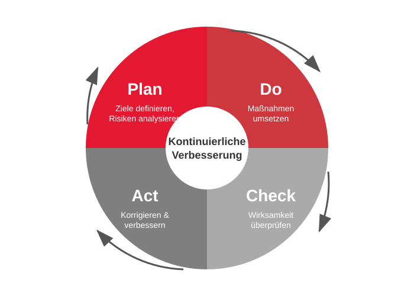
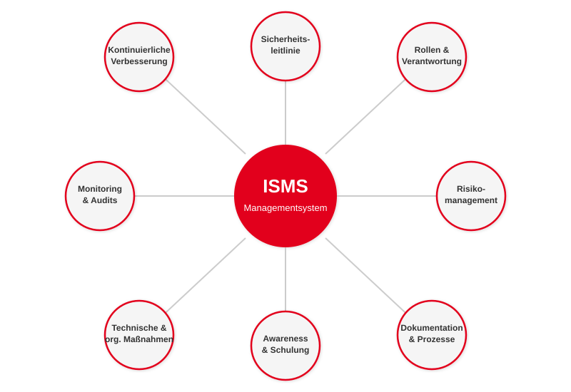
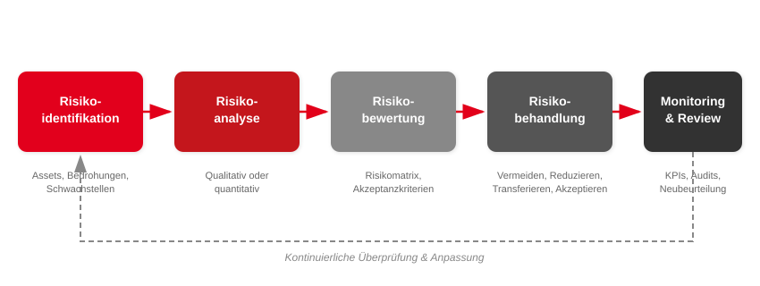
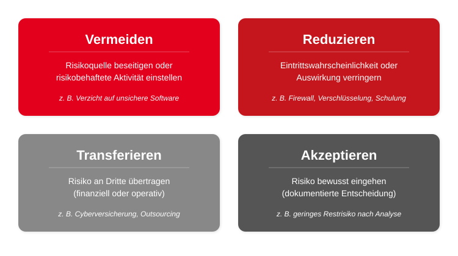
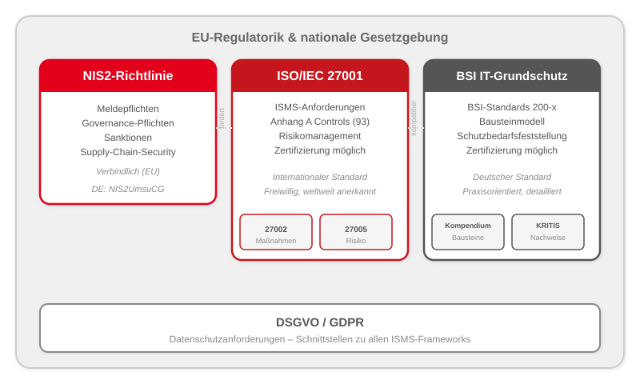
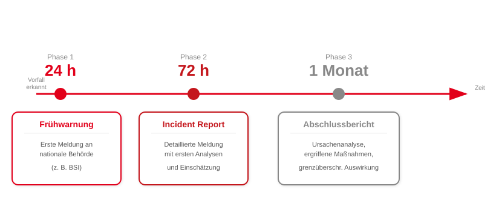

<!-- _class: title -->
# ISMS
## Informationssicherheits-Managementsysteme

<!--
Willkommen zur Vorlesung über ISMS. Heute schauen wir uns an, wie Organisationen Informationssicherheit systematisch managen – nicht nur technisch, sondern als ganzheitliches Managementsystem. Das Thema ist hochaktuell durch NIS2 und zunehmende regulatorische Anforderungen.
-->

---

# Agenda
<!-- _class: biglist -->

1. **Grundlagen:** Was ist ein ISMS und warum brauchen wir es?
2. **Risikomanagement:** Der Kern jedes ISMS
3. **ISO/IEC 27000-Familie:** Internationale Standards
4. **BSI IT-Grundschutz:** Der deutsche Weg
5. **NIS2-Richtlinie:** Regulatorische Anforderungen
6. **ISMS in der Praxis:** Einführung, Herausforderungen, Fallbeispiel

---

<!-- _class: chapter -->
# Grundlagen
## Was ist ein ISMS und warum brauchen wir es?

---

# Motivation: Warum ISMS?

- **2021 – Landkreis Anhalt-Bitterfeld:** Ransomware-Angriff → erster Cyber-Katastrophenfall in Deutschland, wochenlanger Ausfall
- **2023 – MOVEit-Schwachstelle:** Supply-Chain-Angriff → weltweit 2.500+ Organisationen betroffen, 60+ Mio. Datensätze
- **2024 – Change Healthcare (USA):** Ransomware → 100+ Mio. Patientendaten, Wochen ohne Abrechnungssystem

## Gemeinsamer Nenner: Fehlende oder unzureichende Sicherheitsprozesse

<!--
Diese Beispiele zeigen: Technische Maßnahmen allein reichen nicht. In Anhalt-Bitterfeld gab es keine funktionierenden Notfallpläne. Bei MOVEit fehlte Lieferkettenmanagement. Bei Change Healthcare gab es keine Multi-Faktor-Authentifizierung für kritische Systeme. Ein ISMS hätte in jedem Fall geholfen, diese Lücken systematisch zu identifizieren.
-->

---

# Was ist ein ISMS?
<!-- _class: biglist -->

- **Informationssicherheits-Managementsystem**
- Systematischer Ansatz zur Steuerung der Informationssicherheit
- Kombination aus **Richtlinien, Prozessen, Rollen und Technologien**
- Ziel: Schutz von **Vertraulichkeit, Integrität, Verfügbarkeit** (CIA-Triade)
- Kein Produkt, sondern ein **kontinuierlicher Prozess**

<!--
Wichtig: Ein ISMS ist kein Tool und keine Software. Es ist ein Managementsystem – vergleichbar mit einem Qualitätsmanagementsystem nach ISO 9001. Der Schlüssel liegt im Wort "System": Es geht um das Zusammenspiel aller Komponenten, nicht um einzelne Firewalls oder Virenscanner.
-->

---

# Schutzziele im ISMS-Kontext

| Schutzziel | Bedeutung im ISMS | Beispielmaßnahme |
|---|---|---|
| **Vertraulichkeit** | Zugriff nur für Befugte | Zugriffskontrollen, Verschlüsselung |
| **Integrität** | Daten sind korrekt und unverändert | Hashwerte, Change Management |
| **Verfügbarkeit** | Systeme sind nutzbar, wenn benötigt | Redundanz, Backup, BCM |

 

- Aus der CIA-Triade bekannt – im ISMS werden diese Ziele **operationalisiert**
- Jede Maßnahme muss auf mindestens ein Schutzziel einzahlen

<!--
Erinnern Sie sich an die CIA-Triade aus der zweiten Vorlesung? Im ISMS werden diese abstrakten Ziele konkret: Für jedes Asset wird der Schutzbedarf in allen drei Dimensionen bestimmt. Das ist die Grundlage für alle weiteren Entscheidungen.
-->

---

# Der PDCA-Zyklus im ISMS

<!--
Der PDCA-Zyklus nach Deming ist das Herzstück jedes ISMS. Plan: Wir definieren Ziele, analysieren Risiken und planen Maßnahmen. Do: Wir setzen die Maßnahmen um. Check: Wir überprüfen die Wirksamkeit durch Audits und KPIs. Act: Wir korrigieren und verbessern. Dann beginnt der Zyklus von vorne. ISO 27001 ist explizit nach diesem Prinzip aufgebaut.
-->

---

# PDCA im Detail

| Phase | Aktivitäten | Ergebnis |
|---|---|---|
| **Plan** | Scope festlegen, Risiken analysieren, Maßnahmen planen | Sicherheitsstrategie, Risikobehandlungsplan |
| **Do** | Maßnahmen umsetzen, Schulungen durchführen | Implementierte Controls, geschulte Mitarbeitende |
| **Check** | Audits, KPIs messen, Vorfälle analysieren | Auditberichte, Kennzahlen |
| **Act** | Korrekturmaßnahmen, Prozesse anpassen | Verbesserte Richtlinien, aktualisierte Risikobewertung |

<!--
Konkretes Beispiel: In der Plan-Phase stellen wir fest, dass unser E-Mail-System ein hohes Risiko für Phishing hat. In der Do-Phase führen wir einen Spamfilter und Awareness-Schulungen ein. In der Check-Phase messen wir die Klickrate auf Phishing-Mails. In der Act-Phase passen wir die Schulungen an, weil die Rate noch zu hoch ist.
-->

---

# Bestandteile eines ISMS

<!--
Hier sehen Sie die acht Kernbestandteile. Keine dieser Komponenten funktioniert isoliert: Die Sicherheitsleitlinie gibt die Richtung vor, das Risikomanagement bestimmt die Prioritäten, Rollen sorgen für Verantwortlichkeit, und Monitoring stellt sicher, dass alles funktioniert. Fehlt eine Komponente, hat das ISMS eine Lücke.
-->

---

# Rollen und Verantwortlichkeiten

| Rolle | Verantwortung |
|---|---|
| **Geschäftsleitung** | Freigabe der Strategie, Bereitstellung von Ressourcen, Gesamtverantwortung |
| **CISO / ISB** | Koordination des ISMS, Beratung, Reporting an die Leitung |
| **IT-Betrieb** | Umsetzung technischer Maßnahmen, Patch-Management |
| **Fachbereiche** | Verantwortung für Prozesse und Assets, Schutzbedarfsmeldung |
| **Datenschutzbeauftragter** | Schnittstelle ISMS ↔ Datenschutz |
| **Alle Mitarbeitenden** | Einhaltung der Richtlinien, Meldung von Vorfällen |

<!--
Wichtig: Informationssicherheit ist NICHT nur eine IT-Aufgabe. Die Geschäftsleitung trägt die Gesamtverantwortung – das ist auch gesetzlich verankert, wie wir bei NIS2 noch sehen werden. Der CISO oder Informationssicherheitsbeauftragte koordiniert, aber jeder Fachbereich ist für seine Assets verantwortlich.
-->

---

<!-- _class: chapter -->
# Risikomanagement
## Der Kern jedes ISMS

---

# Risikomanagement im Überblick

<!--
Risikomanagement ist DAS zentrale Element eines jeden ISMS. Ohne Risikomanagement ist ein ISMS nur eine Sammlung von Checklisten. Der Prozess besteht aus fünf Schritten, die kontinuierlich durchlaufen werden. Beachten Sie den Feedback-Pfeil: Nach dem Monitoring geht es wieder zurück zur Identifikation – neue Bedrohungen erfordern neue Bewertungen.
-->

---

# Risikoidentifikation

- **Assets inventarisieren:** Was muss geschützt werden?
  - Informationen, Systeme, Prozesse, Personen
- **Bedrohungen erfassen:** Was könnte passieren?
  - Cyberangriffe, Naturkatastrophen, menschliches Versagen
- **Schwachstellen erkennen:** Wo sind wir verwundbar?
  - Fehlende Patches, schwache Passwörter, mangelnde Schulung

## Ergebnis: **Risikoinventar** als Grundlage für die Analyse

<!--
Das Risikoinventar ist das wichtigste Dokument im gesamten ISMS. Tipp für die Praxis: Fangen Sie nicht mit einer vollständigen IT-Asset-Liste an, sondern mit den kritischen Geschäftsprozessen. Fragen Sie: "Was darf auf keinen Fall ausfallen?" Daraus leiten sich die relevanten Assets ab.
-->

---

# Risikoanalyse und Risikobewertung

## Qualitative Risikomatrix

| | **Gering** | **Mittel** | **Hoch** | **Kritisch** |
|---|---|---|---|---|
| **Sehr wahrscheinlich** | Mittel | Hoch | Kritisch | Kritisch |
| **Wahrscheinlich** | Gering | Mittel | Hoch | Kritisch |
| **Möglich** | Gering | Mittel | Mittel | Hoch |
| **Unwahrscheinlich** | Gering | Gering | Mittel | Mittel |

↑ Eintrittswahrscheinlichkeit &nbsp;&nbsp;&nbsp; → Schadenshöhe

- **Akzeptanzkriterien** definieren: Ab welchem Risikoniveau muss behandelt werden?
- Alternative: **Quantitative Analyse** (Schadenhöhe × Eintrittswahrscheinlichkeit in €)

<!--
Die Risikomatrix ist das Standardwerkzeug. In der Praxis wird fast immer qualitativ bewertet, weil quantitative Daten selten vorliegen. Entscheidend ist die Definition der Akzeptanzkriterien – ab welchem Level müssen wir handeln? Das entscheidet das Management, nicht die IT.
-->

---

# Risikobehandlung: Vier Strategien

<!--
Nach der Bewertung muss für jedes nicht-akzeptable Risiko eine Strategie gewählt werden. In der Praxis ist "Reduzieren" die häufigste Strategie – wir setzen technische oder organisatorische Maßnahmen um. "Akzeptieren" ist nur erlaubt, wenn es eine bewusste, dokumentierte Managemententscheidung ist. Wichtig: Ein Restrisiko bleibt immer bestehen.
-->

---

# Statement of Applicability (SoA)

- Das SoA dokumentiert **alle Controls** eines Standards und ob sie angewendet werden
- Für jede Control wird festgehalten:
  - ✅ Angewendet → mit Begründung und Verweis auf Risiko
  - ❌ Nicht angewendet → mit Begründung für den Ausschluss
- **Pflichtdokument** in ISO 27001 (Kapitel 6.1.3)
- Dient als Brücke zwischen Risikobehandlungsplan und konkreten Maßnahmen

## Praxistipp: Das SoA ist eines der ersten Dokumente, das ein Auditor sehen will

<!--
Das Statement of Applicability ist quasi der "Masterplan" des ISMS. Es zeigt dem Auditor auf einen Blick, welche Maßnahmen die Organisation umgesetzt hat und warum bestimmte Controls ausgeschlossen wurden. Ein schlecht gepflegtes SoA ist eines der häufigsten Audit-Findings.
-->

---

<!-- _class: chapter -->
# Internationale Standards
## ISO/IEC 27000-Familie

---

# Überblick: Standards-Landschaft

<!--
Bevor wir in die Details gehen, hier der Überblick: ISO 27001 ist der internationale Standard, BSI IT-Grundschutz der deutsche Weg. NIS2 ist kein Standard, sondern eine EU-Richtlinie, die verbindliche Anforderungen stellt. Die DSGVO ergänzt alles um Datenschutzanforderungen. Wichtig: ISO 27001 und BSI IT-Grundschutz sind kompatibel – ein BSI-Zertifikat kann auf ein ISO-Zertifikat abgebildet werden.
-->

---

# ISO/IEC 27001 – Struktur

- Der **zentrale ISMS-Standard** – weltweit anerkannt und zertifizierbar
- Aufbau orientiert sich am PDCA-Zyklus:

| Kapitel | Inhalt |
|---|---|
| 4 – Kontext | Scope, interessierte Parteien |
| 5 – Führung | Managementverpflichtung, Leitlinie, Rollen |
| 6 – Planung | Risikomanagement, Ziele |
| 7 – Unterstützung | Ressourcen, Kompetenz, Dokumentation |
| 8 – Betrieb | Umsetzung der Risikobehandlung |
| 9 – Bewertung | Monitoring, interne Audits, Managementbewertung |
| 10 – Verbesserung | Korrekturmaßnahmen, kontinuierliche Verbesserung |

<!--
Achten Sie auf die Nummerierung: Kapitel 4-10 sind die Anforderungen, die für ein ISMS zwingend umgesetzt werden müssen. Diese Struktur – die sogenannte High Level Structure – finden Sie auch in anderen ISO-Managementsystemnormen wie ISO 9001 oder ISO 14001. Das erleichtert die Integration verschiedener Managementsysteme.
-->

---

# ISO/IEC 27001 – Anhang A (93 Controls)

| Kategorie | Anzahl | Beispiele |
|---|---|---|
| **Organisatorische Maßnahmen** | 37 | Richtlinien, Lieferkettenmanagement, Asset-Management |
| **Personenbezogene Maßnahmen** | 8 | Schulungen, Hintergrundprüfungen, Disziplinarverfahren |
| **Physische Maßnahmen** | 14 | Zutrittskontrolle, Schutz vor Umwelteinflüssen |
| **Technische Maßnahmen** | 34 | Kryptografie, Logging, Netzwerksicherheit, Secure Development |

- Seit der **Revision 2022**: von 114 auf **93 Controls** (neu strukturiert, 11 neue)
- Neue Controls u. a.: Threat Intelligence, Cloud Security, Data Masking
- Auswahl über **Risikobehandlungsplan** und das **SoA**

<!--
Merken Sie sich die vier Kategorien: organisatorisch, personenbezogen, physisch, technisch. Das zeigt, dass ein ISMS weit über IT hinausgeht. In der Prüfung wird gerne nach den Kategorien gefragt. Die 2022er-Revision hat die Struktur deutlich vereinfacht – vorher gab es 14 Kapitel statt 4 Kategorien.
-->

---

# ISO/IEC 27002 – Maßnahmenkatalog

- Ergänzt ISO 27001 durch **konkrete Umsetzungshinweise** zu jedem Control
- Für jede Maßnahme beschrieben:
  - **Zweck** der Maßnahme
  - **Leitlinien** zur Umsetzung
  - **Weitere Informationen** und Querverweise
- Beispiele:
  - Access Control → Least-Privilege-Prinzip, regelmäßige Rechteprüfung
  - Logging → Welche Events protokollieren? Wie lange aufbewahren?
  - Kryptografie → Welche Algorithmen? Schlüsselverwaltung?
- **Nicht zertifizierbar**, aber essenziell für die praktische Umsetzung

<!--
Die ISO 27002 ist das "Kochbuch" – die 27001 sagt WAS Sie tun müssen, die 27002 sagt WIE. In der Praxis greift jeder ISMS-Berater ständig zur 27002. Tipp: Wenn Sie unsicher sind, wie eine Maßnahme umzusetzen ist, schauen Sie in die 27002.
-->

---

# ISO/IEC 27005 – Risikomanagement

- Beschreibt den **Risikomanagement-Prozess** für Informationssicherheit
- Unterstützt direkt die Anforderungen aus ISO 27001, Kapitel 6
- Wesentliche Elemente:
  - Risikoidentifikation (Assets, Bedrohungen, Schwachstellen)
  - Risikoanalyse (qualitativ oder quantitativ)
  - Risikobewertung (Vergleich mit Akzeptanzkriterien)
  - Risikobehandlung (die vier Strategien)
- Ergebnis: **Risikobehandlungsplan** als Eingabe für Maßnahmenumsetzung

<!--
ISO 27005 haben wir im Risikomanagement-Kapitel praktisch schon behandelt – der Standard formalisiert den Prozess, den wir dort besprochen haben. Wichtig: ISO 27005 ist nicht zertifizierbar, aber sie zeigt dem Auditor, dass das Risikomanagement methodisch sauber durchgeführt wurde.
-->

---

# Weitere ISO-Standards im Überblick

| Standard | Fokus | Relevanz |
|---|---|---|
| **ISO/IEC 27017** | Cloud-spezifische Controls | Multi-Tenancy, Shared Responsibility, API-Schutz |
| **ISO/IEC 27018** | Datenschutz in der Cloud | Transparenz, Zweckbindung, Löschkonzepte |
| **ISO/IEC 27701** | Privacy Information Management (PIMS) | DSGVO-Konformität, Erweiterung von 27001/27002 |
| **ISO/IEC 27035** | Incident Management | Erkennung, Meldung, Analyse, Lessons Learned |
| **ISO/IEC 27019** | Energiesektor | Spezifische Controls für KRITIS/Energie |

- ISO 27017/27018: Besonders relevant für Cloud-Provider und Cloud-Nutzer
- ISO 27701: Als **zertifizierbare Erweiterung** von ISO 27001 einsetzbar
- Alle Standards bauen auf der ISO 27001/27002 Basis auf

<!--
Diese Standards müssen Sie nicht im Detail kennen. Wichtig ist zu verstehen, dass die ISO 27000-Familie modular aufgebaut ist: Die 27001 ist der Kern, und je nach Branche und Kontext kommen spezialisierte Standards dazu. Cloud-Anbieter brauchen die 27017/27018, wer DSGVO-Compliance nachweisen will, nimmt die 27701 dazu.
-->

---

<!-- _class: chapter -->
# BSI IT-Grundschutz
## Informationssicherheit mit System

---

# BSI IT-Grundschutz – Philosophie

- Der **deutsche Weg** zur Informationssicherheit
- Kernidee: **Schutzbedarf** statt reinem Risikomanagement
  - Typische Gefährdungen sind bereits vordefiniert
  - Maßnahmen werden über **Bausteine** zugeordnet
  - → Keine vollständige Risikoanalyse nötig (für normalen Schutzbedarf)
- **Praxisorientiert:** Konkrete, umsetzbare Anforderungen
- **Modular:** Anpassbar an Organisationen jeder Größe
- Grundlage für **KRITIS-Nachweise** und staatliche Zertifizierungen

<!--
Der fundamentale Unterschied zu ISO 27001: BSI IT-Grundschutz nimmt Ihnen einen großen Teil der Risikoanalyse ab, indem typische Gefährdungen und passende Maßnahmen bereits vordefiniert sind. Das macht den Einstieg einfacher, bedeutet aber auch mehr vorgegebene Dokumentation. Für Behörden und KRITIS-Betreiber ist IT-Grundschutz oft die bevorzugte Methode.
-->

---

# BSI-Standards im Überblick

| Standard | Inhalt | Entspricht ca. |
|---|---|---|
| **BSI-Standard 200-1** | Anforderungen an ein ISMS | ISO 27001 (Kapitel 4-10) |
| **BSI-Standard 200-2** | Vorgehensweise (Basis/Standard/Kern) | Implementierungsleitfaden |
| **BSI-Standard 200-3** | Risikoanalyse | ISO 27005 |
| **BSI-Standard 200-4** | Business Continuity Management | ISO 22301 |
| **IT-Grundschutz-Kompendium** | Bausteine mit Anforderungen + Gefährdungen | ISO 27002 (aber detaillierter) |

<!--
Das BSI hat den Vorteil, dass alles aus einer Hand kommt und aufeinander abgestimmt ist. Die rechte Spalte zeigt die ungefähre Entsprechung zu ISO-Standards. Beachten Sie den BSI-Standard 200-4 für Business Continuity – das ist ein Thema, das in ISO 27001 nur am Rande vorkommt, aber in BSI IT-Grundschutz prominent behandelt wird.
-->

---

# BSI-Standard 200-2: Drei Vorgehensweisen

<!-- _class: normal -->

**Basis-Absicherung**
Schneller Einstieg, Mindestniveau. Für Organisationen, die noch am Anfang stehen.
→ Nur Basis-Anforderungen umsetzen.

**Standard-Absicherung**
Vollständige Umsetzung aller relevanten Bausteine für ein angemessenes Schutzniveau.
→ Basis- + Standard-Anforderungen.

**Kern-Absicherung**
Fokus auf besonders kritische Geschäftsprozesse (z. B. „Kronjuwelen").
→ Vollständige Absicherung nur für den Kernbereich.

Ergänzt durch **Risikoanalyse nach 200-3**, wenn Bausteine nicht ausreichen oder erhöhter Schutzbedarf besteht.

<!--
In der Praxis starten die meisten Organisationen mit der Basis-Absicherung, um schnell ein Grundniveau zu erreichen, und arbeiten dann zur Standard-Absicherung hin. Die Kern-Absicherung ist interessant für Unternehmen, die wissen, dass bestimmte Systeme besonders kritisch sind – zum Beispiel das ERP-System oder die Produktionssteuerung.
-->

---

# Schutzbedarfsfeststellung

- Für jedes Asset wird der Schutzbedarf in drei Dimensionen bestimmt:

| Stufe | Vertraulichkeit | Integrität | Verfügbarkeit |
|---|---|---|---|
| **Normal** | Intern, nicht öffentlich | Fehler tolerierbar | Kurze Ausfälle akzeptabel |
| **Hoch** | Geschäftsgeheimnisse | Fehler schwer tolerierbar | Max. 24h Ausfall |
| **Sehr hoch** | Existenzbedrohend | Keinerlei Fehler | Keine Ausfallzeit |

- Der **höchste** Schutzbedarf eines Assets bestimmt die Anforderungen
- **Vererbungsprinzip:** Anwendung erbt Schutzbedarf an Server, Netzwerk etc.

<!--
Die Schutzbedarfsfeststellung ist der zentrale Unterschied zum ISO-Ansatz. Statt einer offenen Risikoanalyse ordnen Sie jedes Asset einer von drei Stufen zu. Das ist schneller, aber auch weniger flexibel. Das Vererbungsprinzip bedeutet: Wenn eine hochkritische Anwendung auf einem Server läuft, bekommt der Server automatisch den gleichen Schutzbedarf.
-->

---

# IT-Grundschutz-Kompendium: Bausteinmodell

| Schicht | Beschreibung | Beispiel-Bausteine |
|---|---|---|
| **ORP** | Organisation & Personal | ORP.1 Organisation, ORP.3 Sensibilisierung |
| **CON** | Konzeption & Vorgehensweise | CON.3 Datensicherung, CON.6 Löschen |
| **OPS** | Betrieb | OPS.1.1 Betrieb, OPS.1.2 Ordnungsgemäße IT-Admin |
| **SYS** | IT-Systeme | SYS.1.1 Server, SYS.2.1 Client |
| **NET** | Netzwerke | NET.1.1 Netzarchitektur, NET.3.2 Firewall |
| **APP** | Anwendungen | APP.3.1 Webanwendungen, APP.5.3 E-Mail |
| **IND** | Industrie/OT | IND.1 Prozessleit-/Automatisierungstechnik |

Jeder Baustein enthält: Beschreibung → Gefährdungen → Anforderungen (Basis / Standard / Erhöht)

<!--
Das Bausteinmodell ist der große Vorteil des IT-Grundschutzes: Sie modellieren Ihre IT-Landschaft, indem Sie die passenden Bausteine auswählen. Für einen Webserver nehmen Sie z.B. SYS.1.1, APP.3.1, NET.3.2 und OPS.1.1 – und bekommen damit alle relevanten Anforderungen. Das Kompendium wird jährlich aktualisiert und enthält aktuell über 100 Bausteine.
-->

---

# Anforderungstypen im IT-Grundschutz

**Basis-Anforderungen** — MUSS
Mindestanforderungen, die jede Organisation erfüllen muss.
*Beispiel: „Administrationszugänge MÜSSEN angemessen geschützt werden."*

**Standard-Anforderungen** — SOLLTE
Vollständiger Schutz für ein angemessenes Sicherheitsniveau.
*Beispiel: „Administrative Zugänge SOLLTEN über ein dediziertes Administrationsnetz erfolgen."*

**Erhöhte Anforderungen** — SOLLTE (bei hohem Schutzbedarf)
Für besonders schutzbedürftige Bereiche (z. B. KRITIS, Geheimschutz).
*Beispiel: „Für administrative Zugänge SOLLTE eine Multi-Faktor-Authentisierung eingesetzt werden."*

<!--
Beachten Sie die sprachliche Abstufung: MUSS, SOLLTE, SOLLTE mit Einschränkung. Das ist nicht zufällig – es folgt der RFC-2119-Systematik. MUSS-Anforderungen sind verpflichtend für jede Absicherungsart. SOLLTE-Anforderungen sind der angestrebte Standard. Die konkreten Formulierungen machen den IT-Grundschutz so praxisnah.
-->

---

# IT-Grundschutz-Zertifizierung und KRITIS

## Zertifizierung durch das BSI:

| Zertifikat | Voraussetzung |
|---|---|
| **Basis** | Alle Basis-Anforderungen umgesetzt |
| **Standard** | Basis- + Standard-Anforderungen umgesetzt |
| **Hoch** | Standard + erhöhte Anforderungen + Risikoanalyse |

- Gültigkeit: **3 Jahre**, jährliche Überwachungsaudits

## KRITIS-Betreiber müssen:
- Nachweis über angemessene Sicherheit erbringen (§ 8a BSI-Gesetz)
- IT-Grundschutz oder branchenspezifische Sicherheitsstandards (B3S) anwenden
- **Alle 2 Jahre** Audits durch das BSI durchführen lassen

<!--
Die Zertifizierung ist für KRITIS-Betreiber praktisch Pflicht. Aber auch nicht-KRITIS-Unternehmen nutzen die Zertifizierung als Nachweis gegenüber Kunden und Partnern. Tipp: Die Basis-Zertifizierung ist ein guter erster Meilenstein, um nach außen Sicherheitskompetenz zu demonstrieren.
-->

---

# Vergleich: ISO 27001 vs. BSI IT-Grundschutz

| Kriterium | ISO 27001 | BSI IT-Grundschutz |
|---|---|---|
| **Geltungsbereich** | International | Primär Deutschland |
| **Ansatz** | Risikoorientiert | Schutzbedarf + Bausteine |
| **Detailgrad** | Abstrakt (WAS) | Sehr konkret (WIE) |
| **Risikoanalyse** | Immer erforderlich | Nur bei hohem Schutzbedarf |
| **Maßnahmenkatalog** | 93 Controls (Anhang A) | 100+ Bausteine, hunderte Anforderungen |
| **Zertifizierung** | Weltweit anerkannt | Primär in Deutschland anerkannt |
| **Aufwand** | Mittel | Hoch (wegen Detailierungsgrad) |
| **Kompatibilität** | — | Kann auf ISO 27001 abgebildet werden |
| **Ideal für** | Internationale Unternehmen | Behörden, KRITIS, deutsche Unternehmen |

<!--
Diese Folie ist prüfungsrelevant! Der wichtigste Unterschied: ISO 27001 sagt, WAS Sie erreichen müssen, lässt aber das WIE offen. BSI IT-Grundschutz sagt auch WIE – bis hinunter zu konkreten Konfigurationsempfehlungen. Beide Ansätze lassen sich kombinieren: Eine ISO-27001-Zertifizierung auf Basis von IT-Grundschutz ist möglich und in Deutschland üblich.
-->

---

<!-- _class: chapter -->
# Regulatorische Anforderungen
## NIS2-Richtlinie

---

# NIS2 – Hintergrund und Zielsetzung

- **NIS2** = überarbeitete EU-Richtlinie zur Netz- und Informationssicherheit (2022)
- Ziel: EU-weit ein **einheitlich hohes Sicherheitsniveau** schaffen
- Gründe für die Reform:
  - Zunahme von Ransomware und Supply-Chain-Angriffen
  - Unzureichende Umsetzung von NIS1 in den Mitgliedstaaten
  - Erweiterung auf deutlich mehr Sektoren und Unternehmen
- NIS2 ist **verbindlich** und muss in nationales Recht umgesetzt werden
- In Deutschland: **NIS2-Umsetzungs- und Cybersicherheitsstärkungsgesetz (NIS2UmsuCG)**

<!--
NIS2 ist ein Gamechanger: Während NIS1 nur wenige Tausend Unternehmen in der EU betraf, sind unter NIS2 schätzungsweise 160.000 Unternehmen allein in Deutschland betroffen. Die Richtlinie ist seit Januar 2023 in Kraft, die Umsetzung in nationales Recht sollte bis Oktober 2024 erfolgen – Deutschland ist hier wie viele EU-Länder verspätet.
-->

---

# NIS2 – Geltungsbereich

## Zwei Kategorien mit unterschiedlichen Pflichten:

**Wesentliche Einrichtungen (Essential Entities)**
Energie, Gesundheit, Transport, Wasser, Finanzwesen, digitale Infrastruktur, öffentliche Verwaltung

**Wichtige Einrichtungen (Important Entities)**
Post, Abfallwirtschaft, Lebensmittel, Chemie, digitale Dienste, Forschung

## Schwellenwerte:
- Ab **50 Mitarbeitenden** oder **10 Mio. € Umsatz**
- Hochkritische Sektoren: Auch darunter möglich
- **Neu:** Auch Zulieferer und Dienstleister können betroffen sein

<!--
Prüfen Sie für Ihren späteren Arbeitgeber: Ist das Unternehmen von NIS2 betroffen? Die Schwellenwerte sind bewusst niedrig angesetzt. Besonders die Einbeziehung von Zulieferern und Dienstleistern ist neu: Wenn Sie IT-Dienstleister für ein Krankenhaus sind, können Sie als Teil der Lieferkette betroffen sein, auch wenn Sie unter den Schwellenwerten liegen.
-->

---

# NIS2 – Kernelemente

<!-- _class: small -->

**Governance & Management-Verantwortung**
- Geschäftsführung trägt **persönliche Verantwortung** für Cybersicherheit
- Pflicht zur Genehmigung der Sicherheitsstrategie und Überwachung der Umsetzung
- Verpflichtende **Management-Schulungen** zur Cybersicherheit
- Bei grober Fahrlässigkeit: persönliche Sanktionen möglich

**Pflichtmaßnahmen (technisch & organisatorisch)**
- Sicherheitsrichtlinien & Governance
- Incident Response & Business Continuity
- Supply-Chain-Security & Lieferantenbewertung
- Kryptografie, Zugriffskontrolle, MFA
- Logging, Monitoring, SIEM
- Patch- & Vulnerability-Management
- Sichere Softwareentwicklung

<!--
Zwei Dinge sind besonders neu: Erstens, die persönliche Haftung der Geschäftsführung – das gab es unter NIS1 nicht. Zweitens, die verpflichtenden Management-Schulungen. Das Management kann Cybersicherheit nicht mehr an die IT-Abteilung delegieren und sich selbst raushalten. Die Pflichtmaßnahmen haben eine starke Überschneidung mit ISO 27001 – wer bereits ein ISMS hat, ist gut aufgestellt.
-->

---

# NIS2 – Meldepflichten

- Meldepflicht gilt für Vorfälle mit **erheblichem Einfluss** auf die Diensterbringung
- Auch Vorfälle mit **grenzüberschreitender Wirkung** sind meldepflichtig
- Ziel: Schnelle Reaktion und EU-weite **Lagebilder** ermöglichen

<!--
Die dreistufige Meldepflicht ist angelehnt an die DSGVO-Meldepflicht, aber deutlich strenger: 24 Stunden für die Frühwarnung statt 72 Stunden bei der DSGVO. Das erfordert einen funktionierenden Incident-Response-Prozess mit klaren Zuständigkeiten. Wer bei einem Vorfall erst überlegen muss, wen er anruft, hat ein Problem.
-->

---

# NIS2 – Sanktionen und Durchsetzung
<!-- _class: biglist -->

- **Wesentliche Einrichtungen:**
  Bis zu **10 Mio. €** oder **2 % des weltweiten Jahresumsatzes** (je nachdem, was höher ist)
- **Wichtige Einrichtungen:**
  Bis zu **7 Mio. €** oder **1,4 % des Umsatzes**
- **Weitere Maßnahmen:**
  - Vor-Ort-Inspektionen durch Aufsichtsbehörden
  - Bindende Anordnungen zur Umsetzung von Maßnahmen
  - Temporäre Aussetzung von Leitungsaufgaben (in Extremfällen)

<!--
Zum Vergleich: Unter NIS1 gab es keine einheitlichen Bußgeldrahmen und die Sanktionen waren deutlich milder. Die neuen Beträge orientieren sich bewusst an der DSGVO-Systematik. Das Signal ist klar: Cybersicherheit hat den gleichen Stellenwert wie Datenschutz. Die Möglichkeit, Leitungsaufgaben auszusetzen, ist neu und zeigt die Ernsthaftigkeit.
-->

---

# NIS2 – Umsetzung in Deutschland

- Umsetzung durch das **NIS2UmsuCG** (NIS2-Umsetzungs- und Cybersicherheitsstärkungsgesetz)
- Rolle des **BSI** wird gestärkt:
  - Zentrale Aufsichtsbehörde für Cybersicherheit
  - Meldestelle für Sicherheitsvorfälle
  - Erlass verbindlicher Vorgaben und Leitlinien
- Neue Kategorien im deutschen Recht:
  - **„Besonders wichtige Einrichtungen"** (≈ Essential Entities)
  - **„Wichtige Einrichtungen"** (≈ Important Entities)
- Enge Verzahnung mit bestehendem **KRITIS-Recht** und **BSI-Gesetz**

## ISMS wird zum zentralen Werkzeug zur Erfüllung der NIS2-Anforderungen

<!--
Die nationale Umsetzung in Deutschland verschärft die NIS2-Anforderungen teilweise noch. Das BSI bekommt deutlich mehr Befugnisse als bisher. Für Unternehmen, die bereits ein ISMS nach ISO 27001 oder BSI IT-Grundschutz haben, ist die Umstellung vergleichsweise einfach – sie müssen vor allem Meldepflichten, Supply-Chain-Management und Governance-Strukturen ergänzen.
-->

---

<!-- _class: chapter -->
# ISMS in der Praxis
## Einführung, Herausforderungen, Fallbeispiel

---

# ISMS-Einführung: Schritt für Schritt

<!-- _class: normal -->

| Phase | Aktivität | Typische Dauer |
|---|---|---|
| **1. Initiierung** | Management-Commitment, Scope-Definition, ISMS-Team | 1–2 Monate |
| **2. Ist-Analyse** | Gap-Analyse gegen ISO 27001 oder BSI IT-Grundschutz | 1–3 Monate |
| **3. Aufbau** | Sicherheitsleitlinie, Rollen, Prozesse, Risikoanalyse | 2–4 Monate |
| **4. Umsetzung** | Maßnahmen implementieren, Schulungen durchführen | 3–6 Monate |
| **5. Betrieb** | Monitoring, Incident Response, Dokumentation | Laufend |
| **6. Überprüfung** | Interne Audits, Management-Review | Jährlich |
| **7. Zertifizierung** | Externes Audit (Stage 1 + Stage 2) | 2–4 Wochen |

<!--
Realistische Gesamtdauer bis zur Zertifizierung: 12 bis 18 Monate für ein mittelständisches Unternehmen. Der häufigste Fehler: Das Management unterschätzt den Aufwand und stellt nicht genug Ressourcen bereit. Tipp: Starten Sie mit einem begrenzten Scope – zum Beispiel nur die IT-Abteilung – und erweitern Sie schrittweise.
-->

---

# Typische Herausforderungen und Erfolgsfaktoren

| Herausforderung | Erfolgsfaktor |
|---|---|
| Fehlendes Management-Commitment | Top-Down-Ansatz, regelmäßiges Reporting |
| Hoher Dokumentationsaufwand | Tool-Unterstützung, Vorlagen nutzen |
| „Papier-ISMS" ohne gelebte Praxis | Awareness-Kampagnen, Kultur fördern |
| Abhängigkeit von Schlüsselpersonen | Vertretungsregelungen, Wissensdokumentation |
| Integration in bestehende Prozesse | ISMS in vorhandene Workflows einbetten |
| Ressourcenmangel (Personal, Budget) | Priorisierung über Risikoanalyse, Synergien nutzen |

## Merksatz: **Ein ISMS ist nur so gut wie die Kultur, die es trägt.**

<!--
Das größte Risiko für ein ISMS ist nicht ein technischer Angriff, sondern die fehlende Akzeptanz in der Organisation. Wenn Mitarbeitende das ISMS als Bürokratie empfinden, werden Richtlinien umgangen und Vorfälle nicht gemeldet. Deshalb ist Awareness keine einmalige Aktion, sondern ein kontinuierlicher Prozess.
-->

---

# Fallbeispiel: ISMS in einem mittelständischen Unternehmen

<!-- _class: small -->

**Szenario:** Maschinenbauunternehmen, 300 Mitarbeitende, Automotive-Zulieferer

**Ausgangslage:**
- Kein strukturiertes Sicherheitskonzept, IT komplett ausgelagert
- Wichtiger Kunde fordert ISO-27001-Zertifizierung als Lieferbedingung
- NIS2 betrifft das Unternehmen als „Wichtige Einrichtung"

**Vorgehensweise:**
1. Geschäftsführung beauftragt externen CISO (Teilzeit)
2. Gap-Analyse: 40 % der ISO-27001-Controls bereits teilweise erfüllt
3. Scope: Zentrale IT + Produktions-OT (Kern-Absicherung als Start)
4. Priorisierung: Zugriffskontrollen, Backup, Incident Response zuerst
5. Schulung aller Mitarbeitenden (2h Awareness-Workshop)
6. Zertifizierung nach 14 Monaten erreicht

**Lessons Learned:** Frühes Management-Buy-in war entscheidend. Größte Hürde: Fachabteilungen in Risikoanalyse einbinden.

<!--
Dieses Beispiel zeigt einen typischen Praxisfall: Der Anstoß kommt oft nicht aus eigenem Antrieb, sondern durch Kundenanforderungen oder Regulatorik. Die 40% bereits vorhandener Maßnahmen sind typisch – viele Unternehmen tun bereits einiges für Sicherheit, aber eben nicht systematisch. Der externe CISO in Teilzeit ist ein gängiges Modell für den Mittelstand, weil eine Vollzeitstelle oft nicht finanzierbar ist.
-->

---

# Zusammenfassung: Key Takeaways
<!-- _class: biglist -->

- Ein ISMS ist ein **Managementsystem**, kein technisches Produkt
- Der **PDCA-Zyklus** sorgt für kontinuierliche Verbesserung
- **Risikomanagement** ist das Herzstück: Identifikation → Analyse → Bewertung → Behandlung
- **ISO 27001** (international) und **BSI IT-Grundschutz** (deutsch) sind die beiden Hauptstandards
- **NIS2** macht ISMS-Anforderungen für viele Unternehmen **verbindlich**
- Erfolgsfaktor Nr. 1: **Management-Commitment** und gelebte Sicherheitskultur

<!--
Wenn Sie nur drei Dinge mitnehmen: Erstens, ISMS ist ein Prozess, kein Zustand. Zweitens, Risikomanagement bestimmt die Prioritäten – nicht ein Audit-Katalog. Drittens, ohne Management-Unterstützung scheitert jedes ISMS.
-->

---

# Diskussionsfragen

1. **Ihr Arbeitgeber hat kein ISMS.** Mit welchem Argument überzeugen Sie die Geschäftsführung, eines einzuführen?

2. **ISO 27001 oder BSI IT-Grundschutz?** Ein deutsches Unternehmen mit internationalen Kunden muss sich entscheiden – was empfehlen Sie und warum?

3. **"Wir haben eine Firewall und Virenscanner – das reicht."** Wie reagieren Sie auf diese Aussage?

4. **NIS2 betrifft Ihr Unternehmen.** Welche drei Maßnahmen setzen Sie als Erstes um?

<!--
Diese Fragen eignen sich gut für eine Diskussion in Kleingruppen (5 Minuten) mit anschließender Vorstellung im Plenum. Frage 3 ist besonders gut geeignet, um das Verständnis für den Unterschied zwischen technischen Einzelmaßnahmen und einem Managementsystem zu testen.
-->

---

<!-- _class: title -->

# Und nächstes Mal...
