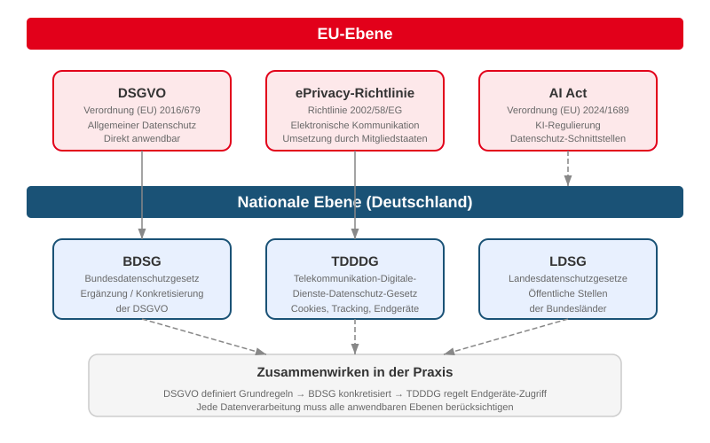
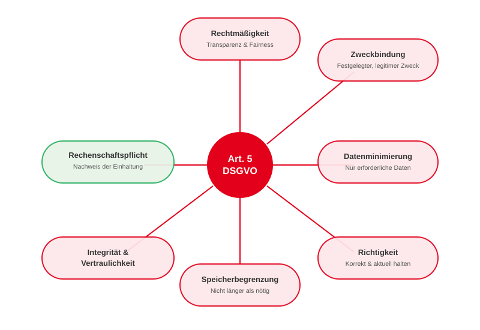
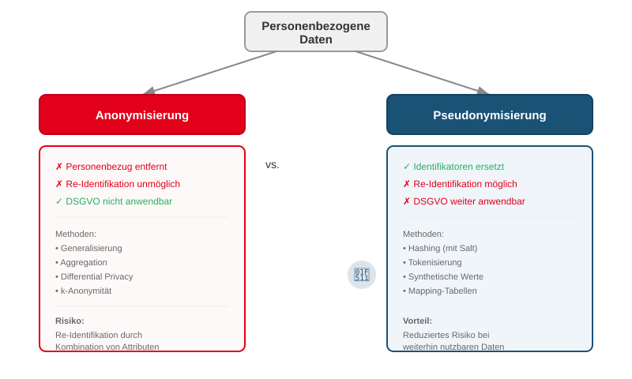
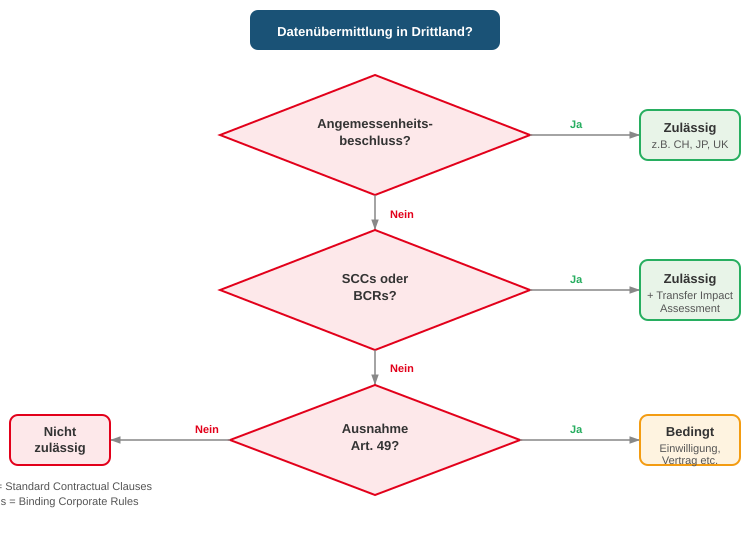
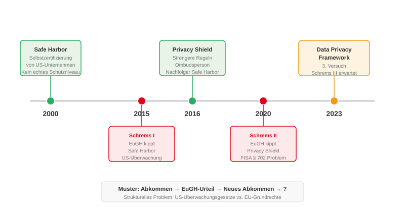
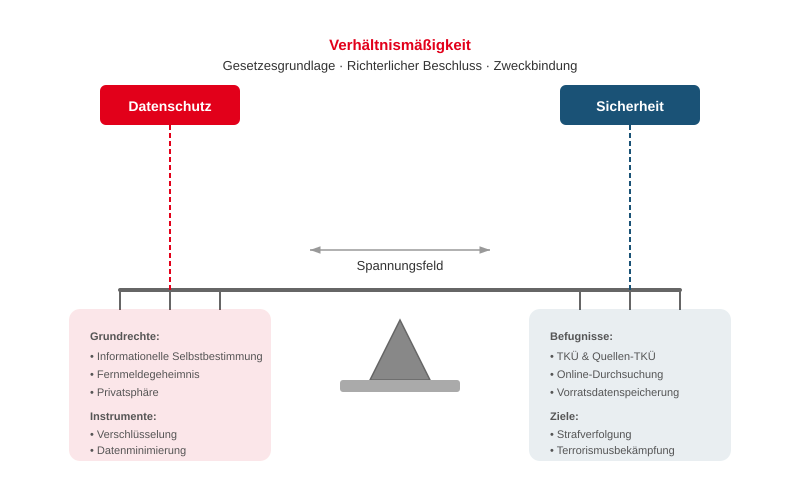

<!-- _class: title -->
# Datenschutz & IT‑Sicherheit

<!-- presenter notes
Willkommen zur Vorlesung Datenschutz. Wir behandeln heute drei große Themenblöcke: Erst die DSGVO als rechtliches Fundament, dann Anonymisierung/Pseudonymisierung als technische Werkzeuge, und abschließend das Spannungsfeld zwischen Datenschutz und staatlichen Ermittlungsbefugnissen. Der rote Faden: Datenschutz ist kein Hindernis, sondern ein Qualitätsmerkmal guter IT-Systeme.
-->

---

# Agenda
<!-- _class: biglist -->

1. Einführung & Motivation
2. DSGVO – Grundlagen & Umsetzung
3. Anonymisierung & Pseudonymisierung
4. Internationale Datenübermittlung
5. Datenschutz vs. Ermittlungsbefugnisse
6. Vorratsdatenspeicherung

<!-- presenter notes
Kurzer Überblick über die Agenda. Wir werden immer wieder den Bezug zur IT-Sicherheit herstellen – Datenschutz ist kein reines Rechtsthema, sondern hat massive Auswirkungen auf Architektur, Entwicklung und Betrieb von IT-Systemen.
-->

---
<!-- _class: chapter -->
# Einführung & Motivation

## Warum Datenschutz in der IT‑Sicherheit?

---

# Datenschutz und die CIA‑Triade
<!-- _class: normal -->

Datenschutz ist **kein separates Thema** – er ist direkt mit der CIA‑Triade verknüpft:

| CIA‑Prinzip | Datenschutz‑Bezug |
|---|---|
| **Confidentiality** | Personenbezogene Daten dürfen nur Berechtigte sehen |
| **Integrity** | Daten müssen korrekt und aktuell sein (Art. 5 DSGVO) |
| **Availability** | Betroffene müssen auf ihre Daten zugreifen können (Auskunftsrecht) |

**Datenschutzverletzung = Sicherheitsvorfall**
Eine Datenpanne ist immer auch ein IT‑Sicherheitsproblem.

<!-- presenter notes
Wichtiger Brückenschlag zu Vorlesung 1: Die CIA-Triade ist das Fundament der IT-Sicherheit. Datenschutz fordert genau diese drei Eigenschaften für personenbezogene Daten. Wenn eines dieser Prinzipien verletzt wird, liegt typischerweise auch ein DSGVO-Verstoß vor. Beispiel: Ein SQL-Injection-Angriff verletzt Confidentiality UND ist eine meldepflichtige Datenpanne.
-->

---

# Datenschutz‑Rechtsrahmen im Überblick

<!-- presenter notes
Dieses Diagramm zeigt die verschiedenen Ebenen: Auf EU-Ebene haben wir die DSGVO als zentrale Verordnung, die ePrivacy-Richtlinie für elektronische Kommunikation, und seit 2024 den AI Act mit Datenschutz-Schnittstellen. Auf nationaler Ebene konkretisiert das BDSG die DSGVO, das TDDDG regelt den Zugriff auf Endgeräte (Cookies, Tracking), und die Landesdatenschutzgesetze gelten für öffentliche Stellen. In der Praxis müssen alle Ebenen berücksichtigt werden – das macht Compliance so komplex.
-->

---

# Historischer Kontext
<!-- _class: normal -->

| Jahr | Ereignis |
|------|----------|
| 1970 | Erstes Datenschutzgesetz weltweit (Hessen) |
| 1977 | Bundesdatenschutzgesetz (BDSG) |
| 1983 | Volkszählungsurteil → Recht auf informationelle Selbstbestimmung |
| 1995 | EU‑Datenschutzrichtlinie 95/46/EG |
| 2018 | DSGVO tritt in Kraft |
| 2023 | EU‑US Data Privacy Framework |
| 2024 | AI Act verabschiedet |

**Das Volkszählungsurteil von 1983** begründete das Grundrecht auf informationelle Selbstbestimmung – und damit die Grundlage für alles, was danach kam.

<!-- presenter notes
Besonders wichtig: Das Volkszählungsurteil des Bundesverfassungsgerichts 1983. Bürger klagten gegen die geplante Volkszählung, weil sie befürchteten, dass der Staat zu viele Daten über sie sammelt. Das BVerfG leitete aus dem Grundgesetz ein neues Grundrecht ab: das Recht auf informationelle Selbstbestimmung. Dieses Recht ist die geistige Grundlage der DSGVO, auch wenn die Verordnung 35 Jahre später kam.
-->

---
<!-- _class: chapter -->
# DSGVO

## Datenschutz‑Grundverordnung

---

# Ziele der DSGVO
<!-- _class: biglist -->

- Schutz personenbezogener Daten natürlicher Personen
- Stärkung der Rechte von Betroffenen
- Vereinheitlichung des Datenschutzrechts in der EU
- Verpflichtung zu sicherer Datenverarbeitung
- Transparenz über Datenflüsse
- Freier Verkehr personenbezogener Daten im Binnenmarkt

<!-- presenter notes
Die DSGVO hat zwei Ziele, die in Spannung zueinander stehen: Einerseits den Schutz personenbezogener Daten, andererseits den freien Datenverkehr im EU-Binnenmarkt. Das ist kein Widerspruch – einheitliche Regeln schaffen Rechtssicherheit und damit Vertrauen, das den Datenverkehr erst ermöglicht.
-->

---

# Personenbezogene Daten
<!-- _class: normal -->

**Definition (Art. 4 Nr. 1 DSGVO):** Alle Informationen, die sich auf eine identifizierte oder identifizierbare natürliche Person beziehen.

**Direkte Identifikatoren:**
Name, Adresse, E‑Mail, Personalnummer

**Indirekte Identifikatoren:**
IP‑Adresse, Standortdaten, Cookies, Nutzerverhalten, Logdaten

**Identifizierbarkeit** ist der Schlüssel – auch pseudonyme Daten sind personenbezogen, wenn eine Re‑Identifikation möglich ist.

<!-- presenter notes
Hier ist die Abgrenzung entscheidend: Es geht nicht nur um den Namen einer Person. Sobald Daten KOMBINIERT werden können, um eine Person zu identifizieren, sind sie personenbezogen. Ein Beispiel: Ein einzelner Logfile-Eintrag mit einer IP-Adresse ist bereits personenbezogen, weil der Provider die IP einer Person zuordnen kann. Das hat massive Auswirkungen auf Logging, Monitoring und Analytics.
-->

---

# Besondere Kategorien personenbezogener Daten (Art. 9)
<!-- _class: normal -->

Art. 9 DSGVO definiert **besonders sensible** Datenkategorien mit **erhöhtem Schutz**:

- Rassische und ethnische Herkunft
- Politische Meinungen
- Religiöse oder weltanschauliche Überzeugungen
- Gewerkschaftszugehörigkeit
- **Genetische und biometrische Daten** (z. B. Fingerabdruck, Gesichtserkennung)
- **Gesundheitsdaten**
- Daten zum Sexualleben oder der sexuellen Orientierung

**Verarbeitung grundsätzlich verboten** – nur unter engen Ausnahmen erlaubt (z. B. ausdrückliche Einwilligung, Arbeitsrecht, Gesundheitsversorgung).

<!-- presenter notes
Art. 9 ist für IT-Systeme extrem relevant: Gesundheits-Apps, biometrische Authentifizierung, HR-Systeme – überall werden besondere Kategorien verarbeitet. Die Verarbeitung ist grundsätzlich VERBOTEN und nur unter engen Ausnahmen erlaubt. Wer ein System baut, das solche Daten verarbeitet, braucht besondere technische und organisatorische Maßnahmen – und meistens eine Datenschutz-Folgenabschätzung.
-->

---

# Grundprinzipien der DSGVO (Art. 5)

<!-- presenter notes
Art. 5 ist der Herzschlag der DSGVO. Die sieben Grundprinzipien müssen bei JEDER Verarbeitung eingehalten werden. Besonders wichtig für IT: Datenminimierung – nur speichern, was wirklich gebraucht wird. Speicherbegrenzung – Löschkonzepte von Anfang an einplanen. Integrität und Vertraulichkeit – hier trifft Datenschutz direkt auf IT-Sicherheit. Die Rechenschaftspflicht hebt sich ab – sie verlangt, dass man die Einhaltung NACHWEISEN kann. Das bedeutet: Dokumentation, Logging, Audits.
-->

---

# Rechtsgrundlagen der Verarbeitung (Art. 6)
<!-- _class: normal -->

**Jede Verarbeitung braucht eine Rechtsgrundlage.** Die sechs Optionen:

| # | Rechtsgrundlage | Beispiel |
|:-:|---|---|
| a | **Einwilligung** | Newsletter-Anmeldung, Tracking-Consent |
| b | **Vertragserfüllung** | Lieferadresse für Bestellung |
| c | **Rechtliche Verpflichtung** | Steuerrechtliche Aufbewahrungspflicht |
| d | **Lebenswichtige Interessen** | Medizinischer Notfall |
| e | **Öffentliches Interesse** | Pandemie-Kontaktverfolgung |
| f | **Berechtigtes Interesse** | Betrugsprävention, IT‑Sicherheit |

In der Praxis sind **a**, **b** und **f** die häufigsten Grundlagen in IT‑Systemen.

<!-- presenter notes
Häufiger Fehler: Entwickler denken, für jede Verarbeitung braucht man eine Einwilligung. Das stimmt nicht – es gibt sechs Rechtsgrundlagen. In der Praxis sind die häufigsten: Einwilligung für Marketing/Tracking, Vertragserfüllung für die Kernfunktion eines Dienstes, und berechtigtes Interesse als Auffangtatbestand z.B. für IT-Sicherheitsmaßnahmen wie Logging. Wichtig: Die Rechtsgrundlage muss VOR der Verarbeitung festgelegt und dokumentiert werden.
-->

---

# Privacy by Design & by Default (Art. 25)
<!-- _class: normal -->

**Privacy by Design:** Datenschutz in die Architektur einbauen – von Anfang an, nicht nachträglich.

**Privacy by Default:** Datensparsame Voreinstellungen als Standard.

**Praxisbeispiele:**

| Schlecht | Besser |
|---|---|
| Opt‑out für Tracking | Opt‑in für Tracking |
| Alle Felder Pflichtfelder | Minimale Pflichtfelder |
| IP‑Adressen in Logs | Gekürzte IPs oder Pseudonyme |
| Unbegrenzte Speicherung | Automatische Löschfristen |
| Profile standardmäßig öffentlich | Profile standardmäßig privat |

<!-- presenter notes
Art. 25 ist der Artikel, der Datenschutz zum Architekturthema macht. Privacy by Design bedeutet: Wenn ich ein System plane, denke ich von Anfang an mit, wie ich personenbezogene Daten minimiere. Nicht erst als letzten Schritt vor dem Go-Live. Beispiel: Ein Webshop, der die Lieferadresse nach Zustellung automatisch löscht oder anonymisiert, statt sie ewig zu speichern. Privacy by Default: Das System ist in der sparsamsten Konfiguration ausgeliefert. Der Nutzer kann mehr Datenfreigabe opt-in.
-->

---

# Pflichten für Verantwortliche – Überblick
<!-- _class: normal -->

| Pflicht | Beschreibung | Relevanz für IT |
|---|---|---|
| Verzeichnis von Verarbeitungstätigkeiten | Dokumentation aller Datenverarbeitungen | Architektur-Doku |
| DSFA | Folgenabschätzung bei hohem Risiko | Risikoanalyse |
| Meldepflicht (72h) | Datenpannen an Aufsichtsbehörde | Incident Response |
| Auftragsverarbeitungsvertrag | Vertrag mit Dienstleistern | Cloud, SaaS |
| Löschkonzepte | Automatisierte Löschung | Datenbank-Design |
| Betroffenenrechte umsetzen | Technische Umsetzung | API, Export, Lösch-Workflows |

<!-- presenter notes
Diese Pflichten treffen Verantwortliche – also das Unternehmen, das über Zweck und Mittel der Verarbeitung entscheidet. Für IT-Teams besonders relevant: Das Verzeichnis der Verarbeitungstätigkeiten erfordert eine saubere Dokumentation aller Datenflüsse. Die 72-Stunden-Meldepflicht bei Datenpannen erfordert funktionierende Incident-Response-Prozesse. Und die Umsetzung der Betroffenenrechte muss technisch eingebaut werden – man kann nicht einfach manuell in der Datenbank suchen.
-->

---

# Datenschutzbeauftragte/r (DSB)
<!-- _class: normal -->

**Wann ist ein DSB Pflicht?** (Art. 37 DSGVO, § 38 BDSG)
- Öffentliche Stellen – immer
- Private Unternehmen: wenn ≥ 20 Personen ständig personenbezogene Daten verarbeiten
- Oder wenn Kerntätigkeit in umfangreicher Verarbeitung besonderer Kategorien liegt

**Aufgaben des DSB:**
- Beratung und Überwachung der Datenschutz-Compliance
- Anlaufstelle für Betroffene und Aufsichtsbehörden
- Durchführung von Schulungen
- Begleitung der DSFA

**Kein Weisungsrecht** – der DSB ist unabhängig und genießt besonderen Kündigungsschutz.

<!-- presenter notes
Der Datenschutzbeauftragte ist eine Besonderheit des deutschen Rechts – das BDSG senkt die Schwelle deutlich ab: Schon ab 20 Personen, die regelmäßig personenbezogene Daten verarbeiten, braucht man einen DSB. Das betrifft praktisch jedes mittelständische Unternehmen. Wichtig: Der DSB ist NICHT verantwortlich für die Einhaltung – das bleibt die Geschäftsführung. Der DSB berät und überwacht. Er hat eine Sonderstellung: weisungsfrei und besonderer Kündigungsschutz.
-->

---

# Betroffenenrechte (Art. 12–23) – Überblick
<!-- _class: small -->

| Recht | Artikel | Kerninhalt | Technische Umsetzung |
|---|:-:|---|---|
| **Auskunft** | 15 | Welche Daten? Woher? An wen? | Dateninventar, Data Lineage |
| **Berichtigung** | 16 | Korrektur falscher Daten | Änderbare Datenmodelle, Audit‑Logs |
| **Löschung** | 17 | „Recht auf Vergessenwerden" | Löschkonzepte, verteilte Systeme |
| **Einschränkung** | 18 | Speichern, aber nicht verarbeiten | Frozen‑State‑Flags in DB |
| **Datenübertragbarkeit** | 20 | Export in maschinenlesbarem Format | Export‑API (JSON/CSV) |
| **Widerspruch** | 21 | Gegen Tracking, Profiling | Consent‑Management |
| **Widerruf** | 7 | Einwilligung jederzeit widerrufen | Consent‑Status in Echtzeit |
| **Keine autom. Entscheidung** | 22 | Schutz vor rein algorithmischen Entscheidungen | Human‑in‑the‑Loop |

<!-- presenter notes
Statt jedes Recht auf einer eigenen Folie: Hier die Gesamtübersicht. Die rechte Spalte zeigt, was das für die IT bedeutet. Besonders herausfordernd: Art. 17 – Löschung in verteilten Systemen, Microservices, Message Queues und Data Lakes. Art. 20 – Datenübertragbarkeit erfordert standardisierte Export-APIs. Und Art. 22 wird mit zunehmender KI-Nutzung immer wichtiger. Auf die wichtigsten gehe ich jetzt im Detail ein.
-->

---

# Betroffenenrechte – Technische Herausforderungen
<!-- _class: normal -->

## Recht auf Löschung (Art. 17) – Die größte Herausforderung

- Daten in **verteilten Systemen**: Microservices, Caches, Message Queues, Data Lakes
- **Backups**: Einzellöschung in Backups oft unmöglich
- **Unveränderliche Logs** (Audit‑Trails): Pseudonymisierung statt Löschung
- **Aufbewahrungspflichten** vs. Löschpflicht: Steuerrecht (10 Jahre) kollidiert mit DSGVO

## Recht auf automatisierte Entscheidungen (Art. 22) – KI‑Bezug

- Schutz vor rein algorithmischen Entscheidungen mit rechtlicher Wirkung
- **Kredit‑Scoring**, automatische Bewerbungsfilter, Versicherungstarife
- Anforderung: Erklärbare KI (Explainable AI), Human‑in‑the‑Loop
- Schnittstelle zum **AI Act** (Hochrisiko‑KI‑Systeme)

<!-- presenter notes
Zwei Rechte, die IT-seitig besonders anspruchsvoll sind. Art. 17: In einer modernen Microservice-Architektur liegen Daten einer Person in dutzenden Systemen. Wie stelle ich sicher, dass ALLE Kopien gelöscht werden? Lösung: Zentrale ID, Lösch-Events per Event-Bus, Dokumentation aller Datensenken. Backups sind besonders schwierig – hier arbeitet man oft mit Crypto-Erasure: Der Schlüssel wird gelöscht, die verschlüsselten Daten werden unlesbar. Art. 22: Wird mit KI-Systemen immer wichtiger. Ein automatisches Kredit-Scoring-System, das einen Antrag ablehnt, ohne dass ein Mensch draufschaut, verstößt gegen Art. 22.
-->

---

# Datenschutz‑Folgenabschätzung (DSFA) – Praxisbeispiel
<!-- _class: normal -->

**Wann Pflicht?** Bei Verarbeitungen mit **hohem Risiko** für Betroffene (Art. 35).

**Beispiel: Einführung einer Bewerber‑KI**

| Schritt | Inhalt |
|---|---|
| 1. Beschreibung | KI filtert Bewerbungen vor, rankt Kandidaten |
| 2. Bewertung der Notwendigkeit | Ist KI erforderlich? Gibt es mildere Mittel? |
| 3. Risikobewertung | Diskriminierungsrisiko, Transparenzdefizit, Art. 22 |
| 4. Maßnahmen | Bias‑Audits, Human‑in‑the‑Loop, Erklärbarkeit |
| 5. Dokumentation | Verfahren, Ergebnisse, Restrisiken |
| 6. Konsultation | Ggf. Aufsichtsbehörde einbeziehen |

<!-- presenter notes
Die DSFA ist ein strukturierter Prozess, um Risiken VORAB zu identifizieren und zu minimieren. Pflicht bei: systematischer Überwachung öffentlicher Bereiche, umfangreicher Verarbeitung besonderer Kategorien, oder Scoring/Profiling. Das Beispiel einer Bewerber-KI zeigt alle typischen Probleme: Art. 22 (automatisierte Entscheidung), besondere Kategorien (Alter, Geschlecht könnten aus Daten abgeleitet werden), Diskriminierungsrisiko. Die DSFA zwingt dazu, diese Risiken VOR dem Einsatz zu durchdenken.
-->

---

# Meldung von Datenpannen (Art. 33 & 34)
<!-- _class: normal -->

## Pflichten bei Datenpannen

**An die Aufsichtsbehörde (Art. 33):**
- Meldung innerhalb von **72 Stunden** nach Kenntnisnahme
- Art der Verletzung, Anzahl Betroffener, wahrscheinliche Folgen
- Ergriffene und geplante Maßnahmen

**An die Betroffenen (Art. 34):**
- Nur wenn **hohes Risiko** für die Rechte der Betroffenen
- In klarer und einfacher Sprache

## Technische Voraussetzungen
- Incident‑Response‑Prozesse mit klarer Eskalationskette
- Monitoring & Alerting für Datenzugriffe
- Forensische Logs zur Ermittlung des Umfangs
- Breach‑Detection‑Systeme

<!-- presenter notes
72 Stunden – das ist extrem knapp. Freitagnacht wird ein Breach entdeckt, Montagmorgen muss die Meldung raus. Wer keine eingespielten Incident-Response-Prozesse hat, scheitert hier. Typischer Fehler: Unternehmen merken erst Monate später, dass sie gehackt wurden – dann war die Frist längst abgelaufen, und es droht ein zusätzliches Bußgeld wegen verspäteter Meldung. Die technische Voraussetzung ist gutes Monitoring: Wer Anomalien bei Datenzugriffen nicht erkennt, kann auch nicht melden.
-->

---

# Technische Gesamtanforderungen an IT‑Systeme
<!-- _class: normal -->

- **Identifizierbarkeit** von Datensätzen (für Auskunft, Löschung, Portabilität)
- **Trennung** personenbezogener und pseudonymisierter Daten
- **Rollen‑ und Berechtigungskonzepte** (Need‑to‑know‑Prinzip)
- **Datenklassifizierung** (normal, besondere Kategorien, anonymisiert)
- **Automatisierte Lösch‑ und Exportprozesse**
- **Vollständige Dokumentation** der Datenverarbeitung
- **Logging ohne personenbezogene Daten**, wo möglich
- **Verschlüsselung** at rest und in transit

Diese Anforderungen müssen in **Architektur, Datenmodell und DevOps‑Pipeline** verankert werden.

<!-- presenter notes
Eine Zusammenfassung der technischen Anforderungen, die sich aus der DSGVO ergeben. Das ist die Checkliste, die eine Architektin im Kopf haben sollte, wenn sie ein neues System entwirft. Besonders wichtig: Identifizierbarkeit – wenn ich nicht weiß, welche Daten zu welcher Person gehören, kann ich weder Auskunft geben noch löschen. Aber: Zu viel Identifizierbarkeit ist auch ein Risiko. Die Kunst liegt in der Balance zwischen Zuordenbarkeit und Minimierung.
-->

---

# Große DSGVO‑Verstöße – Bußgelder
<!-- _class: normal -->

| Unternehmen | Bußgeld | Grund |
|---|---|---|
| **Meta** (Facebook) | 1,2 Mrd. € | Unzulässige Datenübermittlung in die USA |
| **Amazon** | 746 Mio. € | Unzulässige personalisierte Werbung |
| **TikTok** | 345 Mio. € | Mangelnder Schutz von Minderjährigen |
| **WhatsApp** | 225 Mio. € | Intransparente Datenweitergabe |
| **British Airways** | 204 Mio. € | Datenpanne durch unzureichende Sicherheit |
| **Clearview AI** | 20 Mio. € | Unzulässige biometrische Massenüberwachung |

**Bußgeldrahmen:** Bis zu **20 Mio. € oder 4 % des weltweiten Jahresumsatzes** – je nachdem, was höher ist.

<!-- presenter notes
Die Bußgelder zeigen, dass die DSGVO Zähne hat. Der Meta-Fall ist besonders lehrreich: 1,2 Milliarden Euro, weil Daten europäischer Nutzer ohne ausreichende Rechtsgrundlage in die USA übermittelt wurden. British Airways zeigt: Unzureichende IT-Sicherheit ist ein DSGVO-Verstoß. Die Bußgelder orientieren sich am Jahresumsatz – für einen Konzern wie Amazon sind 746 Mio. spürbar, für ein KMU wären 4% des Umsatzes existenzbedrohend.
-->

---

# Kritik an der DSGVO
<!-- _class: normal -->

**Technische Kritik:**
- Unklare Begriffe → Interpretationsspielraum (z. B. „angemessene Maßnahmen")
- Datenminimierung vs. Machine‑Learning‑Trainingsdaten
- Logging und IP‑Adressen: rechtlich oft unklar
- Komplexe Löschkonzepte in verteilten Systemen

**Wirtschaftliche Kritik:**
- Hohe Compliance‑Kosten, insbesondere für KMU
- Cookie‑Banner‑Wahnsinn: Nutzer klicken reflexhaft „Akzeptieren"
- Wettbewerbsnachteil gegenüber nicht‑EU‑Unternehmen

**Positiv:**
- DSGVO als globaler Goldstandard (Vorbild für CCPA, LGPD, PIPL)
- Bewusstseinsbildung bei Unternehmen und Bürgern

<!-- presenter notes
Kritik an der DSGVO muss erlaubt sein. Die Cookie-Banner sind ein gutes Beispiel für gut gemeinte Regulierung mit zweifelhafter Wirkung: Niemand liest die Banner, fast alle klicken auf "Alles akzeptieren". Das Ergebnis ist schlechter als kein Banner. Technisch ist der Konflikt mit Machine Learning real: ML braucht große Datenmengen, die DSGVO fordert Datenminimierung. Andererseits: Die DSGVO hat weltweit Standards gesetzt. Kaliforniens CCPA, Brasiliens LGPD und sogar Chinas PIPL orientieren sich daran.
-->

---
<!-- _class: chapter -->
# Anonymisierung & Pseudonymisierung

## Technische Werkzeuge für den Datenschutz

---

# Anonymisierung vs. Pseudonymisierung

<!-- presenter notes
Die zentrale Unterscheidung: Bei der Anonymisierung wird der Personenbezug UNWIDERRUFLICH entfernt – die DSGVO gilt dann nicht mehr. Bei der Pseudonymisierung wird er nur ERSETZT – mit einem Schlüssel kann man die Person wieder zuordnen, die DSGVO gilt weiterhin. In der Praxis ist echte Anonymisierung überraschend schwer: Der Netflix-Datensatz wurde "anonymisiert" veröffentlicht, aber Forscher konnten Nutzer durch Abgleich mit IMDb re-identifizieren.
-->

---

# Methoden der Anonymisierung
<!-- _class: normal -->

| Methode | Funktionsweise | Beispiel |
|---|---|---|
| **Generalisierung** | Werte verallgemeinern | Geburtsdatum → Altersgruppe |
| **Aggregation** | Nur Gruppenstatistiken | Durchschnittsgehalt statt Einzelwerte |
| **Rauschen** (Differential Privacy) | Zufällige Störung hinzufügen | Apple nutzt dies für Nutzungsstatistiken |
| **k‑Anonymität** | Jeder Datensatz ist mindestens k‑mal identisch | Mind. 5 Personen pro Gruppe |
| **l‑Diversität** | Innerhalb jeder Gruppe l verschiedene sensible Werte | |
| **t‑Closeness** | Verteilung sensibler Werte ≈ Gesamtverteilung | |

**Risiko:** Re‑Identifikation durch Kombination mehrerer quasi‑identifizierender Attribute (Alter + PLZ + Geschlecht → 87 % der US‑Bevölkerung eindeutig identifizierbar).

<!-- presenter notes
Der letzte Punkt ist besonders eindrucksvoll: Latanya Sweeney zeigte 2000, dass allein Postleitzahl, Geburtsdatum und Geschlecht ausreichen, um 87% der US-Bevölkerung eindeutig zu identifizieren. Das heißt: Auch wenn man den Namen entfernt, reichen wenige Quasi-Identifikatoren für eine Re-Identifikation. Differential Privacy ist der aktuelle Goldstandard – Apple und Google nutzen es, um Nutzungsstatistiken zu erheben, ohne einzelne Nutzer zu identifizieren. Das Prinzip: Zu jedem Datenpunkt wird ein kontrolliertes Rauschen addiert.
-->

---

# Pseudonymisierung in der Praxis
<!-- _class: normal -->

## Typische Verfahren
- **Hashing mit Salt**: `SHA256(name + salt)` → nicht umkehrbar ohne Salt
- **Tokenisierung**: Ersetzen durch zufällige Token mit Mapping‑Tabelle
- **Synthetische Werte**: Realistische, aber erfundene Ersatzdaten
- **Format‑Preserving Encryption**: Daten behalten ihr Format (z. B. Kreditkartennummer)

## Einsatzbereiche
- Testdaten in Staging/QA‑Umgebungen
- Logging & Monitoring (User‑IDs statt Namen)
- Analytics‑Pipelines
- Fehleranalyse (Debugging mit anonymisierten Tickets)

**Schlüssel/Mapping‑Tabelle muss getrennt gespeichert werden** – Zugriff streng beschränkt.

<!-- presenter notes
In der Software-Entwicklung ist Pseudonymisierung Alltag: Produktionsdaten dürfen nicht einfach in die Testumgebung kopiert werden, weil diese typischerweise schlechter gesichert ist. Also pseudonymisiert oder synthetisiert man die Daten. Hashing mit Salt ist die einfachste Methode – der Salt verhindert Rainbow-Table-Angriffe. Tokenisierung wird oft bei Kreditkartendaten verwendet (PCI DSS). Die Mapping-Tabelle ist das kritische Element: Wer darauf zugriff hat, kann alles re-identifizieren.
-->

---

# Risiken der Re‑Identifikation
<!-- _class: normal -->

## Bekannte Angriffe

- **Netflix‑Datensatz (2006):** „Anonymisierte" Filmbewertungen über IMDb‑Abgleich re‑identifiziert
- **NYC Taxi Dataset (2014):** Fahrten durch schwaches Hashing de‑anonymisiert → Bewegungsprofile
- **GovWild (2011):** Verknüpfung öffentlicher Datenbanken → Re‑Identifikation

## Warnsignale für IT‑Systeme

- Quasi‑Identifikatoren nicht entfernt (PLZ, Alter, Geschlecht)
- Zu wenig Generalisierung
- ML‑Modelle „memorieren" Trainingsdaten (Membership Inference Attack)
- Verknüpfung mit externen Datenquellen nicht berücksichtigt

<!-- presenter notes
Die Beispiele zeigen: Anonymisierung klingt einfach, ist aber extrem fehleranfällig. Der Netflix-Fall führte zu einem Gerichtsverfahren. Das NYC-Taxi-Dataset wurde so schlecht anonymisiert, dass Journalisten die Fahrten prominenter Personen nachverfolgen konnten. Für IT bedeutet das: Anonymisierung ist kein einmaliger Schritt, sondern ein fortlaufender Prozess. Man muss auch berücksichtigen, welche externen Datenquellen in Zukunft verfügbar sein könnten, die eine Re-Identifikation ermöglichen.
-->

---

# Testdatenmanagement unter der DSGVO
<!-- _class: normal -->

**Problem:** Entwickler benötigen realistische Testdaten – aber Produktivdaten sind personenbezogen.

**Pflichten:**
- Keine echten personenbezogenen Daten in Testsystemen
- Automatisierte Anonymisierung/Pseudonymisierung in CI/CD
- Dokumentation der Verfahren
- Zugriffskontrollen für Entwickler
- Löschkonzepte auch für Testdaten

**Best Practices:**
- **Synthetic Data Generation** (z. B. Faker‑Bibliotheken)
- **Data Masking Tools** (z. B. Delphix, Informatica)
- Rollenbasierte Zugriffssteuerung auf Testsysteme
- Automatische Anonymisierung beim DB‑Dump

<!-- presenter notes
Ein häufiger Compliance-Verstoß: Ein Entwickler kopiert die Produktionsdatenbank in die Staging-Umgebung, um einen Bug zu reproduzieren. Damit hat er alle personenbezogenen Daten in ein System kopiert, das oft deutlich schlechter gesichert ist – kein VPN, schwache Passwörter, offene Zugänge. Best Practice: In der CI/CD-Pipeline einen automatischen Anonymisierungsschritt einbauen. Tools wie Faker generieren synthetische, aber realistische Daten. Für komplexe Konstellationen gibt es spezialisierte Data-Masking-Tools.
-->

---
<!-- _class: chapter -->
# Internationale Datenübermittlung

## Art. 44 ff. DSGVO

---

# Dürfen Daten ins Ausland? – Entscheidungsbaum

<!-- presenter notes
Dieser Entscheidungsbaum fasst die Art. 44 ff. zusammen. Erste Frage: Gibt es einen Angemessenheitsbeschluss für das Zielland? Wenn ja, ist die Übermittlung zulässig – z.B. für die Schweiz, Japan, UK. Wenn nein: Hat man Standard Contractual Clauses oder Binding Corporate Rules? Dann mit Transfer Impact Assessment zulässig. Wenn das auch nicht: Gibt es eine Ausnahme nach Art. 49 – z.B. ausdrückliche Einwilligung oder Vertragserfüllung? Wenn nichts greift: Die Übermittlung ist nicht zulässig.
-->

---

# Safe Harbor → Privacy Shield → Data Privacy Framework

<!-- presenter notes
Die Geschichte der transatlantischen Datenübermittlung ist eine Abfolge gescheiterter Versuche. Safe Harbor wurde 2015 vom EuGH gekippt, weil US-Überwachungsprogramme keinen angemessenen Schutz boten. Privacy Shield folgte 2016, wurde 2020 ebenfalls gekippt – gleicher Grund, FISA Section 702. Das aktuelle Data Privacy Framework von 2023 ist der dritte Versuch. Es enthält einen neuen Rechtsschutzmechanismus – das Data Protection Review Court. Aber Kritiker sagen: Die strukturellen Probleme bleiben, FISA 702 existiert weiter. Max Schrems hat bereits angekündigt, auch dieses Abkommen anzugreifen.
-->

---

# EU‑US Data Privacy Framework – Aktueller Stand
<!-- _class: normal -->

**Seit Juli 2023:** Angemessenheitsbeschluss der EU‑Kommission

**Neue Garantien:**
- Begrenzung von Geheimdienstzugriffen auf „notwendig und verhältnismäßig"
- **Data Protection Review Court** (DPRC) als Rechtsbehelf für EU‑Bürger
- Jährliche Überprüfung durch EU‑Kommission

**Offene Kritik:**
- DPRC ist kein echtes Gericht (keine öffentlichen Verhandlungen)
- FISA Section 702 weiterhin in Kraft
- „Schrems III" wird erwartet – noyb bereitet Klage vor
- Politische Abhängigkeit: Nächste US‑Regierung kann Garantien aufweichen

**Praxisempfehlung:** Nicht allein auf DPF verlassen – parallel SCCs und technische Maßnahmen (Verschlüsselung) einsetzen.

<!-- presenter notes
Das DPF ist aktuell gültig, aber auf tönernen Füßen. Für die Praxis bedeutet das: Man sollte sich nicht ausschließlich auf das DPF verlassen, sondern parallel Standard Contractual Clauses abschließen und technische Maßnahmen einsetzen – insbesondere Verschlüsselung, bei der der Schlüssel in der EU bleibt. Besonders brisant: FISA Section 702 wurde 2024 verlängert und sogar ausgeweitet. Das untergräbt genau die Garantien, auf denen das DPF basiert.
-->

---

# Standardvertragsklauseln (SCCs) in der Praxis
<!-- _class: normal -->

**Was sind SCCs?**
Von der EU‑Kommission genehmigte Musterverträge für Datenübermittlungen in Drittländer.

**Seit 2021:** Neue SCCs mit modularem Aufbau:
- Modul 1: Controller → Controller
- Modul 2: Controller → Processor
- Modul 3: Processor → Processor
- Modul 4: Processor → Controller

**Transfer Impact Assessment (TIA)** erforderlich:
- Prüfung der Rechtslage im Zielland
- Technische Zusatzmaßnahmen (Verschlüsselung, Pseudonymisierung)
- Regelmäßige Überprüfung

**Problem:** In Ländern mit umfassender Überwachung reichen SCCs allein nicht aus.

<!-- presenter notes
SCCs sind der Fallback, wenn kein Angemessenheitsbeschluss existiert. Seit 2021 gibt es neue, modulare SCCs. Wichtig: SCCs allein reichen nicht – man muss ein Transfer Impact Assessment durchführen. Das heißt: Prüfen, ob die Gesetze des Ziellandes den Schutz der SCCs untergraben. Wenn ja, braucht man technische Zusatzmaßnahmen – typischerweise Verschlüsselung, bei der der Empfänger keinen Zugriff auf den Schlüssel hat. Das ist z.B. bei vielen Cloud-Diensten schwierig.
-->

---

# Cloud‑Dienste & Jurisdiktionskonflikte
<!-- _class: normal -->

**Problem:** Daten liegen verteilt über Länder und Jurisdiktionen.

**CLOUD Act (USA, 2018):**
- US‑Behörden können Zugriff auf Daten verlangen, die US‑Unternehmen speichern – **egal wo auf der Welt**
- Kollidiert direkt mit DSGVO Art. 48

**Konsequenzen für europäische Unternehmen:**
- Nutzung von US‑Cloud‑Diensten (AWS, Azure, GCP) birgt rechtliche Risiken
- Europäische Cloud‑Alternativen gewinnen an Bedeutung (GAIA‑X, Sovereign Cloud)
- Technische Lösung: **Verschlüsselung mit eigenem Schlüsselmanagement** (BYOK/HYOK)

**Praktische Empfehlung:**
Datenlokalisierung allein reicht nicht – entscheidend ist, wer den Schlüssel kontrolliert.

<!-- presenter notes
Der CLOUD Act ist der Elefant im Raum: Ein US-Gesetz von 2018, das US-Unternehmen verpflichtet, Daten an US-Behörden herauszugeben – egal ob die Daten in den USA oder in Frankfurt liegen. Das kollidiert direkt mit der DSGVO: Art. 48 verbietet die Herausgabe ohne Rechtsgrundlage im EU-Recht. In der Praxis nutzen fast alle europäischen Unternehmen US-Cloud-Dienste. Die Lösung: Eigenes Schlüsselmanagement. Wenn der Cloud-Provider keinen Zugriff auf den Schlüssel hat, kann er die Daten nicht entschlüsseln – auch nicht auf Anforderung einer US-Behörde.
-->

---

# TDDDG & Cookie‑Consent
<!-- _class: normal -->

**TDDDG** (Telekommunikation‑Digitale‑Dienste‑Datenschutz‑Gesetz, seit 2024):
- Umsetzung der ePrivacy‑Richtlinie in Deutschland
- Regelt den **Zugriff auf Endgeräte** (nicht nur Cookies!)

**Grundregel (§ 25 TDDDG):**
Speichern oder Lesen von Informationen auf dem Endgerät nur mit **Einwilligung** – es sei denn:
- Technisch **unbedingt erforderlich** (z. B. Session‑Cookie, Warenkorb)
- Nutzerwunsch (z. B. Spracheinstellung)

**Praxisprobleme:**
- Cookie‑Banner: Dark Patterns, Consent‑Fatigue
- „Legitimate Interest" für Tracking: in der EU weitgehend abgelehnt
- ePrivacy‑Verordnung (EU) lässt weiter auf sich warten

<!-- presenter notes
Das TDDDG, früher TTDSG, ist die deutsche Umsetzung der ePrivacy-Richtlinie und regelt den Zugriff auf Endgeräte der Nutzer. Wichtig: Es geht nicht nur um Cookies, sondern um JEDEN Zugriff auf das Endgerät – Fingerprinting, Local Storage, Device-IDs. Die Einwilligungspflicht gilt unabhängig davon, ob personenbezogene Daten betroffen sind. Cookie-Banner sind die sichtbarste Auswirkung – und leider oft schlecht umgesetzt: Dark Patterns, die den "Akzeptieren"-Button hervorheben, verstoßen gegen die DSGVO-Anforderung an informierte Einwilligung.
-->

---
<!-- _class: chapter -->
# Datenschutz vs. Ermittlungsbefugnisse

## Das Spannungsfeld zwischen Freiheit und Sicherheit

---

# Das Spannungsfeld

<!-- presenter notes
Dieses Waage-Diagramm zeigt das zentrale Spannungsfeld: Auf der einen Seite stehen die Grundrechte – informationelle Selbstbestimmung, Fernmeldegeheimnis, Privatsphäre. Auf der anderen Seite stehen die staatlichen Sicherheitsinteressen – Strafverfolgung, Terrorismusbekämpfung. Das Prinzip der Verhältnismäßigkeit ist der Schlüssel: Jeder Eingriff braucht eine Gesetzesgrundlage, muss zweckgebunden sein und durch einen Richter genehmigt werden. In der Praxis ist diese Balance ständig umkämpft.
-->

---

# Grundrechte als Schranke
<!-- _class: normal -->

| Grundrecht | Artikel | Bedeutung für digitale Welt |
|---|:-:|---|
| **Informationelle Selbstbestimmung** | Art. 2 GG | Kontrolle über eigene Daten |
| **Fernmeldegeheimnis** | Art. 10 GG | Schutz digitaler Kommunikation |
| **Unverletzlichkeit der Wohnung** | Art. 13 GG | Auch: digitale Durchsuchungen? |

**Kernprinzipien für staatliche Eingriffe:**
- Gesetzliche Grundlage erforderlich
- Verhältnismäßigkeit (geeignet, erforderlich, angemessen)
- Zweckbindung
- Richterliche Kontrolle

**Konflikt:** DSGVO fordert weniger Daten – Ermittlungen brauchen oft mehr.

<!-- presenter notes
Die Grundrechte setzen klare Schranken für staatliches Handeln. Art. 10 GG schützt das Fernmeldegeheimnis – das gilt auch für E-Mails, Messenger, VoIP. Art. 13 GG schützt die Wohnung – die Frage ist: Gilt das auch für einen Laptop? Das BVerfG hat 2008 ein neues Grundrecht auf Gewährleistung der Vertraulichkeit und Integrität informationstechnischer Systeme geschaffen. Das ist die verfassungsrechtliche Grundlage dafür, dass der Staat nicht einfach auf Computer zugreifen darf.
-->

---

# Ermittlungsbefugnisse – Überblick
<!-- _class: normal -->

| Maßnahme | Rechtsgrundlage | Intensität |
|---|---|---|
| **TKÜ** (klassisch) | § 100a StPO | Mithören laufender Kommunikation |
| **Quellen‑TKÜ** | § 100a StPO | Zugriff vor Verschlüsselung am Endgerät |
| **Online‑Durchsuchung** | § 100b StPO | Vollzugriff auf IT‑System |
| **Beschlagnahme** | § 94 StPO | Sicherstellung digitaler Geräte |
| **Funkzellenabfrage** | § 100g StPO | Alle Mobilfunknutzer in einem Gebiet |
| **Bestandsdatenauskunft** | § 174 TKG | Wem gehört diese Nummer/IP? |

**Voraussetzungen:** Schwere Straftaten, richterlicher Beschluss, Kernbereichsschutz.

**Strukturelles Problem:** Neue Technologien entstehen schneller als die Gesetzgebung sie regulieren kann.

<!-- presenter notes
Hier ein Überblick über die wichtigsten digitalen Ermittlungsbefugnisse. Die Intensität steigt von unten nach oben: Eine Bestandsdatenauskunft ist ein relativ milder Eingriff – wem gehört diese Nummer? Eine Online-Durchsuchung dagegen ist der schwerste Eingriff: Der Staat liest heimlich das gesamte IT-System aus. Bei der Quellen-TKÜ installiert der Staat Software auf dem Endgerät, um Kommunikation BEVOR sie verschlüsselt wird abzufangen. Das ist technisch ein Trojaner – der sogenannte Staatstrojaner. Das BVerfG erlaubt das nur unter strengen Auflagen.
-->

---

# TKÜ & Quellen‑TKÜ
<!-- _class: normal -->

## Klassische TKÜ (§ 100a StPO)
- Mithören/Mitlesen **laufender** Kommunikation
- Provider leiten Datenströme an Ermittler weiter
- **Problem:** Ende‑zu‑Ende‑Verschlüsselung macht dies wirkungslos

## Quellen‑TKÜ
- Zugriff **am Endgerät**, bevor Verschlüsselung greift
- Technisch: Installation eines „Staatstrojaners"
- Zugriff **nur auf laufende Kommunikation** (nicht gesamtes System)

**Technische Konflikte:**
- Eingriff in die Integrität des IT‑Systems
- Staatstrojaner nutzt/kauft Sicherheitslücken → schwächt IT‑Sicherheit für alle
- Risiko: Sicherheitslücken werden nicht an Hersteller gemeldet, um sie ausnutzen zu können

<!-- presenter notes
Hier wird der Konflikt zwischen IT-Sicherheit und Ermittlung besonders deutlich: Der Staat hat ein Interesse daran, Sicherheitslücken NICHT zu melden, weil er sie für die Quellen-TKÜ braucht. Das schadet der IT-Sicherheit aller Nutzer. Beispiel: Die Pegasus-Software von NSO Group nutzte Zero-Day-Lücken in iOS und Android. Diese Lücken hätten, wenn sie gemeldet worden wären, alle Nutzer geschützt. Stattdessen wurden sie für Überwachung genutzt – auch gegen Journalisten und Menschenrechtsaktivisten.
-->

---

# Online‑Durchsuchung (§ 100b StPO)
<!-- _class: normal -->

## Der schwerste digitale Eingriff

**Zugriff auf:**
- Dateien, Dokumente, Bilder
- Browserhistorie, Passwörter
- Cloud‑Zugänge
- Chatverläufe (auch gelöschte)
- Kamera, Mikrofon (technisch möglich)

**Voraussetzungen:**
- Schwere Straftaten (Terrorismus, Mord, organisierte Kriminalität)
- Richterliche Anordnung
- Kernbereichsschutz: Intime private Inhalte sind tabu

**Technisches Problem:**
Kernbereichsschutz in der Praxis kaum umsetzbar – Software unterscheidet nicht zuverlässig zwischen „privat" und „ermittlungsrelevant".

<!-- presenter notes
Die Online-Durchsuchung ist der invasivste digitale Eingriff, den das deutsche Recht kennt. Das BVerfG hat ihn 2008 grundsätzlich für möglich erklärt, aber extrem hohe Hürden gesetzt. Der Kernbereichsschutz ist das zentrale Problem: Ein Trojaner, der das gesamte System ausliest, kann nicht unterscheiden, ob er gerade ein Tagebuch oder Kommunikation mit Terrorverdächtigen kopiert. In der Praxis gibt es keine technische Lösung dafür – es bleibt eine nachträgliche Sichtung durch Ermittler.
-->

---

# Ende‑zu‑Ende‑Verschlüsselung – Der technische Konflikt
<!-- _class: normal -->

**Funktionsweise:**
Nur Sender und Empfänger können Inhalte lesen – der Anbieter **kann nicht** entschlüsseln.

**Dilemma:**
- Verschlüsselung schützt **alle** – Journalisten, Aktivisten, Whistleblower
- Verschlüsselung schützt **auch** Kriminelle und Terroristen
- Ermittler fordern „Zugänge" – technisch nicht möglich ohne Schwächung

## Warum es keinen „Mittelweg" gibt

Eine „Hintertür nur für die Guten" ist ein **Widerspruch in sich:**
- Kryptographie kennt kein „ein bisschen gebrochen"
- Jede Schwachstelle kann ausgenutzt werden – von Staaten, Kriminellen, Geheimdiensten
- Vertrauensverlust in digitale Kommunikation

<!-- presenter notes
Das ist das technische Kernargument in der gesamten Debatte: Kryptographie ist binär. Entweder die Verschlüsselung ist sicher, oder sie ist es nicht. Es gibt keinen Zustand dazwischen. Wenn man eine Hintertür einbaut, ist die Verschlüsselung für alle geschwächt – nicht nur für die Zielperson. Das Argument "Wir brauchen Zugang für Strafverfolgung" klingt vernünftig, kollidiert aber mit den Gesetzen der Mathematik und Informatik. Das ist keine politische Meinung, sondern technische Realität.
-->

---

# Hintertüren – Risiken
<!-- _class: normal -->

**Defintion:** Absichtlich eingebaute Möglichkeit, Verschlüsselung zu umgehen.

**Warum Hintertüren die IT‑Sicherheit zerstören:**

| Risiko | Beschreibung |
|---|---|
| **Ausnutzung durch Angreifer** | Hintertüren werden entdeckt und ausgenutzt (z. B. Juniper‑Backdoor 2015) |
| **Staatlicher Missbrauch** | Auch demokratische Staaten missbrauchen Überwachung (NSA, Pegasus) |
| **Globale Schwächung** | Andere Staaten fordern die gleiche Hintertür |
| **Vertrauensverlust** | Nutzer wandern zu Diensten ohne Hintertür ab |
| **Keine Begrenzung** | „Nur für Terrorismus" weitet sich erfahrungsgemäß aus (Function Creep) |

**Historisches Beispiel:** Die Juniper‑Backdoor (2015): Ein Geheimdienst platzierte eine Backdoor in Netzwerk‑Equipment – sie wurde später von Dritten ausgenutzt.

<!-- presenter notes
Die Juniper-Backdoor ist das perfekte Beispiel: Juniper Networks hatte in seinen Firewalls eine Hintertür eingebaut – vermutlich auf Veranlassung der NSA. Diese Hintertür wurde dann von einem anderen Geheimdienst (möglicherweise China) modifiziert und für eigene Zwecke genutzt. Das zeigt: Hintertüren lassen sich nicht kontrollieren. Function Creep ist ein weiteres Risiko: Nach 9/11 eingeführte Überwachungsbefugnisse werden heute für Drogendelikte und Steuerhinterziehung genutzt.
-->

---

# Apple vs. FBI – Der Fall San Bernardino
<!-- _class: normal -->

## Der Fall (2015/2016)

**Terroranschlag** in San Bernardino, Kalifornien. Ein Täter hinterlässt ein gesperrtes iPhone 5C.

**FBI fordert:** Apple soll spezielle iOS‑Version entwickeln, die:
- die PIN‑Sperre entschärft
- die Auto‑Löschfunktion deaktiviert
- Brute‑Force‑Versuche ermöglicht

**Apple verweigert:** Hintertür würde **alle** iPhones schwächen, Präzedenzfall für globale Überwachung.

**Ausgang:** FBI zog Forderung zurück – externe Firma knackte das iPhone über eine Sicherheitslücke. Methode funktionierte nur für dieses Modell (ohne Secure Enclave).

<!-- presenter notes
Dieser Fall hat die Debatte weltweit geprägt. Das FBI argumentierte mit nationaler Sicherheit und Terrorismusbekämpfung. Apple argumentierte: Wenn wir einmal eine Hintertür bauen, müssen wir das für jede Regierung weltweit tun – China, Russland, Saudi-Arabien. Und die Hintertür kann von Kriminellen ausgenutzt werden. Am Ende wurde das iPhone von einer externen Firma geknackt – vermutlich Cellebrite. Wichtig: Das iPhone 5C hatte noch keine Secure Enclave. Moderne iPhones sind deutlich schwerer zu knacken.
-->

---

# Apple vs. FBI – Lehren für die IT‑Sicherheit
<!-- _class: normal -->

## Technische Konsequenzen
- Apple verstärkte Sicherheitsmechanismen (Secure Enclave, Hardware‑Keys)
- Hersteller setzen stärker auf „Secure by Default"
- **Hintertüren gelten seither als globales Sicherheitsrisiko**

## Politische Konsequenzen
- „Lawful Access"‑Debatte weltweit intensiviert
- EU: „Chat Control"‑Vorschlag (Client‑Side Scanning) → massive Kritik
- Australien: Assistance and Access Act 2018 (faktisches Hintertür‑Gesetz)
- UK: Online Safety Act (Durchgriff auf verschlüsselte Messenger geplant)

## Kernaussage
**Zugänge für Ermittler schwächen immer auch die Sicherheit aller Nutzer.**
Keine technische Lösung existiert, die nur „den Guten" Zugang gewährt.

<!-- presenter notes
Der Fall hat den Diskurs verändert: Apple hat gewonnen – und seine Sicherheitsarchitektur massiv ausgebaut. Secure Enclave, USB Restricted Mode, verschlüsselte Backups. Aber die Politik hat nicht aufgegeben: Die EU diskutiert "Chat Control" – client-side Scanning von Nachrichten VOR der Verschlüsselung. Signal und andere Messenger drohen, die EU zu verlassen, wenn das kommt. In Australien gibt es seit 2018 ein Gesetz, das Unternehmen zur Kooperation mit Geheimdiensten zwingt – inklusive Verschwiegenheitspflicht.
-->

---

# Metadaten – Die unterschätzte Gefahr
<!-- _class: normal -->

**Inhalte vs. Metadaten:**

| Inhalte | Metadaten |
|---|---|
| Was wurde gesagt? | Wer? Wann? Wo? Wie oft? Mit wem? |
| Durch E2E geschützt | Oft **nicht** verschlüsselt |
| Schwer auswertbar in Masse | Automatisiert analysierbar |

**Warum Metadaten oft aussagekräftiger sind:**

- Anruf bei Krebszentrum (2 Min.) + Anruf bei Anwalt (30 Min.) = ?
- 50 Anrufe pro Tag an dieselbe Person = ?
- Teilnahme an Demo (Funkzellenabfrage) + Gewerkschaftsnähe = ?

> *„Wir töten Menschen basierend auf Metadaten."*
> — Michael Hayden, ehemaliger NSA‑ und CIA‑Direktor

<!-- presenter notes
Dieses Zitat von Michael Hayden, dem ehemaligen NSA- und CIA-Direktor, bringt es auf den Punkt: Metadaten sind keine harmlosen technischen Informationen, sondern können Leben kosten – im wörtlichen Sinne, weil Drohnenangriffe auf Basis von Metadaten-Analysen durchgeführt wurden. Für die Debatte um Datenschutz ist das entscheidend: Auch wenn Inhalte verschlüsselt sind, verraten die Metadaten extrem viel. Wer regelmäßig eine Suchtberatung anruft, braucht nicht den Inhalt der Gespräche, um Schlüsse zu ziehen. Funkzellenabfragen bei Demonstrationen sind besonders problematisch – sie erfassen ALLE Anwesenden.
-->

---

# Messenger‑Dienste & Verschlüsselung
<!-- _class: normal -->

| Dienst | E2E Standard | Code Open Source | Metadaten‑Schutz |
|---|:-:|:-:|:-:|
| **Signal** | ✅ | ✅ | ✅ (Sealed Sender) |
| **WhatsApp** | ✅ | ❌ | ❌ (Meta sammelt Metadaten) |
| **Threema** | ✅ | ✅ | ✅ (keine Telefonnummer nötig) |
| **Telegram** | ❌ (nur Secret Chats) | Teilweise | ❌ |
| **iMessage** | ✅ | ❌ | Teilweise |

**Aktuelle Debatte: „Chat Control" (EU)**
- Client‑Side Scanning: Nachrichten VOR Verschlüsselung scannen
- Ziel: Kindesmissbrauchsmaterial erkennen
- Kritik: „Überwachungsinfrastruktur für alle Bürger", Signal droht mit EU‑Rückzug

<!-- presenter notes
Diese Übersicht ist wichtig für die Praxis: Signal ist der Goldstandard in Sachen Datenschutz – E2E, Open Source, und mit Sealed Sender auch die Metadaten geschützt. WhatsApp nutzt das Signal-Protokoll für Verschlüsselung, aber Meta sammelt trotzdem Metadaten. Telegram wird oft als "sicher" wahrgenommen, hat aber standardmäßig KEINE E2E-Verschlüsselung. Die Chat-Control-Debatte in der EU ist aktuell die größte Bedrohung für verschlüsselte Kommunikation in Europa.
-->

---
<!-- _class: chapter -->
# Vorratsdatenspeicherung

## Einordnung, Technik, Rechtsprechung

---

# Was ist Vorratsdatenspeicherung?
<!-- _class: normal -->

**Grundidee:**
Pflicht für TK‑Anbieter, **Verkehrs‑ und Standortdaten aller Bürger auf Vorrat** zu speichern – ohne Anlass oder Verdacht.

**Welche Daten?**

| Verkehrsdaten | Standortdaten |
|---|---|
| Wer kommuniziert mit wem? | Funkzellenprotokolle |
| Wann und wie lange? | Aufenthaltsorte über Wochen/Monate |
| Von welchem Anschluss? | Bewegungsprofile |

**Ziel:** Ermittler sollen im Nachhinein auf Daten zugreifen können.

**Problem:** Betrifft **alle** Bürger – nicht nur Verdächtige. Anlasslose Massenüberwachung.

<!-- presenter notes
Vorratsdatenspeicherung ist die umstrittenste Ermittlungsmaßnahme in der digitalen Welt. Das Prinzip: Alle Telekommunikationsanbieter müssen die Verbindungs- und Standortdaten ALLER Nutzer speichern – nicht weil ein Verdacht besteht, sondern auf Vorrat, falls die Daten irgendwann für Ermittlungen gebraucht werden. Das ist ein fundamentaler Bruch mit dem Grundsatz, dass Überwachung einen Anlass braucht.
-->

---

# Geschichte der Vorratsdatenspeicherung
<!-- _class: normal -->

| Jahr | Ereignis |
|------|----------|
| 2006 | EU‑Richtlinie 2006/24/EG → Mitgliedstaaten müssen VDS einführen |
| 2007 | Deutschland setzt Richtlinie um |
| 2010 | **BVerfG erklärt deutsches Gesetz für verfassungswidrig** |
| 2014 | **EuGH erklärt EU‑Richtlinie für ungültig** (Digital Rights Ireland) |
| 2015 | Neues deutsches Gesetz („Höchstspeicherfristen") |
| 2017–2022 | Mehrere Gerichte setzen das neue Gesetz aus |
| 2022 | **EuGH erklärt auch neue Regelung für unvereinbar mit EU‑Recht** |
| 2023 | Quick‑Freeze‑Regelung als Alternative in Diskussion |

**Muster:** Gesetzgeber führt VDS ein → Gerichte kippen sie → Neuer Versuch → Gekippt.

<!-- presenter notes
Die Geschichte der Vorratsdatenspeicherung ist eine Geschichte des Scheiterns: In 15 Jahren hat kein Versuch einer anlasslosen Massenspeicherung vor den höchsten Gerichten bestanden. Das BVerfG hat 2010 sehr deutlich gesagt: Eine flächendeckende Speicherung ohne Anlass ist mit dem Grundgesetz nicht vereinbar. Der EuGH hat 2014 und 2022 dasselbe für EU-Recht entschieden. Trotzdem versuchen Regierungen immer wieder, neue Varianten einzuführen.
-->

---

# Argumente Pro & Contra
<!-- _class: normal -->

| Pro (Befürworter) | Contra (Gegner) |
|---|---|
| Historische Daten für Aufklärung schwerer Straftaten | Unverhältnismäßiger Grundrechtseingriff |
| Terrorismus‑ und KiPo‑Bekämpfung | Betrifft **alle**, nicht nur Verdächtige |
| TK‑Daten oft einzige Spur | Effektivität wissenschaftlich umstritten |
| Internationale Zusammenarbeit | Missbrauchsrisiken und Datenlecks |
| | Chilling Effects (Verhaltensänderung) |
| | Function Creep (schleichende Ausweitung) |

**Technische Perspektive:**
Je größer der gespeicherte Datensatz, desto attraktiver als Angriffsziel und desto größer der Schaden bei Kompromittierung.

<!-- presenter notes
Die Argumente der Befürworter sind nachvollziehbar: Manchmal gibt es nur TK-Daten als Spur. Aber: Studien des Max-Planck-Instituts haben gezeigt, dass die Aufklärungsquote in Ländern mit VDS nicht signifikant höher ist als in Ländern ohne. Der Chilling Effect ist real: Wenn Menschen wissen, dass ihre Kommunikation aufgezeichnet wird, ändern sie ihr Verhalten – Journalisten schützen ihre Quellen weniger, Bürger üben ihr Grundrecht auf freie Kommunikation weniger aus.
-->

---

# Quick Freeze – Die Alternative
<!-- _class: normal -->

**Konzept:**
- Daten werden **nicht** auf Vorrat gespeichert
- Erst bei **konkretem Verdacht** werden vorhandene Daten „eingefroren"
- Zugriff nur mit **richterlicher Anordnung**

**Vorteile gegenüber VDS:**
- Kein anlassloser Grundrechtseingriff
- Kleinere Datenmengen → geringeres Angriffsrisiko
- Verfassungs‑ und europarechtskonform
- Geringere Kosten für TK‑Anbieter

**Nachteil:** Daten, die zum Zeitpunkt des Freeze bereits gelöscht waren, sind nicht mehr verfügbar.

**Aktueller Stand:** Die Bundesregierung bevorzugt Quick Freeze als Nachfolgelösung. Der EuGH hat dieses Modell im Grundsatz bestätigt.

<!-- presenter notes
Quick Freeze ist der aktuell vielversprechendste Kompromiss: Statt alle Daten aller Bürger auf Vorrat zu speichern, werden Daten erst eingefroren, wenn ein konkreter Verdacht besteht. Das ist wie ein Durchsuchungsbefehl für digitale Daten: Es braucht einen Anlass und einen richterlichen Beschluss. Der Nachteil ist real: Wenn die Daten schon gelöscht sind, hilft auch ein Freeze nicht mehr. Aber die Gerichte haben klar entschieden, dass der Grundrechtsschutz hier vorgeht.
-->

---
<!-- _class: chapter -->
# Fazit & Diskussion

---

# Fazit
<!-- _class: biglist -->

- **Datenschutz ist ein Architekturthema**, kein nachträgliches Add‑on
- DSGVO ist technisch anspruchsvoll, aber Grundlage für vertrauenswürdige Systeme
- Anonymisierung & Pseudonymisierung sind Schlüsseltechniken – aber **schwer korrekt umzusetzen**
- **Internationale Datenübermittlung** bleibt ein Problemfeld (CLOUD Act, Schrems)
- Das Spannungsfeld Datenschutz vs. Ermittlung ist **technisch nicht auflösbar**
- Hintertüren schwächen **immer** die Sicherheit aller Nutzer

<!-- presenter notes
In einem Satz: Datenschutz ist eines der schwierigsten Themen in der IT-Sicherheit, weil es an der Schnittstelle von Technik, Recht und Ethik liegt. Für Informatiker ist die wichtigste Erkenntnis: Privacy by Design ist nicht optional. Wer ein System baut, muss von Anfang an mitdenken, welche personenbezogenen Daten verarbeitet werden und wie die Betroffenenrechte technisch umgesetzt werden. Das ist genauso Teil der Architektur wie Skalierbarkeit oder Performance.
-->

---

# Diskussionsfragen
<!-- _class: biglist -->

1. Soll der Staat eine Hintertür in Verschlüsselung haben dürfen – unter richterlicher Kontrolle?

2. Wie bewerten Sie die Cookie‑Banner‑Praxis: Datenschutz oder Alibi?

3. Kann Anonymisierung in Zeiten von Big Data überhaupt noch funktionieren?

4. Quick Freeze vs. Vorratsdatenspeicherung: Welches Modell schützt besser – und wen?

5. Europäische Datenhoheit (GAIA‑X) vs. US‑Cloud: Realistische Alternative oder Wunschdenken?

<!-- presenter notes
Diese Fragen sind bewusst kontrovers gewählt. Zu Frage 1: Die technische Antwort ist klar – eine Hintertür nur für die Guten gibt es nicht. Aber die politische Abwägung ist komplexer. Zu Frage 2: Cookie-Banner sind ein gutes Beispiel für Regulierung, die ihr Ziel verfehlt hat. Zu Frage 5: GAIA-X war als europäische Cloud-Alternative gedacht, ist aber bisher nicht wirklich erfolgreich. Das zeigt das Dilemma: Europäische Unternehmen nutzen US-Dienste, weil sie besser sind.
-->

---

# Quellen & Weiterführend
<!-- _class: small -->

**Gesetzestexte:**
- DSGVO: [eur-lex.europa.eu](https://eur-lex.europa.eu/eli/reg/2016/679/oj)
- BDSG, TDDDG: [gesetze-im-internet.de](https://www.gesetze-im-internet.de)

**Aufsichtsbehörden:**
- Europäischer Datenschutzausschuss (EDPB): [edpb.europa.eu](https://edpb.europa.eu)
- Landesbeauftragte für Datenschutz (LfDI)

**Vertiefung:**
- noyb.eu – Max Schrems' Datenschutz-Organisation
- BfDI – Bundesdatenschutzbeauftragte/r
- ENISA – EU‑Cybersicherheitsagentur (Pseudonymisierung Guidelines)

**Fallstudien:**
- Apple vs. FBI: EFF Dokumentation
- Schrems I/II/III: noyb.eu Dokumentation

<!-- presenter notes
Für Interessierte: Die noyb-Website von Max Schrems ist eine hervorragende Quelle für aktuelle Entwicklungen im transatlantischen Datenschutz. Die ENISA-Guidelines zur Pseudonymisierung sind besonders praxisnah für Informatiker. Und die EFF-Dokumentation zum Apple-vs-FBI-Fall ist eine der besten Aufarbeitungen dieses Konflikts.
-->
