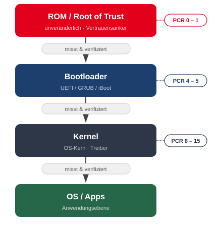
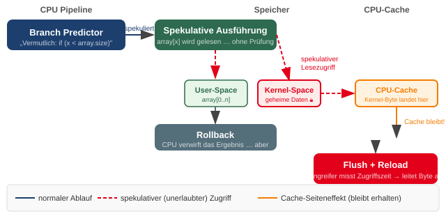
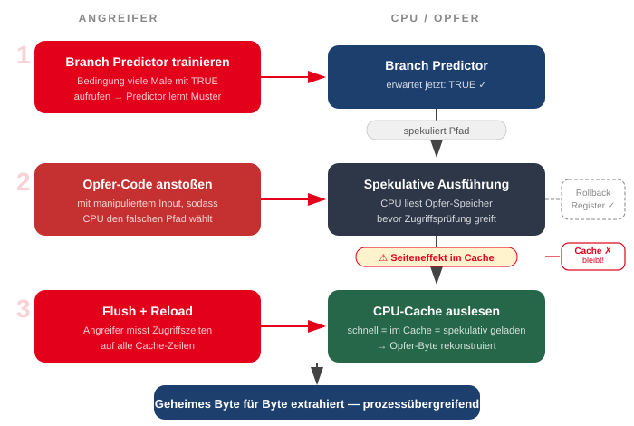
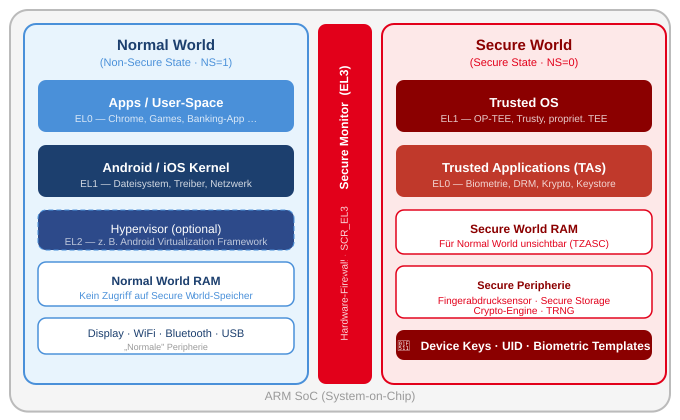
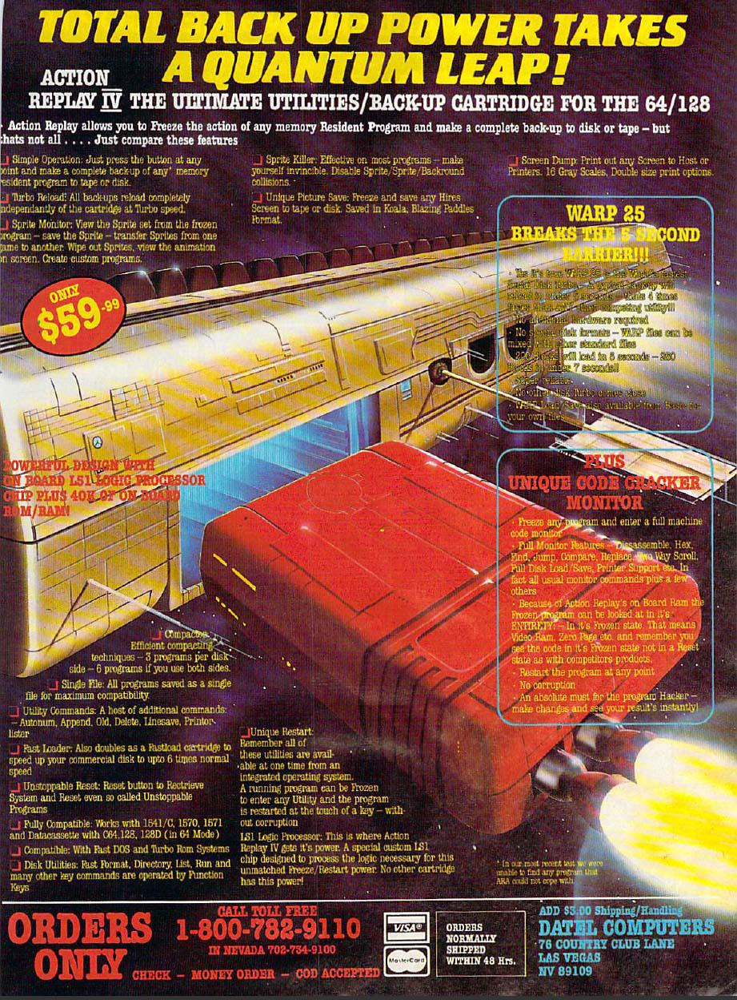

<!-- _class: title -->
# Hardwarenahe Sicherheit
<br><br><br><br>

## PC · Mobile · Spielkonsolen

---
<!-- _class: biglist -->
# Agenda

1. **Grundlagen** – Root of Trust, Angriffstaxonomie 
2. **PC-Sicherheit** – TPM, Spectre/Meltdown, physische Angriffe 
3. **Mobile-Sicherheit** – TrustZone, Secure Enclave, checkm8, FBI vs. Apple 
4. **Spielkonsolen** – C64 bis Switch, vertiefte Fallstudien, Recht 
5. **Querschnittsthemen** – eFuses, Supply Chain, PUFs, TRNG 

---
<!-- _class: chapter -->
# Grundlagen
## Warum ist Hardware die entscheidende Vertrauensebene?

---

# Software kann nur so sicher sein wie die Schicht darunter

<div class="columns">
<div>

### Das Hochhaus-Prinzip
* **App-Ebene:** Penthouse
* **Betriebssystem:** Etagen
* **Hardware:** Das Fundament

> Wenn das Fundament kompromittiert ist, kann der Angreifer die Statik des gesamten Gebäudes verändern.

</div>
<div>

### Konsequenzen
* Firmware-Malware überlebt Neuinstallationen
* Hardware-nahe Angriffe umgehen Kernel-Isolation
* BootROM-Bugs sind **permanent** – kein Patch möglich

</div>
</div>

---

# Root of Trust (RoT)

Ein **Root of Trust** ist eine Komponente, der **implizit vertraut** wird – sie kann ihre eigene Integrität nicht selbst prüfen.

<center>

| Typ | Beispiel |
|-----|----------|
| **Hardware-RoT** | TPM, Apple T2/SEP, Google Titan M |
| **Firmware-RoT** | Boot-ROM (unveränderlicher Startcode) |

</center>

**Aufgaben:**
* Speicherung kryptographischer Schlüssel
* Signaturprüfung der nächsten Boot-Stufe
* Kryptographische Messungen (Hashing)

---

# Chain of Trust

<div class="columns">
<div>
<br>


**Schritt für Schritt** zum Vertrauen.

Jede Stufe:
1. **Misst** (hasht) die nächste Komponente
2. **Prüft** die digitale Signatur
3. Übergibt Kontrolle **nur bei Erfolg**

Die **PCR**-Register im TPM protokollieren jede Messung irreversibel.

</div>
  <div>

  

  </div>
</div>

---

# Angriffstaxonomie: Drei Klassen

<div class="columns3">
<div>

### Invasiv
Chip öffnen, modifizieren
* Chip Decapping
* Microprobing
* Focused Ion Beam (FIB)

*Teuer, zerstörend, Labor nötig*

</div>
<div>

### Semi-invasiv
Ohne Innenzugang
* Fault Injection
* Laser-Angriffe
* EM-Puls-Injektion

*Spezialhardware, reversibel*

</div>
<div>

### Nicht-invasiv
Keine physische Modifikation
* Side-Channel (Timing, Strom, EM)
* Bus Sniffing
* Glitching durch externe Signale

*Preiswert, schwer zu erkennen*

</div>
</div>

---
<!-- _class: chapter -->
# PC-Sicherheit
## UEFI · TPM · Spectre/Meltdown · Physische Angriffe

---

# UEFI & Secure Boot

**UEFI** (Unified Extensible Firmware Interface) ersetzt seit ~2010 schrittweise das klassische BIOS.

**Secure Boot:**
1. UEFI-Firmware enthält eine **Whitelist signierter Bootloader** (Platform Key, Key Exchange Key, Database)
2. Beim Start wird der Bootloader gegen die DB geprüft
3. Nicht-signierter Code → **Boot abgelehnt**

> **Angriffsvektor:** UEFI selbst kann Schadsoftware enthalten (BlackLotus, 2023 – umgeht Secure Boot via legitimen, aber verwundbaren Microsoft-Bootloader).

---

# TPM 2.0 – Architektur

**Trusted Platform Module** = kryptographischer Co-Prozessor.

<div class="columns">
<div>

### Interner Aufbau
* **Crypto-Engine** – RSA, ECC, AES
* **Schlüsselspeicher** – Private Keys verlassen TPM nie
* **PCR-Register** – Integritätsmessungen
* **TRNG** – Hardware-Zufallszahlen

</div>
<div>

### Zwei Varianten
| | dTPM | fTPM |
|--|------|------|
| Ort | eigener Chip | CPU-intern |
| Sicherheit | höher | geringer |
| Beispiele | Infineon, ST | Intel PTT, AMD fTPM |

</div>
</div>

---

# PCR-Register & Measured Boot

**Platform Configuration Registers (PCRs)** speichern Integritätsmessungen des Boot-Pfades.

<center>

| PCR | Inhalt |
|-----|--------|
| 0 | UEFI-Firmware |
| 4 | Bootloader (MBR/GPT) |
| 7 | Secure Boot Policy |
| 8–15 | OS-spezifische Werte |

</center>

> Ändert sich **ein Bit** in der Boot-Kette → alle nachfolgenden PCR-Werte ändern sich → **BitLocker gibt keinen Key frei**.

---

# BitLocker & TPM – Zusammenspiel

<div class="columns">
<div>

### Normaler Boot
1. UEFI misst sich → PCR 0
2. Bootloader misst sich → PCR 4
3. BitLocker fragt TPM: *„Gibt Key frei?"*
4. TPM prüft PCR-Soll-Werte
5. ✅ Key → Volume entschlüsselt

</div>
<div>

### Manipulierter Boot
1. Angreifer ändert UEFI
2. PCR 0 hat falschen Wert
3. BitLocker fragt TPM
4. TPM: PCR-Wert stimmt nicht
5. ❌ Kein Key → Recovery-Screen

</div>
</div>

---
<!-- _class: normal -->
# 🔍 Fallstudie: BitLocker Bus Sniffing

**Das Problem:** Bei diskreten TPMs fließen Daten über **LPC- oder SPI-Bus** zwischen TPM-Chip und CPU – im Klartext.

**Der Angriff (2021):**
1. Angreifer öffnet Laptop, lötet **4 Kabel** an SPI-Bus-Pins (kein Chip entfernt)
2. Logikanalysator (< 50 €, z. B. Saleae Logic) snifft den Bus beim Boot
3. BitLocker-**Volume Master Key** wird unverschlüsselt übertragen und abgefangen
4. Angreifer entschlüsselt die Festplatte auf einem anderen Rechner

---
<!-- _class: normal -->
# 🔍 Fallstudie: BitLocker Bus Sniffing

**Gegenmaßnahme:** BitLocker mit **Pre-Boot-PIN** aktivieren → Key wird erst nach PIN-Eingabe entsiegelt.

<br>
<br>

> *Betroffen: alle Laptops mit diskretem dTPM ohne Pre-Boot-Auth (Standard bei Enterprise-Geräten)*

---
<!-- _class: normal -->
# 🔍 Fallstudie: faulTPM (2023)

**Ziel:** AMD fTPM (Firmware-TPM, läuft in AMD Secure Processor)

**Methode:** Timing-Side-Channel Attack
1. AMD fTPM antwortet bei kryptographischen Operationen mit **messbaren Zeitvariationen**
2. Angreifer wiederholt tausende Anfragen und misst Antwortzeiten mit Oszilloskop
3. Statistische Analyse der Timing-Unterschiede → private kryptographische Schlüssel rekonstruierbar
4. Kein Löten, kein Dekapping – nur **Strommessung am Netzteil-Pin**

**Impact:** BitLocker-Keys aus fTPM extrahierbar; AMD-Systeme 2019–2023 betroffen.

---
<!-- _class: biglist -->
# Intel ME & AMD PSP – die unsichtbaren Co-Prozessoren


## Intel ME (Management Engine)
* Eigenständiger **Minix-basierter Computer** im Chipsatz
* Läuft mit **Ring -3** – unter dem Kernel
* Aktiv auch wenn PC aus (Standby-Strom)
* Eigener Netzwerk-Stack (AMT – Remote Management)
* Firmware ist **verschlüsselt und signiert**

---

# Intel ME & AMD PSP – die unsichtbaren Co-Prozessoren

## Warum relevant?
* Vollständiger Speicherzugriff
* Nicht vom OS sichtbar oder kontrollierbar
* 2017: **INTEL-SA-00075** – Remote Code Execution in AMT via HTTP ohne Passwort
* Seitdem: mehrere weitere CVEs

> *"Der Computer im Computer, dem man blind vertrauen muss"*

---
<!-- _class: biglist -->
# Fallstudie: Spectre & Meltdown (2018)

## Entdeckung:
 Google Project Zero, 3. Januar 2018. Alle modernen CPUs (Intel seit 1995, AMD, ARM) betroffen.

## Kernproblem: 
CPUs optimieren Geschwindigkeit durch **spekulative Ausführung** – sie führen Code aus, bevor sicher ist, ob er überhaupt benötigt wird.

---
<!-- _class: normal -->
# Fallstudie: Spectre & Meltdown (2018)

<div class="columns">
<div>

### Meltdown (CVE-2017-5754)
* Nutzt **Out-of-Order Execution**
* Kernel-Speicher aus User-Space lesbar
* Komplett über Software patchbar (KPTI)
* Performance-Kosten: bis zu **30 %**

</div>
<div>

### Spectre (CVE-2017-5753/5715)
* Manipuliert **Branch Predictor**
* Andere Prozesse ausspionierbar
* **Bis heute nicht vollständig patchbar**
* Neue Varianten erscheinen jährlich (Retbleed, BHI, Inception...)

</div>
</div>

---

# Hintergrund: Spekulative Ausführung

## Moderne CPUs führen Befehle **nicht sequenziell** aus – sie optimieren aggressiv für Geschwindigkeit:

---

# Hintergrund: Spekulative Ausführung

<div class="columns">
<div>

### Out-of-Order Execution
* CPU erkennt, dass Befehl B nicht auf Befehl A warten muss
* Führt B **bereits aus**, während A noch läuft
* Ergebnis wird zwischengespeichert, bei Bedarf übernommen

</div>
<div>

### Branch Prediction
* Bei `if/else`-Verzweigungen „rät" die CPU den wahrscheinlicheren Pfad
* Führt diesen Pfad spekulativ aus
* Ist die Vorhersage falsch: **Rollback** – Ergebnis verworfen

</div>
<div>

---

# Hintergrund: Spekulative Ausführung

## Das Problem
Der Rollback macht Registeränderungen rückgängig – aber **nicht den CPU-Cache-Zustand**.

Genau diese Spur im Cache ist der Seitenkanal.

> *CPUs wurden über Jahrzehnte auf maximale Geschwindigkeit optimiert – Sicherheitsisolation war ein Afterthought.*


---

# Meltdown: Wie der Angriff funktioniert

**Kernidee:** Kernel-Speicher aus dem User-Space lesen – durch spekulative Ausführung vor dem Zugriffs-Check.



---

# Spectre: Grundprinzip


## Unterschied zu Meltdown:

 Spectre missbraucht den **Branch Predictor** – und kann damit auch Daten *anderer Prozesse* (und des Browsers) leaken.

<br>

> Spectre funktioniert **prozessübergreifend** – auch aus einer Browser-Sandbox heraus via JavaScript (SpectreJS, 2018).

---

# Spectre: Grundprinzip





---

# Spectre Varianten & Nachwirkungen

| Variante | Name | Mechanismus | Patchbar? |
|----------|------|-------------|-----------|
| **Retbleed** (2022) | Return-Stack-Buffer | Return-Adressen spekulativ umgeleitet | Microcode + SW |
| **BHI / Spectre-BHB** (2022) | Branch History Injection | Neue Variante von V2 | Microcode |
| **Inception** (2023) | Training in Transient Execution | AMD Zen-Prozessoren | Microcode |


> *Spectre ist kein Bug – es ist ein fundamentales Designproblem. Solange CPUs spekulativ ausführen, werden neue Varianten auftauchen.*

---
<!-- _class: biglist -->
# Auswirkungen & Lehren

## Betroffene Systeme
* **Intel:** Alle CPUs seit ~1995 (Meltdown + Spectre)
* **AMD:** Spectre V1/V2, Inception, GhostRace
* **ARM:** Cortex-A75+ (Meltdown), alle mit Branch Prediction (Spectre)
* **Cloud-VMs:** Kritisch – VM könnte Host-Kernel lesen

---
<!-- _class: biglist -->
# Auswirkungen & Lehren

## Reaktion der Industrie
* Microcode-Updates (Intel, AMD, ARM)
* Betriebssystem-Patches (KPTI, Retpoline)
* Compilerflags: `-mindirect-branch=thunk`
* Browser: Timer-Präzision reduziert (Spectre-Mitigation)
---
<!-- _class: biglist -->
# Auswirkungen & Lehren

Performance-Optimierungen **der letzten 25 Jahre** waren sicherheitstechnisch nicht analysiert.

Hardware kann **keine** nachträglichen Security-Eigenschaften garantieren, wenn das Grunddesign diese nicht berücksichtigt.

> **Fazit für die Praxis:**
> Meltdown ist gepatcht – zu einem Preis.
> Spectre ist nicht lösbar ohne neue CPU-Architekturen.
> **Intel 13./14. Gen:** Raptor Lake teils anfällig für neue Varianten (2024).

---
<!-- _class: biglist -->
# Physische Angriffe: Cold Boot & DMA

## Cold Boot Attack
* DRAM-Chips verlieren Inhalt **nicht sofort** beim Abschalten
* Bei −20 °C (Druckluftspray): Daten bleiben **minutenlang** erhalten
* Angreifer friert RAM ein, transferiert in anderen PC
* So wurden BitLocker/FileVault-Keys extrahiert (2008, Princeton)

---
<!-- _class: biglist -->
# Physische Angriffe: Cold Boot & DMA

## Thunderspy / DMA-Angriff (2020)
* Thunderbolt erlaubt **Direct Memory Access**
* Angreifer öffnet Rechner, schließt Thunderbolt-Gerät an
* Umgeht in **5 Minuten** Windows-Login und BitLocker
* Intel-Reaktion: **Kernel DMA Protection** (ab 2019)
* Ältere Systeme bleiben anfällig


---
<!-- _class: chapter -->
# Mobile-Sicherheit
## TrustZone · Secure Enclave · checkm8 · FBI vs. Apple

---

# ARM TrustZone – die Hardware-Grundlage

TrustZone ist eine **Sicherheitserweiterung** direkt in ARM-CPUs – Standard in fast jedem Smartphone.



---

# ARM TrustZone – Kommunikation & Isolation

  ### Zwei Welten, eine physische CPU
  * **Normal World (NS=1):** Android/iOS, alle Apps (EL0/EL1), optional Hypervisor (EL2)
  * **Secure World (NS=0):** Trusted OS (OP-TEE, Trusty), Trusted Applications
  * **Secure Monitor (EL3):** einzige Brücke – kontrolliert von ARM-Hardware

---

# ARM TrustZone – Kommunikation & Isolation

  ### Speichertrennung (TZASC)
  * TrustZone Address Space Controller teilt DRAM physisch auf
  * Normal World kann Secure-RAM-Adressen **nicht lesen, auch nicht als Root**

---

# ARM TrustZone – Kommunikation & Isolation


  ## SMC-Aufruf (Secure Monitor Call)
  1. Normal World führt `SMC`-Instruction aus
  2. CPU wechselt in EL3 (Secure Monitor)
  3. Monitor leitet Anfrage an Trusted App weiter
  4. Trusted App antwortet mit **minimalem Ergebnis** (true/false, Token, Signatur)
  5. Kein Rohdatum verlässt die Secure World

---

# ARM TrustZone – Kommunikation & Isolation

  ## Beispiele aus der Praxis

<br>

**Fingerabdruck-Prüfung:** Scanergebnis bleibt im TEE — Android sieht nur „match: true"

<br>

**DRM-Schlüssel (Widevine L1):** Entschlüsselung im TEE — Video-Bytes verlassen TEE nie


---

# Apple Secure Enclave (SEP)

**Dedizierter ARM-Co-Prozessor**, physisch vom Application Processor getrennt – seit iPhone 5s (2013).

<div class="columns">
<div>

### Architektur
* Eigener **L4-Mikrokernel** (sepOS)
* Eigenes SRAM, isoliert vom AP
* Einzige Schnittstelle: **Mailbox**-Protokoll
* **Secure ROM** (unveränderlich) prüft SEP-OS beim Boot

</div>
<div>

### Was lebt im SEP?
* **UID** – 256-bit-Wert, bei Herstellung eingebrannt, verlässt SEP nie
* Face ID / Touch ID Vorlagen
* Apple Pay Device Account Number
* Passcode-Verarbeitung + Hardware Rate-Limiting

</div>
</div>

---

# Hardware Rate-Limiting gegen Brute-Force

Das SEP erzwingt Verzögerungen direkt in **Hardware** – kein Software-Bypass möglich:
<br>
<center>

| Fehlversuche | Wartezeit |
|---|---|
| 1–5 | keine |
| 6 | 1 Minute |
| 7 | 5 Minuten |
| 8 | 15 Minuten |
| 9 | 1 Stunde |
| 10 | **Gerät löscht sich** (optional) |

---
<!-- _class: normal -->
# Fallstudie: checkm8 (September 2019)

**Entdeckt von:** @axi0mX  
**Betroffen:** Apple A5–A11 (iPhone 4s bis iPhone X) – **ca. 900 Millionen** Geräte

**Die Schwachstelle:** Use-After-Free im **BootROM** (SecureROM) – im USB-DFU-Stack.

1. DFU-Modus via Tastenkombination aktivieren
2. USB-Kontrollanfrage sendet: Speicher reservieren → freigeben → **erneut referenzieren**
3. Race Condition ermöglicht **Heap Corruption**
4. Heap Spraying → eigener Code überschreibt BootROM-Execution-Flow

---
# Fallstudie: checkm8 (September 2019)
<!-- _class: biglist -->
**Warum unpatchbar?** Das BootROM ist **physisch Read-Only** – es wird bei Chipherstellung eingebrannt. Kein Software-Update möglich.

**Was rettet die Secure Enclave?** Ab A7 ist das SEP ein **eigener, separater Chip** mit eigener Boot-Chain. checkm8 kompromittiert nur den Application Processor – der PIN bleibt sicher.

---

# Android: TEE vs. StrongBox

<div class="columns">
<div>

### TEE (Trusted Execution Environment)
* Läuft auf **gleichem Prozessor** via ARM TrustZone
* Auf fast jedem Android-Gerät verfügbar
* Teilt physisch Ressourcen mit Normal World
* Anfälliger für Side-Channel-Angriffe

</div>
<div>

### StrongBox / Titan M2
* **Komplett separater Chip** (wie Apple SEP)
* Eigenständige CPU, eigenes RAM, eigenes OS
* Google Pixel: **Titan M2**
* Samsung: **Knox Vault**
* Höchste Sicherheitsstufe: StrongBox-Zertifizierung

</div>
</div>

---

# Android: TEE vs. StrongBox

| | Apple SEP | Android StrongBox | Android TEE |
|--|-----------|-------------------|-------------|
| **Isolierung** | Exzellent | Sehr gut | Mittel |
| **Verfügbarkeit** | Alle iPhones | High-End | Fast alle |
| **Update-Zyklus** | Zentral (Apple) | Gut (Google Pixel) | Fragmentiert |

---
<!-- _class: chapter -->
# Spielkonsolen
## 40 Jahre Hardware-Manipulation + Recht

---

# Das Geschäftsmodell erklärt die Sicherheit

Das **„Razor and Blades"**-Prinzip:

* **Hardware:** Wird mit Verlust oder knapper Marge verkauft
* **Software:** Gewinne durch **Lizenzgebühren** (Sony, Nintendo, Microsoft nehmen 30 % pro Spiel)

→ **Ohne Kontrolle über die Hardware bricht das gesamte Ökosystem ein.**

Die drei Feinde der Hersteller:
1. **Piraterie** – keine Lizenzgebühren
2. **Homebrew** – unkontrollierte Software, potentielles Piraterie-Einfallstor
3. **Region-Lock-Umgehung** – Preisarbitrage zwischen Märkten

---

# Zeitleiste: 40 Jahre Hardware-Manipulation

```
1982  C64 Expansion Port        → Action Replay / Final Cartridge
1985  NES 10NES Lockout-Chip    → Game Genie / Modchips
1994  PS1 CD-Wobble             → Modchip-Industrie entsteht
2001  Xbox BIOS Flash           → Cromwell/BIOS-Ersatz
2008  Xbox 360 JTAG             → Debug-Port-Exploit
2010  PS3 OtherOS entfernt      → fail0verflow / GeoHot
2018  Switch Fusée Gelée        → unpatchbarer Tegra-Bug
2022  PS4/PS5 erste Exploits    → WebKit → Kernel-Chain
```

**Muster:** Jede Generation lernt aus der vorherigen – und jede Generation wird gebrochen.

---

# C64 (1982): Der Expansion Port als Werkzeug
<div class="columns">
<div>

**Kein Kopierschutz im Chip** – aber der **Expansion Port** ermöglichte tiefe Systemkontrolle:

* Direkter Zugriff auf den **Adress- und Datenbus** der MOS 6510 CPU
* Module können internen RAM/ROM des C64 **ausblenden und ersetzen**

</div>
<div>



</div>
</div>

---

# C64 (1982): Der Expansion Port als Werkzeug

### Action Replay & Final Cartridge III
* **Freeze-Button → NMI** (Non-Maskable Interrupt): CPU stoppt sofort
* Gesamter RAM-Inhalt eingefroren → Spiel nach dem Laden-Entschlüsseln dumpbar
* **Machine Code Monitor:** Live-Speicher-Editing während das Spiel pausiert
* Trainer-Codes: Unendlich Leben, Cheats direkt in RAM schreiben

> *Erste Consumer-Hardware die zeigt: Physischer Bus-Zugriff = vollständige Systemkontrolle*

---
<!-- _class: biglist -->
# NES (1985): 10NES & Game Genie

## Nintendo's Ansatz:

* Hardware-basierten Kopierschutz durch den **10NES Lockout-Chip** (CIC).
* **Challenge-Response:** Konsole und Modul-Chip kommunizieren ständig; kein Signal → Konsole friert ein
* **Regionaler Schutz:** Japanische Famicom-Chips sprechen anders als US-NES-Chips

---

# NES (1985): 10NES & Game Genie

<div class="columns">
<div>

### Game Genie
* Transparenter **Adressbus-Adapter**
* Interceptet CPU-Leseanfragen und ersetzt Speicherwerte **on the fly**
* Kein Eingriff in Konsolen-Hardware

</div>
<div>

### Juristischer Präzedenzfall
**Lewis Galoob Toys v. Nintendo (1992):**
* Nintendo klagt → verliert
* Gericht: Cheat-Gerät ist **kein Urheberrechtsverstoß**
* Erster juristischer Meilenstein für Cheat-Hardware

</div>
</div>

---
<!-- _class: biglist -->
# PlayStation 1 (1994): CD-Schutz & Modchips

## Schutzmechanismus:
* **LibCrypt:** Spezielle Wobble-Signatur (**SCEX-String**) in der Leadout-Zone der CD
* Nicht mit Standard-CD-Brennern reproduzierbar
* Region-Encoding: JP / NA / EU haben unterschiedliche SCEX-Strings

---

# PlayStation 1 (1994): CD-Schutz & Modchips

## Umgehungen:

* **Modchip** (PIC-Mikrocontroller, direkt verlötet): täuscht korrektes SCEX-Signal vor
* **Swap Trick:** Original-CD einlegen → nach SCEX-Prüfung schnell gegen Kopie tauschen
* **GameShark / Pro Action Replay:** Code-Injection über Cheat-Adapter im Expansion-Slot

> *Die Modchip-Industrie entsteht. Hunderte Anbieter weltweit — Hersteller können Hardware-Mods kaum verhindern.*

---

# PlayStation 2 (2000): Memory Card Exploit

**Sony verbessert den Schutz:** DVD-Region-Encoding + stärkere Disc-Verifizierung

**Modchips werden komplexer** — aber eine elegantere Methode entsteht:

**FreeMCBoot:**
* **Buffer Overflow** im Memory Card File System der PS2-Firmware
* Präparierte Memory Card (8 MB) genügt — kein Löten, keine Hardware-Modifikation
* Beliebiger Code läuft beim Booten → Homebrew-Launcher

> *PS2-Schutz war so löchrig, dass Hardware-Modchips für viele Nutzer überflüssig wurden.*


---
# Fallstudie: Xbox 360 – Sicherheitsarchitektur

## Microsoft baute mit der Xbox 360 eine der bis dahin sichersten Konsolen:

* **Hyper-V Hypervisor** schützt Kernel-Integrität — läuft unter dem OS
* Alle ausführbaren Dateien kryptographisch **signiert und verschlüsselt**
* **eFuses** sichern gegen Firmware-Downgrades
* CPU-Key nur einmal programmierbar (Hardware Security Fuses)

---
# Fallstudie: Xbox 360 – JTAG

## Der erste Riss – JTAG Hack (2008):

* Debug-JTAG-Pins waren im Auslieferungszustand **aktiv und zugänglich**
* Über JTAG konnte direkt in die Signaturprüfung eingegriffen werden
* Beliebiger, unsignierter Code ausführbar
* **Reaktion:** JTAG-Pins in neuen Revisionen deaktiviert — alle JTAG-Konsolen über Xbox Live gebannt

→ Die Community brauchte eine neue Methode …

---
# Xbox 360 – Reset Glitch Hack (RGH, 2011)

Prinzip: **Fault Injection durch präzises Timing**

1. CPU prüft beim Start die Signatur des Bootloaders in einem Fenster von **~100 ns**
2. Gelöteter **Glitch-Chip** sendet exakt in diesem Fenster einen Impuls an den CPU-Reset-Pin
3. CPU macht Micro-Reset: **Prüflogik läuft erneut – mit korrumpierten Registerwerten**
4. Signaturprüfung „schlägt fehl" — Konsole bootet trotzdem mit **unsigniertem Code**

---

# Xbox 360 RGH – Das ewige Katz-und-Maus-Spiel

| Revision | Jahr | Reaktion Microsoft | Community-Antwort |
|---|---|---|---|
| Zephyr / Falcon | 2005–07 | JTAG aktiv | JTAG Hack |
| Jasper | 2008 | JTAG gesperrt | RGH 1.0 entwickelt |
| Corona | 2011 | Timing geändert | RGH 2.0 |
| Trinity / Winchester | 2013–14 | neue Glitch-Punkte | RGH 3.0 (2022) |

**Parallel:** Microsoft bannt alle modifizierten Konsolen von Xbox Live — Offline-Nutzung bleibt möglich.

---
# Fallstudie: PS3 – Sicherheitsarchitektur & OtherOS

## Sonys Sicherheitsarchitektur der PS3:

* **Cell-Prozessor** (IBM) mit eigenem Hardware-Hypervisor
* Alle ausführbaren Dateien müssen mit Sonys **privatem Masterschlüssel signiert** sein
* Ohne gültige Signatur: Konsole verweigert Ausführung vollständig
* **OtherOS:** PS3 erlaubte offiziell Linux-Installation — U.S. Air Force kaufte 1760 PS3s als Supercomputer-Cluster

---
# Fallstudie: PS3 – Sicherheitsarchitektur & OtherOS

## Sony entfernt OtherOS (April 2010):

* Firmware 3.21 deaktiviert OtherOS — **kein Opt-out möglich**
* Wer nicht updatet: kein PSN-Zugang, keine neuen Spiele
* Nutzerklage wegen Vertragsbruchs (USA) — letztlich abgewiesen
* **Community-Reaktion:** Gezielter Angriff auf die kryptographische Basis der Konsole

---
<!-- _class: normal -->
# 🔍 Fallstudie: PS3 – Der ECDSA-Fehler (2010)

**fail0verflow präsentiert auf dem 27C3 Berlin, Dezember 2010:**

> „Sony verwendete eine Konstante als Zufallszahl."

**Das Problem:** Bei ECDSA muss der Nonce `k` für **jede Signatur einmalig zufällig** sein. Sony verwendete dasselbe `k` für alle Signaturen.

**Die Mathematik:** Bei gleichem `k` in zwei Signaturen $(r_1 = r_2)$:

$$k = \frac{s_1 z_1 - s_2 z_2}{s_1 - s_2} \pmod{n} \qquad \Rightarrow \qquad d = \frac{s k - z}{r} \pmod{n}$$

→ Privater **Masterschlüssel** $d$ aus zwei öffentlich bekannten Signaturen vollständig berechenbar.

---

# Sony Computer Entertainment v. George Hotz (2011)

**GeoHot (George Hotz)** veröffentlicht den Key online. Jeder kann nun beliebige PS3-Software „offiziell" signieren.

Sony klagt auf Grundlage von:
* **DMCA §1201** – Umgehung technischer Schutzmaßnahmen
* **CFAA** (Computer Fraud and Abuse Act) – Unbefugter Computerzugang

**Eskalation:**
* **Anonymous** greift PSN an (Operation Sony) → PSN tagelang offline
* Sony beantragt IP-Adressen aller Besucher von GeoHotz' YouTube-Videos und Twitter-Followern
* GeoHot reist nach Brasilien — kein DMCA-Auslieferungsabkommen

---

# PS3 – Ausgang & Bewertung

**Ausgang:** Außergerichtlicher Vergleich — GeoHot darf **keine Sony-Produkte mehr hacken**. Bedingungen bleiben geheim.

**Rechtliche Lehre:**
* DMCA-Klagen können als **Einschüchterungsmittel** eingesetzt werden — unabhängig vom technischen Kern
* Forderung nach Nutzerdaten (YouTube-IPs) als Taktik: **Privacy-Angriff auf die Community**
* Kein Präzedenzurteil → rechtliche Lage für Reverse Engineering bleibt ungeklärt

---
# Nintendo Switch – Sicherheitsarchitektur

**Die Switch (2017) hat eine der komplexesten Konsolen-Sicherheitsarchitekturen:**

<div class="columns">
<div>

### Hardware-Komponenten
* **NVIDIA Tegra X1** SoC
* **ARM TrustZone** (Secure/Normal World)
* **TSEC** – NVIDIA-Co-Prozessor (Falcon-Architektur) für Key-Management
* **eFuses** – eine Fuse pro Firmware-Major-Update

</div>
<div>

### Boot-Chain
```
BootROM  (Read-Only)
  ↓ PKC-Signaturprüfung
Package1  (TrustZone-Setup)
  ↓
TSEC lädt geheime Schlüssel
  ↓
TrustZone-Kernel (EL3)
  ↓
HorizonOS (Normal World)
```

</div>
</div>

Jede Stufe kryptographisch signiert. eFuses verhindern den Schritt zurück.

---
# Fallstudie: Nintendo Switch – Fusée Gelée (2018)

**Der Bug – RCM (Recovery Mode) im unveränderlichen BootROM:**

* Tegra X1 hat einen USB-Recovery-Mode für Factory-Reparaturen
* USB-Control-Transfer-Handler hat einen **Stack Buffer Overflow:**
  * Interner Puffer: `0x4000` Bytes
  * Angreifer sendet: `0x7000` Bytes → Stack Overflow
  * **Beliebige Code-Ausführung vor jedem Sicherheits-Check**

**Aktivierung:** Zwei Pins im rechten Joy-Con-Slot kurzschließen (Büroklammer) + Volume+ beim Einschalten.

**Warum unpatchbar?** Das BootROM ist physisch Read-Only — wie bei checkm8 kein Software-Update möglich.

---

# Nintendo Switch – Reaktion & Betroffene Geräte

| Gerät | Chip | Fusée Gelée? |
|---|---|---|
| Switch (2017, alle) | Tegra X1 | ✅ dauerhaft anfällig |
| Switch Lite (2019) | Tegra T214 „Mariko" | ❌ behoben |
| Switch v2 (2019+) | Tegra T214 „Mariko" | ❌ behoben |
| Switch OLED (2021) | Tegra T214 „Mariko" | ❌ behoben |

**~15–20 Millionen** Original-Switch-Geräte bleiben permanent verwundbar.

**Nintendo-Gegenmaßnahmen:**
* Aggressive **Ban-Welle** auf Nintendo-Servern für modifizierte Konsolen
* Online-Erkennung über Certificate-Pinning und Telemetrie
* Konsequente Strafverfolgung von CFW-Distributoren (Team Xecuter, 2020)

---

# Rechtliche Gesamtbewertung: USA

## 🇺🇸 USA – DMCA §1201 (Digital Millennium Copyright Act, 1998)

* Umgehung technischer Schutzmaßnahmen **verboten** — unabhängig davon, ob eine Urheberrechtsverletzung stattfindet
* Auch das **Bereitstellen von Umgehungstools** ist strafbar (§1201(a)(2))
* Ausnahmen: Security Research (seit 2015 erweitert), Interoperabilität — eng ausgelegt
* **Strafmaß:** Bis 500.000 USD und 5 Jahre Haft (Ersttat)
* **Präzedenzfälle:** Sony v. Hotz (2011), Nintendo v. Team Xecuter (2020 — 4,5 Jahre Haft)

---

# Rechtliche Gesamtbewertung: EU

## 🇪🇺 EU – InfoSoc-Richtlinie Art. 6 (2001)

* Gleichwertiges Umgehungsverbot, umgesetzt in nationales Recht aller EU-Staaten
* Nationaler Spielraum bei Ausnahmen größer als in den USA
* Interoperabilitätsausnahme (Art. 6 Abs. 4) theoretisch anwendbar — in der Praxis selten erfolgreich
* Kein einheitliches EU-Strafmaß — variiert stark nach Mitgliedstaat

---

# Rechtliche Gesamtbewertung: Deutschland

## 🇩🇪 Deutschland – § 95a UrhG

* Umgehung **wirksamer technischer Maßnahmen** verboten
* Verbreitung von Umgehungstools: **§ 95c UrhG**
* Nuancen in der Praxis:
  * *Besitz* eines Modchips: i. d. R. **nicht strafbar**
  * *Verkauf/Einbau* zum Zweck der Urheberrechtsverletzung: **strafbar**
  * Backup eigener Spiele: rechtlich grau — § 69d gilt nur für Software, nicht für Spiele als AV-Werk

---

# Rechtliche Gesamtbewertung: Deutschland

## Homebrew vs. Piraterie — die ungeklärte Grenze

<center>

| | Homebrew | Piraterie |
|---|---|---|
| **Technische Mittel** | identisch | identisch |
| **Zweck** | eigene Software | fremde Spiele kopieren |
| **Rechtliche Bewertung** | unklar | illegal |

> Kein europäisches Gericht hat die Grenze zwischen erlaubter Interoperabilität und verbotener Schutzumgehung bei Spielkonsolen abschließend definiert.

---
<!-- _class: chapter -->
# Querschnittsthemen
## eFuses · Supply Chain · PUFs · TRNG

---

# eFuses – Irreversibles Hardware-Gedächtnis

**Problem:** Angreifer findet Exploit in Firmware 1.0 → kann immer auf 1.0 downgraden.

**eFuse-Lösung:**
* Winzige mikroskopische Sicherungen direkt im Prozessor-Die
* Software-Befehl **brennt Sicherung irreversibel durch**
* Jedes Firmware-Update zählt: *„Erwarte N durchgebrannte Fuses"*

**Grenzen des Konzepts (Fallbeispiel Switch):**
> eFuses schützen gegen Downgrades – aber wenn der **BootROM selbst** kompromittiert ist (Fusée Gelée), werden eFuses **vor** ihrer Prüfung umgangen. Reihenfolge zählt.

---

# Hardware Trojans & Supply Chain

**Hardware Trojan:** Bösartige Schaltungsmodifikation, eingebracht bei Design, Herstellung oder Integration.

| Phase | Angriffsvektor |
|-------|----------------|
| CAD/Design | Bösartiger IP-Core in gemieteter Bibliothek |
| Foundry | Zusätzliche Logik-Gates beim Chip-Ätzen |
| Montage | Austausch legitimer Chips gegen präparierte |
| Transport | Manipulation der Supply Chain |

---

# Hardware Trojans & Supply Chain

**Bekannter Vorfall:** Bloomberg „Big Hack" (Oktober 2018) – Behauptet: Chinesische Spionage-Chips auf Supermicro-Servern. Apple und Amazon widersprechen vehement. **Bis heute ungeklärt.**

**Warum so schwer zu finden?** Moderne Chips haben Milliarden Transistoren. Referenz-Netlist bindet Hersteller nicht zu vollständiger Transparenz.

---

# Physical Unclonable Functions (PUFs)

**Idee:** Jeder Chip hat durch Fertigungstoleranzen einzigartige physikalische Eigenschaften – messbar, nicht kopierbar.

<div class="columns">
<div>

### Wie es funktioniert
* **Challenge:** Messanfrage (z. B. „Welche SRAM-Zellen initialisieren auf 0?")
* **Response:** Einzigartige Antwort, deterministisch für diesen Chip
* **Kein gespeicherter Key nötig** – Key entsteht bei Bedarf aus Physik

</div>
<div>

### Typen
* **SRAM-PUF:** Startup-Werte von SRAM-Zellen
* **Ring-Oscillator PUF:** Frequenzunterschiede identischer Schaltkreise
* **Arbiter PUF:** Signallaufzeitunterschiede

</div>
</div>

---

# True Random Number Generators (TRNG)

**Warum Hardware-Zufall?** Algorithmen (PRNG) sind deterministisch – bei bekanntem Seed vollständig vorhersagbar.

**TRNG nutzt physikalisches Rauschen:** Thermisches Rauschen, radioaktiver Zerfall, Photonenrauschen.

---
<!-- _class: normal -->
# 🔍 Fallstudie: Dual EC DRBG – Absichtlich geschwächt

**2006:** NIST standardisiert **Dual Elliptic Curve Deterministic Random Bit Generator** (Dual EC DRBG).

**Das Problem:** Der Standard enthält zwei elliptische Kurven-Punkte P und Q – wer das Verhältnis P/Q kennt (den geheimen „Backdoor-Key"), kann alle generierten Zufallszahlen **rückwärts berechnen**.

---
<!-- _class: normal -->
# 🔍 Fallstudie: Dual EC DRBG – Absichtlich geschwächt

**2013 (Snowden-Leaks):** NSA hat diesen Backdoor-Key. NSA hat Dual EC DRBG gezielt in den NIST-Standard eingebracht und RSA Security überzeugt, ihn in RSA BSAFE (Standardbibliothek in tausenden Enterprise-Produkten) als **Default-Generator** zu verwenden – für 10 Mio. USD.

**Konsequenz:** Jede TLS-Verbindung, die RSA BSAFE mit Dual EC DRBG verwendete, war für die NSA entschlüsselbar.

> *Zeigt: Schwachstellen in Zufallszahlengeneratoren untergraben alle darauf aufbauende Kryptographie – unabhängig von der Hardware-Sicherheit.*

---
<!-- _class: biglist -->
# Was haben wir gelernt?

1. **Hardware ist die unterste Vertrauensebene** – kein Software-Sicherheitsmodell ist stärker als die Hardware, auf der es läuft.

2. **Security by Obscurity scheitert systematisch** – NES bis Switch: 40 Jahre zeigen dasselbe Muster.

3. **Kryptographische Fehler besiegen perfekte Hardware** – PS3: Ein konstantes `k` in ECDSA macht 7 Jahre Hardware-Entwicklung wertlos.

4. **ROM-Bugs sind permanent** – checkm8 (iPhone 4s–X) und Fusée Gelée (Switch) sind unrepairierbar; Verteidigungstiefe (SEP-Isolation) rettet was zu retten ist.

